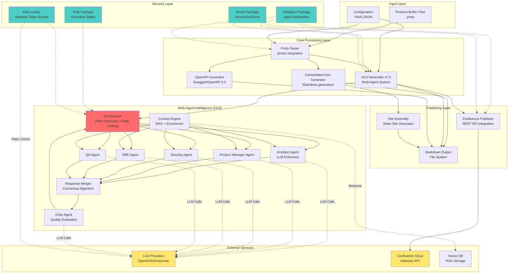
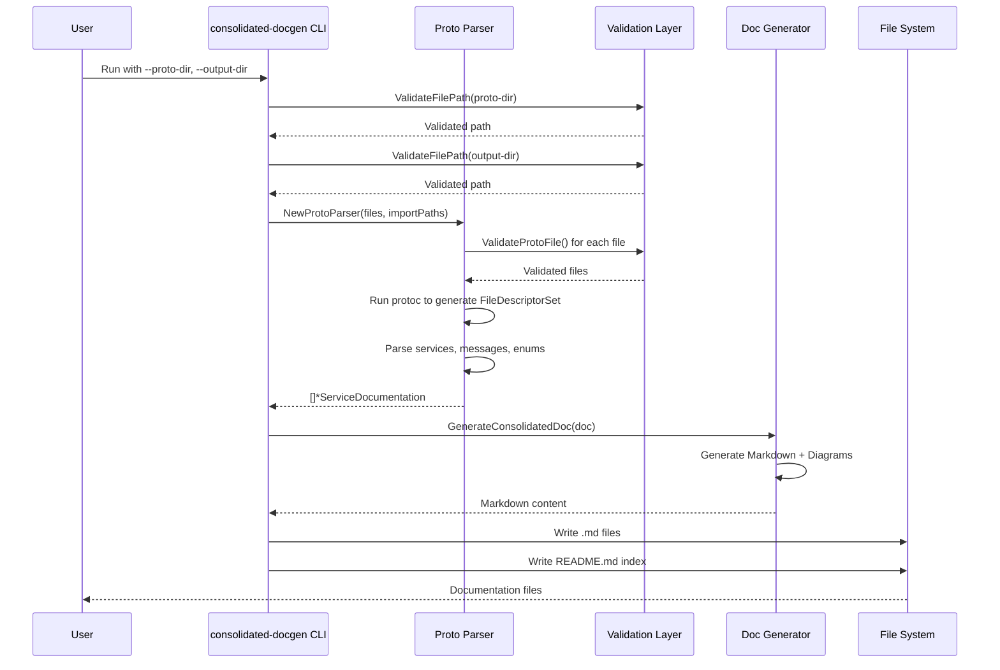
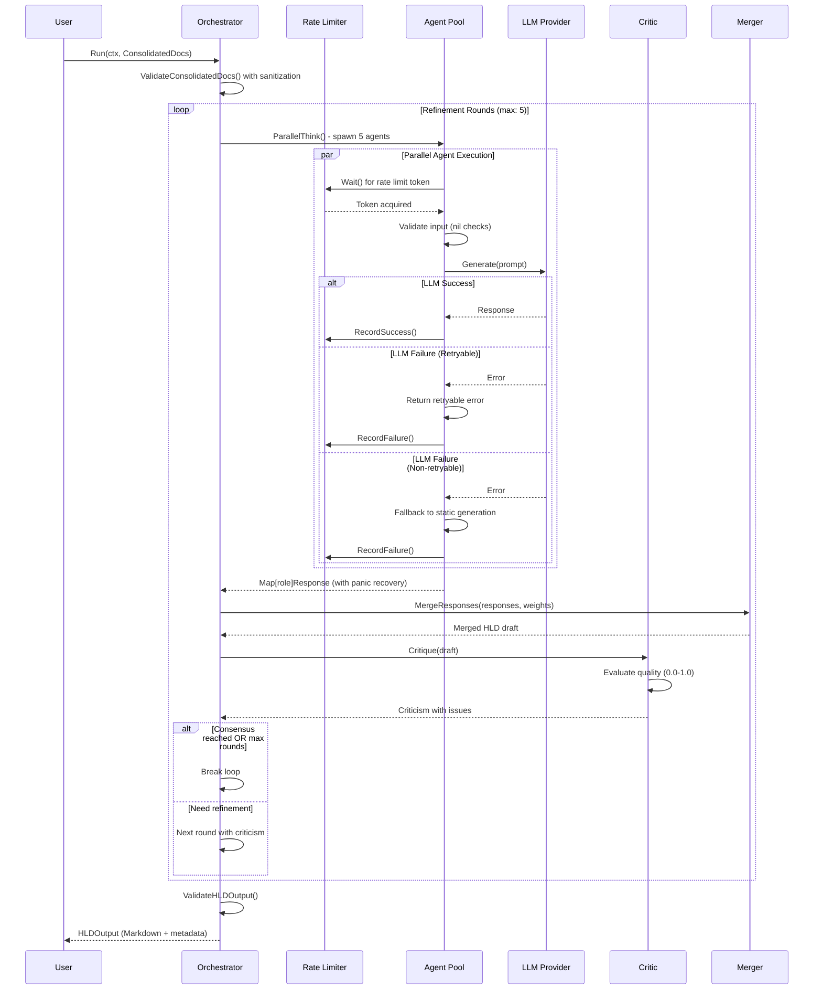
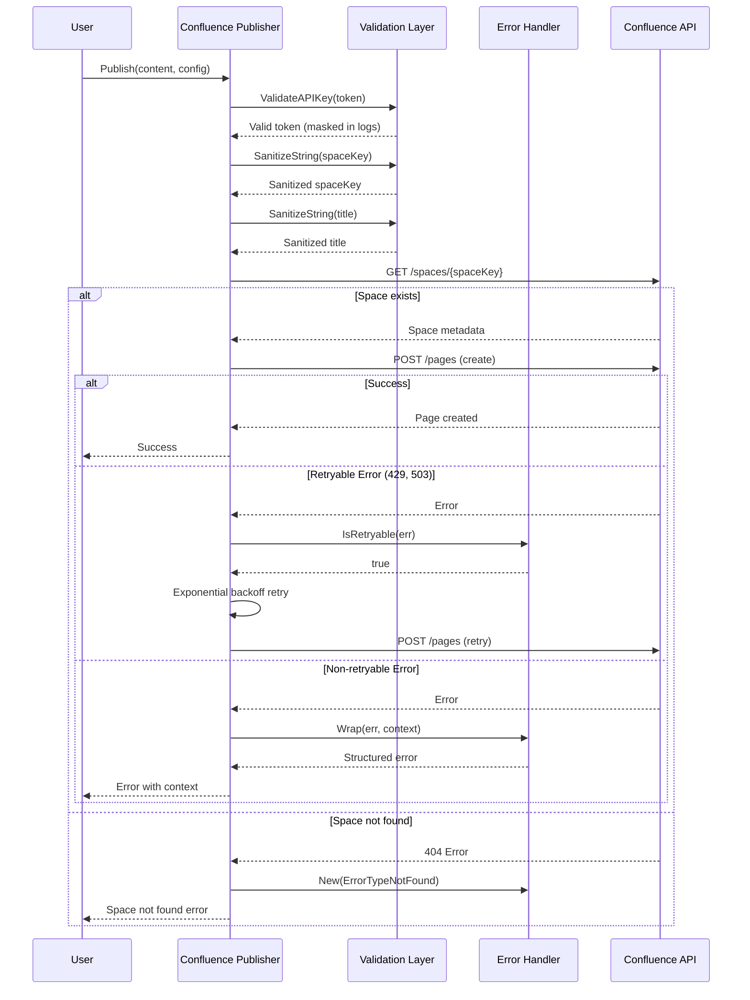
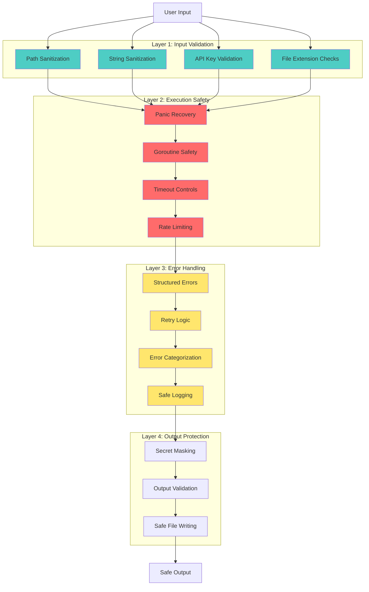
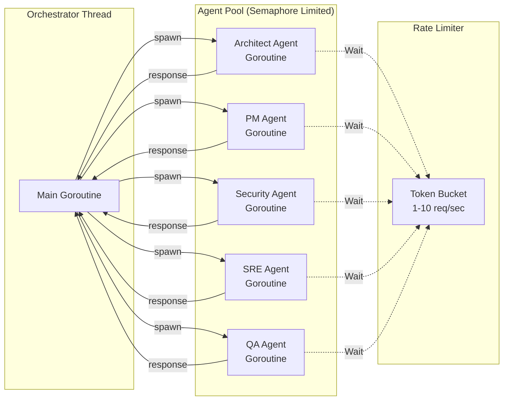

# ProtoDocs System Architecture

## System Overview



## Table of Contents

1. [Component Details](#component-details)
2. [Data Flow](#data-flow)
3. [Security Architecture](#security-architecture)
4. [Performance Characteristics](#performance-characteristics)
5. [Configuration](#configuration)
6. [Deployment](#deployment)
7. [Monitoring](#monitoring-and-observability)

## Component Details

### Input Layer

#### Protocol Buffer Files (.proto)
- **Purpose**: Source of truth for API definitions
- **Format**: Protocol Buffer v3 syntax
- **Validation**: Path sanitization, file extension checks
- **Security**: Input validation via `internal/validation`

#### Configuration
- **Format**: YAML/JSON configuration files
- **Contents**:
  - HLD generation modes (basic, advanced, business, compliance, ultra-advanced)
  - Multi-agent configuration (roles, weights, thresholds)
  - LLM provider settings (API keys, models, endpoints)
  - Publishing settings (Confluence, output paths)

### Core Processing Layer

#### Proto Parser
- **Technology**: protoc compiler integration
- **Functionality**:
  - Generates FileDescriptorSet from .proto files
  - Extracts services, methods, messages, enums
  - Resolves type dependencies
  - Handles import path resolution
- **Security**: All paths validated via `validation.ValidateProtoFile()`
- **Location**: `tools/protodocs/docgen/proto_parser.go`

#### Consolidated Doc Generator
- **Functionality**:
  - Generates comprehensive Markdown documentation
  - Creates Mermaid diagrams (architecture, sequence, class, ERD)
  - Produces code examples (Go, JavaScript, Python)
  - Cross-references between types
  - Table of contents generation
- **Output**: Service-specific .md files + index README.md
- **Location**: `tools/protodocs/docgen/consolidated_generator.go`

#### HLD Generator v7.0
- **Architecture**: Multi-agent orchestration system
- **Modes**: 6 generation modes for different documentation depths
- **Intelligence**: LLM-enhanced agents with fallback to static generation
- **Refinement**: Iterative improvement loop with critic feedback
- **Location**: `tools/protodocs/hldgen/`

#### OpenAPI Generator
- **Functionality**:
  - Converts Protocol Buffers to OpenAPI 3.0 specs
  - Generates Swagger-compatible documentation
  - Maps gRPC to REST semantics
- **Output**: OpenAPI YAML/JSON files
- **Location**: `tools/protodocs/openapi/`

### Multi-Agent Intelligence System

#### Orchestrator
- **Role**: Coordinates multi-agent execution
- **Features**:
  - Parallel agent execution with semaphore concurrency control
  - **Panic recovery** with stack trace logging ✨
  - **Adaptive rate limiting** for LLM calls ✨
  - Per-agent timeout management
  - Response aggregation
- **Security**:
  - Panic recovery prevents agent crashes from taking down system
  - Rate limiter prevents API abuse (1-10 req/sec adaptive)
- **Location**: `hldgen/orchestrator.go:184`

#### Architect Agent
- **Role**: Principal Architect with 15+ years distributed systems experience
- **Responsibilities**:
  - Bounded contexts (Domain-Driven Design)
  - Component architecture with clear boundaries
  - Data flow diagrams
  - Async communication patterns (Event-Driven)
  - Scalability & performance considerations
  - Multi-region deployment strategy
- **Technology**: LLM-enhanced with fallback to template-based generation
- **Weight**: 0.35 (highest)
- **Location**: `hldgen/agent_architect.go`, `hldgen/agent_improved.go:12`

#### Product Manager Agent
- **Role**: Senior Product Manager
- **Responsibilities**:
  - Business context and value proposition
  - Key metrics and success criteria
  - User stories and use cases
- **Weight**: 0.20

#### Security Agent
- **Role**: Security Architect (CISSP, CISA)
- **Responsibilities**:
  - Authentication & authorization architecture
  - Compliance requirements (SOC2, GDPR, HIPAA)
  - Zero-trust security model
  - Threat modeling
- **Weight**: 0.20

#### SRE Agent
- **Role**: Site Reliability Engineer
- **Responsibilities**:
  - SLO/SLI definitions (latency, availability, error rate)
  - Observability stack (metrics, logs, traces)
  - Resilience patterns (circuit breakers, retries, timeouts)
- **Weight**: 0.15

#### QA Agent
- **Role**: QA Lead
- **Responsibilities**:
  - Test strategy (unit, integration, e2e)
  - Test requirements and acceptance criteria
  - Edge cases and boundary conditions
- **Weight**: 0.10

#### Critic Agent
- **Role**: Quality evaluator and feedback generator
- **Responsibilities**:
  - Evaluates each agent's output (0.0-1.0 score)
  - Identifies issues (severity: critical/high/medium/low)
  - Provides actionable improvement suggestions
  - Determines if refinement round is needed
- **Technology**: LLM-based critique with rule-based fallback
- **Location**: `hldgen/agent_critic.go:266`

#### Response Merger
- **Strategies**:
  - `priority_merge`: Weighted merge based on agent weights
  - `consensus_merge`: Requires agreement threshold
  - `best_of_n`: Selects highest-scoring response
- **Algorithm**: Weighted consensus with confidence scoring

#### Context Engine
- **Features**:
  - **RAG (Retrieval-Augmented Generation)**: Fetches relevant documentation
  - **Ownership info**: Team and owner metadata
  - **Dependencies**: Related services and messages
  - **Historical context**: Previous versions and changes

### Security Layer (Internal Packages)

#### Validation Package ✨
- **Purpose**: Input sanitization and validation
- **Functions**:
  - `SanitizeString()`: Removes control characters, null bytes
  - `ValidateFilePath()`: Path traversal prevention
  - `ValidateProtoFile()`: .proto file validation
  - `ValidateDirectory()`: Directory path validation
  - `ValidateAPIKey()`: API key format validation
  - `MaskSecret()`: Secret masking for logs
- **Protection**: Injection attacks, path traversal, XSS
- **Location**: `tools/protodocs/internal/validation/`
- **Integration**: Used in parser, HLD generator, Confluence publisher

#### Errors Package ✨
- **Purpose**: Structured error handling with categorization
- **Error Types**:
  - `ErrorTypeValidation`: Input validation failures
  - `ErrorTypeNetwork`: Network/API failures
  - `ErrorTypeRetryable`: Temporary failures (can retry)
  - `ErrorTypeAuth`: Authentication failures
  - `ErrorTypeNotFound`: Resource not found
- **Functions**:
  - `New()`: Create categorized error
  - `Wrap()`: Wrap error with context
  - `IsRetryable()`: Check if error allows retry
- **Location**: `tools/protodocs/internal/errors/`
- **Integration**: Used in agents, LLM clients, Confluence publisher

#### Safe Package
- **Purpose**: Safe goroutine execution with panic recovery
- **Functions**:
  - `Go()`: Execute function in goroutine with panic recovery
  - `Run()`: Execute function with panic recovery (synchronous)
- **Features**:
  - Stack trace capture
  - Error channel for panic recovery
  - Logging integration
- **Location**: `tools/protodocs/internal/safe/`

#### Rate Limiter Package ✨
- **Algorithm**: Adaptive token bucket
- **Features**:
  - Adaptive rate adjustment based on success/failure
  - Configurable min/max rates (1-10 req/sec)
  - Thread-safe implementation
  - Success/failure tracking
- **Purpose**: Prevents LLM API rate limit errors (429)
- **Location**: `tools/protodocs/internal/ratelimit/`
- **Integration**: Orchestrator applies before each agent LLM call

### Publishing Layer

#### Confluence Publisher ✨
- **API**: Confluence Cloud REST API v2
- **Authentication**: API token-based (validated)
- **Features**:
  - Page creation with parent hierarchy
  - Content update with version management
  - Label management
  - **Security**: Input validation, error handling, retry logic
- **Recent Improvements**:
  - Integrated `internal/validation` for input sanitization
  - Integrated `internal/errors` for structured error handling
  - Added retry logic with exponential backoff
- **Location**: `tools/protodocs/publisher/confluence/`

#### Site Assembly
- **Purpose**: Static site generation from documentation
- **Features**:
  - Index generation with navigation
  - Asset management (diagrams, images)
  - Search index creation
  - Theme support
- **Location**: `tools/protodocs/siteasm/`

## Data Flow

### 1. Documentation Generation Flow



### 2. HLD Multi-Agent Generation Flow



### 3. Confluence Publishing Flow



## Security Architecture

### Defense in Depth Strategy



### Threat Mitigation Matrix

| Threat | Mitigation | Implementation | Location |
|--------|-----------|----------------|----------|
| **Path Traversal** | Path validation & sanitization | `validation.ValidateFilePath()` | `internal/validation/validation.go:174` |
| **Injection Attacks** | String sanitization (control chars, null bytes) | `validation.SanitizeString()` | `internal/validation/validation.go:41` |
| **Goroutine Panics** | Panic recovery with stack traces | `defer/recover` in orchestrator | `hldgen/orchestrator.go:209` |
| **API Rate Limits** | Adaptive rate limiting | `ratelimit.AdaptiveLimiter` | `internal/ratelimit/limiter.go:23` |
| **Secret Exposure** | API key masking in logs | `validation.MaskSecret()` | `internal/validation/validation.go:72` |
| **Malformed Input** | Input validation with structured errors | `errors.ErrorTypeValidation` | `hldgen/validation.go:128` |
| **Network Failures** | Retry logic with exponential backoff | Confluence publisher retries | `publisher/confluence/client.go` |
| **Resource Exhaustion** | Semaphore concurrency limits | `semaphore.NewWeighted()` | `hldgen/orchestrator.go:195` |
| **Timeout Issues** | Per-agent context timeouts | `context.WithTimeout()` | `hldgen/orchestrator.go:238` |

## Performance Characteristics

### Concurrency Model



### Performance Metrics

| Component | Latency | Throughput | Bottleneck |
|-----------|---------|------------|------------|
| Proto Parser | ~500ms | 10 files/sec | protoc execution |
| Doc Generator | ~100ms | 20 services/sec | Markdown rendering |
| HLD Generator (no LLM) | ~2s | 1 doc/2s | Static generation |
| HLD Generator (with LLM) | ~30s | 1 doc/30s | LLM API calls |
| Confluence Publisher | ~1s | 10 pages/min | API rate limits |
| Rate Limiter | ~1ms | 1-10 req/sec | Adaptive throttle |

## Configuration

### HLD Generator Configuration Example

```yaml
version: "7.0"
default_mode: "advanced"

refinement:
  max_rounds: 5
  consensus_threshold: 0.85
  min_improvement_per_round: 0.05

intelligence:
  consensus_threshold: 0.85
  multi_agent:
    enabled: true
    agents:
      - role: "architect"
        weight: 0.35
        enabled: true
      - role: "pm"
        weight: 0.20
        enabled: true
      - role: "security"
        weight: 0.20
        enabled: true
      - role: "sre"
        weight: 0.15
        enabled: true
      - role: "qa"
        weight: 0.10
        enabled: true
      - role: "critic"
        weight: 0.0  # Critic doesn't vote
        enabled: true

llm:
  providers:
    - name: "openai"
      model: "gpt-4"
      api_key_env: "OPENAI_API_KEY"
      max_tokens: 4000
      temperature: 0.7
    - name: "anthropic"
      model: "claude-3-5-sonnet-20241022"
      api_key_env: "ANTHROPIC_API_KEY"
      max_tokens: 4000
      temperature: 0.7

performance:
  concurrency: 10
  timeout_seconds: 120

context:
  enabled: true
  rag:
    enabled: true
    top_k: 5
  ownership:
    enabled: true
```

## Deployment

### Prerequisites
- Go 1.21+
- protoc (Protocol Buffer Compiler)
- LLM API keys (optional, for enhanced HLD generation)
- Confluence API token (optional, for publishing)

### Build Commands

```bash
# Build all tools
go build -v ./tools/protodocs/...

# Build specific tools
go build -v ./tools/protodocs/cmd/consolidated-docgen
go build -v ./tools/protodocs/cmd/hldgen
go build -v ./tools/protodocs/cmd/confluence-publisher

# Run tests
go test -v ./tools/protodocs/...

# Run tests with coverage
go test -v -coverprofile=coverage.out ./tools/protodocs/...
go tool cover -html=coverage.out
```

### Usage Examples

#### Generate Consolidated Documentation
```bash
./consolidated-docgen \
  --proto-dir ./proto \
  --output-dir ./docs/consolidated \
  --theme forest \
  --verbose
```

#### Generate HLD Documentation
```bash
./hldgen \
  --proto-dir ./proto \
  --output-dir ./docs/hld \
  --mode advanced \
  --config ./hldgen-config.yaml
```

#### Publish to Confluence
```bash
./confluence-publisher \
  --input ./docs/hld/UserService.md \
  --space "DOCS" \
  --title "User Service HLD" \
  --parent-id 123456 \
  --token "${CONFLUENCE_API_TOKEN}"
```

## Monitoring and Observability

### Structured Logging (zerolog)

All components use structured JSON logging:

```json
{
  "level": "info",
  "component": "orchestrator",
  "agent": "architect",
  "round": 2,
  "confidence": 0.92,
  "tokens": 3500,
  "duration_ms": 2840,
  "message": "Agent completed"
}
```

### Key Metrics to Monitor

1. **Agent Performance**
   - Agent completion rate
   - Average confidence scores
   - Token usage per agent
   - LLM API latency

2. **System Health**
   - Panic recovery events
   - Rate limiter adjustments
   - Validation failures
   - Retry attempts

3. **Output Quality**
   - Consensus scores
   - Refinement rounds needed
   - Critic evaluation scores
   - Validation warnings

## Recent Security Improvements (Commit a29bd01) ✨

### Summary of Changes

1. **Panic Recovery** - Orchestrator goroutines protected with `defer/recover`
2. **Rate Limiting** - Adaptive limiter prevents LLM API abuse (1-10 req/sec)
3. **Input Validation** - All user-facing strings sanitized with `SanitizeString()`
4. **Structured Errors** - Error categorization with retry logic

### Impact

- **Resilience**: Agent failures no longer crash the system
- **Cost Optimization**: Rate limiting prevents excessive API calls
- **Security**: Input sanitization protects against injection attacks
- **Reliability**: Better error handling with automatic retry detection

## Conclusion

The ProtoDocs system provides a comprehensive, secure, and intelligent documentation generation pipeline for Protocol Buffer-based APIs. The multi-agent HLD generation system represents a cutting-edge approach to automated technical documentation, combining LLM intelligence with deterministic fallbacks and robust error handling.

The security improvements ensure the system is production-ready and resilient to failures at multiple levels, following defense-in-depth principles.
