# 📚 AnalyticsService API Documentation

| **Attribute** | **Value** |
|---------------|----------|
| **Service Name** | `AnalyticsService` |
| **Package** | `analytics.v1` |
| **Version** |  |
| **Proto File** | `analytics/analytics.proto` |
| **Generated** | 0001-01-01T00:00:00Z |

---

## 📑 Table of Contents

- [Overview](#overview)
- [Architecture](#architecture)
- [Methods](#methods)
  - [TrackEvent](#trackevent)
  - [BatchTrackEvents](#batchtrackevents)
  - [GetMetrics](#getmetrics)
  - [GetReport](#getreport)
  - [StreamMetrics](#streammetrics)
  - [QueryData](#querydata)
  - [CreateDashboard](#createdashboard)
  - [GetDashboard](#getdashboard)
- [Messages](#messages)
  - [QueryRequest](#queryrequest)
  - [QueryResponse](#queryresponse)
  - [GetMetricsRequest](#getmetricsrequest)
  - [StreamMetricsRequest](#streammetricsrequest)
  - [GetDashboardResponse](#getdashboardresponse)
  - [TrackEventRequest](#trackeventrequest)
  - [CreateDashboardRequest](#createdashboardrequest)
  - [CreateDashboardResponse](#createdashboardresponse)
  - [TrackEventResponse](#trackeventresponse)
  - [BatchTrackResponse](#batchtrackresponse)
  - [GetMetricsResponse](#getmetricsresponse)
  - [GetReportRequest](#getreportrequest)
  - [GetReportResponse](#getreportresponse)
  - [MetricUpdate](#metricupdate)
  - [GetDashboardRequest](#getdashboardrequest)
- [Enumerations](#enumerations)
- [Error Codes](#error-codes)
- [Examples](#examples)

---

## 📖 Overview

<a name="overview"></a>

### Service Statistics

| Metric | Count |
|--------|-------|
| **RPC Methods** | 8 |
| **Message Types** | 15 |
| **Enumerations** | 10 |
| **Streaming RPCs** | 2 |

### Quick Start

This service provides the following capabilities:

- [`TrackEvent`](#trackevent): 
- [`BatchTrackEvents`](#batchtrackevents) (client streaming): 
- [`GetMetrics`](#getmetrics): 
- [`GetReport`](#getreport): 
- [`StreamMetrics`](#streammetrics) (server streaming): 
- ... and 3 more methods

---

## 🏗️ Architecture

<a name="architecture"></a>

```mermaid
graph TB
    classDef serviceClass fill:#e1f5ff,stroke:#01579b,stroke-width:3px
    classDef methodClass fill:#f3e5f5,stroke:#4a148c,stroke-width:2px
    classDef messageClass fill:#e8f5e9,stroke:#1b5e20,stroke-width:2px

    AnalyticsService[🔧 AnalyticsService]:::serviceClass

    TrackEvent[TrackEvent]:::methodClass
    AnalyticsService --> TrackEvent
    TrackEvent_in[📥 TrackEventRequest]:::messageClass
    TrackEvent_out[📤 TrackEventResponse]:::messageClass
    TrackEvent_in -.->|input| TrackEvent
    TrackEvent -.->|output| TrackEvent_out
    BatchTrackEvents[↑ BatchTrackEvents]:::methodClass
    AnalyticsService --> BatchTrackEvents
    BatchTrackEvents_in[📥 TrackEventRequest]:::messageClass
    BatchTrackEvents_out[📤 BatchTrackResponse]:::messageClass
    BatchTrackEvents_in -.->|input| BatchTrackEvents
    BatchTrackEvents -.->|output| BatchTrackEvents_out
    GetMetrics[GetMetrics]:::methodClass
    AnalyticsService --> GetMetrics
    GetMetrics_in[📥 GetMetricsRequest]:::messageClass
    GetMetrics_out[📤 GetMetricsResponse]:::messageClass
    GetMetrics_in -.->|input| GetMetrics
    GetMetrics -.->|output| GetMetrics_out
    GetReport[GetReport]:::methodClass
    AnalyticsService --> GetReport
    GetReport_in[📥 GetReportRequest]:::messageClass
    GetReport_out[📤 GetReportResponse]:::messageClass
    GetReport_in -.->|input| GetReport
    GetReport -.->|output| GetReport_out
    StreamMetrics[↓ StreamMetrics]:::methodClass
    AnalyticsService --> StreamMetrics
    StreamMetrics_in[📥 StreamMetricsRequest]:::messageClass
    StreamMetrics_out[📤 MetricUpdate]:::messageClass
    StreamMetrics_in -.->|input| StreamMetrics
    StreamMetrics -.->|output| StreamMetrics_out
    QueryData[QueryData]:::methodClass
    AnalyticsService --> QueryData
    QueryData_in[📥 QueryRequest]:::messageClass
    QueryData_out[📤 QueryResponse]:::messageClass
    QueryData_in -.->|input| QueryData
    QueryData -.->|output| QueryData_out
    CreateDashboard[CreateDashboard]:::methodClass
    AnalyticsService --> CreateDashboard
    CreateDashboard_in[📥 CreateDashboardRequest]:::messageClass
    CreateDashboard_out[📤 CreateDashboardResponse]:::messageClass
    CreateDashboard_in -.->|input| CreateDashboard
    CreateDashboard -.->|output| CreateDashboard_out
    GetDashboard[GetDashboard]:::methodClass
    AnalyticsService --> GetDashboard
    GetDashboard_in[📥 GetDashboardRequest]:::messageClass
    GetDashboard_out[📤 GetDashboardResponse]:::messageClass
    GetDashboard_in -.->|input| GetDashboard
    GetDashboard -.->|output| GetDashboard_out
```

---

## ⚙️ Methods

<a name="methods"></a>

This service defines **8 RPC methods**:

### TrackEvent

<a name="trackevent"></a>

#### Method Signature

```protobuf
// Unary RPC
rpc TrackEvent(TrackEventRequest) returns (TrackEventResponse);
```

#### Method Details

| Attribute | Value |
|-----------|-------|
| **Full Name** | `analytics.v1.TrackEvent` |
| **Input Type** | [`TrackEventRequest`](#trackeventrequest) |
| **Output Type** | [`TrackEventResponse`](#trackeventresponse) |
| **Streaming Type** | Unary |

##### Sequence Diagram

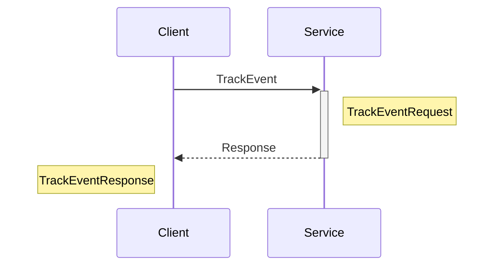

---

### BatchTrackEvents

<a name="batchtrackevents"></a>

#### Method Signature

```protobuf
// Client streaming RPC
rpc BatchTrackEvents(stream TrackEventRequest) returns (BatchTrackResponse);
```

#### Method Details

| Attribute | Value |
|-----------|-------|
| **Full Name** | `analytics.v1.BatchTrackEvents` |
| **Input Type** | [`TrackEventRequest`](#trackeventrequest) |
| **Output Type** | [`BatchTrackResponse`](#batchtrackresponse) |
| **Streaming Type** | Client Streaming |

##### Sequence Diagram

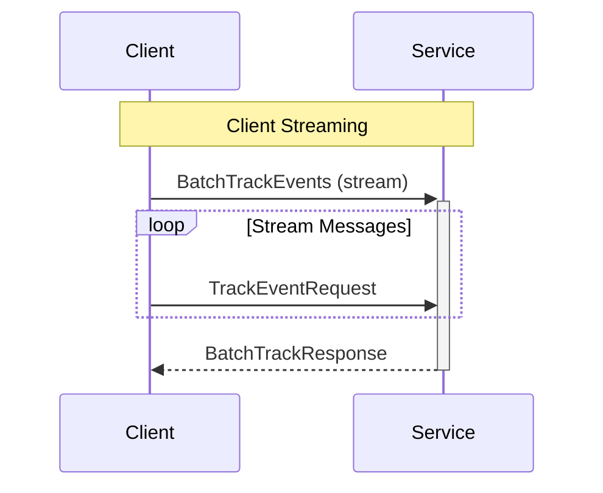

---

### GetMetrics

<a name="getmetrics"></a>

#### Method Signature

```protobuf
// Unary RPC
rpc GetMetrics(GetMetricsRequest) returns (GetMetricsResponse);
```

#### Method Details

| Attribute | Value |
|-----------|-------|
| **Full Name** | `analytics.v1.GetMetrics` |
| **Input Type** | [`GetMetricsRequest`](#getmetricsrequest) |
| **Output Type** | [`GetMetricsResponse`](#getmetricsresponse) |
| **Streaming Type** | Unary |

##### Sequence Diagram

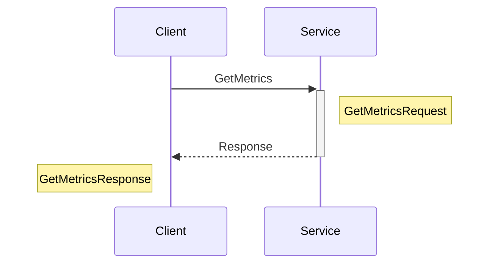

---

### GetReport

<a name="getreport"></a>

#### Method Signature

```protobuf
// Unary RPC
rpc GetReport(GetReportRequest) returns (GetReportResponse);
```

#### Method Details

| Attribute | Value |
|-----------|-------|
| **Full Name** | `analytics.v1.GetReport` |
| **Input Type** | [`GetReportRequest`](#getreportrequest) |
| **Output Type** | [`GetReportResponse`](#getreportresponse) |
| **Streaming Type** | Unary |

##### Sequence Diagram

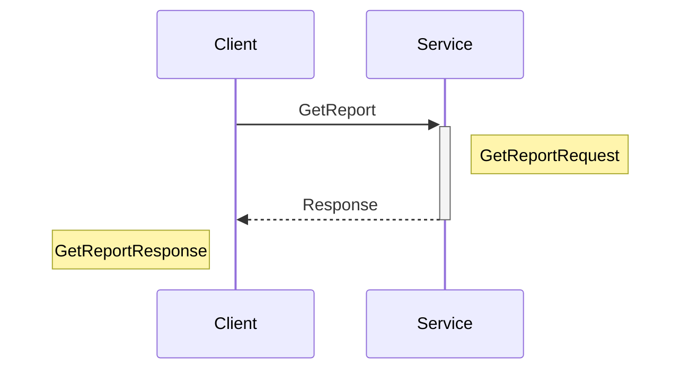

---

### StreamMetrics

<a name="streammetrics"></a>

#### Method Signature

```protobuf
// Server streaming RPC
rpc StreamMetrics(StreamMetricsRequest) returns (stream MetricUpdate);
```

#### Method Details

| Attribute | Value |
|-----------|-------|
| **Full Name** | `analytics.v1.StreamMetrics` |
| **Input Type** | [`StreamMetricsRequest`](#streammetricsrequest) |
| **Output Type** | [`MetricUpdate`](#metricupdate) |
| **Streaming Type** | Server Streaming |

##### Sequence Diagram

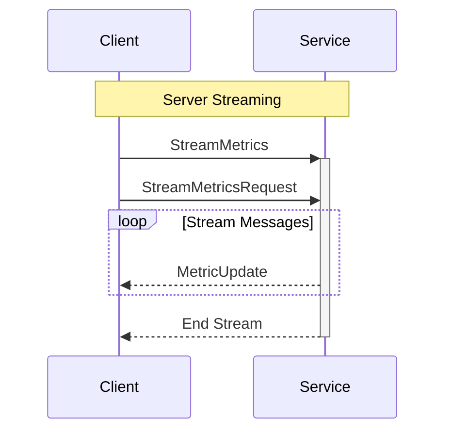

---

### QueryData

<a name="querydata"></a>

#### Method Signature

```protobuf
// Unary RPC
rpc QueryData(QueryRequest) returns (QueryResponse);
```

#### Method Details

| Attribute | Value |
|-----------|-------|
| **Full Name** | `analytics.v1.QueryData` |
| **Input Type** | [`QueryRequest`](#queryrequest) |
| **Output Type** | [`QueryResponse`](#queryresponse) |
| **Streaming Type** | Unary |

##### Sequence Diagram

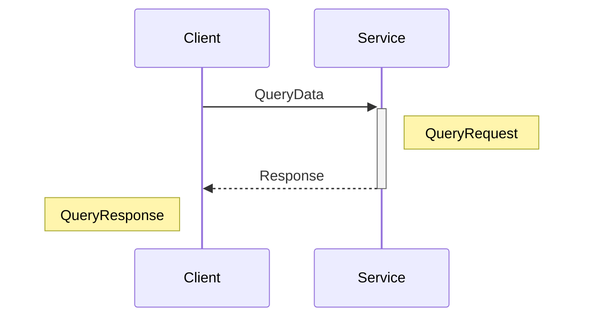

---

### CreateDashboard

<a name="createdashboard"></a>

#### Method Signature

```protobuf
// Unary RPC
rpc CreateDashboard(CreateDashboardRequest) returns (CreateDashboardResponse);
```

#### Method Details

| Attribute | Value |
|-----------|-------|
| **Full Name** | `analytics.v1.CreateDashboard` |
| **Input Type** | [`CreateDashboardRequest`](#createdashboardrequest) |
| **Output Type** | [`CreateDashboardResponse`](#createdashboardresponse) |
| **Streaming Type** | Unary |

##### Sequence Diagram

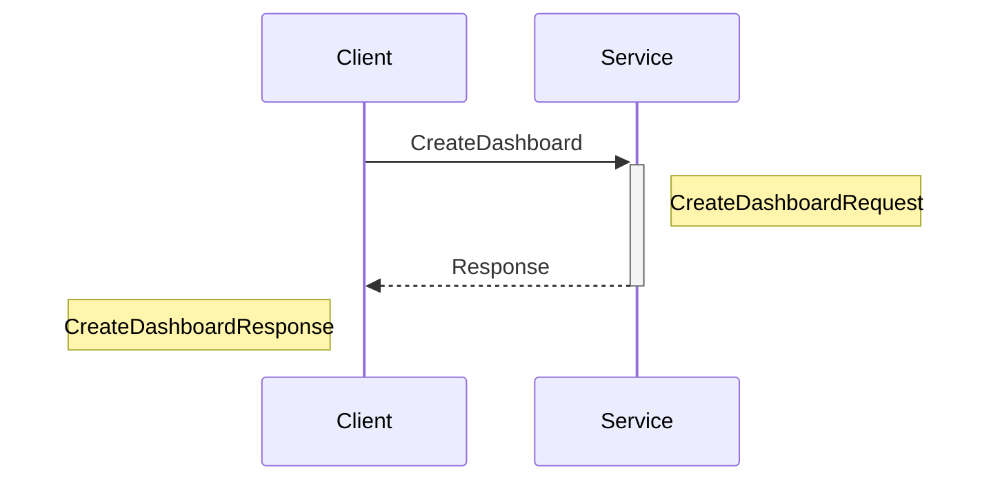

---

### GetDashboard

<a name="getdashboard"></a>

#### Method Signature

```protobuf
// Unary RPC
rpc GetDashboard(GetDashboardRequest) returns (GetDashboardResponse);
```

#### Method Details

| Attribute | Value |
|-----------|-------|
| **Full Name** | `analytics.v1.GetDashboard` |
| **Input Type** | [`GetDashboardRequest`](#getdashboardrequest) |
| **Output Type** | [`GetDashboardResponse`](#getdashboardresponse) |
| **Streaming Type** | Unary |

##### Sequence Diagram

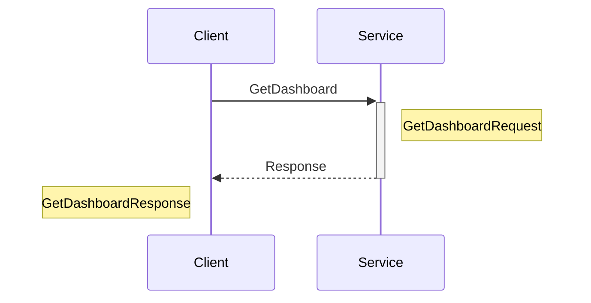

---

## 📦 Messages

<a name="messages"></a>

This service defines **15 message types**:

### QueryRequest

<a name="queryrequest"></a>

| Attribute | Value |
|-----------|-------|
| **Full Name** | `analytics.v1.QueryRequest` |
| **Field Count** | 4 |
| **Nested Types** | 1 |

#### Fields

| # | Name | Type | Label | Description |
|---|------|------|-------|-------------|
| 1 | `query` | TYPE_STRING | optional | - |
| 2 | `parameters` | [`ParametersEntry`](#parametersentry) | repeated | - |
| 3 | `limit` | TYPE_INT32 | optional | - |
| 4 | `offset` | TYPE_INT32 | optional | - |

#### Proto Definition

```protobuf
message QueryRequest {
  optional TYPE_STRING query = 1;
  repeated ParametersEntry parameters = 2;
  optional TYPE_INT32 limit = 3;
  optional TYPE_INT32 offset = 4;
}
```

##### Message Structure

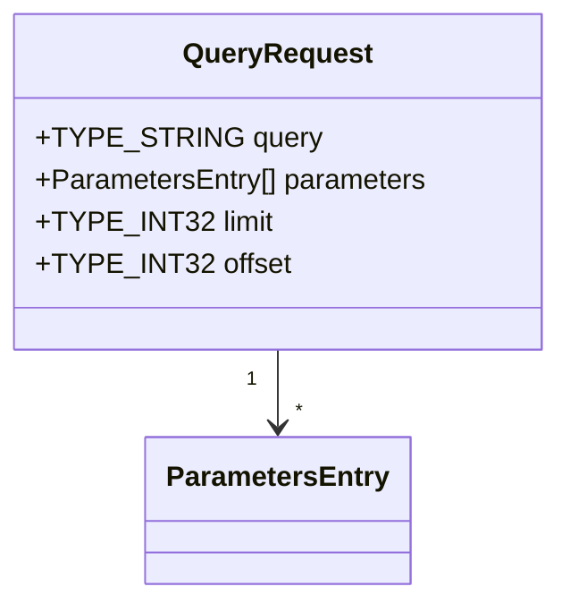

---

### QueryResponse

<a name="queryresponse"></a>

| Attribute | Value |
|-----------|-------|
| **Full Name** | `analytics.v1.QueryResponse` |
| **Field Count** | 2 |

#### Fields

| # | Name | Type | Label | Description |
|---|------|------|-------|-------------|
| 1 | `result` | [`DataTable`](#datatable) | optional | - |
| 2 | `execution_time` | [`Duration`](#duration) | optional | - |

#### Proto Definition

```protobuf
message QueryResponse {
  optional DataTable result = 1;
  optional Duration execution_time = 2;
}
```

##### Message Structure

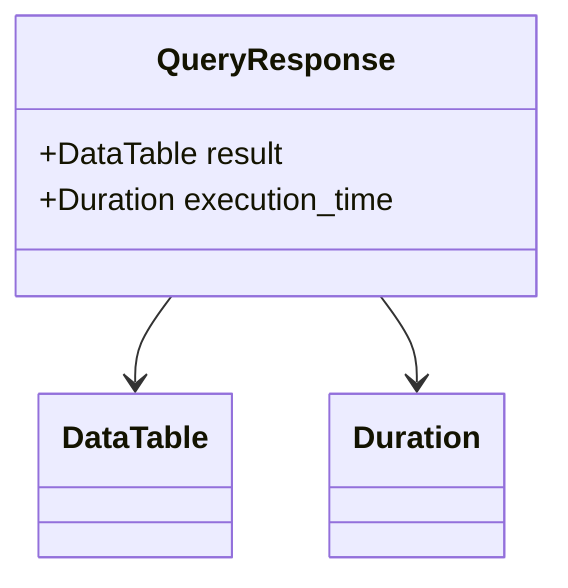

---

### GetMetricsRequest

<a name="getmetricsrequest"></a>

| Attribute | Value |
|-----------|-------|
| **Full Name** | `analytics.v1.GetMetricsRequest` |
| **Field Count** | 4 |
| **Nested Types** | 1 |

#### Fields

| # | Name | Type | Label | Description |
|---|------|------|-------|-------------|
| 1 | `metric_names` | TYPE_STRING | repeated | - |
| 2 | `time_range` | [`TimeRange`](#timerange) | optional | - |
| 3 | `filters` | [`FiltersEntry`](#filtersentry) | repeated | - |
| 4 | `group_by` | TYPE_STRING | repeated | - |

#### Proto Definition

```protobuf
message GetMetricsRequest {
  repeated TYPE_STRING metric_names = 1;
  optional TimeRange time_range = 2;
  repeated FiltersEntry filters = 3;
  repeated TYPE_STRING group_by = 4;
}
```

##### Message Structure

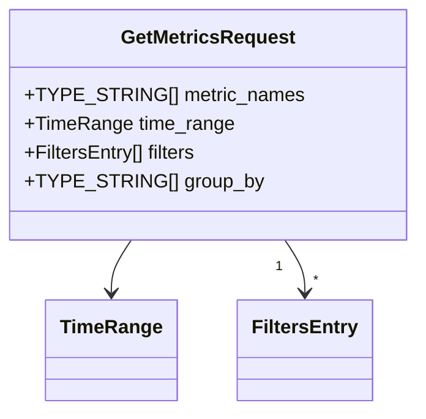

---

### StreamMetricsRequest

<a name="streammetricsrequest"></a>

| Attribute | Value |
|-----------|-------|
| **Full Name** | `analytics.v1.StreamMetricsRequest` |
| **Field Count** | 2 |

#### Fields

| # | Name | Type | Label | Description |
|---|------|------|-------|-------------|
| 1 | `metric_names` | TYPE_STRING | repeated | - |
| 2 | `interval` | [`Duration`](#duration) | optional | - |

#### Proto Definition

```protobuf
message StreamMetricsRequest {
  repeated TYPE_STRING metric_names = 1;
  optional Duration interval = 2;
}
```

##### Message Structure

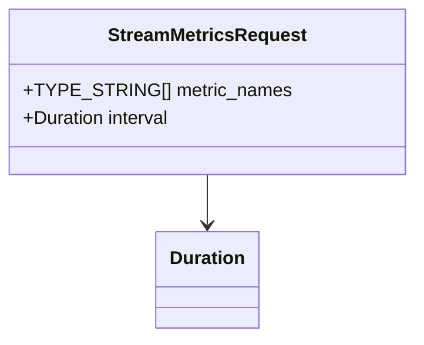

---

### GetDashboardResponse

<a name="getdashboardresponse"></a>

| Attribute | Value |
|-----------|-------|
| **Full Name** | `analytics.v1.GetDashboardResponse` |
| **Field Count** | 2 |
| **Nested Types** | 1 |

#### Fields

| # | Name | Type | Label | Description |
|---|------|------|-------|-------------|
| 1 | `dashboard` | [`Dashboard`](#dashboard) | optional | - |
| 2 | `widget_data` | [`WidgetDataEntry`](#widgetdataentry) | repeated | - |

#### Proto Definition

```protobuf
message GetDashboardResponse {
  optional Dashboard dashboard = 1;
  repeated WidgetDataEntry widget_data = 2;
}
```

##### Message Structure

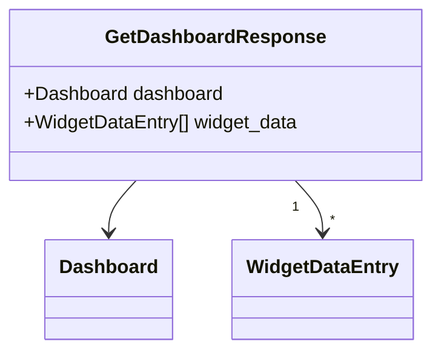

---

### TrackEventRequest

<a name="trackeventrequest"></a>

| Attribute | Value |
|-----------|-------|
| **Full Name** | `analytics.v1.TrackEventRequest` |
| **Field Count** | 1 |

#### Fields

| # | Name | Type | Label | Description |
|---|------|------|-------|-------------|
| 1 | `event` | [`Event`](#event) | optional | - |

#### Proto Definition

```protobuf
message TrackEventRequest {
  optional Event event = 1;
}
```

##### Message Structure

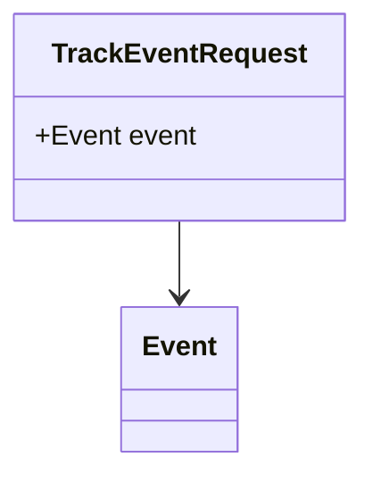

---

### CreateDashboardRequest

<a name="createdashboardrequest"></a>

| Attribute | Value |
|-----------|-------|
| **Full Name** | `analytics.v1.CreateDashboardRequest` |
| **Field Count** | 1 |

#### Fields

| # | Name | Type | Label | Description |
|---|------|------|-------|-------------|
| 1 | `dashboard` | [`Dashboard`](#dashboard) | optional | - |

#### Proto Definition

```protobuf
message CreateDashboardRequest {
  optional Dashboard dashboard = 1;
}
```

##### Message Structure

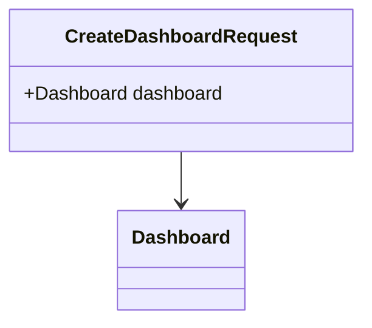

---

### CreateDashboardResponse

<a name="createdashboardresponse"></a>

| Attribute | Value |
|-----------|-------|
| **Full Name** | `analytics.v1.CreateDashboardResponse` |
| **Field Count** | 1 |

#### Fields

| # | Name | Type | Label | Description |
|---|------|------|-------|-------------|
| 1 | `dashboard` | [`Dashboard`](#dashboard) | optional | - |

#### Proto Definition

```protobuf
message CreateDashboardResponse {
  optional Dashboard dashboard = 1;
}
```

##### Message Structure

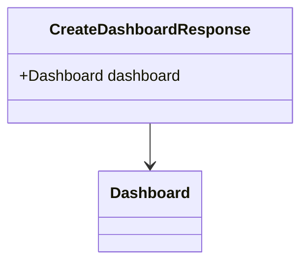

---

### TrackEventResponse

<a name="trackeventresponse"></a>

| Attribute | Value |
|-----------|-------|
| **Full Name** | `analytics.v1.TrackEventResponse` |
| **Field Count** | 2 |

#### Fields

| # | Name | Type | Label | Description |
|---|------|------|-------|-------------|
| 1 | `event_id` | TYPE_STRING | optional | - |
| 2 | `success` | TYPE_BOOL | optional | - |

#### Proto Definition

```protobuf
message TrackEventResponse {
  optional TYPE_STRING event_id = 1;
  optional TYPE_BOOL success = 2;
}
```

##### Message Structure

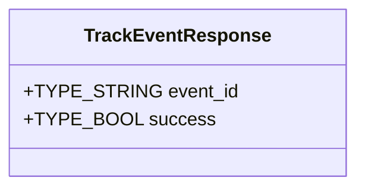

---

### BatchTrackResponse

<a name="batchtrackresponse"></a>

| Attribute | Value |
|-----------|-------|
| **Full Name** | `analytics.v1.BatchTrackResponse` |
| **Field Count** | 2 |

#### Fields

| # | Name | Type | Label | Description |
|---|------|------|-------|-------------|
| 1 | `events_tracked` | TYPE_INT32 | optional | - |
| 2 | `failed_count` | TYPE_INT32 | optional | - |

#### Proto Definition

```protobuf
message BatchTrackResponse {
  optional TYPE_INT32 events_tracked = 1;
  optional TYPE_INT32 failed_count = 2;
}
```

##### Message Structure

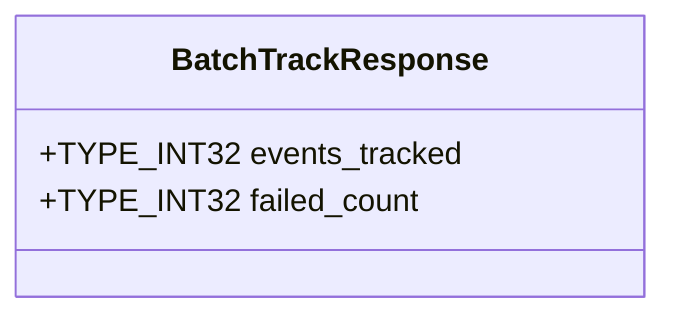

---

### GetMetricsResponse

<a name="getmetricsresponse"></a>

| Attribute | Value |
|-----------|-------|
| **Full Name** | `analytics.v1.GetMetricsResponse` |
| **Field Count** | 1 |

#### Fields

| # | Name | Type | Label | Description |
|---|------|------|-------|-------------|
| 1 | `metrics` | [`MetricSeries`](#metricseries) | repeated | - |

#### Proto Definition

```protobuf
message GetMetricsResponse {
  repeated MetricSeries metrics = 1;
}
```

##### Message Structure

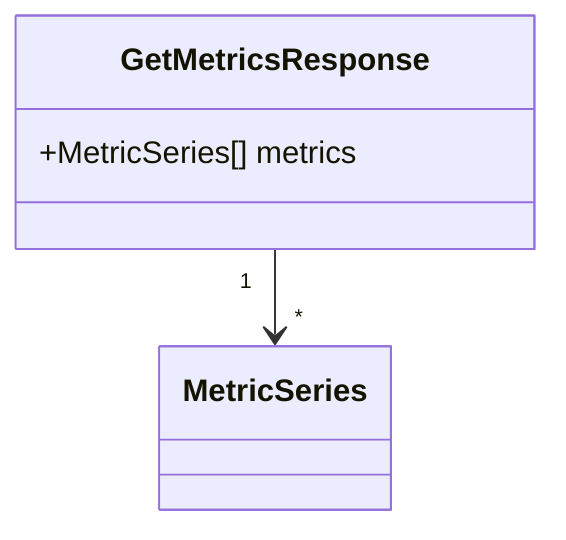

---

### GetReportRequest

<a name="getreportrequest"></a>

| Attribute | Value |
|-----------|-------|
| **Full Name** | `analytics.v1.GetReportRequest` |
| **Field Count** | 5 |
| **Nested Types** | 1 |

#### Fields

| # | Name | Type | Label | Description |
|---|------|------|-------|-------------|
| 1 | `type` | [`ReportType`](#reporttype) | optional | - |
| 2 | `time_range` | [`TimeRange`](#timerange) | optional | - |
| 3 | `filters` | [`FiltersEntry`](#filtersentry) | repeated | - |
| 4 | `metrics` | TYPE_STRING | repeated | - |
| 5 | `dimensions` | TYPE_STRING | repeated | - |

#### Proto Definition

```protobuf
message GetReportRequest {
  optional ReportType type = 1;
  optional TimeRange time_range = 2;
  repeated FiltersEntry filters = 3;
  repeated TYPE_STRING metrics = 4;
  repeated TYPE_STRING dimensions = 5;
}
```

##### Message Structure

```mermaid
classDiagram
    class GetReportRequest {
        +ReportType type
        +TimeRange time_range
        +FiltersEntry[] filters
        +TYPE_STRING[] metrics
        +TYPE_STRING[] dimensions
    }
    GetReportRequest --> ReportType
    GetReportRequest --> TimeRange
    GetReportRequest "1" --> "*" FiltersEntry
```

---

### GetReportResponse

<a name="getreportresponse"></a>

| Attribute | Value |
|-----------|-------|
| **Full Name** | `analytics.v1.GetReportResponse` |
| **Field Count** | 1 |

#### Fields

| # | Name | Type | Label | Description |
|---|------|------|-------|-------------|
| 1 | `report` | [`Report`](#report) | optional | - |

#### Proto Definition

```protobuf
message GetReportResponse {
  optional Report report = 1;
}
```

##### Message Structure

```mermaid
classDiagram
    class GetReportResponse {
        +Report report
    }
    GetReportResponse --> Report
```

---

### MetricUpdate

<a name="metricupdate"></a>

| Attribute | Value |
|-----------|-------|
| **Full Name** | `analytics.v1.MetricUpdate` |
| **Field Count** | 2 |

#### Fields

| # | Name | Type | Label | Description |
|---|------|------|-------|-------------|
| 1 | `metric` | [`Metric`](#metric) | optional | - |
| 2 | `timestamp` | [`Timestamp`](#timestamp) | optional | - |

#### Proto Definition

```protobuf
message MetricUpdate {
  optional Metric metric = 1;
  optional Timestamp timestamp = 2;
}
```

##### Message Structure

```mermaid
classDiagram
    class MetricUpdate {
        +Metric metric
        +Timestamp timestamp
    }
    MetricUpdate --> Metric
    MetricUpdate --> Timestamp
```

---

### GetDashboardRequest

<a name="getdashboardrequest"></a>

| Attribute | Value |
|-----------|-------|
| **Full Name** | `analytics.v1.GetDashboardRequest` |
| **Field Count** | 1 |

#### Fields

| # | Name | Type | Label | Description |
|---|------|------|-------|-------------|
| 1 | `dashboard_id` | TYPE_STRING | optional | - |

#### Proto Definition

```protobuf
message GetDashboardRequest {
  optional TYPE_STRING dashboard_id = 1;
}
```

##### Message Structure

```mermaid
classDiagram
    class GetDashboardRequest {
        +TYPE_STRING dashboard_id
    }
```

---

## 🔢 Enumerations

<a name="enumerations"></a>

This service defines **10 enumeration types**:

### ChartType

<a name="charttype"></a>

| Value | Number | Description |
|-------|--------|-------------|
| `CHART_TYPE_UNSPECIFIED` | 0 | - |
| `CHART_TYPE_LINE` | 1 | - |
| `CHART_TYPE_BAR` | 2 | - |
| `CHART_TYPE_PIE` | 3 | - |
| `CHART_TYPE_AREA` | 4 | - |
| `CHART_TYPE_SCATTER` | 5 | - |
| `CHART_TYPE_HEATMAP` | 6 | - |
| `CHART_TYPE_FUNNEL` | 7 | - |

#### Proto Definition

```protobuf
enum ChartType {
  CHART_TYPE_UNSPECIFIED = 0;
  CHART_TYPE_LINE = 1;
  CHART_TYPE_BAR = 2;
  CHART_TYPE_PIE = 3;
  CHART_TYPE_AREA = 4;
  CHART_TYPE_SCATTER = 5;
  CHART_TYPE_HEATMAP = 6;
  CHART_TYPE_FUNNEL = 7;
}
```

---

### DataType

<a name="datatype"></a>

| Value | Number | Description |
|-------|--------|-------------|
| `DATA_TYPE_UNSPECIFIED` | 0 | - |
| `DATA_TYPE_STRING` | 1 | - |
| `DATA_TYPE_NUMBER` | 2 | - |
| `DATA_TYPE_BOOLEAN` | 3 | - |
| `DATA_TYPE_TIMESTAMP` | 4 | - |
| `DATA_TYPE_DURATION` | 5 | - |

#### Proto Definition

```protobuf
enum DataType {
  DATA_TYPE_UNSPECIFIED = 0;
  DATA_TYPE_STRING = 1;
  DATA_TYPE_NUMBER = 2;
  DATA_TYPE_BOOLEAN = 3;
  DATA_TYPE_TIMESTAMP = 4;
  DATA_TYPE_DURATION = 5;
}
```

---

### AggregationType

<a name="aggregationtype"></a>

| Value | Number | Description |
|-------|--------|-------------|
| `AGGREGATION_TYPE_UNSPECIFIED` | 0 | - |
| `AGGREGATION_TYPE_SUM` | 1 | - |
| `AGGREGATION_TYPE_AVG` | 2 | - |
| `AGGREGATION_TYPE_MIN` | 3 | - |
| `AGGREGATION_TYPE_MAX` | 4 | - |
| `AGGREGATION_TYPE_COUNT` | 5 | - |
| `AGGREGATION_TYPE_PERCENTILE` | 6 | - |

#### Proto Definition

```protobuf
enum AggregationType {
  AGGREGATION_TYPE_UNSPECIFIED = 0;
  AGGREGATION_TYPE_SUM = 1;
  AGGREGATION_TYPE_AVG = 2;
  AGGREGATION_TYPE_MIN = 3;
  AGGREGATION_TYPE_MAX = 4;
  AGGREGATION_TYPE_COUNT = 5;
  AGGREGATION_TYPE_PERCENTILE = 6;
}
```

---

### TimeGranularity

<a name="timegranularity"></a>

| Value | Number | Description |
|-------|--------|-------------|
| `TIME_GRANULARITY_UNSPECIFIED` | 0 | - |
| `TIME_GRANULARITY_MINUTE` | 1 | - |
| `TIME_GRANULARITY_HOUR` | 2 | - |
| `TIME_GRANULARITY_DAY` | 3 | - |
| `TIME_GRANULARITY_WEEK` | 4 | - |
| `TIME_GRANULARITY_MONTH` | 5 | - |
| `TIME_GRANULARITY_YEAR` | 6 | - |

#### Proto Definition

```protobuf
enum TimeGranularity {
  TIME_GRANULARITY_UNSPECIFIED = 0;
  TIME_GRANULARITY_MINUTE = 1;
  TIME_GRANULARITY_HOUR = 2;
  TIME_GRANULARITY_DAY = 3;
  TIME_GRANULARITY_WEEK = 4;
  TIME_GRANULARITY_MONTH = 5;
  TIME_GRANULARITY_YEAR = 6;
}
```

---

### ReportType

<a name="reporttype"></a>

| Value | Number | Description |
|-------|--------|-------------|
| `REPORT_TYPE_UNSPECIFIED` | 0 | - |
| `REPORT_TYPE_OVERVIEW` | 1 | - |
| `REPORT_TYPE_USER_ACTIVITY` | 2 | - |
| `REPORT_TYPE_CONVERSION` | 3 | - |
| `REPORT_TYPE_REVENUE` | 4 | - |
| `REPORT_TYPE_RETENTION` | 5 | - |
| `REPORT_TYPE_FUNNEL` | 6 | - |
| `REPORT_TYPE_COHORT` | 7 | - |
| `REPORT_TYPE_CUSTOM` | 100 | - |

#### Proto Definition

```protobuf
enum ReportType {
  REPORT_TYPE_UNSPECIFIED = 0;
  REPORT_TYPE_OVERVIEW = 1;
  REPORT_TYPE_USER_ACTIVITY = 2;
  REPORT_TYPE_CONVERSION = 3;
  REPORT_TYPE_REVENUE = 4;
  REPORT_TYPE_RETENTION = 5;
  REPORT_TYPE_FUNNEL = 6;
  REPORT_TYPE_COHORT = 7;
  REPORT_TYPE_CUSTOM = 100;
}
```

---

### WidgetType

<a name="widgettype"></a>

| Value | Number | Description |
|-------|--------|-------------|
| `WIDGET_TYPE_UNSPECIFIED` | 0 | - |
| `WIDGET_TYPE_METRIC` | 1 | - |
| `WIDGET_TYPE_CHART` | 2 | - |
| `WIDGET_TYPE_TABLE` | 3 | - |
| `WIDGET_TYPE_TEXT` | 4 | - |
| `WIDGET_TYPE_CUSTOM` | 100 | - |

#### Proto Definition

```protobuf
enum WidgetType {
  WIDGET_TYPE_UNSPECIFIED = 0;
  WIDGET_TYPE_METRIC = 1;
  WIDGET_TYPE_CHART = 2;
  WIDGET_TYPE_TABLE = 3;
  WIDGET_TYPE_TEXT = 4;
  WIDGET_TYPE_CUSTOM = 100;
}
```

---

### EventType

<a name="eventtype"></a>

| Value | Number | Description |
|-------|--------|-------------|
| `EVENT_TYPE_UNSPECIFIED` | 0 | - |
| `EVENT_TYPE_PAGE_VIEW` | 1 | - |
| `EVENT_TYPE_CLICK` | 2 | - |
| `EVENT_TYPE_CONVERSION` | 3 | - |
| `EVENT_TYPE_PURCHASE` | 4 | - |
| `EVENT_TYPE_SIGNUP` | 5 | - |
| `EVENT_TYPE_LOGIN` | 6 | - |
| `EVENT_TYPE_LOGOUT` | 7 | - |
| `EVENT_TYPE_SEARCH` | 8 | - |
| `EVENT_TYPE_SHARE` | 9 | - |
| `EVENT_TYPE_CUSTOM` | 100 | - |

#### Proto Definition

```protobuf
enum EventType {
  EVENT_TYPE_UNSPECIFIED = 0;
  EVENT_TYPE_PAGE_VIEW = 1;
  EVENT_TYPE_CLICK = 2;
  EVENT_TYPE_CONVERSION = 3;
  EVENT_TYPE_PURCHASE = 4;
  EVENT_TYPE_SIGNUP = 5;
  EVENT_TYPE_LOGIN = 6;
  EVENT_TYPE_LOGOUT = 7;
  EVENT_TYPE_SEARCH = 8;
  EVENT_TYPE_SHARE = 9;
  EVENT_TYPE_CUSTOM = 100;
}
```

---

### MetricType

<a name="metrictype"></a>

| Value | Number | Description |
|-------|--------|-------------|
| `METRIC_TYPE_UNSPECIFIED` | 0 | - |
| `METRIC_TYPE_COUNTER` | 1 | - |
| `METRIC_TYPE_GAUGE` | 2 | - |
| `METRIC_TYPE_HISTOGRAM` | 3 | - |
| `METRIC_TYPE_SUMMARY` | 4 | - |

#### Proto Definition

```protobuf
enum MetricType {
  METRIC_TYPE_UNSPECIFIED = 0;
  METRIC_TYPE_COUNTER = 1;
  METRIC_TYPE_GAUGE = 2;
  METRIC_TYPE_HISTOGRAM = 3;
  METRIC_TYPE_SUMMARY = 4;
}
```

---

### DeviceType

<a name="devicetype"></a>

| Value | Number | Description |
|-------|--------|-------------|
| `DEVICE_TYPE_UNSPECIFIED` | 0 | - |
| `DEVICE_TYPE_DESKTOP` | 1 | - |
| `DEVICE_TYPE_MOBILE` | 2 | - |
| `DEVICE_TYPE_TABLET` | 3 | - |
| `DEVICE_TYPE_TV` | 4 | - |
| `DEVICE_TYPE_WEARABLE` | 5 | - |

#### Proto Definition

```protobuf
enum DeviceType {
  DEVICE_TYPE_UNSPECIFIED = 0;
  DEVICE_TYPE_DESKTOP = 1;
  DEVICE_TYPE_MOBILE = 2;
  DEVICE_TYPE_TABLET = 3;
  DEVICE_TYPE_TV = 4;
  DEVICE_TYPE_WEARABLE = 5;
}
```

---

### Trend

<a name="trend"></a>

| Value | Number | Description |
|-------|--------|-------------|
| `TREND_UNSPECIFIED` | 0 | - |
| `TREND_UP` | 1 | - |
| `TREND_DOWN` | 2 | - |
| `TREND_STABLE` | 3 | - |

#### Proto Definition

```protobuf
enum Trend {
  TREND_UNSPECIFIED = 0;
  TREND_UP = 1;
  TREND_DOWN = 2;
  TREND_STABLE = 3;
}
```

---

## ⚠️ Error Codes

<a name="error-codes"></a>

This service uses standard gRPC status codes:

| gRPC Code | HTTP Status | Description |
|-----------|-------------|-------------|
| `OK` | 200 | Success |
| `CANCELLED` | 499 | Operation cancelled by client |
| `UNKNOWN` | 500 | Unknown error |
| `INVALID_ARGUMENT` | 400 | Client specified an invalid argument |
| `DEADLINE_EXCEEDED` | 504 | Deadline expired before operation could complete |
| `NOT_FOUND` | 404 | Requested entity not found |
| `ALREADY_EXISTS` | 409 | Entity already exists |
| `PERMISSION_DENIED` | 403 | Caller does not have permission |
| `RESOURCE_EXHAUSTED` | 429 | Resource has been exhausted |
| `FAILED_PRECONDITION` | 400 | Operation rejected because system is not in required state |
| `ABORTED` | 409 | Operation aborted, typically due to concurrency issue |
| `OUT_OF_RANGE` | 400 | Operation attempted past valid range |
| `UNIMPLEMENTED` | 501 | Operation not implemented |
| `INTERNAL` | 500 | Internal server error |
| `UNAVAILABLE` | 503 | Service unavailable |
| `DATA_LOSS` | 500 | Unrecoverable data loss or corruption |
| `UNAUTHENTICATED` | 401 | Request does not have valid authentication credentials |

### Error Handling Best Practices

1. **Check status codes**: Always check the gRPC status code before processing responses
2. **Implement retries**: Use exponential backoff for transient errors (`UNAVAILABLE`, `RESOURCE_EXHAUSTED`)
3. **Log errors**: Log error details with correlation IDs for troubleshooting
4. **Handle streaming errors**: Properly handle errors in streaming RPCs
5. **Validate inputs**: Validate inputs client-side to avoid `INVALID_ARGUMENT` errors

---

## 💡 Examples

<a name="examples"></a>

### Go Example

```go
package main

import (
    "context"
    "log"
    "time"

    "google.golang.org/grpc"
    "google.golang.org/grpc/credentials/insecure"

    pb "analytics.v1"
)

func main() {
    // Connect to the service
    conn, err := grpc.Dial("localhost:50051",
        grpc.WithTransportCredentials(insecure.NewCredentials()))
    if err != nil {
        log.Fatalf("Failed to connect: %v", err)
    }
    defer conn.Close()

    client := pb.NewAnalyticsServiceClient(conn)

    // Example RPC call
    ctx, cancel := context.WithTimeout(context.Background(), 5*time.Second)
    defer cancel()

    req := &pb.TrackEventRequest{
        // Fill in request fields
    }

    resp, err := client.TrackEvent(ctx, req)
    if err != nil {
        log.Fatalf("RPC failed: %v", err)
    }

    log.Printf("Response: %v", resp)
}
```

### JavaScript (Node.js) Example

```javascript
const grpc = require('@grpc/grpc-js');
const protoLoader = require('@grpc/proto-loader');

// Load proto file
const packageDefinition = protoLoader.loadSync(
    'analytics/analytics.proto',
    {
        keepCase: true,
        longs: String,
        enums: String,
        defaults: true,
        oneofs: true
    }
);

const proto = grpc.loadPackageDefinition(packageDefinition);

// Create client
const client = new proto.analytics.v1.AnalyticsService(
    'localhost:50051',
    grpc.credentials.createInsecure()
);

// Example RPC call
const request = {
    // Fill in request fields
};

client.TrackEvent(request, (error, response) => {
    if (error) {
        console.error('RPC failed:', error);
        return;
    }
    console.log('Response:', response);
});
```

---

---

<div align="center">

**Generated Documentation**

| Attribute | Value |
|-----------|-------|
| Generated At | 0001-01-01 00:00:00 UTC |
| Generator Version |  |

📚 **Documentation** | 🔧 **ProtoDocs** | ✨ **Auto-Generated**

</div>
