# 📚 NotificationService API Documentation

| **Attribute** | **Value** |
|---------------|----------|
| **Service Name** | `NotificationService` |
| **Package** | `notifications.v1` |
| **Version** |  |
| **Proto File** | `notifications/notifications.proto` |
| **Generated** | 0001-01-01T00:00:00Z |

---

## 📑 Table of Contents

- [Overview](#overview)
- [Architecture](#architecture)
- [Methods](#methods)
  - [SendNotification](#sendnotification)
  - [SendBulkNotifications](#sendbulknotifications)
  - [GetNotification](#getnotification)
  - [ListNotifications](#listnotifications)
  - [MarkAsRead](#markasread)
  - [DeleteNotification](#deletenotification)
  - [StreamNotifications](#streamnotifications)
  - [GetPreferences](#getpreferences)
  - [UpdatePreferences](#updatepreferences)
- [Messages](#messages)
  - [NotificationEvent](#notificationevent)
  - [SendBulkRequest](#sendbulkrequest)
  - [ListNotificationsResponse](#listnotificationsresponse)
  - [MarkAsReadRequest](#markasreadrequest)
  - [DeleteNotificationRequest](#deletenotificationrequest)
  - [UpdatePreferencesResponse](#updatepreferencesresponse)
  - [SendNotificationResponse](#sendnotificationresponse)
  - [GetPreferencesRequest](#getpreferencesrequest)
  - [GetPreferencesResponse](#getpreferencesresponse)
  - [SendNotificationRequest](#sendnotificationrequest)
  - [BulkSendResult](#bulksendresult)
  - [GetNotificationRequest](#getnotificationrequest)
  - [GetNotificationResponse](#getnotificationresponse)
  - [UpdatePreferencesRequest](#updatepreferencesrequest)
  - [ListNotificationsRequest](#listnotificationsrequest)
  - [StreamNotificationsRequest](#streamnotificationsrequest)
- [Enumerations](#enumerations)
- [Error Codes](#error-codes)
- [Examples](#examples)

---

## 📖 Overview

<a name="overview"></a>

### Service Statistics

| Metric | Count |
|--------|-------|
| **RPC Methods** | 9 |
| **Message Types** | 16 |
| **Enumerations** | 7 |
| **Streaming RPCs** | 2 |

### Quick Start

This service provides the following capabilities:

- [`SendNotification`](#sendnotification): 
- [`SendBulkNotifications`](#sendbulknotifications) (server streaming): 
- [`GetNotification`](#getnotification): 
- [`ListNotifications`](#listnotifications): 
- [`MarkAsRead`](#markasread): 
- ... and 4 more methods

---

## 🏗️ Architecture

<a name="architecture"></a>

```mermaid
graph TB
    classDef serviceClass fill:#e1f5ff,stroke:#01579b,stroke-width:3px
    classDef methodClass fill:#f3e5f5,stroke:#4a148c,stroke-width:2px
    classDef messageClass fill:#e8f5e9,stroke:#1b5e20,stroke-width:2px

    NotificationService[🔧 NotificationService]:::serviceClass

    SendNotification[SendNotification]:::methodClass
    NotificationService --> SendNotification
    SendNotification_in[📥 SendNotificationRequest]:::messageClass
    SendNotification_out[📤 SendNotificationResponse]:::messageClass
    SendNotification_in -.->|input| SendNotification
    SendNotification -.->|output| SendNotification_out
    SendBulkNotifications[↓ SendBulkNotifications]:::methodClass
    NotificationService --> SendBulkNotifications
    SendBulkNotifications_in[📥 SendBulkRequest]:::messageClass
    SendBulkNotifications_out[📤 BulkSendResult]:::messageClass
    SendBulkNotifications_in -.->|input| SendBulkNotifications
    SendBulkNotifications -.->|output| SendBulkNotifications_out
    GetNotification[GetNotification]:::methodClass
    NotificationService --> GetNotification
    GetNotification_in[📥 GetNotificationRequest]:::messageClass
    GetNotification_out[📤 GetNotificationResponse]:::messageClass
    GetNotification_in -.->|input| GetNotification
    GetNotification -.->|output| GetNotification_out
    ListNotifications[ListNotifications]:::methodClass
    NotificationService --> ListNotifications
    ListNotifications_in[📥 ListNotificationsRequest]:::messageClass
    ListNotifications_out[📤 ListNotificationsResponse]:::messageClass
    ListNotifications_in -.->|input| ListNotifications
    ListNotifications -.->|output| ListNotifications_out
    MarkAsRead[MarkAsRead]:::methodClass
    NotificationService --> MarkAsRead
    MarkAsRead_in[📥 MarkAsReadRequest]:::messageClass
    MarkAsRead_out[📤 Empty]:::messageClass
    MarkAsRead_in -.->|input| MarkAsRead
    MarkAsRead -.->|output| MarkAsRead_out
    DeleteNotification[DeleteNotification]:::methodClass
    NotificationService --> DeleteNotification
    DeleteNotification_in[📥 DeleteNotificationRequest]:::messageClass
    DeleteNotification_out[📤 Empty]:::messageClass
    DeleteNotification_in -.->|input| DeleteNotification
    DeleteNotification -.->|output| DeleteNotification_out
    StreamNotifications[↓ StreamNotifications]:::methodClass
    NotificationService --> StreamNotifications
    StreamNotifications_in[📥 StreamNotificationsRequest]:::messageClass
    StreamNotifications_out[📤 NotificationEvent]:::messageClass
    StreamNotifications_in -.->|input| StreamNotifications
    StreamNotifications -.->|output| StreamNotifications_out
    GetPreferences[GetPreferences]:::methodClass
    NotificationService --> GetPreferences
    GetPreferences_in[📥 GetPreferencesRequest]:::messageClass
    GetPreferences_out[📤 GetPreferencesResponse]:::messageClass
    GetPreferences_in -.->|input| GetPreferences
    GetPreferences -.->|output| GetPreferences_out
    UpdatePreferences[UpdatePreferences]:::methodClass
    NotificationService --> UpdatePreferences
    UpdatePreferences_in[📥 UpdatePreferencesRequest]:::messageClass
    UpdatePreferences_out[📤 UpdatePreferencesResponse]:::messageClass
    UpdatePreferences_in -.->|input| UpdatePreferences
    UpdatePreferences -.->|output| UpdatePreferences_out
```

---

## ⚙️ Methods

<a name="methods"></a>

This service defines **9 RPC methods**:

### SendNotification

<a name="sendnotification"></a>

#### Method Signature

```protobuf
// Unary RPC
rpc SendNotification(SendNotificationRequest) returns (SendNotificationResponse);
```

#### Method Details

| Attribute | Value |
|-----------|-------|
| **Full Name** | `notifications.v1.SendNotification` |
| **Input Type** | [`SendNotificationRequest`](#sendnotificationrequest) |
| **Output Type** | [`SendNotificationResponse`](#sendnotificationresponse) |
| **Streaming Type** | Unary |

##### Sequence Diagram


---

### SendBulkNotifications

<a name="sendbulknotifications"></a>

#### Method Signature

```protobuf
// Server streaming RPC
rpc SendBulkNotifications(SendBulkRequest) returns (stream BulkSendResult);
```

#### Method Details

| Attribute | Value |
|-----------|-------|
| **Full Name** | `notifications.v1.SendBulkNotifications` |
| **Input Type** | [`SendBulkRequest`](#sendbulkrequest) |
| **Output Type** | [`BulkSendResult`](#bulksendresult) |
| **Streaming Type** | Server Streaming |

##### Sequence Diagram

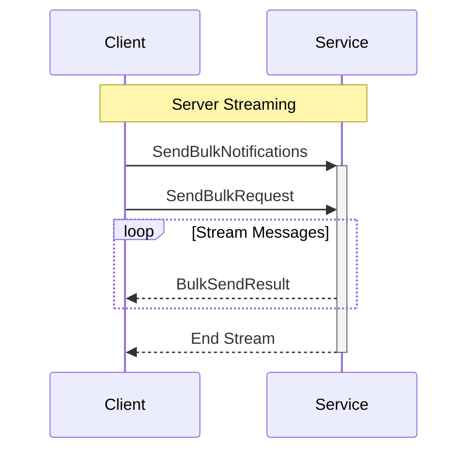

---

### GetNotification

<a name="getnotification"></a>

#### Method Signature

```protobuf
// Unary RPC
rpc GetNotification(GetNotificationRequest) returns (GetNotificationResponse);
```

#### Method Details

| Attribute | Value |
|-----------|-------|
| **Full Name** | `notifications.v1.GetNotification` |
| **Input Type** | [`GetNotificationRequest`](#getnotificationrequest) |
| **Output Type** | [`GetNotificationResponse`](#getnotificationresponse) |
| **Streaming Type** | Unary |

##### Sequence Diagram

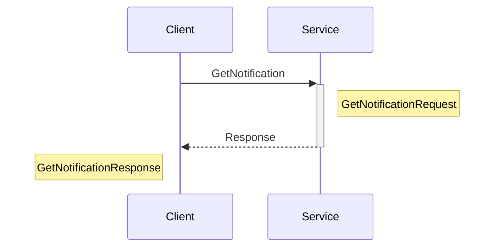

---

### ListNotifications

<a name="listnotifications"></a>

#### Method Signature

```protobuf
// Unary RPC
rpc ListNotifications(ListNotificationsRequest) returns (ListNotificationsResponse);
```

#### Method Details

| Attribute | Value |
|-----------|-------|
| **Full Name** | `notifications.v1.ListNotifications` |
| **Input Type** | [`ListNotificationsRequest`](#listnotificationsrequest) |
| **Output Type** | [`ListNotificationsResponse`](#listnotificationsresponse) |
| **Streaming Type** | Unary |

##### Sequence Diagram

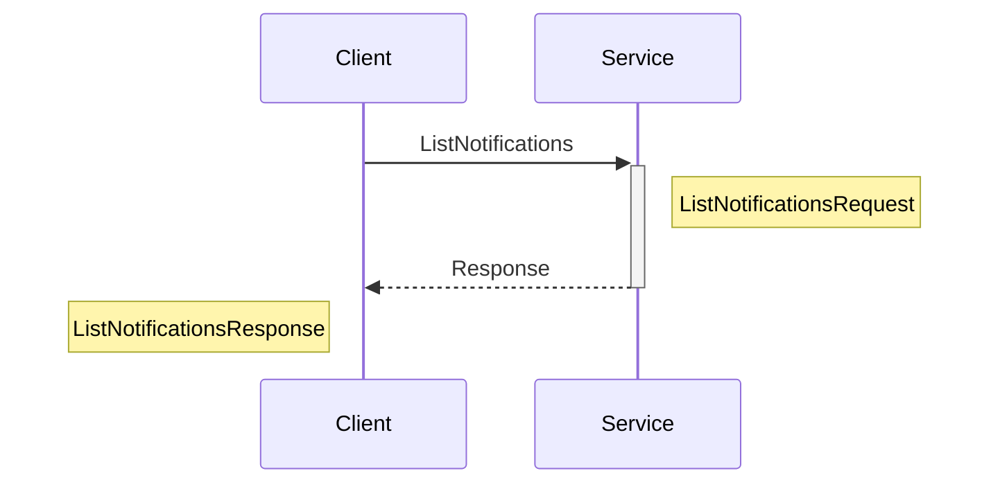

---

### MarkAsRead

<a name="markasread"></a>

#### Method Signature

```protobuf
// Unary RPC
rpc MarkAsRead(MarkAsReadRequest) returns (Empty);
```

#### Method Details

| Attribute | Value |
|-----------|-------|
| **Full Name** | `notifications.v1.MarkAsRead` |
| **Input Type** | [`MarkAsReadRequest`](#markasreadrequest) |
| **Output Type** | [`Empty`](#empty) |
| **Streaming Type** | Unary |

##### Sequence Diagram

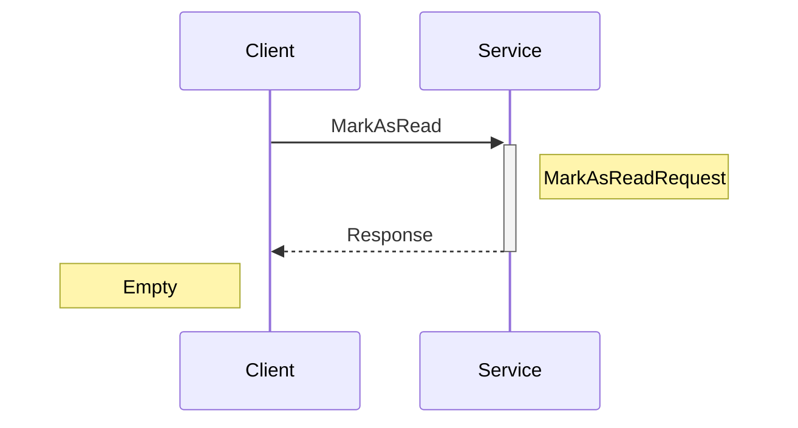

---

### DeleteNotification

<a name="deletenotification"></a>

#### Method Signature

```protobuf
// Unary RPC
rpc DeleteNotification(DeleteNotificationRequest) returns (Empty);
```

#### Method Details

| Attribute | Value |
|-----------|-------|
| **Full Name** | `notifications.v1.DeleteNotification` |
| **Input Type** | [`DeleteNotificationRequest`](#deletenotificationrequest) |
| **Output Type** | [`Empty`](#empty) |
| **Streaming Type** | Unary |

##### Sequence Diagram

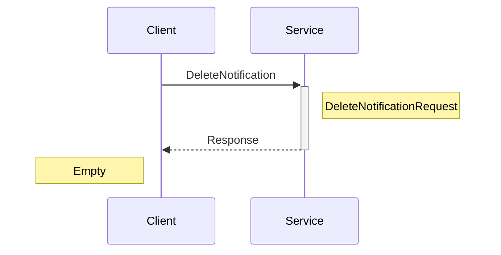

---

### StreamNotifications

<a name="streamnotifications"></a>

#### Method Signature

```protobuf
// Server streaming RPC
rpc StreamNotifications(StreamNotificationsRequest) returns (stream NotificationEvent);
```

#### Method Details

| Attribute | Value |
|-----------|-------|
| **Full Name** | `notifications.v1.StreamNotifications` |
| **Input Type** | [`StreamNotificationsRequest`](#streamnotificationsrequest) |
| **Output Type** | [`NotificationEvent`](#notificationevent) |
| **Streaming Type** | Server Streaming |

##### Sequence Diagram

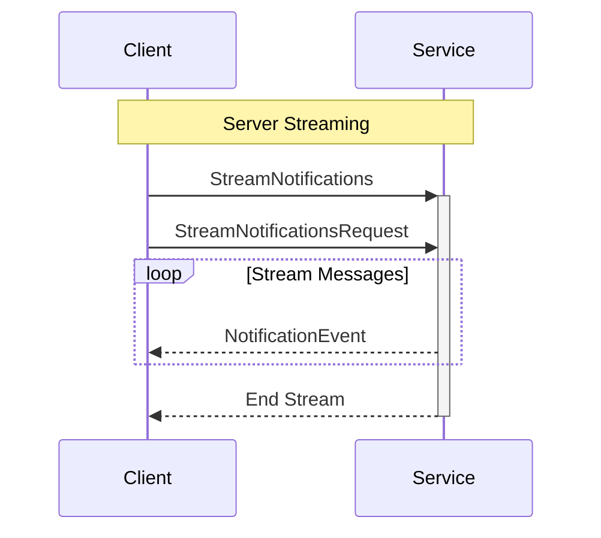

---

### GetPreferences

<a name="getpreferences"></a>

#### Method Signature

```protobuf
// Unary RPC
rpc GetPreferences(GetPreferencesRequest) returns (GetPreferencesResponse);
```

#### Method Details

| Attribute | Value |
|-----------|-------|
| **Full Name** | `notifications.v1.GetPreferences` |
| **Input Type** | [`GetPreferencesRequest`](#getpreferencesrequest) |
| **Output Type** | [`GetPreferencesResponse`](#getpreferencesresponse) |
| **Streaming Type** | Unary |

##### Sequence Diagram

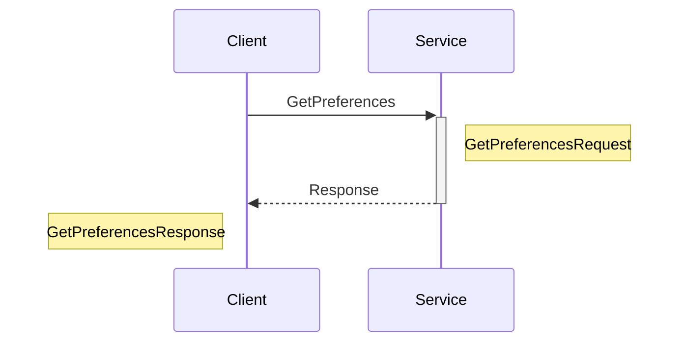

---

### UpdatePreferences

<a name="updatepreferences"></a>

#### Method Signature

```protobuf
// Unary RPC
rpc UpdatePreferences(UpdatePreferencesRequest) returns (UpdatePreferencesResponse);
```

#### Method Details

| Attribute | Value |
|-----------|-------|
| **Full Name** | `notifications.v1.UpdatePreferences` |
| **Input Type** | [`UpdatePreferencesRequest`](#updatepreferencesrequest) |
| **Output Type** | [`UpdatePreferencesResponse`](#updatepreferencesresponse) |
| **Streaming Type** | Unary |

##### Sequence Diagram

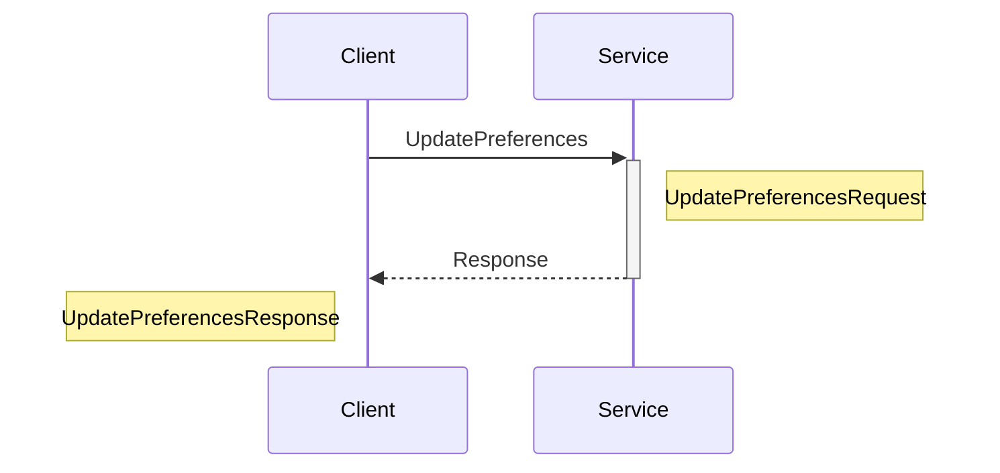

---

## 📦 Messages

<a name="messages"></a>

This service defines **16 message types**:

### NotificationEvent

<a name="notificationevent"></a>

| Attribute | Value |
|-----------|-------|
| **Full Name** | `notifications.v1.NotificationEvent` |
| **Field Count** | 3 |

#### Fields

| # | Name | Type | Label | Description |
|---|------|------|-------|-------------|
| 1 | `event_type` | [`EventType`](#eventtype) | optional | - |
| 2 | `notification` | [`Notification`](#notification) | optional | - |
| 3 | `event_time` | [`Timestamp`](#timestamp) | optional | - |

#### Proto Definition

```protobuf
message NotificationEvent {
  optional EventType event_type = 1;
  optional Notification notification = 2;
  optional Timestamp event_time = 3;
}
```

##### Message Structure

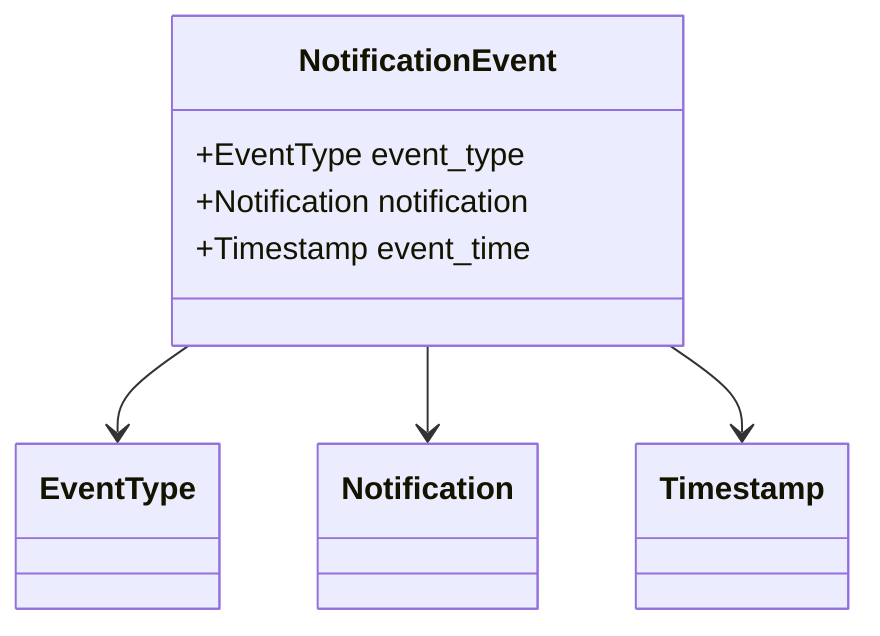

---

### SendBulkRequest

<a name="sendbulkrequest"></a>

| Attribute | Value |
|-----------|-------|
| **Full Name** | `notifications.v1.SendBulkRequest` |
| **Field Count** | 4 |
| **Nested Types** | 1 |

#### Fields

| # | Name | Type | Label | Description |
|---|------|------|-------|-------------|
| 1 | `recipient_ids` | TYPE_STRING | repeated | - |
| 2 | `template` | [`NotificationTemplate`](#notificationtemplate) | optional | - |
| 3 | `personalizations` | [`PersonalizationsEntry`](#personalizationsentry) | repeated | - |
| 4 | `scheduled_at` | [`Timestamp`](#timestamp) | optional | - |

#### Proto Definition

```protobuf
message SendBulkRequest {
  repeated TYPE_STRING recipient_ids = 1;
  optional NotificationTemplate template = 2;
  repeated PersonalizationsEntry personalizations = 3;
  optional Timestamp scheduled_at = 4;
}
```

##### Message Structure

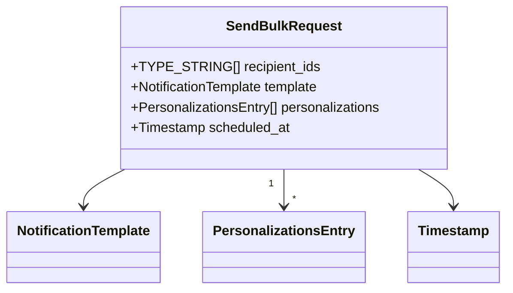

---

### ListNotificationsResponse

<a name="listnotificationsresponse"></a>

| Attribute | Value |
|-----------|-------|
| **Full Name** | `notifications.v1.ListNotificationsResponse` |
| **Field Count** | 3 |

#### Fields

| # | Name | Type | Label | Description |
|---|------|------|-------|-------------|
| 1 | `notifications` | [`Notification`](#notification) | repeated | - |
| 2 | `pagination` | [`PaginationResponse`](#paginationresponse) | optional | - |
| 3 | `unread_count` | TYPE_INT64 | optional | - |

#### Proto Definition

```protobuf
message ListNotificationsResponse {
  repeated Notification notifications = 1;
  optional PaginationResponse pagination = 2;
  optional TYPE_INT64 unread_count = 3;
}
```

##### Message Structure

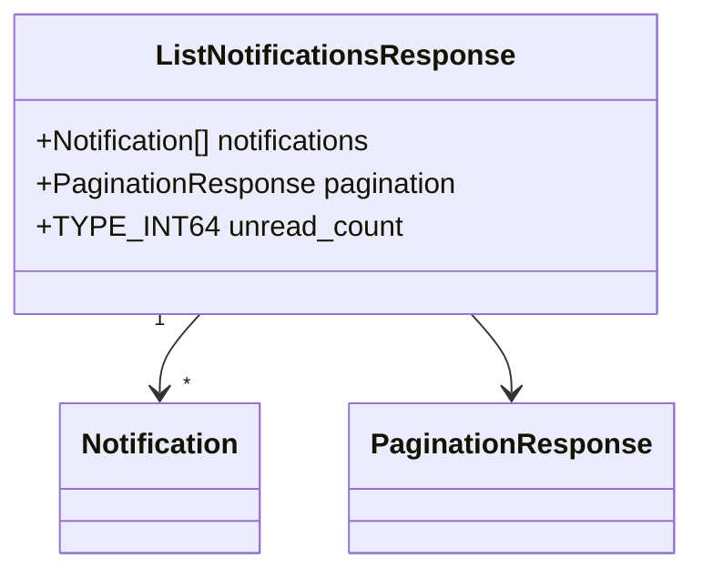

---

### MarkAsReadRequest

<a name="markasreadrequest"></a>

| Attribute | Value |
|-----------|-------|
| **Full Name** | `notifications.v1.MarkAsReadRequest` |
| **Field Count** | 3 |

#### Fields

| # | Name | Type | Label | Description |
|---|------|------|-------|-------------|
| 1 | `notification_ids` | TYPE_STRING | repeated | - |
| 2 | `user_id` | TYPE_STRING | optional | - |
| 3 | `all` | TYPE_BOOL | optional | - |

#### Proto Definition

```protobuf
message MarkAsReadRequest {
  repeated TYPE_STRING notification_ids = 1;
  optional TYPE_STRING user_id = 2;
  optional TYPE_BOOL all = 3;
}
```

##### Message Structure

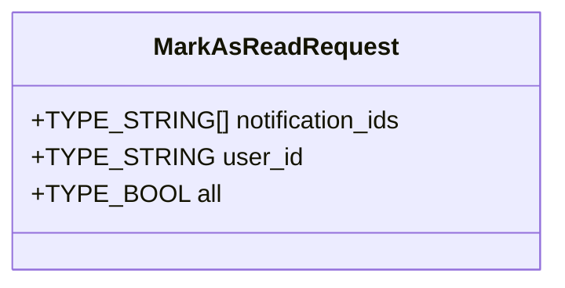

---

### DeleteNotificationRequest

<a name="deletenotificationrequest"></a>

| Attribute | Value |
|-----------|-------|
| **Full Name** | `notifications.v1.DeleteNotificationRequest` |
| **Field Count** | 2 |

#### Fields

| # | Name | Type | Label | Description |
|---|------|------|-------|-------------|
| 1 | `notification_id` | TYPE_STRING | optional | - |
| 2 | `user_id` | TYPE_STRING | optional | - |

#### Proto Definition

```protobuf
message DeleteNotificationRequest {
  optional TYPE_STRING notification_id = 1;
  optional TYPE_STRING user_id = 2;
}
```

##### Message Structure

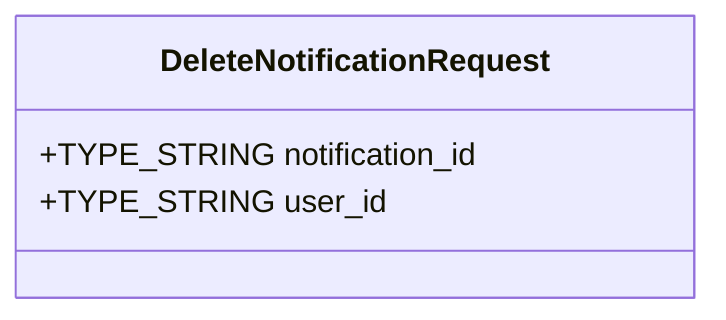

---

### UpdatePreferencesResponse

<a name="updatepreferencesresponse"></a>

| Attribute | Value |
|-----------|-------|
| **Full Name** | `notifications.v1.UpdatePreferencesResponse` |
| **Field Count** | 1 |

#### Fields

| # | Name | Type | Label | Description |
|---|------|------|-------|-------------|
| 1 | `preferences` | [`NotificationPreferences`](#notificationpreferences) | optional | - |

#### Proto Definition

```protobuf
message UpdatePreferencesResponse {
  optional NotificationPreferences preferences = 1;
}
```

##### Message Structure

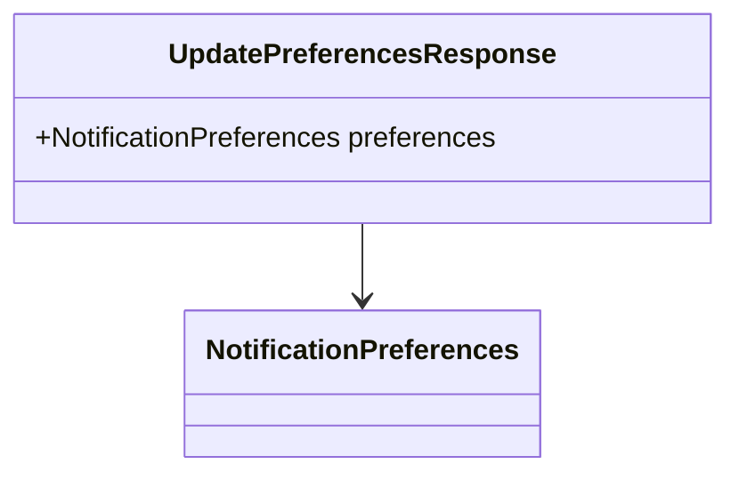

---

### SendNotificationResponse

<a name="sendnotificationresponse"></a>

| Attribute | Value |
|-----------|-------|
| **Full Name** | `notifications.v1.SendNotificationResponse` |
| **Field Count** | 2 |

#### Fields

| # | Name | Type | Label | Description |
|---|------|------|-------|-------------|
| 1 | `notification` | [`Notification`](#notification) | optional | - |
| 2 | `scheduled` | TYPE_BOOL | optional | - |

#### Proto Definition

```protobuf
message SendNotificationResponse {
  optional Notification notification = 1;
  optional TYPE_BOOL scheduled = 2;
}
```

##### Message Structure

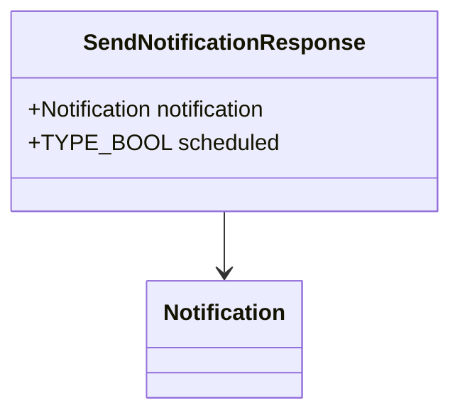

---

### GetPreferencesRequest

<a name="getpreferencesrequest"></a>

| Attribute | Value |
|-----------|-------|
| **Full Name** | `notifications.v1.GetPreferencesRequest` |
| **Field Count** | 1 |

#### Fields

| # | Name | Type | Label | Description |
|---|------|------|-------|-------------|
| 1 | `user_id` | TYPE_STRING | optional | - |

#### Proto Definition

```protobuf
message GetPreferencesRequest {
  optional TYPE_STRING user_id = 1;
}
```

##### Message Structure

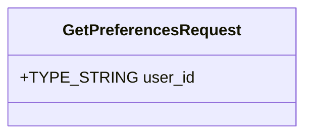

---

### GetPreferencesResponse

<a name="getpreferencesresponse"></a>

| Attribute | Value |
|-----------|-------|
| **Full Name** | `notifications.v1.GetPreferencesResponse` |
| **Field Count** | 1 |

#### Fields

| # | Name | Type | Label | Description |
|---|------|------|-------|-------------|
| 1 | `preferences` | [`NotificationPreferences`](#notificationpreferences) | optional | - |

#### Proto Definition

```protobuf
message GetPreferencesResponse {
  optional NotificationPreferences preferences = 1;
}
```

##### Message Structure

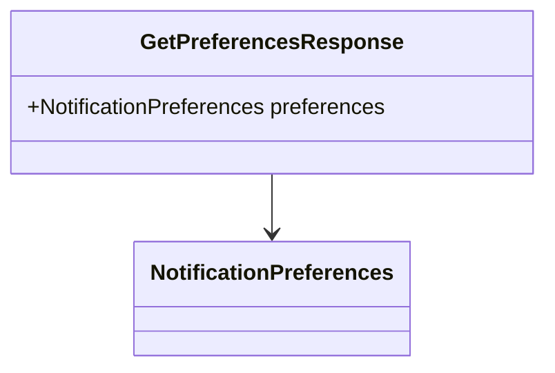

---

### SendNotificationRequest

<a name="sendnotificationrequest"></a>

| Attribute | Value |
|-----------|-------|
| **Full Name** | `notifications.v1.SendNotificationRequest` |
| **Field Count** | 14 |
| **Nested Types** | 1 |

#### Fields

| # | Name | Type | Label | Description |
|---|------|------|-------|-------------|
| 1 | `recipient_id` | TYPE_STRING | optional | - |
| 2 | `type` | [`NotificationType`](#notificationtype) | optional | - |
| 3 | `priority` | [`Priority`](#priority) | optional | - |
| 4 | `title` | TYPE_STRING | optional | - |
| 5 | `message` | TYPE_STRING | optional | - |
| 6 | `content` | [`RichContent`](#richcontent) | optional | - |
| 7 | `channels` | [`Channel`](#channel) | repeated | - |
| 8 | `actions` | [`Action`](#action) | repeated | - |
| 9 | `deep_link` | TYPE_STRING | optional | - |
| 10 | `image_url` | TYPE_STRING | optional | - |
| 11 | `data` | [`DataEntry`](#dataentry) | repeated | - |
| 12 | `scheduled_at` | [`Timestamp`](#timestamp) | optional | - |
| 13 | `expires_at` | [`Timestamp`](#timestamp) | optional | - |
| 14 | `idempotency_key` | TYPE_STRING | optional | - |

#### Proto Definition

```protobuf
message SendNotificationRequest {
  optional TYPE_STRING recipient_id = 1;
  optional NotificationType type = 2;
  optional Priority priority = 3;
  optional TYPE_STRING title = 4;
  optional TYPE_STRING message = 5;
  optional RichContent content = 6;
  repeated Channel channels = 7;
  repeated Action actions = 8;
  optional TYPE_STRING deep_link = 9;
  optional TYPE_STRING image_url = 10;
  repeated DataEntry data = 11;
  optional Timestamp scheduled_at = 12;
  optional Timestamp expires_at = 13;
  optional TYPE_STRING idempotency_key = 14;
}
```

##### Message Structure

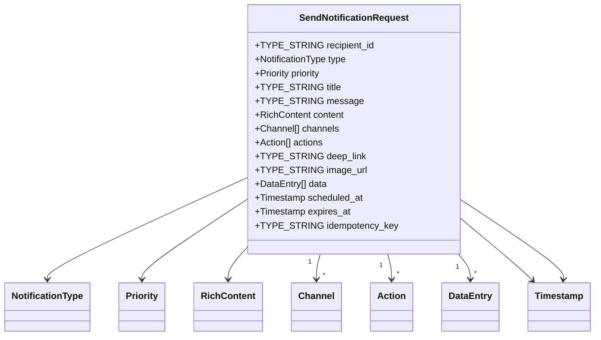

---

### BulkSendResult

<a name="bulksendresult"></a>

| Attribute | Value |
|-----------|-------|
| **Full Name** | `notifications.v1.BulkSendResult` |
| **Field Count** | 4 |

#### Fields

| # | Name | Type | Label | Description |
|---|------|------|-------|-------------|
| 1 | `recipient_id` | TYPE_STRING | optional | - |
| 2 | `success` | TYPE_BOOL | optional | - |
| 3 | `notification` | [`Notification`](#notification) | optional | - |
| 4 | `error` | [`Error`](#error) | optional | - |

#### Proto Definition

```protobuf
message BulkSendResult {
  optional TYPE_STRING recipient_id = 1;
  optional TYPE_BOOL success = 2;
  optional Notification notification = 3;
  optional Error error = 4;
}
```

##### Message Structure

```mermaid
classDiagram
    class BulkSendResult {
        +TYPE_STRING recipient_id
        +TYPE_BOOL success
        +Notification notification
        +Error error
    }
    BulkSendResult --> Notification
    BulkSendResult --> Error
```

---

### GetNotificationRequest

<a name="getnotificationrequest"></a>

| Attribute | Value |
|-----------|-------|
| **Full Name** | `notifications.v1.GetNotificationRequest` |
| **Field Count** | 1 |

#### Fields

| # | Name | Type | Label | Description |
|---|------|------|-------|-------------|
| 1 | `notification_id` | TYPE_STRING | optional | - |

#### Proto Definition

```protobuf
message GetNotificationRequest {
  optional TYPE_STRING notification_id = 1;
}
```

##### Message Structure

```mermaid
classDiagram
    class GetNotificationRequest {
        +TYPE_STRING notification_id
    }
```

---

### GetNotificationResponse

<a name="getnotificationresponse"></a>

| Attribute | Value |
|-----------|-------|
| **Full Name** | `notifications.v1.GetNotificationResponse` |
| **Field Count** | 1 |

#### Fields

| # | Name | Type | Label | Description |
|---|------|------|-------|-------------|
| 1 | `notification` | [`Notification`](#notification) | optional | - |

#### Proto Definition

```protobuf
message GetNotificationResponse {
  optional Notification notification = 1;
}
```

##### Message Structure

```mermaid
classDiagram
    class GetNotificationResponse {
        +Notification notification
    }
    GetNotificationResponse --> Notification
```

---

### UpdatePreferencesRequest

<a name="updatepreferencesrequest"></a>

| Attribute | Value |
|-----------|-------|
| **Full Name** | `notifications.v1.UpdatePreferencesRequest` |
| **Field Count** | 2 |

#### Fields

| # | Name | Type | Label | Description |
|---|------|------|-------|-------------|
| 1 | `user_id` | TYPE_STRING | optional | - |
| 2 | `preferences` | [`NotificationPreferences`](#notificationpreferences) | optional | - |

#### Proto Definition

```protobuf
message UpdatePreferencesRequest {
  optional TYPE_STRING user_id = 1;
  optional NotificationPreferences preferences = 2;
}
```

##### Message Structure

```mermaid
classDiagram
    class UpdatePreferencesRequest {
        +TYPE_STRING user_id
        +NotificationPreferences preferences
    }
    UpdatePreferencesRequest --> NotificationPreferences
```

---

### ListNotificationsRequest

<a name="listnotificationsrequest"></a>

| Attribute | Value |
|-----------|-------|
| **Full Name** | `notifications.v1.ListNotificationsRequest` |
| **Field Count** | 8 |

#### Fields

| # | Name | Type | Label | Description |
|---|------|------|-------|-------------|
| 1 | `user_id` | TYPE_STRING | optional | - |
| 2 | `pagination` | [`PaginationRequest`](#paginationrequest) | optional | - |
| 3 | `read` | TYPE_BOOL | oneof `_read` | - |
| 4 | `types` | [`NotificationType`](#notificationtype) | repeated | - |
| 5 | `channels` | [`Channel`](#channel) | repeated | - |
| 6 | `categories` | TYPE_STRING | repeated | - |
| 7 | `tags` | TYPE_STRING | repeated | - |
| 8 | `date_range` | [`DateRangeFilter`](#daterangefilter) | optional | - |

#### Proto Definition

```protobuf
message ListNotificationsRequest {
  optional TYPE_STRING user_id = 1;
  optional PaginationRequest pagination = 2;
  repeated NotificationType types = 4;
  repeated Channel channels = 5;
  repeated TYPE_STRING categories = 6;
  repeated TYPE_STRING tags = 7;
  optional DateRangeFilter date_range = 8;

  oneof _read {
    TYPE_BOOL read = 3;
  }
}
```

##### Message Structure

```mermaid
classDiagram
    class ListNotificationsRequest {
        +TYPE_STRING user_id
        +PaginationRequest pagination
        +TYPE_BOOL read
        +NotificationType[] types
        +Channel[] channels
        +TYPE_STRING[] categories
        +TYPE_STRING[] tags
        +DateRangeFilter date_range
    }
    ListNotificationsRequest --> PaginationRequest
    ListNotificationsRequest "1" --> "*" NotificationType
    ListNotificationsRequest "1" --> "*" Channel
    ListNotificationsRequest --> DateRangeFilter
```

---

### StreamNotificationsRequest

<a name="streamnotificationsrequest"></a>

| Attribute | Value |
|-----------|-------|
| **Full Name** | `notifications.v1.StreamNotificationsRequest` |
| **Field Count** | 3 |

#### Fields

| # | Name | Type | Label | Description |
|---|------|------|-------|-------------|
| 1 | `user_id` | TYPE_STRING | optional | - |
| 2 | `types` | [`NotificationType`](#notificationtype) | repeated | - |
| 3 | `channels` | [`Channel`](#channel) | repeated | - |

#### Proto Definition

```protobuf
message StreamNotificationsRequest {
  optional TYPE_STRING user_id = 1;
  repeated NotificationType types = 2;
  repeated Channel channels = 3;
}
```

##### Message Structure

```mermaid
classDiagram
    class StreamNotificationsRequest {
        +TYPE_STRING user_id
        +NotificationType[] types
        +Channel[] channels
    }
    StreamNotificationsRequest "1" --> "*" NotificationType
    StreamNotificationsRequest "1" --> "*" Channel
```

---

## 🔢 Enumerations

<a name="enumerations"></a>

This service defines **7 enumeration types**:

### Channel

<a name="channel"></a>

| Value | Number | Description |
|-------|--------|-------------|
| `CHANNEL_UNSPECIFIED` | 0 | - |
| `CHANNEL_EMAIL` | 1 | - |
| `CHANNEL_PUSH` | 2 | - |
| `CHANNEL_SMS` | 3 | - |
| `CHANNEL_IN_APP` | 4 | - |
| `CHANNEL_WEBHOOK` | 5 | - |
| `CHANNEL_SLACK` | 6 | - |
| `CHANNEL_TEAMS` | 7 | - |

#### Proto Definition

```protobuf
enum Channel {
  CHANNEL_UNSPECIFIED = 0;
  CHANNEL_EMAIL = 1;
  CHANNEL_PUSH = 2;
  CHANNEL_SMS = 3;
  CHANNEL_IN_APP = 4;
  CHANNEL_WEBHOOK = 5;
  CHANNEL_SLACK = 6;
  CHANNEL_TEAMS = 7;
}
```

---

### NotificationType

<a name="notificationtype"></a>

| Value | Number | Description |
|-------|--------|-------------|
| `NOTIFICATION_TYPE_UNSPECIFIED` | 0 | - |
| `NOTIFICATION_TYPE_SYSTEM` | 1 | - |
| `NOTIFICATION_TYPE_ALERT` | 2 | - |
| `NOTIFICATION_TYPE_WARNING` | 3 | - |
| `NOTIFICATION_TYPE_INFO` | 4 | - |
| `NOTIFICATION_TYPE_SUCCESS` | 5 | - |
| `NOTIFICATION_TYPE_MARKETING` | 6 | - |
| `NOTIFICATION_TYPE_TRANSACTIONAL` | 7 | - |
| `NOTIFICATION_TYPE_SOCIAL` | 8 | - |

#### Proto Definition

```protobuf
enum NotificationType {
  NOTIFICATION_TYPE_UNSPECIFIED = 0;
  NOTIFICATION_TYPE_SYSTEM = 1;
  NOTIFICATION_TYPE_ALERT = 2;
  NOTIFICATION_TYPE_WARNING = 3;
  NOTIFICATION_TYPE_INFO = 4;
  NOTIFICATION_TYPE_SUCCESS = 5;
  NOTIFICATION_TYPE_MARKETING = 6;
  NOTIFICATION_TYPE_TRANSACTIONAL = 7;
  NOTIFICATION_TYPE_SOCIAL = 8;
}
```

---

### DeliveryStatus

<a name="deliverystatus"></a>

| Value | Number | Description |
|-------|--------|-------------|
| `DELIVERY_STATUS_UNSPECIFIED` | 0 | - |
| `DELIVERY_STATUS_PENDING` | 1 | - |
| `DELIVERY_STATUS_QUEUED` | 2 | - |
| `DELIVERY_STATUS_SENT` | 3 | - |
| `DELIVERY_STATUS_DELIVERED` | 4 | - |
| `DELIVERY_STATUS_FAILED` | 5 | - |
| `DELIVERY_STATUS_BOUNCED` | 6 | - |
| `DELIVERY_STATUS_OPENED` | 7 | - |
| `DELIVERY_STATUS_CLICKED` | 8 | - |

#### Proto Definition

```protobuf
enum DeliveryStatus {
  DELIVERY_STATUS_UNSPECIFIED = 0;
  DELIVERY_STATUS_PENDING = 1;
  DELIVERY_STATUS_QUEUED = 2;
  DELIVERY_STATUS_SENT = 3;
  DELIVERY_STATUS_DELIVERED = 4;
  DELIVERY_STATUS_FAILED = 5;
  DELIVERY_STATUS_BOUNCED = 6;
  DELIVERY_STATUS_OPENED = 7;
  DELIVERY_STATUS_CLICKED = 8;
}
```

---

### AttachmentType

<a name="attachmenttype"></a>

| Value | Number | Description |
|-------|--------|-------------|
| `ATTACHMENT_TYPE_UNSPECIFIED` | 0 | - |
| `ATTACHMENT_TYPE_IMAGE` | 1 | - |
| `ATTACHMENT_TYPE_VIDEO` | 2 | - |
| `ATTACHMENT_TYPE_AUDIO` | 3 | - |
| `ATTACHMENT_TYPE_DOCUMENT` | 4 | - |
| `ATTACHMENT_TYPE_FILE` | 5 | - |

#### Proto Definition

```protobuf
enum AttachmentType {
  ATTACHMENT_TYPE_UNSPECIFIED = 0;
  ATTACHMENT_TYPE_IMAGE = 1;
  ATTACHMENT_TYPE_VIDEO = 2;
  ATTACHMENT_TYPE_AUDIO = 3;
  ATTACHMENT_TYPE_DOCUMENT = 4;
  ATTACHMENT_TYPE_FILE = 5;
}
```

---

### ActionType

<a name="actiontype"></a>

| Value | Number | Description |
|-------|--------|-------------|
| `ACTION_TYPE_UNSPECIFIED` | 0 | - |
| `ACTION_TYPE_LINK` | 1 | - |
| `ACTION_TYPE_DISMISS` | 2 | - |
| `ACTION_TYPE_CONFIRM` | 3 | - |
| `ACTION_TYPE_DECLINE` | 4 | - |
| `ACTION_TYPE_CUSTOM` | 5 | - |

#### Proto Definition

```protobuf
enum ActionType {
  ACTION_TYPE_UNSPECIFIED = 0;
  ACTION_TYPE_LINK = 1;
  ACTION_TYPE_DISMISS = 2;
  ACTION_TYPE_CONFIRM = 3;
  ACTION_TYPE_DECLINE = 4;
  ACTION_TYPE_CUSTOM = 5;
}
```

---

### DigestFrequency

<a name="digestfrequency"></a>

| Value | Number | Description |
|-------|--------|-------------|
| `DIGEST_FREQUENCY_UNSPECIFIED` | 0 | - |
| `DIGEST_FREQUENCY_HOURLY` | 1 | - |
| `DIGEST_FREQUENCY_DAILY` | 2 | - |
| `DIGEST_FREQUENCY_WEEKLY` | 3 | - |
| `DIGEST_FREQUENCY_MONTHLY` | 4 | - |

#### Proto Definition

```protobuf
enum DigestFrequency {
  DIGEST_FREQUENCY_UNSPECIFIED = 0;
  DIGEST_FREQUENCY_HOURLY = 1;
  DIGEST_FREQUENCY_DAILY = 2;
  DIGEST_FREQUENCY_WEEKLY = 3;
  DIGEST_FREQUENCY_MONTHLY = 4;
}
```

---

### EventType

<a name="eventtype"></a>

| Value | Number | Description |
|-------|--------|-------------|
| `EVENT_TYPE_UNSPECIFIED` | 0 | - |
| `EVENT_TYPE_CREATED` | 1 | - |
| `EVENT_TYPE_DELIVERED` | 2 | - |
| `EVENT_TYPE_READ` | 3 | - |
| `EVENT_TYPE_DELETED` | 4 | - |
| `EVENT_TYPE_FAILED` | 5 | - |

#### Proto Definition

```protobuf
enum EventType {
  EVENT_TYPE_UNSPECIFIED = 0;
  EVENT_TYPE_CREATED = 1;
  EVENT_TYPE_DELIVERED = 2;
  EVENT_TYPE_READ = 3;
  EVENT_TYPE_DELETED = 4;
  EVENT_TYPE_FAILED = 5;
}
```

---

## ⚠️ Error Codes

<a name="error-codes"></a>

This service uses standard gRPC status codes:

| gRPC Code | HTTP Status | Description |
|-----------|-------------|-------------|
| `OK` | 200 | Success |
| `CANCELLED` | 499 | Operation cancelled by client |
| `UNKNOWN` | 500 | Unknown error |
| `INVALID_ARGUMENT` | 400 | Client specified an invalid argument |
| `DEADLINE_EXCEEDED` | 504 | Deadline expired before operation could complete |
| `NOT_FOUND` | 404 | Requested entity not found |
| `ALREADY_EXISTS` | 409 | Entity already exists |
| `PERMISSION_DENIED` | 403 | Caller does not have permission |
| `RESOURCE_EXHAUSTED` | 429 | Resource has been exhausted |
| `FAILED_PRECONDITION` | 400 | Operation rejected because system is not in required state |
| `ABORTED` | 409 | Operation aborted, typically due to concurrency issue |
| `OUT_OF_RANGE` | 400 | Operation attempted past valid range |
| `UNIMPLEMENTED` | 501 | Operation not implemented |
| `INTERNAL` | 500 | Internal server error |
| `UNAVAILABLE` | 503 | Service unavailable |
| `DATA_LOSS` | 500 | Unrecoverable data loss or corruption |
| `UNAUTHENTICATED` | 401 | Request does not have valid authentication credentials |

### Error Handling Best Practices

1. **Check status codes**: Always check the gRPC status code before processing responses
2. **Implement retries**: Use exponential backoff for transient errors (`UNAVAILABLE`, `RESOURCE_EXHAUSTED`)
3. **Log errors**: Log error details with correlation IDs for troubleshooting
4. **Handle streaming errors**: Properly handle errors in streaming RPCs
5. **Validate inputs**: Validate inputs client-side to avoid `INVALID_ARGUMENT` errors

---

## 💡 Examples

<a name="examples"></a>

### Go Example

```go
package main

import (
    "context"
    "log"
    "time"

    "google.golang.org/grpc"
    "google.golang.org/grpc/credentials/insecure"

    pb "notifications.v1"
)

func main() {
    // Connect to the service
    conn, err := grpc.Dial("localhost:50051",
        grpc.WithTransportCredentials(insecure.NewCredentials()))
    if err != nil {
        log.Fatalf("Failed to connect: %v", err)
    }
    defer conn.Close()

    client := pb.NewNotificationServiceClient(conn)

    // Example RPC call
    ctx, cancel := context.WithTimeout(context.Background(), 5*time.Second)
    defer cancel()

    req := &pb.SendNotificationRequest{
        // Fill in request fields
    }

    resp, err := client.SendNotification(ctx, req)
    if err != nil {
        log.Fatalf("RPC failed: %v", err)
    }

    log.Printf("Response: %v", resp)
}
```

### Python Example

```python
import grpc
import notificationservice_pb2
import notificationservice_pb2_grpc

def main():
    # Connect to the service
    with grpc.insecure_channel('localhost:50051') as channel:
        stub = notificationservice_pb2_grpc.NotificationServiceStub(channel)

        # Example RPC call
        request = notificationservice_pb2.SendNotificationRequest(
            # Fill in request fields
        )

        try:
            response = stub.SendNotification(request)
            print(f'Response: {response}')
        except grpc.RpcError as e:
            print(f'RPC failed: {e.code()} - {e.details()}')

if __name__ == '__main__':
    main()
```

### JavaScript (Node.js) Example

```javascript
const grpc = require('@grpc/grpc-js');
const protoLoader = require('@grpc/proto-loader');

// Load proto file
const packageDefinition = protoLoader.loadSync(
    'notifications/notifications.proto',
    {
        keepCase: true,
        longs: String,
        enums: String,
        defaults: true,
        oneofs: true
    }
);

const proto = grpc.loadPackageDefinition(packageDefinition);

// Create client
const client = new proto.notifications.v1.NotificationService(
    'localhost:50051',
    grpc.credentials.createInsecure()
);

// Example RPC call
const request = {
    // Fill in request fields
};

client.SendNotification(request, (error, response) => {
    if (error) {
        console.error('RPC failed:', error);
        return;
    }
    console.log('Response:', response);
});
```

---

---

<div align="center">

**Generated Documentation**

| Attribute | Value |
|-----------|-------|
| Generated At | 0001-01-01 00:00:00 UTC |
| Generator Version |  |

📚 **Documentation** | 🔧 **ProtoDocs** | ✨ **Auto-Generated**

</div>
