# 📚 NotificationService API Documentation

| **Attribute** | **Value** |
|---------------|----------|
| **Service Name** | `NotificationService` |
| **Package** | `notifications.v1` |
| **Version** |  |
| **Proto File** | `notifications/notifications.proto` |
| **Generated** | 0001-01-01T00:00:00Z |

NotificationService manages notifications.

---

## 📑 Table of Contents

- [Overview](#overview)
- [Architecture](#architecture)
- [gRPC Service Interactions](#service-interaction)
- [Message Type Diagrams](#class-diagram)
- [Methods](#methods)
  - [SendNotification](#sendnotification)
  - [SendBulkNotifications](#sendbulknotifications)
  - [GetNotification](#getnotification)
  - [ListNotifications](#listnotifications)
  - [MarkAsRead](#markasread)
  - [DeleteNotification](#deletenotification)
  - [StreamNotifications](#streamnotifications)
  - [GetPreferences](#getpreferences)
  - [UpdatePreferences](#updatepreferences)
- [Messages](#messages)
  - [BulkSendResult](#bulksendresult)
  - [NotificationEvent](#notificationevent)
  - [NotificationTemplate](#notificationtemplate)
  - [NotificationPreferences](#notificationpreferences)
  - [TrackingData](#trackingdata)
  - [GetNotificationRequest](#getnotificationrequest)
  - [MarkAsReadRequest](#markasreadrequest)
  - [UpdatePreferencesRequest](#updatepreferencesrequest)
  - [RichContent](#richcontent)
  - [Notification](#notification)
  - [DigestSettings](#digestsettings)
  - [SendNotificationResponse](#sendnotificationresponse)
  - [GetNotificationResponse](#getnotificationresponse)
  - [DeleteNotificationRequest](#deletenotificationrequest)
  - [GetPreferencesRequest](#getpreferencesrequest)
  - [UpdatePreferencesResponse](#updatepreferencesresponse)
  - [QuietHours](#quiethours)
  - [UTMParameters](#utmparameters)
  - [ListNotificationsRequest](#listnotificationsrequest)
  - [ListNotificationsResponse](#listnotificationsresponse)
  - [StreamNotificationsRequest](#streamnotificationsrequest)
  - [Action](#action)
  - [DateRangeFilter](#daterangefilter)
  - [Attachment](#attachment)
  - [GetPreferencesResponse](#getpreferencesresponse)
  - [SendNotificationRequest](#sendnotificationrequest)
  - [SendBulkRequest](#sendbulkrequest)
- [Enumerations](#enumerations)
- [Error Codes](#error-codes)
- [Examples](#examples)

---

## 📖 Overview

<a name="overview"></a>

### Service Statistics

| Metric | Count |
|--------|-------|
| **RPC Methods** | 9 |
| **Message Types** | 27 |
| **Enumerations** | 7 |
| **Streaming RPCs** | 2 |

### Quick Start

This service provides the following capabilities:

- [`SendNotification`](#sendnotification): SendNotification sends a single notification.
- [`SendBulkNotifications`](#sendbulknotifications) (server streaming): SendBulkNotifications sends notifications to multiple recipients. Uses server-side streaming to deliver multiple responses
- [`GetNotification`](#getnotification): GetNotification retrieves a notification.
- [`ListNotifications`](#listnotifications): ListNotifications lists user notifications.
- [`MarkAsRead`](#markasread): MarkAsRead marks notifications as read.
- ... and 4 more methods

---

## 🏗️ Architecture

<a name="architecture"></a>

```mermaid
graph TB
    classDef serviceClass fill:#e1f5ff,stroke:#01579b,stroke-width:3px
    classDef methodClass fill:#f3e5f5,stroke:#4a148c,stroke-width:2px
    classDef messageClass fill:#e8f5e9,stroke:#1b5e20,stroke-width:2px

    NotificationService[🔧 NotificationService]:::serviceClass

    SendNotification[SendNotification]:::methodClass
    NotificationService --> SendNotification
    SendNotification_in[📥 SendNotificationRequest]:::messageClass
    SendNotification_out[📤 SendNotificationResponse]:::messageClass
    SendNotification_in -.->|input| SendNotification
    SendNotification -.->|output| SendNotification_out
    SendBulkNotifications[↓ SendBulkNotifications]:::methodClass
    NotificationService --> SendBulkNotifications
    SendBulkNotifications_in[📥 SendBulkRequest]:::messageClass
    SendBulkNotifications_out[📤 BulkSendResult]:::messageClass
    SendBulkNotifications_in -.->|input| SendBulkNotifications
    SendBulkNotifications -.->|output| SendBulkNotifications_out
    GetNotification[GetNotification]:::methodClass
    NotificationService --> GetNotification
    GetNotification_in[📥 GetNotificationRequest]:::messageClass
    GetNotification_out[📤 GetNotificationResponse]:::messageClass
    GetNotification_in -.->|input| GetNotification
    GetNotification -.->|output| GetNotification_out
    ListNotifications[ListNotifications]:::methodClass
    NotificationService --> ListNotifications
    ListNotifications_in[📥 ListNotificationsRequest]:::messageClass
    ListNotifications_out[📤 ListNotificationsResponse]:::messageClass
    ListNotifications_in -.->|input| ListNotifications
    ListNotifications -.->|output| ListNotifications_out
    MarkAsRead[MarkAsRead]:::methodClass
    NotificationService --> MarkAsRead
    MarkAsRead_in[📥 MarkAsReadRequest]:::messageClass
    MarkAsRead_out[📤 Empty]:::messageClass
    MarkAsRead_in -.->|input| MarkAsRead
    MarkAsRead -.->|output| MarkAsRead_out
    DeleteNotification[DeleteNotification]:::methodClass
    NotificationService --> DeleteNotification
    DeleteNotification_in[📥 DeleteNotificationRequest]:::messageClass
    DeleteNotification_out[📤 Empty]:::messageClass
    DeleteNotification_in -.->|input| DeleteNotification
    DeleteNotification -.->|output| DeleteNotification_out
    StreamNotifications[↓ StreamNotifications]:::methodClass
    NotificationService --> StreamNotifications
    StreamNotifications_in[📥 StreamNotificationsRequest]:::messageClass
    StreamNotifications_out[📤 NotificationEvent]:::messageClass
    StreamNotifications_in -.->|input| StreamNotifications
    StreamNotifications -.->|output| StreamNotifications_out
    GetPreferences[GetPreferences]:::methodClass
    NotificationService --> GetPreferences
    GetPreferences_in[📥 GetPreferencesRequest]:::messageClass
    GetPreferences_out[📤 GetPreferencesResponse]:::messageClass
    GetPreferences_in -.->|input| GetPreferences
    GetPreferences -.->|output| GetPreferences_out
    UpdatePreferences[UpdatePreferences]:::methodClass
    NotificationService --> UpdatePreferences
    UpdatePreferences_in[📥 UpdatePreferencesRequest]:::messageClass
    UpdatePreferences_out[📤 UpdatePreferencesResponse]:::messageClass
    UpdatePreferences_in -.->|input| UpdatePreferences
    UpdatePreferences -.->|output| UpdatePreferences_out
```

---

## 🔄 gRPC Service Interactions

<a name="service-interaction"></a>

This diagram shows the interactions between the service methods and message types.

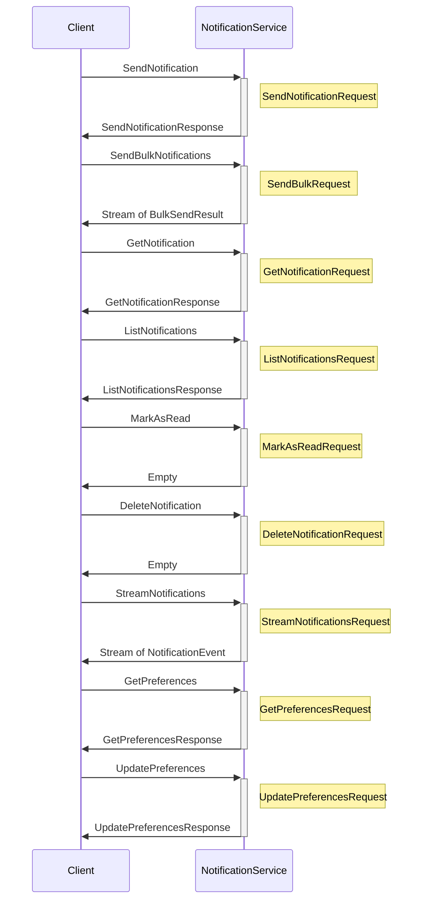

---

## 📦 Message Type Diagrams

<a name="class-diagram"></a>

UML class diagrams showing the structure of message types.

```mermaid
classDiagram
    class NotificationService {
        <<service>>
        +BulkSendResult()
        +NotificationEvent()
        +NotificationTemplate()
        +NotificationPreferences()
        +TrackingData()
        +GetNotificationRequest()
        +MarkAsReadRequest()
        +UpdatePreferencesRequest()
        +RichContent()
        +Notification()
        +DigestSettings()
        +SendNotificationResponse()
        +GetNotificationResponse()
        +DeleteNotificationRequest()
        +GetPreferencesRequest()
        +UpdatePreferencesResponse()
        +QuietHours()
        +UTMParameters()
        +ListNotificationsRequest()
        +ListNotificationsResponse()
        +StreamNotificationsRequest()
        +Action()
        +DateRangeFilter()
        +Attachment()
        +GetPreferencesResponse()
        +SendNotificationRequest()
        +SendBulkRequest()
    }

    class BulkSendResult {
        +string recipient_id
        +bool success
        +Notification notification
        +Error error
    }

    BulkSendResult "1" --> "1" Notification
    BulkSendResult "1" --> "1" Error
    class NotificationEvent {
        +EventType event_type
        +Notification notification
        +Timestamp event_time
    }

    NotificationEvent "1" --> "1" EventType
    NotificationEvent "1" --> "1" Notification
    class NotificationTemplate {
        +string template_id
        +NotificationType type
        +Priority priority
        +string title
        +string message
        +Channel channels[]
        +map<string, string> default_data
    }

    NotificationTemplate "1" --> "1" NotificationType
    NotificationTemplate "1" --> "1" Priority
    NotificationTemplate "1" --> "*" Channel
    class NotificationPreferences {
        +string user_id
        +bool enabled
        +map<string, ChannelPreference> channels
        +map<string, TypePreference> types
        +QuietHours quiet_hours
        +DigestSettings digest
    }

    NotificationPreferences "1" --> "1" QuietHours
    NotificationPreferences "1" --> "1" DigestSettings
    class TrackingData {
        +bool impression_tracked
        +Timestamp impression_at
        +bool click_tracked
        +Timestamp clicked_at
        +bool conversion_tracked
        +Timestamp converted_at
        +UTMParameters utm
    }

    TrackingData "1" --> "1" UTMParameters
    class GetNotificationRequest {
        +string notification_id
    }

    class MarkAsReadRequest {
        +string notification_ids[]
        +string user_id
        +bool all
    }

    class UpdatePreferencesRequest {
        +string user_id
        +NotificationPreferences preferences
    }

    UpdatePreferencesRequest "1" --> "1" NotificationPreferences
    class RichContent {
        +string html
        +string markdown
        +Struct structured_data
        +Attachment attachments[]
    }

    RichContent "1" --> "*" Attachment
    class Notification {
        +Metadata metadata
        +string recipient_id
        +string sender_id
        +NotificationType type
        +Priority priority
        +string title
        +string message
        +RichContent content
        +Channel channels[]
        +map<string, DeliveryDetails> deliveries
        +Action actions[]
        +string deep_link
        +string image_url
        +string icon_url
        +string sound
        +int32 badge
        +bool read
        +Timestamp read_at
        +Timestamp expires_at
        +string category
        +string tags[]
        +map<string, string> data
        +TrackingData tracking
    }

    Notification "1" --> "1" Metadata
    Notification "1" --> "1" NotificationType
    Notification "1" --> "1" Priority
    Notification "1" --> "1" RichContent
    Notification "1" --> "*" Channel
    Notification "1" --> "*" Action
    Notification "1" --> "1" TrackingData
    class DigestSettings {
        +bool enabled
        +DigestFrequency frequency
        +string delivery_time
        +int32 days[]
    }

    DigestSettings "1" --> "1" DigestFrequency
    class SendNotificationResponse {
        +Notification notification
        +bool scheduled
    }

    SendNotificationResponse "1" --> "1" Notification
    class GetNotificationResponse {
        +Notification notification
    }

    GetNotificationResponse "1" --> "1" Notification
    class DeleteNotificationRequest {
        +string notification_id
        +string user_id
    }

    class GetPreferencesRequest {
        +string user_id
    }

    class UpdatePreferencesResponse {
        +NotificationPreferences preferences
    }

    UpdatePreferencesResponse "1" --> "1" NotificationPreferences
    class QuietHours {
        +bool enabled
        +string start_time
        +string end_time
        +int32 days[]
        +string timezone
    }

    class UTMParameters {
        +string source
        +string medium
        +string campaign
        +string term
        +string content
    }

    class ListNotificationsRequest {
        +string user_id
        +PaginationRequest pagination
        +bool read
        +NotificationType types[]
        +Channel channels[]
        +string categories[]
        +string tags[]
        +DateRangeFilter date_range
    }

    ListNotificationsRequest "1" --> "1" PaginationRequest
    ListNotificationsRequest "1" --> "*" NotificationType
    ListNotificationsRequest "1" --> "*" Channel
    ListNotificationsRequest "1" --> "1" DateRangeFilter
    class ListNotificationsResponse {
        +Notification notifications[]
        +PaginationResponse pagination
        +int64 unread_count
    }

    ListNotificationsResponse "1" --> "*" Notification
    ListNotificationsResponse "1" --> "1" PaginationResponse
    class StreamNotificationsRequest {
        +string user_id
        +NotificationType types[]
        +Channel channels[]
    }

    StreamNotificationsRequest "1" --> "*" NotificationType
    StreamNotificationsRequest "1" --> "*" Channel
    class Action {
        +string id
        +string label
        +string url
        +ActionType type
        +bool primary
    }

    Action "1" --> "1" ActionType
    class DateRangeFilter {
        +Timestamp start
        +Timestamp end
    }

    class Attachment {
        +AttachmentType type
        +string url
        +string filename
        +int64 size
        +string mime_type
    }

    Attachment "1" --> "1" AttachmentType
    class GetPreferencesResponse {
        +NotificationPreferences preferences
    }

    GetPreferencesResponse "1" --> "1" NotificationPreferences
    class SendNotificationRequest {
        +string recipient_id
        +NotificationType type
        +Priority priority
        +string title
        +string message
        +RichContent content
        +Channel channels[]
        +Action actions[]
        +string deep_link
        +string image_url
        +map<string, string> data
        +Timestamp scheduled_at
        +Timestamp expires_at
        +string idempotency_key
    }

    SendNotificationRequest "1" --> "1" NotificationType
    SendNotificationRequest "1" --> "1" Priority
    SendNotificationRequest "1" --> "1" RichContent
    SendNotificationRequest "1" --> "*" Channel
    SendNotificationRequest "1" --> "*" Action
    class SendBulkRequest {
        +string recipient_ids[]
        +NotificationTemplate template
        +map<string, Struct> personalizations
        +Timestamp scheduled_at
    }

    SendBulkRequest "1" --> "1" NotificationTemplate
```

---

## ⚙️ Methods

<a name="methods"></a>

This service defines **9 RPC methods**:

### SendNotification

<a name="sendnotification"></a>

SendNotification sends a single notification.

#### Method Signature

```protobuf
// Unary RPC
rpc SendNotification(SendNotificationRequest) returns (SendNotificationResponse);
```

#### Method Details

| Attribute | Value |
|-----------|-------|
| **Full Name** | `notifications.v1.SendNotification` |
| **Input Type** | [`SendNotificationRequest`](#sendnotificationrequest) |
| **Output Type** | [`SendNotificationResponse`](#sendnotificationresponse) |
| **Streaming Type** | Unary |

##### Sequence Diagram


---

### SendBulkNotifications

<a name="sendbulknotifications"></a>

SendBulkNotifications sends notifications to multiple recipients. Uses server-side streaming to deliver multiple responses

#### Method Signature

```protobuf
// Server streaming RPC
rpc SendBulkNotifications(SendBulkRequest) returns (stream BulkSendResult);
```

#### Method Details

| Attribute | Value |
|-----------|-------|
| **Full Name** | `notifications.v1.SendBulkNotifications` |
| **Input Type** | [`SendBulkRequest`](#sendbulkrequest) |
| **Output Type** | [`BulkSendResult`](#bulksendresult) |
| **Streaming Type** | Server Streaming |

##### Sequence Diagram

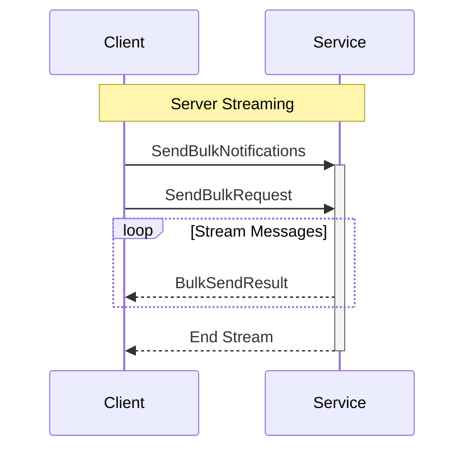

---

### GetNotification

<a name="getnotification"></a>

GetNotification retrieves a notification.

#### Method Signature

```protobuf
// Unary RPC
rpc GetNotification(GetNotificationRequest) returns (GetNotificationResponse);
```

#### Method Details

| Attribute | Value |
|-----------|-------|
| **Full Name** | `notifications.v1.GetNotification` |
| **Input Type** | [`GetNotificationRequest`](#getnotificationrequest) |
| **Output Type** | [`GetNotificationResponse`](#getnotificationresponse) |
| **Streaming Type** | Unary |

##### Sequence Diagram

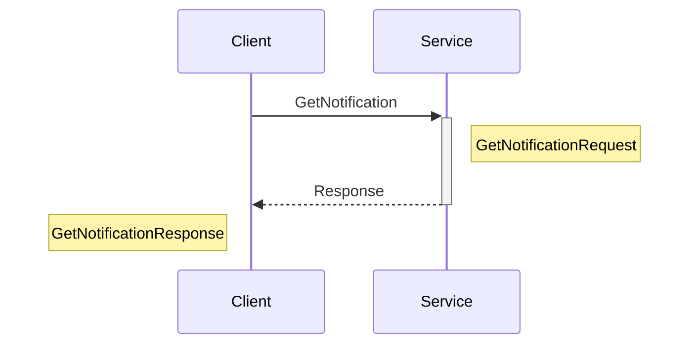

---

### ListNotifications

<a name="listnotifications"></a>

ListNotifications lists user notifications.

#### Method Signature

```protobuf
// Unary RPC
rpc ListNotifications(ListNotificationsRequest) returns (ListNotificationsResponse);
```

#### Method Details

| Attribute | Value |
|-----------|-------|
| **Full Name** | `notifications.v1.ListNotifications` |
| **Input Type** | [`ListNotificationsRequest`](#listnotificationsrequest) |
| **Output Type** | [`ListNotificationsResponse`](#listnotificationsresponse) |
| **Streaming Type** | Unary |

##### Sequence Diagram

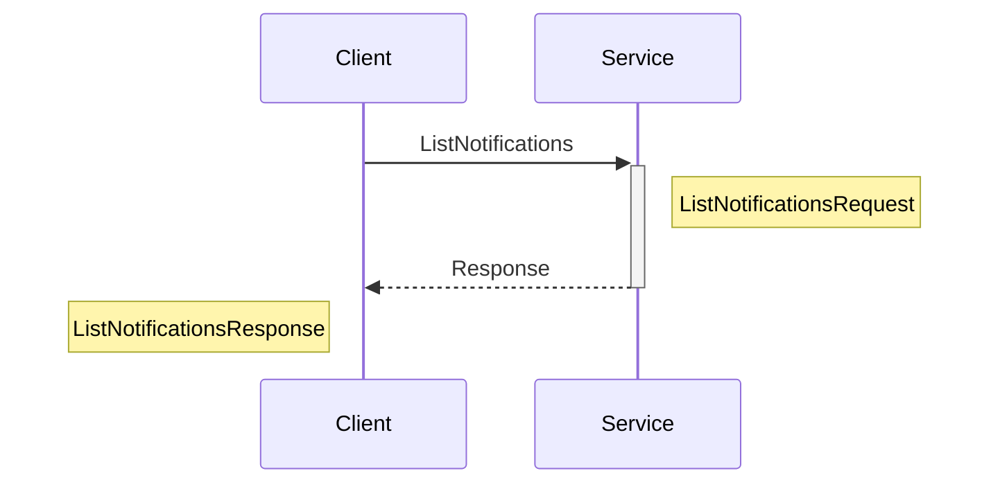

---

### MarkAsRead

<a name="markasread"></a>

MarkAsRead marks notifications as read.

#### Method Signature

```protobuf
// Unary RPC
rpc MarkAsRead(MarkAsReadRequest) returns (Empty);
```

#### Method Details

| Attribute | Value |
|-----------|-------|
| **Full Name** | `notifications.v1.MarkAsRead` |
| **Input Type** | [`MarkAsReadRequest`](#markasreadrequest) |
| **Output Type** | [`Empty`](#empty) |
| **Streaming Type** | Unary |

##### Sequence Diagram

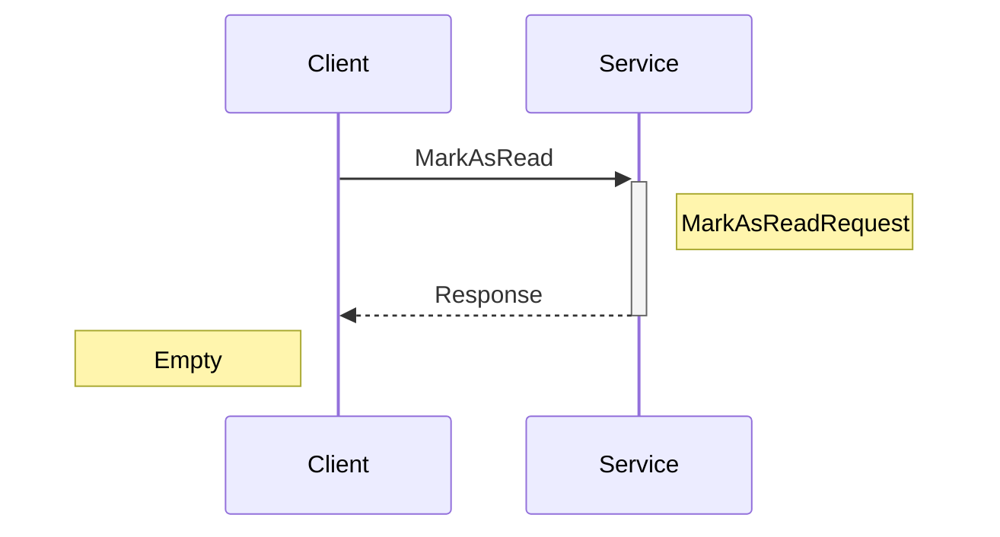

---

### DeleteNotification

<a name="deletenotification"></a>

DeleteNotification deletes a notification.

#### Method Signature

```protobuf
// Unary RPC
rpc DeleteNotification(DeleteNotificationRequest) returns (Empty);
```

#### Method Details

| Attribute | Value |
|-----------|-------|
| **Full Name** | `notifications.v1.DeleteNotification` |
| **Input Type** | [`DeleteNotificationRequest`](#deletenotificationrequest) |
| **Output Type** | [`Empty`](#empty) |
| **Streaming Type** | Unary |

##### Sequence Diagram

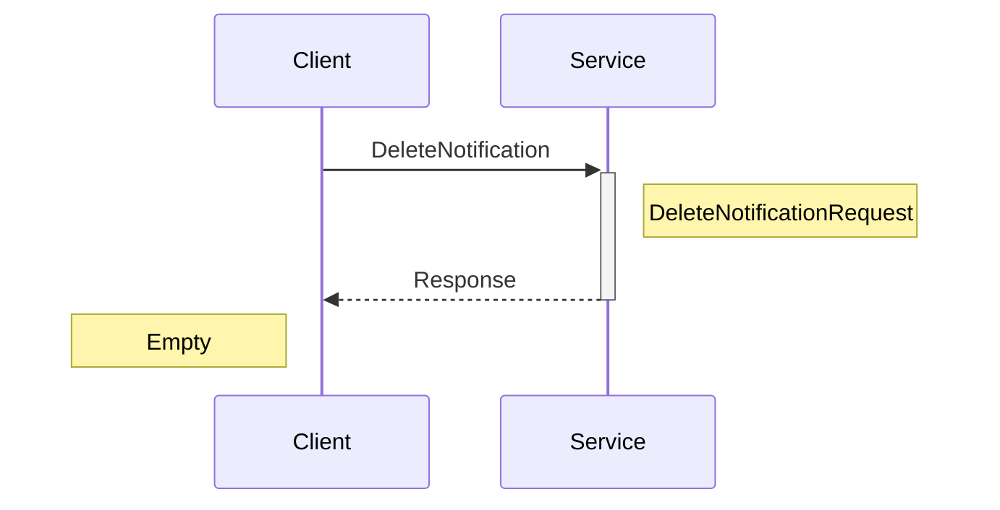

---

### StreamNotifications

<a name="streamnotifications"></a>

StreamNotifications streams real-time notifications.

#### Method Signature

```protobuf
// Server streaming RPC
rpc StreamNotifications(StreamNotificationsRequest) returns (stream NotificationEvent);
```

#### Method Details

| Attribute | Value |
|-----------|-------|
| **Full Name** | `notifications.v1.StreamNotifications` |
| **Input Type** | [`StreamNotificationsRequest`](#streamnotificationsrequest) |
| **Output Type** | [`NotificationEvent`](#notificationevent) |
| **Streaming Type** | Server Streaming |

##### Sequence Diagram

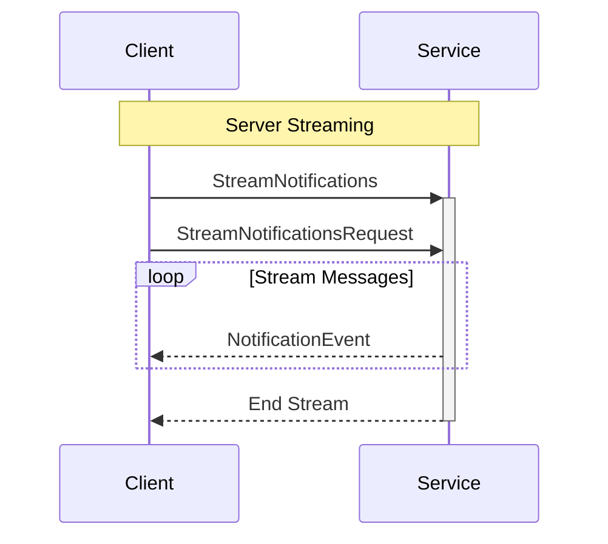

---

### GetPreferences

<a name="getpreferences"></a>

GetPreferences gets user notification preferences.

#### Method Signature

```protobuf
// Unary RPC
rpc GetPreferences(GetPreferencesRequest) returns (GetPreferencesResponse);
```

#### Method Details

| Attribute | Value |
|-----------|-------|
| **Full Name** | `notifications.v1.GetPreferences` |
| **Input Type** | [`GetPreferencesRequest`](#getpreferencesrequest) |
| **Output Type** | [`GetPreferencesResponse`](#getpreferencesresponse) |
| **Streaming Type** | Unary |

##### Sequence Diagram

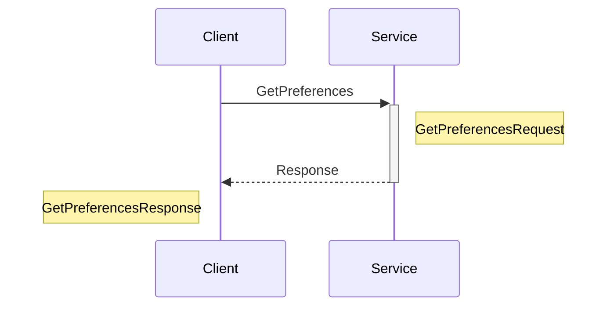

---

### UpdatePreferences

<a name="updatepreferences"></a>

UpdatePreferences updates notification preferences.

#### Method Signature

```protobuf
// Unary RPC
rpc UpdatePreferences(UpdatePreferencesRequest) returns (UpdatePreferencesResponse);
```

#### Method Details

| Attribute | Value |
|-----------|-------|
| **Full Name** | `notifications.v1.UpdatePreferences` |
| **Input Type** | [`UpdatePreferencesRequest`](#updatepreferencesrequest) |
| **Output Type** | [`UpdatePreferencesResponse`](#updatepreferencesresponse) |
| **Streaming Type** | Unary |

##### Sequence Diagram

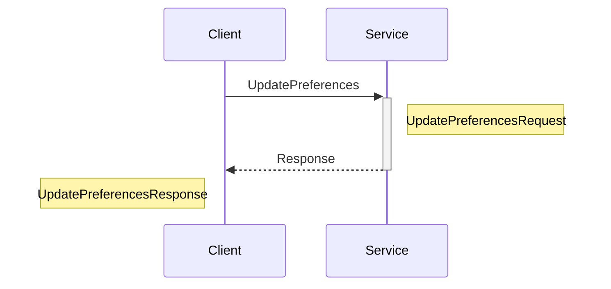

---

## 📦 Messages

<a name="messages"></a>

This service defines **27 message types**:

### BulkSendResult

<a name="bulksendresult"></a>

BulkSendResult streams results.

| Attribute | Value |
|-----------|-------|
| **Full Name** | `notifications.v1.BulkSendResult` |
| **Field Count** | 4 |

#### Fields

| # | Name | Type | Label | Description |
|---|------|------|-------|-------------|
| 1 | `recipient_id` | string | optional | Recipient ID. (Must be a non-empty identifier) |
| 2 | `success` | bool | optional | Success. |
| 3 | `notification` | [`Notification`](#notification) | optional | Notification. |
| 4 | `error` | [`Error`](#error) | optional | Error. |

#### Proto Definition

```protobuf
message BulkSendResult {
  // Recipient ID. (Must be a non-empty identifier)
  optional string recipient_id = 1;
  // Success.
  optional bool success = 2;
  // Notification.
  optional Notification notification = 3;
  // Error.
  optional Error error = 4;
}
```

##### Message Structure

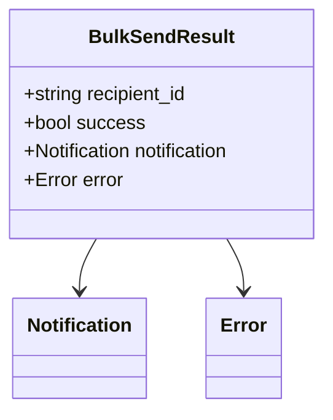

---

### NotificationEvent

<a name="notificationevent"></a>

NotificationEvent represents real-time event.

| Attribute | Value |
|-----------|-------|
| **Full Name** | `notifications.v1.NotificationEvent` |
| **Field Count** | 3 |

#### Fields

| # | Name | Type | Label | Description |
|---|------|------|-------|-------------|
| 1 | `event_type` | [`EventType`](#eventtype) | optional | Event type. |
| 2 | `notification` | [`Notification`](#notification) | optional | Notification. |
| 3 | `event_time` | [`Timestamp`](#timestamp) | optional | Event timestamp. |

#### Proto Definition

```protobuf
message NotificationEvent {
  // Event type.
  optional EventType event_type = 1;
  // Notification.
  optional Notification notification = 2;
  // Event timestamp.
  optional Timestamp event_time = 3;
}
```

##### Message Structure

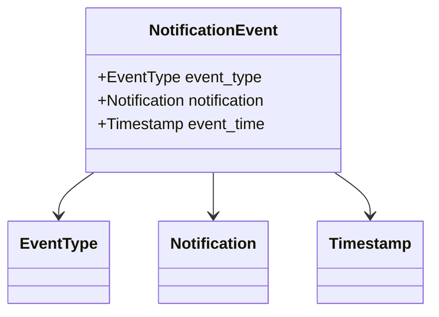

---

### NotificationTemplate

<a name="notificationtemplate"></a>

NotificationTemplate defines reusable template.

| Attribute | Value |
|-----------|-------|
| **Full Name** | `notifications.v1.NotificationTemplate` |
| **Field Count** | 7 |
| **Nested Types** | 1 |

#### Fields

| # | Name | Type | Label | Description |
|---|------|------|-------|-------------|
| 1 | `template_id` | string | optional | Template ID. (Must be a non-empty identifier) |
| 2 | `type` | [`NotificationType`](#notificationtype) | optional | Type. |
| 3 | `priority` | [`Priority`](#priority) | optional | Priority Higher values indicate higher priority. |
| 4 | `title` | string | optional | Title template. |
| 5 | `message` | string | optional | Message template. |
| 6 | `channels` | [`Channel`](#channel) | repeated | Channels. |
| 7 | `default_data` | map<string, string> |  | Default data. |

#### Proto Definition

```protobuf
message NotificationTemplate {
  // Template ID. (Must be a non-empty identifier)
  optional string template_id = 1;
  // Type.
  optional NotificationType type = 2;
  // Priority Higher values indicate higher priority.
  optional Priority priority = 3;
  // Title template.
  optional string title = 4;
  // Message template.
  optional string message = 5;
  // Channels.
  repeated Channel channels = 6;
  // Default data.
   map<string, string> default_data = 7;
}
```

##### Message Structure

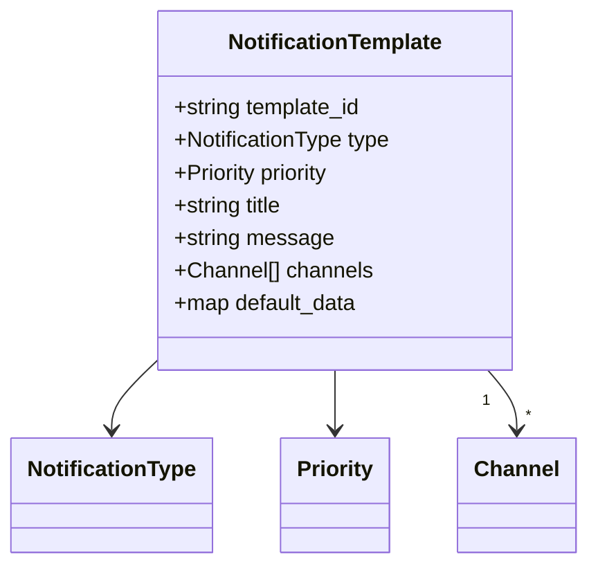

---

### NotificationPreferences

<a name="notificationpreferences"></a>

NotificationPreferences contains user preferences.

| Attribute | Value |
|-----------|-------|
| **Full Name** | `notifications.v1.NotificationPreferences` |
| **Field Count** | 6 |
| **Nested Types** | 2 |

#### Fields

| # | Name | Type | Label | Description |
|---|------|------|-------|-------------|
| 1 | `user_id` | string | optional | User ID. (Must be a non-empty identifier) |
| 2 | `enabled` | bool | optional | Global notification enabled. |
| 3 | `channels` | map<string, ChannelPreference> |  | Channel preferences. |
| 4 | `types` | map<string, TypePreference> |  | Type preferences. |
| 5 | `quiet_hours` | [`QuietHours`](#quiethours) | optional | Quiet hours. |
| 6 | `digest` | [`DigestSettings`](#digestsettings) | optional | Digest settings. |

#### Proto Definition

```protobuf
message NotificationPreferences {
  // User ID. (Must be a non-empty identifier)
  optional string user_id = 1;
  // Global notification enabled.
  optional bool enabled = 2;
  // Channel preferences.
   map<string, ChannelPreference> channels = 3;
  // Type preferences.
   map<string, TypePreference> types = 4;
  // Quiet hours.
  optional QuietHours quiet_hours = 5;
  // Digest settings.
  optional DigestSettings digest = 6;
}
```

##### Message Structure

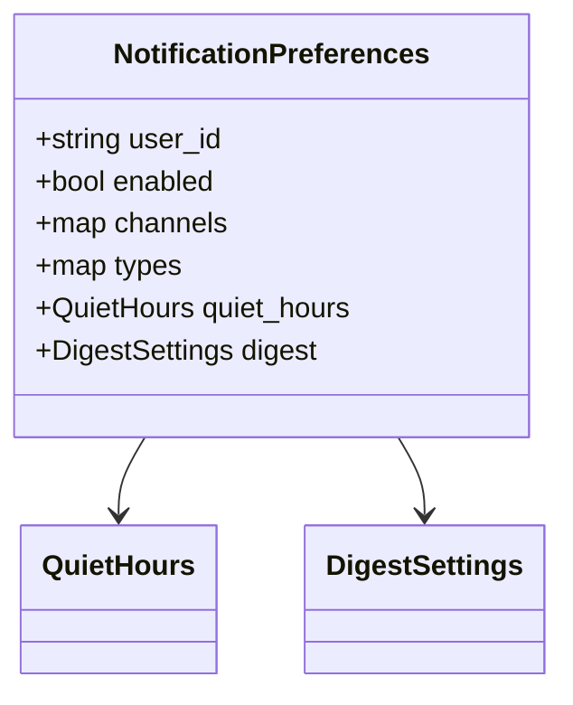

---

### TrackingData

<a name="trackingdata"></a>

TrackingData contains tracking information.

| Attribute | Value |
|-----------|-------|
| **Full Name** | `notifications.v1.TrackingData` |
| **Field Count** | 7 |

#### Fields

| # | Name | Type | Label | Description |
|---|------|------|-------|-------------|
| 1 | `impression_tracked` | bool | optional | Impression tracked. |
| 2 | `impression_at` | [`Timestamp`](#timestamp) | optional | Impression timestamp. (RFC 3339 timestamp format) |
| 3 | `click_tracked` | bool | optional | Click tracked. |
| 4 | `clicked_at` | [`Timestamp`](#timestamp) | optional | Click timestamp. (RFC 3339 timestamp format) |
| 5 | `conversion_tracked` | bool | optional | Conversion tracked. |
| 6 | `converted_at` | [`Timestamp`](#timestamp) | optional | Conversion timestamp. (RFC 3339 timestamp format) |
| 7 | `utm` | [`UTMParameters`](#utmparameters) | optional | UTM parameters. |

#### Proto Definition

```protobuf
message TrackingData {
  // Impression tracked.
  optional bool impression_tracked = 1;
  // Impression timestamp. (RFC 3339 timestamp format)
  optional Timestamp impression_at = 2;
  // Click tracked.
  optional bool click_tracked = 3;
  // Click timestamp. (RFC 3339 timestamp format)
  optional Timestamp clicked_at = 4;
  // Conversion tracked.
  optional bool conversion_tracked = 5;
  // Conversion timestamp. (RFC 3339 timestamp format)
  optional Timestamp converted_at = 6;
  // UTM parameters.
  optional UTMParameters utm = 7;
}
```

##### Message Structure

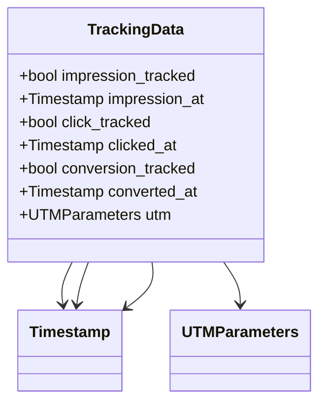

---

### GetNotificationRequest

<a name="getnotificationrequest"></a>

GetNotificationRequest retrieves notification.

| Attribute | Value |
|-----------|-------|
| **Full Name** | `notifications.v1.GetNotificationRequest` |
| **Field Count** | 1 |

#### Fields

| # | Name | Type | Label | Description |
|---|------|------|-------|-------------|
| 1 | `notification_id` | string | optional | Notification ID. (Must be a non-empty identifier) |

#### Proto Definition

```protobuf
message GetNotificationRequest {
  // Notification ID. (Must be a non-empty identifier)
  optional string notification_id = 1;
}
```

##### Message Structure

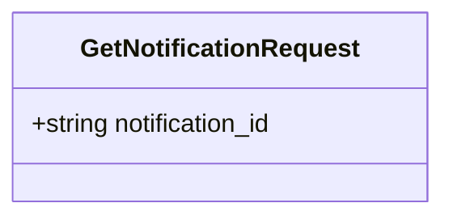

---

### MarkAsReadRequest

<a name="markasreadrequest"></a>

MarkAsReadRequest marks as read.

| Attribute | Value |
|-----------|-------|
| **Full Name** | `notifications.v1.MarkAsReadRequest` |
| **Field Count** | 3 |

#### Fields

| # | Name | Type | Label | Description |
|---|------|------|-------|-------------|
| 1 | `notification_ids` | string | repeated | Notification IDs. |
| 2 | `user_id` | string | optional | User ID. (Must be a non-empty identifier) |
| 3 | `all` | bool | optional | Mark all as read. |

#### Proto Definition

```protobuf
message MarkAsReadRequest {
  // Notification IDs.
  repeated string notification_ids = 1;
  // User ID. (Must be a non-empty identifier)
  optional string user_id = 2;
  // Mark all as read.
  optional bool all = 3;
}
```

##### Message Structure

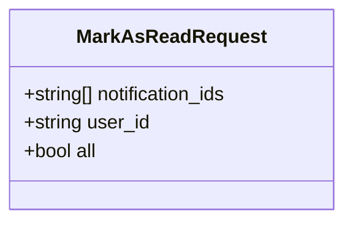

---

### UpdatePreferencesRequest

<a name="updatepreferencesrequest"></a>

UpdatePreferencesRequest updates preferences.

| Attribute | Value |
|-----------|-------|
| **Full Name** | `notifications.v1.UpdatePreferencesRequest` |
| **Field Count** | 2 |

#### Fields

| # | Name | Type | Label | Description |
|---|------|------|-------|-------------|
| 1 | `user_id` | string | optional | User ID. (Must be a non-empty identifier) |
| 2 | `preferences` | [`NotificationPreferences`](#notificationpreferences) | optional | Updated preferences. |

#### Proto Definition

```protobuf
message UpdatePreferencesRequest {
  // User ID. (Must be a non-empty identifier)
  optional string user_id = 1;
  // Updated preferences.
  optional NotificationPreferences preferences = 2;
}
```

##### Message Structure

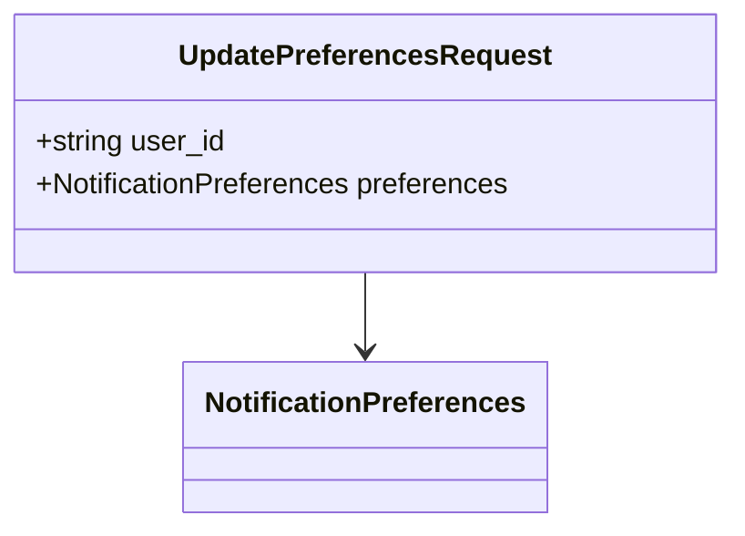

---

### RichContent

<a name="richcontent"></a>

RichContent contains rich notification content.

| Attribute | Value |
|-----------|-------|
| **Full Name** | `notifications.v1.RichContent` |
| **Field Count** | 4 |

#### Fields

| # | Name | Type | Label | Description |
|---|------|------|-------|-------------|
| 1 | `html` | string | optional | HTML content. |
| 2 | `markdown` | string | optional | Markdown content. |
| 3 | `structured_data` | [`Struct`](#struct) | optional | Structured data. |
| 4 | `attachments` | [`Attachment`](#attachment) | repeated | Attachments. |

#### Proto Definition

```protobuf
message RichContent {
  // HTML content.
  optional string html = 1;
  // Markdown content.
  optional string markdown = 2;
  // Structured data.
  optional Struct structured_data = 3;
  // Attachments.
  repeated Attachment attachments = 4;
}
```

##### Message Structure

```mermaid
classDiagram
    class RichContent {
        +string html
        +string markdown
        +Struct structured_data
        +Attachment[] attachments
    }
    RichContent --> Struct
    RichContent "1" --> "*" Attachment
```

---

### Notification

<a name="notification"></a>

Notification represents a notification message.

| Attribute | Value |
|-----------|-------|
| **Full Name** | `notifications.v1.Notification` |
| **Field Count** | 23 |
| **Nested Types** | 2 |

#### Fields

| # | Name | Type | Label | Description |
|---|------|------|-------|-------------|
| 1 | `metadata` | [`Metadata`](#metadata) | optional | Notification metadata. |
| 2 | `recipient_id` | string | optional | Recipient user ID. (Must be a non-empty identifier) |
| 3 | `sender_id` | string | optional | Sender ID (optional). (Must be a non-empty identifier) |
| 4 | `type` | [`NotificationType`](#notificationtype) | optional | Notification type. |
| 5 | `priority` | [`Priority`](#priority) | optional | Priority Higher values indicate higher priority. |
| 6 | `title` | string | optional | Title. |
| 7 | `message` | string | optional | Message content. |
| 8 | `content` | [`RichContent`](#richcontent) | optional | Rich content. |
| 9 | `channels` | [`Channel`](#channel) | repeated | Channels to deliver on. |
| 10 | `deliveries` | map<string, DeliveryDetails> |  | Delivery details per channel. |
| 11 | `actions` | [`Action`](#action) | repeated | Action buttons. |
| 12 | `deep_link` | string | optional | Deep link URL. |
| 13 | `image_url` | string | optional | Image URL. (Must be a valid URL) |
| 14 | `icon_url` | string | optional | Icon URL. (Must be a valid URL) |
| 15 | `sound` | string | optional | Sound (for push notifications). |
| 16 | `badge` | int32 | optional | Badge count. |
| 17 | `read` | bool | optional | Read status. |
| 18 | `read_at` | [`Timestamp`](#timestamp) | optional | Read timestamp. (RFC 3339 timestamp format) |
| 19 | `expires_at` | [`Timestamp`](#timestamp) | optional | Expiry timestamp. (RFC 3339 timestamp format) |
| 20 | `category` | string | optional | Category for grouping. |
| 21 | `tags` | string | repeated | Tags for filtering. |
| 22 | `data` | map<string, string> |  | Custom data. |
| 23 | `tracking` | [`TrackingData`](#trackingdata) | optional | Tracking data. |

#### Proto Definition

```protobuf
message Notification {
  // Notification metadata.
  optional Metadata metadata = 1;
  // Recipient user ID. (Must be a non-empty identifier)
  optional string recipient_id = 2;
  // Sender ID (optional). (Must be a non-empty identifier)
  optional string sender_id = 3;
  // Notification type.
  optional NotificationType type = 4;
  // Priority Higher values indicate higher priority.
  optional Priority priority = 5;
  // Title.
  optional string title = 6;
  // Message content.
  optional string message = 7;
  // Rich content.
  optional RichContent content = 8;
  // Channels to deliver on.
  repeated Channel channels = 9;
  // Delivery details per channel.
   map<string, DeliveryDetails> deliveries = 10;
  // Action buttons.
  repeated Action actions = 11;
  // Deep link URL.
  optional string deep_link = 12;
  // Image URL. (Must be a valid URL)
  optional string image_url = 13;
  // Icon URL. (Must be a valid URL)
  optional string icon_url = 14;
  // Sound (for push notifications).
  optional string sound = 15;
  // Badge count.
  optional int32 badge = 16;
  // Read status.
  optional bool read = 17;
  // Read timestamp. (RFC 3339 timestamp format)
  optional Timestamp read_at = 18;
  // Expiry timestamp. (RFC 3339 timestamp format)
  optional Timestamp expires_at = 19;
  // Category for grouping.
  optional string category = 20;
  // Tags for filtering.
  repeated string tags = 21;
  // Custom data.
   map<string, string> data = 22;
  // Tracking data.
  optional TrackingData tracking = 23;
}
```

##### Message Structure

```mermaid
classDiagram
    class Notification {
        +Metadata metadata
        +string recipient_id
        +string sender_id
        +NotificationType type
        +Priority priority
        +string title
        +string message
        +RichContent content
        +Channel[] channels
        +map<string, DeliveryDetails> deliveries
        +Action[] actions
        +string deep_link
        +string image_url
        +string icon_url
        +string sound
        +int32 badge
        +bool read
        +Timestamp read_at
        +Timestamp expires_at
        +string category
        +string[] tags
        +map<string, string> data
        +TrackingData tracking
    }
    Notification --> Metadata
    Notification --> NotificationType
    Notification --> Priority
    Notification --> RichContent
    Notification "1" --> "*" Channel
    Notification "1" --> "*" Action
    Notification --> Timestamp
    Notification --> Timestamp
    Notification --> TrackingData
```

---

### DigestSettings

<a name="digestsettings"></a>

DigestSettings for notification digests.

| Attribute | Value |
|-----------|-------|
| **Full Name** | `notifications.v1.DigestSettings` |
| **Field Count** | 4 |

#### Fields

| # | Name | Type | Label | Description |
|---|------|------|-------|-------------|
| 1 | `enabled` | bool | optional | Enabled. |
| 2 | `frequency` | [`DigestFrequency`](#digestfrequency) | optional | Frequency. |
| 3 | `delivery_time` | string | optional | Delivery time (HH:MM). |
| 4 | `days` | int32 | repeated | Days for weekly digest. |

#### Proto Definition

```protobuf
message DigestSettings {
  // Enabled.
  optional bool enabled = 1;
  // Frequency.
  optional DigestFrequency frequency = 2;
  // Delivery time (HH:MM).
  optional string delivery_time = 3;
  // Days for weekly digest.
  repeated int32 days = 4;
}
```

##### Message Structure

```mermaid
classDiagram
    class DigestSettings {
        +bool enabled
        +DigestFrequency frequency
        +string delivery_time
        +int32[] days
    }
    DigestSettings --> DigestFrequency
```

---

### SendNotificationResponse

<a name="sendnotificationresponse"></a>

SendNotificationResponse confirms sending.

| Attribute | Value |
|-----------|-------|
| **Full Name** | `notifications.v1.SendNotificationResponse` |
| **Field Count** | 2 |

#### Fields

| # | Name | Type | Label | Description |
|---|------|------|-------|-------------|
| 1 | `notification` | [`Notification`](#notification) | optional | Created notification. |
| 2 | `scheduled` | bool | optional | Scheduled. |

#### Proto Definition

```protobuf
message SendNotificationResponse {
  // Created notification.
  optional Notification notification = 1;
  // Scheduled.
  optional bool scheduled = 2;
}
```

##### Message Structure

```mermaid
classDiagram
    class SendNotificationResponse {
        +Notification notification
        +bool scheduled
    }
    SendNotificationResponse --> Notification
```

---

### GetNotificationResponse

<a name="getnotificationresponse"></a>

GetNotificationResponse returns notification.

| Attribute | Value |
|-----------|-------|
| **Full Name** | `notifications.v1.GetNotificationResponse` |
| **Field Count** | 1 |

#### Fields

| # | Name | Type | Label | Description |
|---|------|------|-------|-------------|
| 1 | `notification` | [`Notification`](#notification) | optional | Notification. |

#### Proto Definition

```protobuf
message GetNotificationResponse {
  // Notification.
  optional Notification notification = 1;
}
```

##### Message Structure

```mermaid
classDiagram
    class GetNotificationResponse {
        +Notification notification
    }
    GetNotificationResponse --> Notification
```

---

### DeleteNotificationRequest

<a name="deletenotificationrequest"></a>

DeleteNotificationRequest deletes notification.

| Attribute | Value |
|-----------|-------|
| **Full Name** | `notifications.v1.DeleteNotificationRequest` |
| **Field Count** | 2 |

#### Fields

| # | Name | Type | Label | Description |
|---|------|------|-------|-------------|
| 1 | `notification_id` | string | optional | Notification ID. (Must be a non-empty identifier) |
| 2 | `user_id` | string | optional | User ID. (Must be a non-empty identifier) |

#### Proto Definition

```protobuf
message DeleteNotificationRequest {
  // Notification ID. (Must be a non-empty identifier)
  optional string notification_id = 1;
  // User ID. (Must be a non-empty identifier)
  optional string user_id = 2;
}
```

##### Message Structure

```mermaid
classDiagram
    class DeleteNotificationRequest {
        +string notification_id
        +string user_id
    }
```

---

### GetPreferencesRequest

<a name="getpreferencesrequest"></a>

GetPreferencesRequest gets preferences.

| Attribute | Value |
|-----------|-------|
| **Full Name** | `notifications.v1.GetPreferencesRequest` |
| **Field Count** | 1 |

#### Fields

| # | Name | Type | Label | Description |
|---|------|------|-------|-------------|
| 1 | `user_id` | string | optional | User ID. (Must be a non-empty identifier) |

#### Proto Definition

```protobuf
message GetPreferencesRequest {
  // User ID. (Must be a non-empty identifier)
  optional string user_id = 1;
}
```

##### Message Structure

```mermaid
classDiagram
    class GetPreferencesRequest {
        +string user_id
    }
```

---

### UpdatePreferencesResponse

<a name="updatepreferencesresponse"></a>

UpdatePreferencesResponse confirms update.

| Attribute | Value |
|-----------|-------|
| **Full Name** | `notifications.v1.UpdatePreferencesResponse` |
| **Field Count** | 1 |

#### Fields

| # | Name | Type | Label | Description |
|---|------|------|-------|-------------|
| 1 | `preferences` | [`NotificationPreferences`](#notificationpreferences) | optional | Updated preferences. |

#### Proto Definition

```protobuf
message UpdatePreferencesResponse {
  // Updated preferences.
  optional NotificationPreferences preferences = 1;
}
```

##### Message Structure

```mermaid
classDiagram
    class UpdatePreferencesResponse {
        +NotificationPreferences preferences
    }
    UpdatePreferencesResponse --> NotificationPreferences
```

---

### QuietHours

<a name="quiethours"></a>

QuietHours defines silent periods.

| Attribute | Value |
|-----------|-------|
| **Full Name** | `notifications.v1.QuietHours` |
| **Field Count** | 5 |

#### Fields

| # | Name | Type | Label | Description |
|---|------|------|-------|-------------|
| 1 | `enabled` | bool | optional | Enabled. |
| 2 | `start_time` | string | optional | Start time (HH:MM). |
| 3 | `end_time` | string | optional | End time (HH:MM). |
| 4 | `days` | int32 | repeated | Days (0=Sunday, 6=Saturday). |
| 5 | `timezone` | string | optional | Timezone. |

#### Proto Definition

```protobuf
message QuietHours {
  // Enabled.
  optional bool enabled = 1;
  // Start time (HH:MM).
  optional string start_time = 2;
  // End time (HH:MM).
  optional string end_time = 3;
  // Days (0=Sunday, 6=Saturday).
  repeated int32 days = 4;
  // Timezone.
  optional string timezone = 5;
}
```

##### Message Structure

```mermaid
classDiagram
    class QuietHours {
        +bool enabled
        +string start_time
        +string end_time
        +int32[] days
        +string timezone
    }
```

---

### UTMParameters

<a name="utmparameters"></a>

UTMParameters for tracking.

| Attribute | Value |
|-----------|-------|
| **Full Name** | `notifications.v1.UTMParameters` |
| **Field Count** | 5 |

#### Fields

| # | Name | Type | Label | Description |
|---|------|------|-------|-------------|
| 1 | `source` | string | optional | Source. |
| 2 | `medium` | string | optional | Medium. |
| 3 | `campaign` | string | optional | Campaign. |
| 4 | `term` | string | optional | Term. |
| 5 | `content` | string | optional | Content. |

#### Proto Definition

```protobuf
message UTMParameters {
  // Source.
  optional string source = 1;
  // Medium.
  optional string medium = 2;
  // Campaign.
  optional string campaign = 3;
  // Term.
  optional string term = 4;
  // Content.
  optional string content = 5;
}
```

##### Message Structure

```mermaid
classDiagram
    class UTMParameters {
        +string source
        +string medium
        +string campaign
        +string term
        +string content
    }
```

---

### ListNotificationsRequest

<a name="listnotificationsrequest"></a>

ListNotificationsRequest lists notifications.

| Attribute | Value |
|-----------|-------|
| **Full Name** | `notifications.v1.ListNotificationsRequest` |
| **Field Count** | 8 |

#### Fields

| # | Name | Type | Label | Description |
|---|------|------|-------|-------------|
| 1 | `user_id` | string | optional | User ID. (Must be a non-empty identifier) |
| 2 | `pagination` | [`PaginationRequest`](#paginationrequest) | optional | Pagination. |
| 3 | `read` | bool | oneof `_read` | Filter by read status. |
| 4 | `types` | [`NotificationType`](#notificationtype) | repeated | Filter by type. |
| 5 | `channels` | [`Channel`](#channel) | repeated | Filter by channel. |
| 6 | `categories` | string | repeated | Filter by category. |
| 7 | `tags` | string | repeated | Filter by tags. |
| 8 | `date_range` | [`DateRangeFilter`](#daterangefilter) | optional | Date range. |

#### Proto Definition

```protobuf
message ListNotificationsRequest {
  // User ID. (Must be a non-empty identifier)
  optional string user_id = 1;
  // Pagination.
  optional PaginationRequest pagination = 2;
  // Filter by type.
  repeated NotificationType types = 4;
  // Filter by channel.
  repeated Channel channels = 5;
  // Filter by category.
  repeated string categories = 6;
  // Filter by tags.
  repeated string tags = 7;
  // Date range.
  optional DateRangeFilter date_range = 8;

  oneof _read {
    // Filter by read status.
    bool read = 3;
  }
}
```

##### Message Structure

```mermaid
classDiagram
    class ListNotificationsRequest {
        +string user_id
        +PaginationRequest pagination
        +bool read
        +NotificationType[] types
        +Channel[] channels
        +string[] categories
        +string[] tags
        +DateRangeFilter date_range
    }
    ListNotificationsRequest --> PaginationRequest
    ListNotificationsRequest "1" --> "*" NotificationType
    ListNotificationsRequest "1" --> "*" Channel
    ListNotificationsRequest --> DateRangeFilter
```

---

### ListNotificationsResponse

<a name="listnotificationsresponse"></a>

ListNotificationsResponse returns notifications.

| Attribute | Value |
|-----------|-------|
| **Full Name** | `notifications.v1.ListNotificationsResponse` |
| **Field Count** | 3 |

#### Fields

| # | Name | Type | Label | Description |
|---|------|------|-------|-------------|
| 1 | `notifications` | [`Notification`](#notification) | repeated | Notifications. |
| 2 | `pagination` | [`PaginationResponse`](#paginationresponse) | optional | Pagination. |
| 3 | `unread_count` | int64 | optional | Unread count Must be >= 0. |

#### Proto Definition

```protobuf
message ListNotificationsResponse {
  // Notifications.
  repeated Notification notifications = 1;
  // Pagination.
  optional PaginationResponse pagination = 2;
  // Unread count Must be >= 0.
  optional int64 unread_count = 3;
}
```

##### Message Structure

```mermaid
classDiagram
    class ListNotificationsResponse {
        +Notification[] notifications
        +PaginationResponse pagination
        +int64 unread_count
    }
    ListNotificationsResponse "1" --> "*" Notification
    ListNotificationsResponse --> PaginationResponse
```

---

### StreamNotificationsRequest

<a name="streamnotificationsrequest"></a>

StreamNotificationsRequest subscribes to stream.

| Attribute | Value |
|-----------|-------|
| **Full Name** | `notifications.v1.StreamNotificationsRequest` |
| **Field Count** | 3 |

#### Fields

| # | Name | Type | Label | Description |
|---|------|------|-------|-------------|
| 1 | `user_id` | string | optional | User ID. (Must be a non-empty identifier) |
| 2 | `types` | [`NotificationType`](#notificationtype) | repeated | Filter by types. |
| 3 | `channels` | [`Channel`](#channel) | repeated | Filter by channels. |

#### Proto Definition

```protobuf
message StreamNotificationsRequest {
  // User ID. (Must be a non-empty identifier)
  optional string user_id = 1;
  // Filter by types.
  repeated NotificationType types = 2;
  // Filter by channels.
  repeated Channel channels = 3;
}
```

##### Message Structure

```mermaid
classDiagram
    class StreamNotificationsRequest {
        +string user_id
        +NotificationType[] types
        +Channel[] channels
    }
    StreamNotificationsRequest "1" --> "*" NotificationType
    StreamNotificationsRequest "1" --> "*" Channel
```

---

### Action

<a name="action"></a>

Action represents a notification action button.

| Attribute | Value |
|-----------|-------|
| **Full Name** | `notifications.v1.Action` |
| **Field Count** | 5 |

#### Fields

| # | Name | Type | Label | Description |
|---|------|------|-------|-------------|
| 1 | `id` | string | optional | Action ID. (Must be a non-empty identifier) |
| 2 | `label` | string | optional | Button label. |
| 3 | `url` | string | optional | Action URL. (Must be a valid URL) |
| 4 | `type` | [`ActionType`](#actiontype) | optional | Action type. |
| 5 | `primary` | bool | optional | Is primary action. |

#### Proto Definition

```protobuf
message Action {
  // Action ID. (Must be a non-empty identifier)
  optional string id = 1;
  // Button label.
  optional string label = 2;
  // Action URL. (Must be a valid URL)
  optional string url = 3;
  // Action type.
  optional ActionType type = 4;
  // Is primary action.
  optional bool primary = 5;
}
```

##### Message Structure

```mermaid
classDiagram
    class Action {
        +string id
        +string label
        +string url
        +ActionType type
        +bool primary
    }
    Action --> ActionType
```

---

### DateRangeFilter

<a name="daterangefilter"></a>

DateRangeFilter filters by date.

| Attribute | Value |
|-----------|-------|
| **Full Name** | `notifications.v1.DateRangeFilter` |
| **Field Count** | 2 |

#### Fields

| # | Name | Type | Label | Description |
|---|------|------|-------|-------------|
| 1 | `start` | [`Timestamp`](#timestamp) | optional | Start date. |
| 2 | `end` | [`Timestamp`](#timestamp) | optional | End date. |

#### Proto Definition

```protobuf
message DateRangeFilter {
  // Start date.
  optional Timestamp start = 1;
  // End date.
  optional Timestamp end = 2;
}
```

##### Message Structure

```mermaid
classDiagram
    class DateRangeFilter {
        +Timestamp start
        +Timestamp end
    }
    DateRangeFilter --> Timestamp
    DateRangeFilter --> Timestamp
```

---

### Attachment

<a name="attachment"></a>

Attachment represents a file attachment.

| Attribute | Value |
|-----------|-------|
| **Full Name** | `notifications.v1.Attachment` |
| **Field Count** | 5 |

#### Fields

| # | Name | Type | Label | Description |
|---|------|------|-------|-------------|
| 1 | `type` | [`AttachmentType`](#attachmenttype) | optional | Attachment type. |
| 2 | `url` | string | optional | File URL. (Must be a valid URL) |
| 3 | `filename` | string | optional | File name. |
| 4 | `size` | int64 | optional | File size in bytes. |
| 5 | `mime_type` | string | optional | MIME type. |

#### Proto Definition

```protobuf
message Attachment {
  // Attachment type.
  optional AttachmentType type = 1;
  // File URL. (Must be a valid URL)
  optional string url = 2;
  // File name.
  optional string filename = 3;
  // File size in bytes.
  optional int64 size = 4;
  // MIME type.
  optional string mime_type = 5;
}
```

##### Message Structure

```mermaid
classDiagram
    class Attachment {
        +AttachmentType type
        +string url
        +string filename
        +int64 size
        +string mime_type
    }
    Attachment --> AttachmentType
```

---

### GetPreferencesResponse

<a name="getpreferencesresponse"></a>

GetPreferencesResponse returns preferences.

| Attribute | Value |
|-----------|-------|
| **Full Name** | `notifications.v1.GetPreferencesResponse` |
| **Field Count** | 1 |

#### Fields

| # | Name | Type | Label | Description |
|---|------|------|-------|-------------|
| 1 | `preferences` | [`NotificationPreferences`](#notificationpreferences) | optional | Preferences. |

#### Proto Definition

```protobuf
message GetPreferencesResponse {
  // Preferences.
  optional NotificationPreferences preferences = 1;
}
```

##### Message Structure

```mermaid
classDiagram
    class GetPreferencesResponse {
        +NotificationPreferences preferences
    }
    GetPreferencesResponse --> NotificationPreferences
```

---

### SendNotificationRequest

<a name="sendnotificationrequest"></a>

SendNotificationRequest sends a notification.

| Attribute | Value |
|-----------|-------|
| **Full Name** | `notifications.v1.SendNotificationRequest` |
| **Field Count** | 14 |
| **Nested Types** | 1 |

#### Fields

| # | Name | Type | Label | Description |
|---|------|------|-------|-------------|
| 1 | `recipient_id` | string | optional | Recipient ID. (Must be a non-empty identifier) |
| 2 | `type` | [`NotificationType`](#notificationtype) | optional | Notification type. |
| 3 | `priority` | [`Priority`](#priority) | optional | Priority Higher values indicate higher priority. |
| 4 | `title` | string | optional | Title. |
| 5 | `message` | string | optional | Message. |
| 6 | `content` | [`RichContent`](#richcontent) | optional | Rich content. |
| 7 | `channels` | [`Channel`](#channel) | repeated | Channels. |
| 8 | `actions` | [`Action`](#action) | repeated | Actions. |
| 9 | `deep_link` | string | optional | Deep link. |
| 10 | `image_url` | string | optional | Image URL. (Must be a valid URL) |
| 11 | `data` | map<string, string> |  | Custom data. |
| 12 | `scheduled_at` | [`Timestamp`](#timestamp) | optional | Schedule for later. (RFC 3339 timestamp format) |
| 13 | `expires_at` | [`Timestamp`](#timestamp) | optional | Expiry time. (RFC 3339 timestamp format) |
| 14 | `idempotency_key` | string | optional | Idempotency key. |

#### Proto Definition

```protobuf
message SendNotificationRequest {
  // Recipient ID. (Must be a non-empty identifier)
  optional string recipient_id = 1;
  // Notification type.
  optional NotificationType type = 2;
  // Priority Higher values indicate higher priority.
  optional Priority priority = 3;
  // Title.
  optional string title = 4;
  // Message.
  optional string message = 5;
  // Rich content.
  optional RichContent content = 6;
  // Channels.
  repeated Channel channels = 7;
  // Actions.
  repeated Action actions = 8;
  // Deep link.
  optional string deep_link = 9;
  // Image URL. (Must be a valid URL)
  optional string image_url = 10;
  // Custom data.
   map<string, string> data = 11;
  // Schedule for later. (RFC 3339 timestamp format)
  optional Timestamp scheduled_at = 12;
  // Expiry time. (RFC 3339 timestamp format)
  optional Timestamp expires_at = 13;
  // Idempotency key.
  optional string idempotency_key = 14;
}
```

##### Message Structure

```mermaid
classDiagram
    class SendNotificationRequest {
        +string recipient_id
        +NotificationType type
        +Priority priority
        +string title
        +string message
        +RichContent content
        +Channel[] channels
        +Action[] actions
        +string deep_link
        +string image_url
        +map<string, string> data
        +Timestamp scheduled_at
        +Timestamp expires_at
        +string idempotency_key
    }
    SendNotificationRequest --> NotificationType
    SendNotificationRequest --> Priority
    SendNotificationRequest --> RichContent
    SendNotificationRequest "1" --> "*" Channel
    SendNotificationRequest "1" --> "*" Action
    SendNotificationRequest --> Timestamp
    SendNotificationRequest --> Timestamp
```

---

### SendBulkRequest

<a name="sendbulkrequest"></a>

SendBulkRequest sends to multiple recipients.

| Attribute | Value |
|-----------|-------|
| **Full Name** | `notifications.v1.SendBulkRequest` |
| **Field Count** | 4 |
| **Nested Types** | 1 |

#### Fields

| # | Name | Type | Label | Description |
|---|------|------|-------|-------------|
| 1 | `recipient_ids` | string | repeated | Recipient IDs. |
| 2 | `template` | [`NotificationTemplate`](#notificationtemplate) | optional | Notification template. |
| 3 | `personalizations` | map<string, Struct> |  | Personalization data per recipient. |
| 4 | `scheduled_at` | [`Timestamp`](#timestamp) | optional | Schedule for later. (RFC 3339 timestamp format) |

#### Proto Definition

```protobuf
message SendBulkRequest {
  // Recipient IDs.
  repeated string recipient_ids = 1;
  // Notification template.
  optional NotificationTemplate template = 2;
  // Personalization data per recipient.
   map<string, Struct> personalizations = 3;
  // Schedule for later. (RFC 3339 timestamp format)
  optional Timestamp scheduled_at = 4;
}
```

##### Message Structure

```mermaid
classDiagram
    class SendBulkRequest {
        +string[] recipient_ids
        +NotificationTemplate template
        +map<string, Struct> personalizations
        +Timestamp scheduled_at
    }
    SendBulkRequest --> NotificationTemplate
    SendBulkRequest --> Timestamp
```

---

## 🔢 Enumerations

<a name="enumerations"></a>

This service defines **7 enumeration types**:

### ActionType

<a name="actiontype"></a>

ActionType represents action types.

| Value | Number | Description |
|-------|--------|-------------|
| `ACTION_TYPE_UNSPECIFIED` | 0 | ACTION_TYPE_UNSPECIFIED value. |
| `ACTION_TYPE_LINK` | 1 | ACTION_TYPE_LINK value. |
| `ACTION_TYPE_DISMISS` | 2 | ACTION_TYPE_DISMISS value. |
| `ACTION_TYPE_CONFIRM` | 3 | ACTION_TYPE_CONFIRM value. |
| `ACTION_TYPE_DECLINE` | 4 | ACTION_TYPE_DECLINE value. |
| `ACTION_TYPE_CUSTOM` | 5 | ACTION_TYPE_CUSTOM value. |

#### Proto Definition

```protobuf
enum ActionType {
  // ACTION_TYPE_UNSPECIFIED value.
  ACTION_TYPE_UNSPECIFIED = 0;
  // ACTION_TYPE_LINK value.
  ACTION_TYPE_LINK = 1;
  // ACTION_TYPE_DISMISS value.
  ACTION_TYPE_DISMISS = 2;
  // ACTION_TYPE_CONFIRM value.
  ACTION_TYPE_CONFIRM = 3;
  // ACTION_TYPE_DECLINE value.
  ACTION_TYPE_DECLINE = 4;
  // ACTION_TYPE_CUSTOM value.
  ACTION_TYPE_CUSTOM = 5;
}
```

---

### DigestFrequency

<a name="digestfrequency"></a>

DigestFrequency represents digest frequencies.

| Value | Number | Description |
|-------|--------|-------------|
| `DIGEST_FREQUENCY_UNSPECIFIED` | 0 | DIGEST_FREQUENCY_UNSPECIFIED value. |
| `DIGEST_FREQUENCY_HOURLY` | 1 | DIGEST_FREQUENCY_HOURLY value. |
| `DIGEST_FREQUENCY_DAILY` | 2 | DIGEST_FREQUENCY_DAILY value. |
| `DIGEST_FREQUENCY_WEEKLY` | 3 | DIGEST_FREQUENCY_WEEKLY value. |
| `DIGEST_FREQUENCY_MONTHLY` | 4 | DIGEST_FREQUENCY_MONTHLY value. |

#### Proto Definition

```protobuf
enum DigestFrequency {
  // DIGEST_FREQUENCY_UNSPECIFIED value.
  DIGEST_FREQUENCY_UNSPECIFIED = 0;
  // DIGEST_FREQUENCY_HOURLY value.
  DIGEST_FREQUENCY_HOURLY = 1;
  // DIGEST_FREQUENCY_DAILY value.
  DIGEST_FREQUENCY_DAILY = 2;
  // DIGEST_FREQUENCY_WEEKLY value.
  DIGEST_FREQUENCY_WEEKLY = 3;
  // DIGEST_FREQUENCY_MONTHLY value.
  DIGEST_FREQUENCY_MONTHLY = 4;
}
```

---

### EventType

<a name="eventtype"></a>

EventType represents event types.

| Value | Number | Description |
|-------|--------|-------------|
| `EVENT_TYPE_UNSPECIFIED` | 0 | EVENT_TYPE_UNSPECIFIED value. |
| `EVENT_TYPE_CREATED` | 1 | EVENT_TYPE_CREATED value. |
| `EVENT_TYPE_DELIVERED` | 2 | EVENT_TYPE_DELIVERED value. |
| `EVENT_TYPE_READ` | 3 | EVENT_TYPE_READ value. |
| `EVENT_TYPE_DELETED` | 4 | EVENT_TYPE_DELETED value. |
| `EVENT_TYPE_FAILED` | 5 | EVENT_TYPE_FAILED value. |

#### Proto Definition

```protobuf
enum EventType {
  // EVENT_TYPE_UNSPECIFIED value.
  EVENT_TYPE_UNSPECIFIED = 0;
  // EVENT_TYPE_CREATED value.
  EVENT_TYPE_CREATED = 1;
  // EVENT_TYPE_DELIVERED value.
  EVENT_TYPE_DELIVERED = 2;
  // EVENT_TYPE_READ value.
  EVENT_TYPE_READ = 3;
  // EVENT_TYPE_DELETED value.
  EVENT_TYPE_DELETED = 4;
  // EVENT_TYPE_FAILED value.
  EVENT_TYPE_FAILED = 5;
}
```

---

### Channel

<a name="channel"></a>

Channel represents notification channels.

| Value | Number | Description |
|-------|--------|-------------|
| `CHANNEL_UNSPECIFIED` | 0 | CHANNEL_UNSPECIFIED value. |
| `CHANNEL_EMAIL` | 1 | CHANNEL_EMAIL value. |
| `CHANNEL_PUSH` | 2 | CHANNEL_PUSH value. |
| `CHANNEL_SMS` | 3 | CHANNEL_SMS value. |
| `CHANNEL_IN_APP` | 4 | CHANNEL_IN_APP value. |
| `CHANNEL_WEBHOOK` | 5 | CHANNEL_WEBHOOK value. |
| `CHANNEL_SLACK` | 6 | CHANNEL_SLACK value. |
| `CHANNEL_TEAMS` | 7 | CHANNEL_TEAMS value. |

#### Proto Definition

```protobuf
enum Channel {
  // CHANNEL_UNSPECIFIED value.
  CHANNEL_UNSPECIFIED = 0;
  // CHANNEL_EMAIL value.
  CHANNEL_EMAIL = 1;
  // CHANNEL_PUSH value.
  CHANNEL_PUSH = 2;
  // CHANNEL_SMS value.
  CHANNEL_SMS = 3;
  // CHANNEL_IN_APP value.
  CHANNEL_IN_APP = 4;
  // CHANNEL_WEBHOOK value.
  CHANNEL_WEBHOOK = 5;
  // CHANNEL_SLACK value.
  CHANNEL_SLACK = 6;
  // CHANNEL_TEAMS value.
  CHANNEL_TEAMS = 7;
}
```

---

### NotificationType

<a name="notificationtype"></a>

NotificationType represents notification categories.

| Value | Number | Description |
|-------|--------|-------------|
| `NOTIFICATION_TYPE_UNSPECIFIED` | 0 | NOTIFICATION_TYPE_UNSPECIFIED value. |
| `NOTIFICATION_TYPE_SYSTEM` | 1 | NOTIFICATION_TYPE_SYSTEM value. |
| `NOTIFICATION_TYPE_ALERT` | 2 | NOTIFICATION_TYPE_ALERT value. |
| `NOTIFICATION_TYPE_WARNING` | 3 | NOTIFICATION_TYPE_WARNING value. |
| `NOTIFICATION_TYPE_INFO` | 4 | NOTIFICATION_TYPE_INFO value. |
| `NOTIFICATION_TYPE_SUCCESS` | 5 | NOTIFICATION_TYPE_SUCCESS value. |
| `NOTIFICATION_TYPE_MARKETING` | 6 | NOTIFICATION_TYPE_MARKETING value. |
| `NOTIFICATION_TYPE_TRANSACTIONAL` | 7 | NOTIFICATION_TYPE_TRANSACTIONAL value. |
| `NOTIFICATION_TYPE_SOCIAL` | 8 | NOTIFICATION_TYPE_SOCIAL value. |

#### Proto Definition

```protobuf
enum NotificationType {
  // NOTIFICATION_TYPE_UNSPECIFIED value.
  NOTIFICATION_TYPE_UNSPECIFIED = 0;
  // NOTIFICATION_TYPE_SYSTEM value.
  NOTIFICATION_TYPE_SYSTEM = 1;
  // NOTIFICATION_TYPE_ALERT value.
  NOTIFICATION_TYPE_ALERT = 2;
  // NOTIFICATION_TYPE_WARNING value.
  NOTIFICATION_TYPE_WARNING = 3;
  // NOTIFICATION_TYPE_INFO value.
  NOTIFICATION_TYPE_INFO = 4;
  // NOTIFICATION_TYPE_SUCCESS value.
  NOTIFICATION_TYPE_SUCCESS = 5;
  // NOTIFICATION_TYPE_MARKETING value.
  NOTIFICATION_TYPE_MARKETING = 6;
  // NOTIFICATION_TYPE_TRANSACTIONAL value.
  NOTIFICATION_TYPE_TRANSACTIONAL = 7;
  // NOTIFICATION_TYPE_SOCIAL value.
  NOTIFICATION_TYPE_SOCIAL = 8;
}
```

---

### DeliveryStatus

<a name="deliverystatus"></a>

DeliveryStatus represents delivery status.

| Value | Number | Description |
|-------|--------|-------------|
| `DELIVERY_STATUS_UNSPECIFIED` | 0 | DELIVERY_STATUS_UNSPECIFIED value. |
| `DELIVERY_STATUS_PENDING` | 1 | DELIVERY_STATUS_PENDING value. |
| `DELIVERY_STATUS_QUEUED` | 2 | DELIVERY_STATUS_QUEUED value. |
| `DELIVERY_STATUS_SENT` | 3 | DELIVERY_STATUS_SENT value. |
| `DELIVERY_STATUS_DELIVERED` | 4 | DELIVERY_STATUS_DELIVERED value. |
| `DELIVERY_STATUS_FAILED` | 5 | DELIVERY_STATUS_FAILED value. |
| `DELIVERY_STATUS_BOUNCED` | 6 | DELIVERY_STATUS_BOUNCED value. |
| `DELIVERY_STATUS_OPENED` | 7 | DELIVERY_STATUS_OPENED value. |
| `DELIVERY_STATUS_CLICKED` | 8 | DELIVERY_STATUS_CLICKED value. |

#### Proto Definition

```protobuf
enum DeliveryStatus {
  // DELIVERY_STATUS_UNSPECIFIED value.
  DELIVERY_STATUS_UNSPECIFIED = 0;
  // DELIVERY_STATUS_PENDING value.
  DELIVERY_STATUS_PENDING = 1;
  // DELIVERY_STATUS_QUEUED value.
  DELIVERY_STATUS_QUEUED = 2;
  // DELIVERY_STATUS_SENT value.
  DELIVERY_STATUS_SENT = 3;
  // DELIVERY_STATUS_DELIVERED value.
  DELIVERY_STATUS_DELIVERED = 4;
  // DELIVERY_STATUS_FAILED value.
  DELIVERY_STATUS_FAILED = 5;
  // DELIVERY_STATUS_BOUNCED value.
  DELIVERY_STATUS_BOUNCED = 6;
  // DELIVERY_STATUS_OPENED value.
  DELIVERY_STATUS_OPENED = 7;
  // DELIVERY_STATUS_CLICKED value.
  DELIVERY_STATUS_CLICKED = 8;
}
```

---

### AttachmentType

<a name="attachmenttype"></a>

AttachmentType represents attachment types.

| Value | Number | Description |
|-------|--------|-------------|
| `ATTACHMENT_TYPE_UNSPECIFIED` | 0 | ATTACHMENT_TYPE_UNSPECIFIED value. |
| `ATTACHMENT_TYPE_IMAGE` | 1 | ATTACHMENT_TYPE_IMAGE value. |
| `ATTACHMENT_TYPE_VIDEO` | 2 | ATTACHMENT_TYPE_VIDEO value. |
| `ATTACHMENT_TYPE_AUDIO` | 3 | ATTACHMENT_TYPE_AUDIO value. |
| `ATTACHMENT_TYPE_DOCUMENT` | 4 | ATTACHMENT_TYPE_DOCUMENT value. |
| `ATTACHMENT_TYPE_FILE` | 5 | ATTACHMENT_TYPE_FILE value. |

#### Proto Definition

```protobuf
enum AttachmentType {
  // ATTACHMENT_TYPE_UNSPECIFIED value.
  ATTACHMENT_TYPE_UNSPECIFIED = 0;
  // ATTACHMENT_TYPE_IMAGE value.
  ATTACHMENT_TYPE_IMAGE = 1;
  // ATTACHMENT_TYPE_VIDEO value.
  ATTACHMENT_TYPE_VIDEO = 2;
  // ATTACHMENT_TYPE_AUDIO value.
  ATTACHMENT_TYPE_AUDIO = 3;
  // ATTACHMENT_TYPE_DOCUMENT value.
  ATTACHMENT_TYPE_DOCUMENT = 4;
  // ATTACHMENT_TYPE_FILE value.
  ATTACHMENT_TYPE_FILE = 5;
}
```

---

## 🗄️ Data Model (ERD)

<a name="erd"></a>

Entity-Relationship diagram showing the data model.

```mermaid
erDiagram
    BulkSendResult {
        string recipient_id
        bool success
        Notification notification
        Error error
    }

    BulkSendResult ||--|| Notification : has
    BulkSendResult ||--|| Error : has
    NotificationEvent {
        EventType event_type
        Notification notification
        Timestamp event_time
    }

    NotificationEvent ||--|| EventType : has
    NotificationEvent ||--|| Notification : has
    NotificationTemplate {
        string template_id
        NotificationType type
        Priority priority
        string title
        string message
        Channel channels
        map<string, string> default_data
    }

    NotificationTemplate ||--|| NotificationType : has
    NotificationTemplate ||--|| Priority : has
    NotificationTemplate ||--o{ Channel : has
    NotificationPreferences {
        string user_id
        bool enabled
        map<string, ChannelPreference> channels
        map<string, TypePreference> types
        QuietHours quiet_hours
        DigestSettings digest
    }

    NotificationPreferences ||--|| QuietHours : has
    NotificationPreferences ||--|| DigestSettings : has
    TrackingData {
        bool impression_tracked
        Timestamp impression_at
        bool click_tracked
        Timestamp clicked_at
        bool conversion_tracked
        Timestamp converted_at
        UTMParameters utm
    }

    TrackingData ||--|| UTMParameters : has
    GetNotificationRequest {
        string notification_id
    }

    MarkAsReadRequest {
        string notification_ids
        string user_id
        bool all
    }

    UpdatePreferencesRequest {
        string user_id
        NotificationPreferences preferences
    }

    UpdatePreferencesRequest ||--|| NotificationPreferences : has
    RichContent {
        string html
        string markdown
        Struct structured_data
        Attachment attachments
    }

    RichContent ||--o{ Attachment : has
    Notification {
        Metadata metadata
        string recipient_id
        string sender_id
        NotificationType type
        Priority priority
        string title
        string message
        RichContent content
        Channel channels
        map<string, DeliveryDetails> deliveries
        Action actions
        string deep_link
        string image_url
        string icon_url
        string sound
        int32 badge
        bool read
        Timestamp read_at
        Timestamp expires_at
        string category
        string tags
        map<string, string> data
        TrackingData tracking
    }

    Notification ||--|| Metadata : has
    Notification ||--|| NotificationType : has
    Notification ||--|| Priority : has
    Notification ||--|| RichContent : has
    Notification ||--o{ Channel : has
    Notification ||--o{ Action : has
    Notification ||--|| TrackingData : has
    DigestSettings {
        bool enabled
        DigestFrequency frequency
        string delivery_time
        int32 days
    }

    DigestSettings ||--|| DigestFrequency : has
    SendNotificationResponse {
        Notification notification
        bool scheduled
    }

    SendNotificationResponse ||--|| Notification : has
    GetNotificationResponse {
        Notification notification
    }

    GetNotificationResponse ||--|| Notification : has
    DeleteNotificationRequest {
        string notification_id
        string user_id
    }

    GetPreferencesRequest {
        string user_id
    }

    UpdatePreferencesResponse {
        NotificationPreferences preferences
    }

    UpdatePreferencesResponse ||--|| NotificationPreferences : has
    QuietHours {
        bool enabled
        string start_time
        string end_time
        int32 days
        string timezone
    }

    UTMParameters {
        string source
        string medium
        string campaign
        string term
        string content
    }

    ListNotificationsRequest {
        string user_id
        PaginationRequest pagination
        bool read
        NotificationType types
        Channel channels
        string categories
        string tags
        DateRangeFilter date_range
    }

    ListNotificationsRequest ||--|| PaginationRequest : has
    ListNotificationsRequest ||--o{ NotificationType : has
    ListNotificationsRequest ||--o{ Channel : has
    ListNotificationsRequest ||--|| DateRangeFilter : has
    ListNotificationsResponse {
        Notification notifications
        PaginationResponse pagination
        int64 unread_count
    }

    ListNotificationsResponse ||--o{ Notification : has
    ListNotificationsResponse ||--|| PaginationResponse : has
    StreamNotificationsRequest {
        string user_id
        NotificationType types
        Channel channels
    }

    StreamNotificationsRequest ||--o{ NotificationType : has
    StreamNotificationsRequest ||--o{ Channel : has
    Action {
        string id
        string label
        string url
        ActionType type
        bool primary
    }

    Action ||--|| ActionType : has
    DateRangeFilter {
        Timestamp start
        Timestamp end
    }

    Attachment {
        AttachmentType type
        string url
        string filename
        int64 size
        string mime_type
    }

    Attachment ||--|| AttachmentType : has
    GetPreferencesResponse {
        NotificationPreferences preferences
    }

    GetPreferencesResponse ||--|| NotificationPreferences : has
    SendNotificationRequest {
        string recipient_id
        NotificationType type
        Priority priority
        string title
        string message
        RichContent content
        Channel channels
        Action actions
        string deep_link
        string image_url
        map<string, string> data
        Timestamp scheduled_at
        Timestamp expires_at
        string idempotency_key
    }

    SendNotificationRequest ||--|| NotificationType : has
    SendNotificationRequest ||--|| Priority : has
    SendNotificationRequest ||--|| RichContent : has
    SendNotificationRequest ||--o{ Channel : has
    SendNotificationRequest ||--o{ Action : has
    SendBulkRequest {
        string recipient_ids
        NotificationTemplate template
        map<string, Struct> personalizations
        Timestamp scheduled_at
    }

    SendBulkRequest ||--|| NotificationTemplate : has
```

---

## ⚠️ Error Codes

<a name="error-codes"></a>

This service uses standard gRPC status codes:

| gRPC Code | HTTP Status | Description |
|-----------|-------------|-------------|
| `OK` | 200 | Success |
| `CANCELLED` | 499 | Operation cancelled by client |
| `UNKNOWN` | 500 | Unknown error |
| `INVALID_ARGUMENT` | 400 | Client specified an invalid argument |
| `DEADLINE_EXCEEDED` | 504 | Deadline expired before operation could complete |
| `NOT_FOUND` | 404 | Requested entity not found |
| `ALREADY_EXISTS` | 409 | Entity already exists |
| `PERMISSION_DENIED` | 403 | Caller does not have permission |
| `RESOURCE_EXHAUSTED` | 429 | Resource has been exhausted |
| `FAILED_PRECONDITION` | 400 | Operation rejected because system is not in required state |
| `ABORTED` | 409 | Operation aborted, typically due to concurrency issue |
| `OUT_OF_RANGE` | 400 | Operation attempted past valid range |
| `UNIMPLEMENTED` | 501 | Operation not implemented |
| `INTERNAL` | 500 | Internal server error |
| `UNAVAILABLE` | 503 | Service unavailable |
| `DATA_LOSS` | 500 | Unrecoverable data loss or corruption |
| `UNAUTHENTICATED` | 401 | Request does not have valid authentication credentials |

### Error Handling Best Practices

1. **Check status codes**: Always check the gRPC status code before processing responses
2. **Implement retries**: Use exponential backoff for transient errors (`UNAVAILABLE`, `RESOURCE_EXHAUSTED`)
3. **Log errors**: Log error details with correlation IDs for troubleshooting
4. **Handle streaming errors**: Properly handle errors in streaming RPCs
5. **Validate inputs**: Validate inputs client-side to avoid `INVALID_ARGUMENT` errors

---

## 💡 Examples

<a name="examples"></a>

### Go Example

```go
package main

import (
    "context"
    "log"
    "time"

    "google.golang.org/grpc"
    "google.golang.org/grpc/credentials/insecure"

    pb "notifications.v1"
)

func main() {
    // Connect to the service
    conn, err := grpc.Dial("localhost:50051",
        grpc.WithTransportCredentials(insecure.NewCredentials()))
    if err != nil {
        log.Fatalf("Failed to connect: %v", err)
    }
    defer conn.Close()

    client := pb.NewNotificationServiceClient(conn)

    // Example RPC call
    ctx, cancel := context.WithTimeout(context.Background(), 5*time.Second)
    defer cancel()

    req := &pb.SendNotificationRequest{
        // Fill in request fields
    }

    resp, err := client.SendNotification(ctx, req)
    if err != nil {
        log.Fatalf("RPC failed: %v", err)
    }

    log.Printf("Response: %v", resp)
}
```

### JavaScript (Node.js) Example

```javascript
const grpc = require('@grpc/grpc-js');
const protoLoader = require('@grpc/proto-loader');

// Load proto file
const packageDefinition = protoLoader.loadSync(
    'notifications/notifications.proto',
    {
        keepCase: true,
        longs: String,
        enums: String,
        defaults: true,
        oneofs: true
    }
);

const proto = grpc.loadPackageDefinition(packageDefinition);

// Create client
const client = new proto.notifications.v1.NotificationService(
    'localhost:50051',
    grpc.credentials.createInsecure()
);

// Example RPC call
const request = {
    // Fill in request fields
};

client.SendNotification(request, (error, response) => {
    if (error) {
        console.error('RPC failed:', error);
        return;
    }
    console.log('Response:', response);
});
```

---

---

<div align="center">

**Generated Documentation**

| Attribute | Value |
|-----------|-------|
| Generated At | 0001-01-01 00:00:00 UTC |
| Generator Version |  |

📚 **Documentation** | 🔧 **ProtoDocs** | ✨ **Auto-Generated**

</div>
