# 📚 PaymentService API Documentation

| **Attribute** | **Value** |
|---------------|----------|
| **Service Name** | `PaymentService` |
| **Package** | `payments.v1` |
| **Version** |  |
| **Proto File** | `payments/payments.proto` |
| **Generated** | 0001-01-01T00:00:00Z |

PaymentService handles payment processing.

---

## 📑 Table of Contents

- [Overview](#overview)
- [Architecture](#architecture)
- [Methods](#methods)
  - [CreatePayment](#createpayment)
  - [GetPayment](#getpayment)
  - [CancelPayment](#cancelpayment)
  - [RefundPayment](#refundpayment)
  - [ListPayments](#listpayments)
  - [ProcessBatch](#processbatch)
  - [SubscribeToPaymentEvents](#subscribetopaymentevents)
- [Messages](#messages)
  - [SettlementDetails](#settlementdetails)
  - [ListPaymentsRequest](#listpaymentsrequest)
  - [BankAccountSource](#bankaccountsource)
  - [Payment](#payment)
  - [FraudCheckResult](#fraudcheckresult)
  - [Fee](#fee)
  - [RiskSignal](#risksignal)
  - [CancelPaymentResponse](#cancelpaymentresponse)
  - [SubscribeRequest](#subscriberequest)
  - [CardPaymentDetails](#cardpaymentdetails)
  - [GetPaymentRequest](#getpaymentrequest)
  - [BatchProcessResult](#batchprocessresult)
  - [CryptoSource](#cryptosource)
  - [PaymentSummary](#paymentsummary)
  - [CreatePaymentRequest](#createpaymentrequest)
  - [GetPaymentResponse](#getpaymentresponse)
  - [AmountRangeFilter](#amountrangefilter)
  - [CreatePaymentResponse](#createpaymentresponse)
  - [CancelPaymentRequest](#cancelpaymentrequest)
  - [PaymentEvent](#paymentevent)
  - [PayerInfo](#payerinfo)
  - [CardSource](#cardsource)
  - [NextAction](#nextaction)
  - [ThreeDSecure](#threedsecure)
  - [RefundPaymentResponse](#refundpaymentresponse)
  - [ListPaymentsResponse](#listpaymentsresponse)
  - [ProcessBatchRequest](#processbatchrequest)
  - [BankTransferDetails](#banktransferdetails)
  - [WalletSource](#walletsource)
  - [RefundDetails](#refunddetails)
  - [DateRangeFilter](#daterangefilter)
  - [WalletPaymentDetails](#walletpaymentdetails)
  - [CaptureDetails](#capturedetails)
  - [RefundPaymentRequest](#refundpaymentrequest)
  - [PayeeInfo](#payeeinfo)
  - [CryptoPaymentDetails](#cryptopaymentdetails)
- [Enumerations](#enumerations)
- [Error Codes](#error-codes)
- [Examples](#examples)

---

## 📖 Overview

<a name="overview"></a>

### Service Statistics

| Metric | Count |
|--------|-------|
| **RPC Methods** | 7 |
| **Message Types** | 36 |
| **Enumerations** | 12 |
| **Streaming RPCs** | 2 |

### Quick Start

This service provides the following capabilities:

- [`CreatePayment`](#createpayment): CreatePayment initiates a new payment.
- [`GetPayment`](#getpayment): GetPayment retrieves payment details.
- [`CancelPayment`](#cancelpayment): CancelPayment cancels a pending payment.
- [`RefundPayment`](#refundpayment): RefundPayment processes a refund.
- [`ListPayments`](#listpayments): ListPayments lists payments with filters.
- ... and 2 more methods

---

## 🏗️ Architecture

<a name="architecture"></a>

```mermaid
graph TB
    classDef serviceClass fill:#e1f5ff,stroke:#01579b,stroke-width:3px
    classDef methodClass fill:#f3e5f5,stroke:#4a148c,stroke-width:2px
    classDef messageClass fill:#e8f5e9,stroke:#1b5e20,stroke-width:2px

    PaymentService[🔧 PaymentService]:::serviceClass

    CreatePayment[CreatePayment]:::methodClass
    PaymentService --> CreatePayment
    CreatePayment_in[📥 CreatePaymentRequest]:::messageClass
    CreatePayment_out[📤 CreatePaymentResponse]:::messageClass
    CreatePayment_in -.->|input| CreatePayment
    CreatePayment -.->|output| CreatePayment_out
    GetPayment[GetPayment]:::methodClass
    PaymentService --> GetPayment
    GetPayment_in[📥 GetPaymentRequest]:::messageClass
    GetPayment_out[📤 GetPaymentResponse]:::messageClass
    GetPayment_in -.->|input| GetPayment
    GetPayment -.->|output| GetPayment_out
    CancelPayment[CancelPayment]:::methodClass
    PaymentService --> CancelPayment
    CancelPayment_in[📥 CancelPaymentRequest]:::messageClass
    CancelPayment_out[📤 CancelPaymentResponse]:::messageClass
    CancelPayment_in -.->|input| CancelPayment
    CancelPayment -.->|output| CancelPayment_out
    RefundPayment[RefundPayment]:::methodClass
    PaymentService --> RefundPayment
    RefundPayment_in[📥 RefundPaymentRequest]:::messageClass
    RefundPayment_out[📤 RefundPaymentResponse]:::messageClass
    RefundPayment_in -.->|input| RefundPayment
    RefundPayment -.->|output| RefundPayment_out
    ListPayments[ListPayments]:::methodClass
    PaymentService --> ListPayments
    ListPayments_in[📥 ListPaymentsRequest]:::messageClass
    ListPayments_out[📤 ListPaymentsResponse]:::messageClass
    ListPayments_in -.->|input| ListPayments
    ListPayments -.->|output| ListPayments_out
    ProcessBatch[↓ ProcessBatch]:::methodClass
    PaymentService --> ProcessBatch
    ProcessBatch_in[📥 ProcessBatchRequest]:::messageClass
    ProcessBatch_out[📤 BatchProcessResult]:::messageClass
    ProcessBatch_in -.->|input| ProcessBatch
    ProcessBatch -.->|output| ProcessBatch_out
    SubscribeToPaymentEvents[↓ SubscribeToPaymentEvents]:::methodClass
    PaymentService --> SubscribeToPaymentEvents
    SubscribeToPaymentEvents_in[📥 SubscribeRequest]:::messageClass
    SubscribeToPaymentEvents_out[📤 PaymentEvent]:::messageClass
    SubscribeToPaymentEvents_in -.->|input| SubscribeToPaymentEvents
    SubscribeToPaymentEvents -.->|output| SubscribeToPaymentEvents_out
```

---

## ⚙️ Methods

<a name="methods"></a>

This service defines **7 RPC methods**:

### CreatePayment

<a name="createpayment"></a>

CreatePayment initiates a new payment.

#### Method Signature

```protobuf
// Unary RPC
rpc CreatePayment(CreatePaymentRequest) returns (CreatePaymentResponse);
```

#### Method Details

| Attribute | Value |
|-----------|-------|
| **Full Name** | `payments.v1.CreatePayment` |
| **Input Type** | [`CreatePaymentRequest`](#createpaymentrequest) |
| **Output Type** | [`CreatePaymentResponse`](#createpaymentresponse) |
| **Streaming Type** | Unary |

##### Sequence Diagram


---

### GetPayment

<a name="getpayment"></a>

GetPayment retrieves payment details.

#### Method Signature

```protobuf
// Unary RPC
rpc GetPayment(GetPaymentRequest) returns (GetPaymentResponse);
```

#### Method Details

| Attribute | Value |
|-----------|-------|
| **Full Name** | `payments.v1.GetPayment` |
| **Input Type** | [`GetPaymentRequest`](#getpaymentrequest) |
| **Output Type** | [`GetPaymentResponse`](#getpaymentresponse) |
| **Streaming Type** | Unary |

##### Sequence Diagram

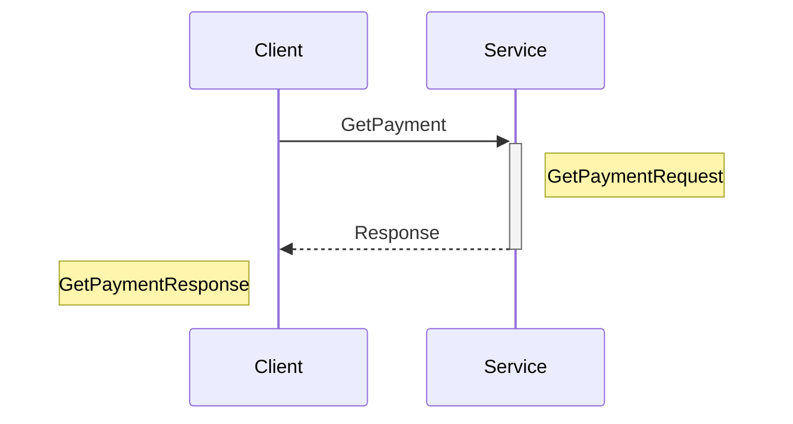

---

### CancelPayment

<a name="cancelpayment"></a>

CancelPayment cancels a pending payment.

#### Method Signature

```protobuf
// Unary RPC
rpc CancelPayment(CancelPaymentRequest) returns (CancelPaymentResponse);
```

#### Method Details

| Attribute | Value |
|-----------|-------|
| **Full Name** | `payments.v1.CancelPayment` |
| **Input Type** | [`CancelPaymentRequest`](#cancelpaymentrequest) |
| **Output Type** | [`CancelPaymentResponse`](#cancelpaymentresponse) |
| **Streaming Type** | Unary |

##### Sequence Diagram

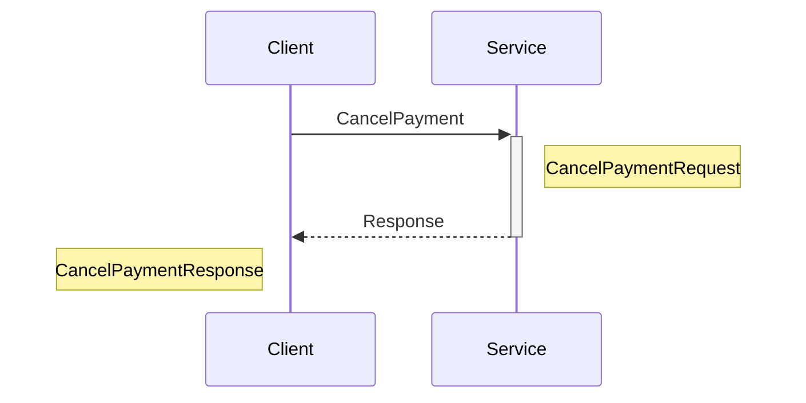

---

### RefundPayment

<a name="refundpayment"></a>

RefundPayment processes a refund.

#### Method Signature

```protobuf
// Unary RPC
rpc RefundPayment(RefundPaymentRequest) returns (RefundPaymentResponse);
```

#### Method Details

| Attribute | Value |
|-----------|-------|
| **Full Name** | `payments.v1.RefundPayment` |
| **Input Type** | [`RefundPaymentRequest`](#refundpaymentrequest) |
| **Output Type** | [`RefundPaymentResponse`](#refundpaymentresponse) |
| **Streaming Type** | Unary |

##### Sequence Diagram

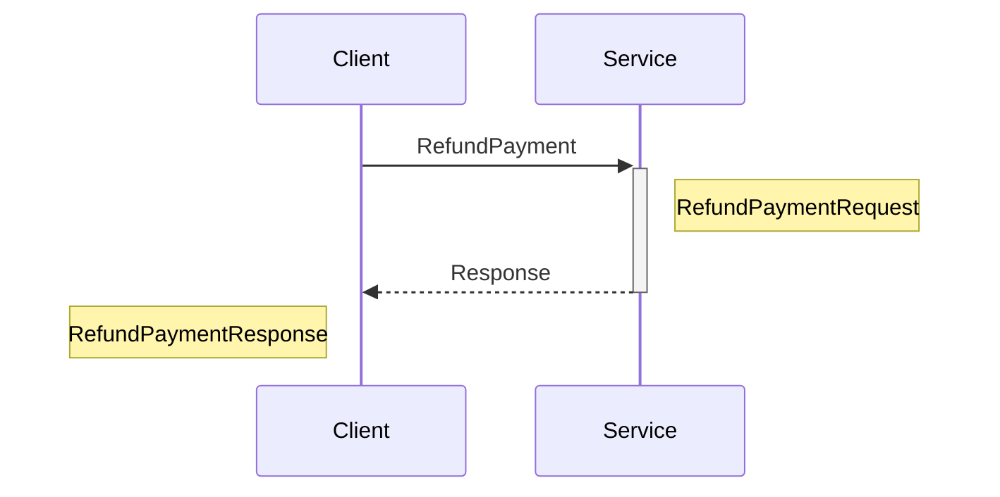

---

### ListPayments

<a name="listpayments"></a>

ListPayments lists payments with filters.

#### Method Signature

```protobuf
// Unary RPC
rpc ListPayments(ListPaymentsRequest) returns (ListPaymentsResponse);
```

#### Method Details

| Attribute | Value |
|-----------|-------|
| **Full Name** | `payments.v1.ListPayments` |
| **Input Type** | [`ListPaymentsRequest`](#listpaymentsrequest) |
| **Output Type** | [`ListPaymentsResponse`](#listpaymentsresponse) |
| **Streaming Type** | Unary |

##### Sequence Diagram


---

### ProcessBatch

<a name="processbatch"></a>

ProcessBatch processes multiple payments. Uses server-side streaming to deliver multiple responses

#### Method Signature

```protobuf
// Server streaming RPC
rpc ProcessBatch(ProcessBatchRequest) returns (stream BatchProcessResult);
```

#### Method Details

| Attribute | Value |
|-----------|-------|
| **Full Name** | `payments.v1.ProcessBatch` |
| **Input Type** | [`ProcessBatchRequest`](#processbatchrequest) |
| **Output Type** | [`BatchProcessResult`](#batchprocessresult) |
| **Streaming Type** | Server Streaming |

##### Sequence Diagram

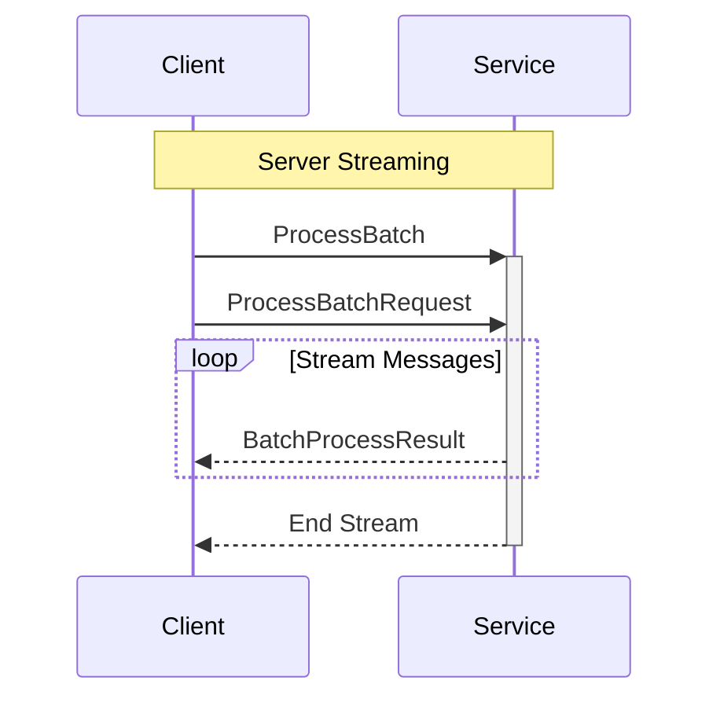

---

### SubscribeToPaymentEvents

<a name="subscribetopaymentevents"></a>

SubscribeToPaymentEvents streams payment events.

#### Method Signature

```protobuf
// Server streaming RPC
rpc SubscribeToPaymentEvents(SubscribeRequest) returns (stream PaymentEvent);
```

#### Method Details

| Attribute | Value |
|-----------|-------|
| **Full Name** | `payments.v1.SubscribeToPaymentEvents` |
| **Input Type** | [`SubscribeRequest`](#subscriberequest) |
| **Output Type** | [`PaymentEvent`](#paymentevent) |
| **Streaming Type** | Server Streaming |

##### Sequence Diagram

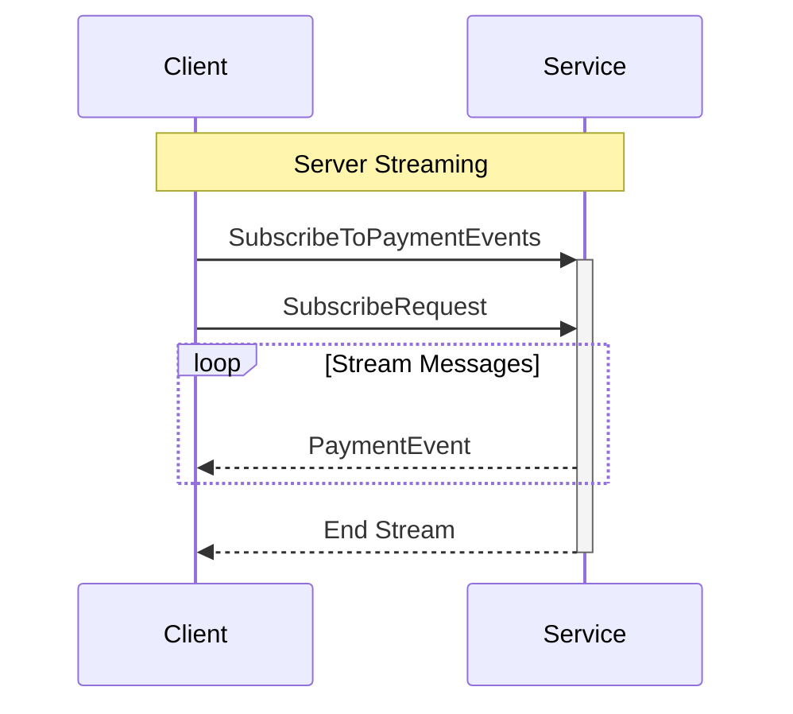

---

## 📦 Messages

<a name="messages"></a>

This service defines **36 message types**:

### SettlementDetails

<a name="settlementdetails"></a>

SettlementDetails contains settlement information.

| Attribute | Value |
|-----------|-------|
| **Full Name** | `payments.v1.SettlementDetails` |
| **Field Count** | 5 |

#### Fields

| # | Name | Type | Label | Description |
|---|------|------|-------|-------------|
| 1 | `status` | [`SettlementStatus`](#settlementstatus) | optional | Settlement status. |
| 2 | `expected_at` | [`Timestamp`](#timestamp) | optional | Expected settlement date. (RFC 3339 timestamp format) |
| 3 | `settled_at` | [`Timestamp`](#timestamp) | optional | Actual settlement date. (RFC 3339 timestamp format) |
| 4 | `batch_id` | string | optional | Settlement batch ID. (Must be a non-empty identifier) |
| 5 | `net_amount` | [`Money`](#money) | optional | Net amount. |

#### Proto Definition

```protobuf
message SettlementDetails {
  // Settlement status.
  optional SettlementStatus status = 1;
  // Expected settlement date. (RFC 3339 timestamp format)
  optional Timestamp expected_at = 2;
  // Actual settlement date. (RFC 3339 timestamp format)
  optional Timestamp settled_at = 3;
  // Settlement batch ID. (Must be a non-empty identifier)
  optional string batch_id = 4;
  // Net amount.
  optional Money net_amount = 5;
}
```

##### Message Structure

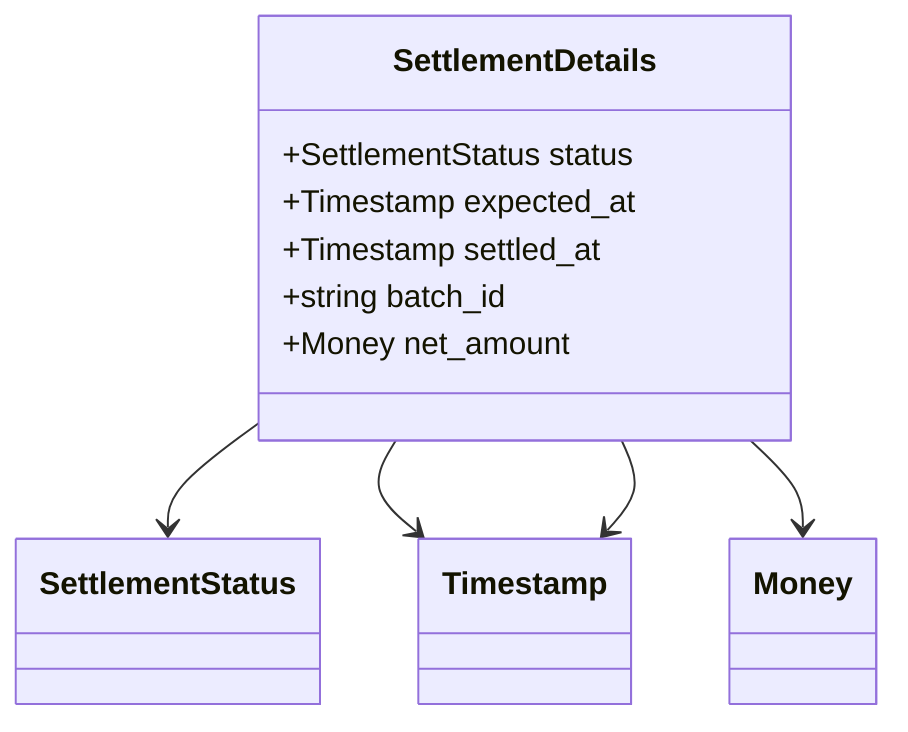

---

### ListPaymentsRequest

<a name="listpaymentsrequest"></a>

ListPaymentsRequest lists payments.

| Attribute | Value |
|-----------|-------|
| **Full Name** | `payments.v1.ListPaymentsRequest` |
| **Field Count** | 6 |

#### Fields

| # | Name | Type | Label | Description |
|---|------|------|-------|-------------|
| 1 | `pagination` | [`PaginationRequest`](#paginationrequest) | optional | Pagination. |
| 2 | `statuses` | [`PaymentStatus`](#paymentstatus) | repeated | Filter by status. |
| 3 | `methods` | [`PaymentMethod`](#paymentmethod) | repeated | Filter by method. |
| 4 | `user_id` | string | optional | Filter by user. (Must be a non-empty identifier) |
| 5 | `date_range` | [`DateRangeFilter`](#daterangefilter) | optional | Date range. |
| 6 | `amount_range` | [`AmountRangeFilter`](#amountrangefilter) | optional | Amount range. |

#### Proto Definition

```protobuf
message ListPaymentsRequest {
  // Pagination.
  optional PaginationRequest pagination = 1;
  // Filter by status.
  repeated PaymentStatus statuses = 2;
  // Filter by method.
  repeated PaymentMethod methods = 3;
  // Filter by user. (Must be a non-empty identifier)
  optional string user_id = 4;
  // Date range.
  optional DateRangeFilter date_range = 5;
  // Amount range.
  optional AmountRangeFilter amount_range = 6;
}
```

##### Message Structure

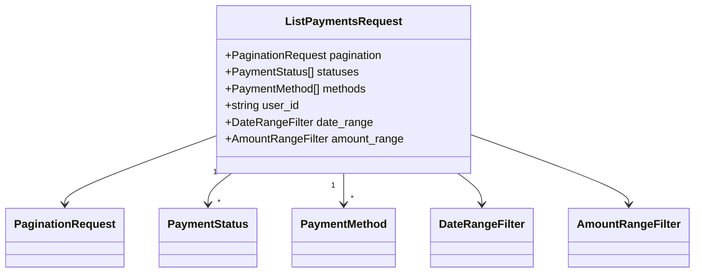

---

### BankAccountSource

<a name="bankaccountsource"></a>

BankAccountSource for bank payments.

| Attribute | Value |
|-----------|-------|
| **Full Name** | `payments.v1.BankAccountSource` |
| **Field Count** | 1 |

#### Fields

| # | Name | Type | Label | Description |
|---|------|------|-------|-------------|
| 1 | `token` | string | optional | Account token. (Sensitive - should be transmitted securely) |

#### Proto Definition

```protobuf
message BankAccountSource {
  // Account token. (Sensitive - should be transmitted securely)
  optional string token = 1;
}
```

##### Message Structure

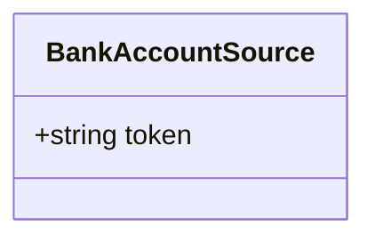

---

### Payment

<a name="payment"></a>

Payment represents a payment transaction.

| Attribute | Value |
|-----------|-------|
| **Full Name** | `payments.v1.Payment` |
| **Field Count** | 23 |
| **Nested Types** | 1 |

#### Fields

| # | Name | Type | Label | Description |
|---|------|------|-------|-------------|
| 1 | `metadata` | [`Metadata`](#metadata) | optional | Payment metadata. |
| 2 | `amount` | [`Money`](#money) | optional | Payment amount. |
| 3 | `method` | [`PaymentMethod`](#paymentmethod) | optional | Payment method. |
| 4 | `status` | [`PaymentStatus`](#paymentstatus) | optional | Payment status. |
| 5 | `type` | [`TransactionType`](#transactiontype) | optional | Transaction type. |
| 6 | `payer` | [`PayerInfo`](#payerinfo) | optional | Payer information. |
| 7 | `payee` | [`PayeeInfo`](#payeeinfo) | optional | Payee information. |
| 8 | `card_details` | [`CardPaymentDetails`](#cardpaymentdetails) | oneof `payment_details` | Card Details (one of multiple options). |
| 9 | `bank_details` | [`BankTransferDetails`](#banktransferdetails) | oneof `payment_details` | Bank Details (one of multiple options). |
| 10 | `wallet_details` | [`WalletPaymentDetails`](#walletpaymentdetails) | oneof `payment_details` | Wallet Details (one of multiple options). |
| 11 | `crypto_details` | [`CryptoPaymentDetails`](#cryptopaymentdetails) | oneof `payment_details` | Crypto Details (one of multiple options). |
| 12 | `order_id` | string | optional | Order reference. (Must be a non-empty identifier) |
| 13 | `invoice_id` | string | optional | Invoice reference. (Must be a non-empty identifier) |
| 14 | `description` | string | optional | Description. |
| 15 | `gateway_reference` | string | optional | Payment gateway reference. |
| 16 | `authorization_code` | string | optional | Authorization code. |
| 17 | `capture` | [`CaptureDetails`](#capturedetails) | optional | Capture details. |
| 18 | `refunds` | [`RefundDetails`](#refunddetails) | repeated | Refund details. |
| 19 | `fraud_check` | [`FraudCheckResult`](#fraudcheckresult) | optional | Fraud check results. |
| 20 | `risk_score` | int32 | optional | Risk score (0-100). |
| 21 | `custom_metadata` | map<string, string> |  | Metadata. |
| 22 | `fees` | [`Fee`](#fee) | repeated | Processing fees. |
| 23 | `settlement` | [`SettlementDetails`](#settlementdetails) | optional | Settlement details. |

#### Proto Definition

```protobuf
message Payment {
  // Payment metadata.
  optional Metadata metadata = 1;
  // Payment amount.
  optional Money amount = 2;
  // Payment method.
  optional PaymentMethod method = 3;
  // Payment status.
  optional PaymentStatus status = 4;
  // Transaction type.
  optional TransactionType type = 5;
  // Payer information.
  optional PayerInfo payer = 6;
  // Payee information.
  optional PayeeInfo payee = 7;
  // Order reference. (Must be a non-empty identifier)
  optional string order_id = 12;
  // Invoice reference. (Must be a non-empty identifier)
  optional string invoice_id = 13;
  // Description.
  optional string description = 14;
  // Payment gateway reference.
  optional string gateway_reference = 15;
  // Authorization code.
  optional string authorization_code = 16;
  // Capture details.
  optional CaptureDetails capture = 17;
  // Refund details.
  repeated RefundDetails refunds = 18;
  // Fraud check results.
  optional FraudCheckResult fraud_check = 19;
  // Risk score (0-100).
  optional int32 risk_score = 20;
  // Metadata.
   map<string, string> custom_metadata = 21;
  // Processing fees.
  repeated Fee fees = 22;
  // Settlement details.
  optional SettlementDetails settlement = 23;

  oneof payment_details {
    // Card Details (one of multiple options).
    CardPaymentDetails card_details = 8;
    // Bank Details (one of multiple options).
    BankTransferDetails bank_details = 9;
    // Wallet Details (one of multiple options).
    WalletPaymentDetails wallet_details = 10;
    // Crypto Details (one of multiple options).
    CryptoPaymentDetails crypto_details = 11;
  }
}
```

##### Message Structure

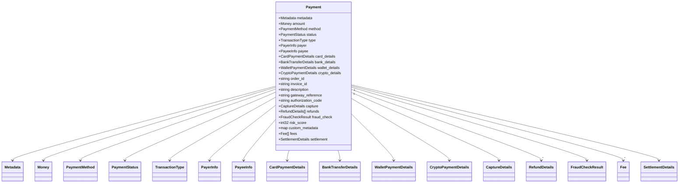

---

### FraudCheckResult

<a name="fraudcheckresult"></a>

FraudCheckResult contains fraud detection results.

| Attribute | Value |
|-----------|-------|
| **Full Name** | `payments.v1.FraudCheckResult` |
| **Field Count** | 5 |

#### Fields

| # | Name | Type | Label | Description |
|---|------|------|-------|-------------|
| 1 | `outcome` | [`FraudCheckOutcome`](#fraudcheckoutcome) | optional | Overall result. |
| 2 | `signals` | [`RiskSignal`](#risksignal) | repeated | Risk signals. |
| 3 | `risk_score` | int32 | optional | Risk score (0-100). |
| 4 | `checked_at` | [`Timestamp`](#timestamp) | optional | Checked at. (RFC 3339 timestamp format) |
| 5 | `provider` | string | optional | Provider. |

#### Proto Definition

```protobuf
message FraudCheckResult {
  // Overall result.
  optional FraudCheckOutcome outcome = 1;
  // Risk signals.
  repeated RiskSignal signals = 2;
  // Risk score (0-100).
  optional int32 risk_score = 3;
  // Checked at. (RFC 3339 timestamp format)
  optional Timestamp checked_at = 4;
  // Provider.
  optional string provider = 5;
}
```

##### Message Structure

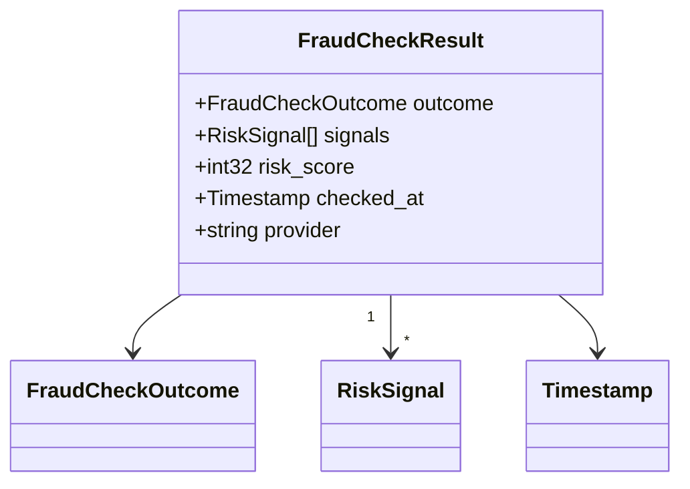

---

### Fee

<a name="fee"></a>

Fee represents a processing fee.

| Attribute | Value |
|-----------|-------|
| **Full Name** | `payments.v1.Fee` |
| **Field Count** | 3 |

#### Fields

| # | Name | Type | Label | Description |
|---|------|------|-------|-------------|
| 1 | `type` | [`FeeType`](#feetype) | optional | Fee type. |
| 2 | `amount` | [`Money`](#money) | optional | Fee amount. |
| 3 | `description` | string | optional | Description. |

#### Proto Definition

```protobuf
message Fee {
  // Fee type.
  optional FeeType type = 1;
  // Fee amount.
  optional Money amount = 2;
  // Description.
  optional string description = 3;
}
```

##### Message Structure

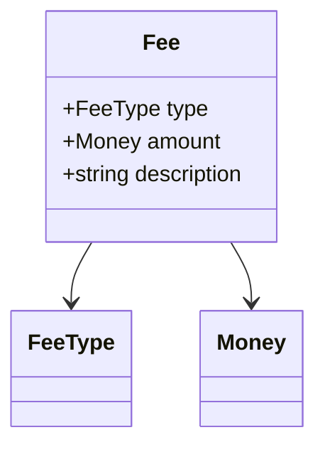

---

### RiskSignal

<a name="risksignal"></a>

RiskSignal represents a risk indicator.

| Attribute | Value |
|-----------|-------|
| **Full Name** | `payments.v1.RiskSignal` |
| **Field Count** | 4 |

#### Fields

| # | Name | Type | Label | Description |
|---|------|------|-------|-------------|
| 1 | `type` | string | optional | Signal type. |
| 2 | `severity` | [`Priority`](#priority) | optional | Signal severity. |
| 3 | `description` | string | optional | Description. |
| 4 | `value` | string | optional | Signal value. |

#### Proto Definition

```protobuf
message RiskSignal {
  // Signal type.
  optional string type = 1;
  // Signal severity.
  optional Priority severity = 2;
  // Description.
  optional string description = 3;
  // Signal value.
  optional string value = 4;
}
```

##### Message Structure

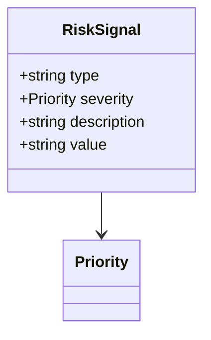

---

### CancelPaymentResponse

<a name="cancelpaymentresponse"></a>

CancelPaymentResponse confirms cancellation.

| Attribute | Value |
|-----------|-------|
| **Full Name** | `payments.v1.CancelPaymentResponse` |
| **Field Count** | 1 |

#### Fields

| # | Name | Type | Label | Description |
|---|------|------|-------|-------------|
| 1 | `payment` | [`Payment`](#payment) | optional | Cancelled payment. |

#### Proto Definition

```protobuf
message CancelPaymentResponse {
  // Cancelled payment.
  optional Payment payment = 1;
}
```

##### Message Structure

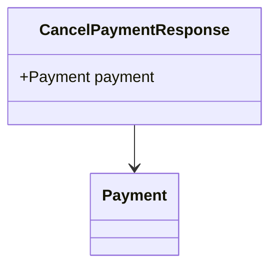

---

### SubscribeRequest

<a name="subscriberequest"></a>

SubscribeRequest subscribes to events.

| Attribute | Value |
|-----------|-------|
| **Full Name** | `payments.v1.SubscribeRequest` |
| **Field Count** | 3 |

#### Fields

| # | Name | Type | Label | Description |
|---|------|------|-------|-------------|
| 1 | `payment_ids` | string | repeated | Filter by payment IDs. |
| 2 | `user_ids` | string | repeated | Filter by user IDs. |
| 3 | `event_types` | [`EventType`](#eventtype) | repeated | Event types to receive. |

#### Proto Definition

```protobuf
message SubscribeRequest {
  // Filter by payment IDs.
  repeated string payment_ids = 1;
  // Filter by user IDs.
  repeated string user_ids = 2;
  // Event types to receive.
  repeated EventType event_types = 3;
}
```

##### Message Structure

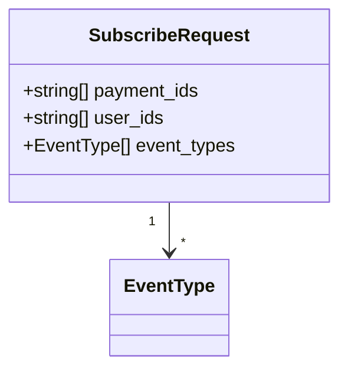

---

### CardPaymentDetails

<a name="cardpaymentdetails"></a>

CardPaymentDetails for card payments.

| Attribute | Value |
|-----------|-------|
| **Full Name** | `payments.v1.CardPaymentDetails` |
| **Field Count** | 7 |

#### Fields

| # | Name | Type | Label | Description |
|---|------|------|-------|-------------|
| 1 | `last_four` | string | optional | Last 4 digits. |
| 2 | `brand` | [`CardBrand`](#cardbrand) | optional | Card brand. |
| 3 | `expiry_month` | int32 | optional | Expiry month. |
| 4 | `expiry_year` | int32 | optional | Expiry year. |
| 5 | `cardholder_name` | string | optional | Cardholder name. |
| 6 | `fingerprint` | string | optional | Card fingerprint. |
| 7 | `three_d_secure` | [`ThreeDSecure`](#threedsecure) | optional | 3DS verification. |

#### Proto Definition

```protobuf
message CardPaymentDetails {
  // Last 4 digits.
  optional string last_four = 1;
  // Card brand.
  optional CardBrand brand = 2;
  // Expiry month.
  optional int32 expiry_month = 3;
  // Expiry year.
  optional int32 expiry_year = 4;
  // Cardholder name.
  optional string cardholder_name = 5;
  // Card fingerprint.
  optional string fingerprint = 6;
  // 3DS verification.
  optional ThreeDSecure three_d_secure = 7;
}
```

##### Message Structure

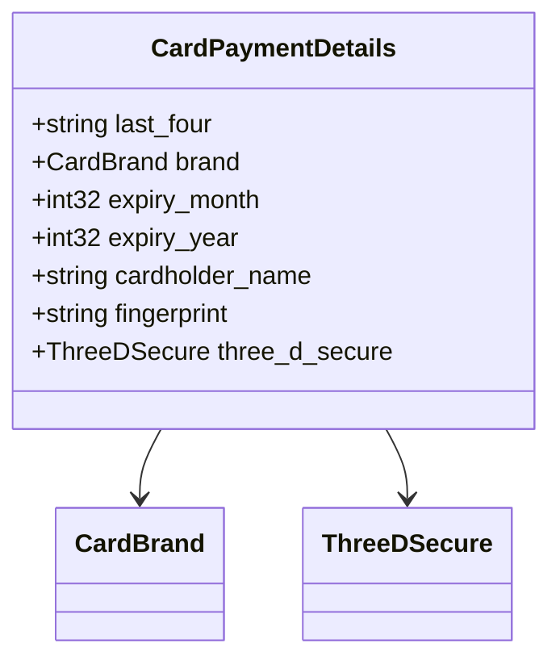

---

### GetPaymentRequest

<a name="getpaymentrequest"></a>

GetPaymentRequest retrieves a payment.

| Attribute | Value |
|-----------|-------|
| **Full Name** | `payments.v1.GetPaymentRequest` |
| **Field Count** | 1 |

#### Fields

| # | Name | Type | Label | Description |
|---|------|------|-------|-------------|
| 1 | `payment_id` | string | optional | Payment ID. (Must be a non-empty identifier) |

#### Proto Definition

```protobuf
message GetPaymentRequest {
  // Payment ID. (Must be a non-empty identifier)
  optional string payment_id = 1;
}
```

##### Message Structure

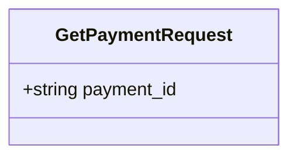

---

### BatchProcessResult

<a name="batchprocessresult"></a>

BatchProcessResult streams results.

| Attribute | Value |
|-----------|-------|
| **Full Name** | `payments.v1.BatchProcessResult` |
| **Field Count** | 4 |

#### Fields

| # | Name | Type | Label | Description |
|---|------|------|-------|-------------|
| 1 | `index` | int32 | optional | Index in batch. |
| 2 | `success` | bool | optional | Success status. |
| 3 | `payment` | [`Payment`](#payment) | optional | Payment result. |
| 4 | `error` | [`Error`](#error) | optional | Error if failed. |

#### Proto Definition

```protobuf
message BatchProcessResult {
  // Index in batch.
  optional int32 index = 1;
  // Success status.
  optional bool success = 2;
  // Payment result.
  optional Payment payment = 3;
  // Error if failed.
  optional Error error = 4;
}
```

##### Message Structure

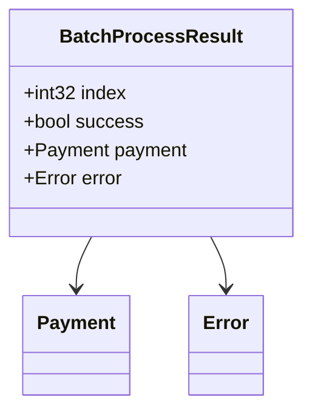

---

### CryptoSource

<a name="cryptosource"></a>

CryptoSource for crypto payments.

| Attribute | Value |
|-----------|-------|
| **Full Name** | `payments.v1.CryptoSource` |
| **Field Count** | 2 |

#### Fields

| # | Name | Type | Label | Description |
|---|------|------|-------|-------------|
| 1 | `crypto_type` | [`CryptoType`](#cryptotype) | optional | Crypto type. |
| 2 | `wallet_address` | string | optional | Wallet address. |

#### Proto Definition

```protobuf
message CryptoSource {
  // Crypto type.
  optional CryptoType crypto_type = 1;
  // Wallet address.
  optional string wallet_address = 2;
}
```

##### Message Structure

```mermaid
classDiagram
    class CryptoSource {
        +CryptoType crypto_type
        +string wallet_address
    }
    CryptoSource --> CryptoType
```

---

### PaymentSummary

<a name="paymentsummary"></a>

PaymentSummary contains aggregate statistics.

| Attribute | Value |
|-----------|-------|
| **Full Name** | `payments.v1.PaymentSummary` |
| **Field Count** | 4 |
| **Nested Types** | 2 |

#### Fields

| # | Name | Type | Label | Description |
|---|------|------|-------|-------------|
| 1 | `total_count` | int64 | optional | Total count Must be >= 0. |
| 2 | `total_amount` | [`Money`](#money) | optional | Total amount. |
| 3 | `status_counts` | map<string, int64> |  | Status breakdown Must be >= 0. |
| 4 | `method_counts` | map<string, int64> |  | Method breakdown Must be >= 0. |

#### Proto Definition

```protobuf
message PaymentSummary {
  // Total count Must be >= 0.
  optional int64 total_count = 1;
  // Total amount.
  optional Money total_amount = 2;
  // Status breakdown Must be >= 0.
   map<string, int64> status_counts = 3;
  // Method breakdown Must be >= 0.
   map<string, int64> method_counts = 4;
}
```

##### Message Structure

```mermaid
classDiagram
    class PaymentSummary {
        +int64 total_count
        +Money total_amount
        +map<string, int64> status_counts
        +map<string, int64> method_counts
    }
    PaymentSummary --> Money
```

---

### CreatePaymentRequest

<a name="createpaymentrequest"></a>

CreatePaymentRequest initiates a payment.

| Attribute | Value |
|-----------|-------|
| **Full Name** | `payments.v1.CreatePaymentRequest` |
| **Field Count** | 12 |
| **Nested Types** | 1 |

#### Fields

| # | Name | Type | Label | Description |
|---|------|------|-------|-------------|
| 1 | `amount` | [`Money`](#money) | optional | Amount to charge. |
| 2 | `method` | [`PaymentMethod`](#paymentmethod) | optional | Payment method. |
| 3 | `payer` | [`PayerInfo`](#payerinfo) | optional | Payer information. |
| 4 | `card_source` | [`CardSource`](#cardsource) | oneof `source` | Card Source (one of multiple options). |
| 5 | `bank_source` | [`BankAccountSource`](#bankaccountsource) | oneof `source` | Bank Source (one of multiple options). |
| 6 | `wallet_source` | [`WalletSource`](#walletsource) | oneof `source` | Wallet Source (one of multiple options). |
| 7 | `crypto_source` | [`CryptoSource`](#cryptosource) | oneof `source` | Crypto Source (one of multiple options). |
| 8 | `order_id` | string | optional | Order ID. (Must be a non-empty identifier) |
| 9 | `description` | string | optional | Description. |
| 10 | `auto_capture` | bool | optional | Capture immediately. |
| 11 | `idempotency_key` | string | optional | Idempotency key. |
| 12 | `metadata` | map<string, string> |  | Custom metadata. |

#### Proto Definition

```protobuf
message CreatePaymentRequest {
  // Amount to charge.
  optional Money amount = 1;
  // Payment method.
  optional PaymentMethod method = 2;
  // Payer information.
  optional PayerInfo payer = 3;
  // Order ID. (Must be a non-empty identifier)
  optional string order_id = 8;
  // Description.
  optional string description = 9;
  // Capture immediately.
  optional bool auto_capture = 10;
  // Idempotency key.
  optional string idempotency_key = 11;
  // Custom metadata.
   map<string, string> metadata = 12;

  oneof source {
    // Card Source (one of multiple options).
    CardSource card_source = 4;
    // Bank Source (one of multiple options).
    BankAccountSource bank_source = 5;
    // Wallet Source (one of multiple options).
    WalletSource wallet_source = 6;
    // Crypto Source (one of multiple options).
    CryptoSource crypto_source = 7;
  }
}
```

##### Message Structure

```mermaid
classDiagram
    class CreatePaymentRequest {
        +Money amount
        +PaymentMethod method
        +PayerInfo payer
        +CardSource card_source
        +BankAccountSource bank_source
        +WalletSource wallet_source
        +CryptoSource crypto_source
        +string order_id
        +string description
        +bool auto_capture
        +string idempotency_key
        +map<string, string> metadata
    }
    CreatePaymentRequest --> Money
    CreatePaymentRequest --> PaymentMethod
    CreatePaymentRequest --> PayerInfo
    CreatePaymentRequest --> CardSource
    CreatePaymentRequest --> BankAccountSource
    CreatePaymentRequest --> WalletSource
    CreatePaymentRequest --> CryptoSource
```

---

### GetPaymentResponse

<a name="getpaymentresponse"></a>

GetPaymentResponse returns payment details.

| Attribute | Value |
|-----------|-------|
| **Full Name** | `payments.v1.GetPaymentResponse` |
| **Field Count** | 1 |

#### Fields

| # | Name | Type | Label | Description |
|---|------|------|-------|-------------|
| 1 | `payment` | [`Payment`](#payment) | optional | Payment. |

#### Proto Definition

```protobuf
message GetPaymentResponse {
  // Payment.
  optional Payment payment = 1;
}
```

##### Message Structure

```mermaid
classDiagram
    class GetPaymentResponse {
        +Payment payment
    }
    GetPaymentResponse --> Payment
```

---

### AmountRangeFilter

<a name="amountrangefilter"></a>

AmountRangeFilter filters by amount.

| Attribute | Value |
|-----------|-------|
| **Full Name** | `payments.v1.AmountRangeFilter` |
| **Field Count** | 2 |

#### Fields

| # | Name | Type | Label | Description |
|---|------|------|-------|-------------|
| 1 | `min` | [`Money`](#money) | optional | Minimum amount. |
| 2 | `max` | [`Money`](#money) | optional | Maximum amount. |

#### Proto Definition

```protobuf
message AmountRangeFilter {
  // Minimum amount.
  optional Money min = 1;
  // Maximum amount.
  optional Money max = 2;
}
```

##### Message Structure

```mermaid
classDiagram
    class AmountRangeFilter {
        +Money min
        +Money max
    }
    AmountRangeFilter --> Money
    AmountRangeFilter --> Money
```

---

### CreatePaymentResponse

<a name="createpaymentresponse"></a>

CreatePaymentResponse returns created payment.

| Attribute | Value |
|-----------|-------|
| **Full Name** | `payments.v1.CreatePaymentResponse` |
| **Field Count** | 3 |

#### Fields

| # | Name | Type | Label | Description |
|---|------|------|-------|-------------|
| 1 | `payment` | [`Payment`](#payment) | optional | Created payment. |
| 2 | `client_secret` | string | optional | Client secret for confirmation. |
| 3 | `next_action` | [`NextAction`](#nextaction) | optional | Next action required. |

#### Proto Definition

```protobuf
message CreatePaymentResponse {
  // Created payment.
  optional Payment payment = 1;
  // Client secret for confirmation.
  optional string client_secret = 2;
  // Next action required.
  optional NextAction next_action = 3;
}
```

##### Message Structure

```mermaid
classDiagram
    class CreatePaymentResponse {
        +Payment payment
        +string client_secret
        +NextAction next_action
    }
    CreatePaymentResponse --> Payment
    CreatePaymentResponse --> NextAction
```

---

### CancelPaymentRequest

<a name="cancelpaymentrequest"></a>

CancelPaymentRequest cancels a payment.

| Attribute | Value |
|-----------|-------|
| **Full Name** | `payments.v1.CancelPaymentRequest` |
| **Field Count** | 2 |

#### Fields

| # | Name | Type | Label | Description |
|---|------|------|-------|-------------|
| 1 | `payment_id` | string | optional | Payment ID. (Must be a non-empty identifier) |
| 2 | `reason` | string | optional | Cancellation reason. |

#### Proto Definition

```protobuf
message CancelPaymentRequest {
  // Payment ID. (Must be a non-empty identifier)
  optional string payment_id = 1;
  // Cancellation reason.
  optional string reason = 2;
}
```

##### Message Structure

```mermaid
classDiagram
    class CancelPaymentRequest {
        +string payment_id
        +string reason
    }
```

---

### PaymentEvent

<a name="paymentevent"></a>

PaymentEvent represents a payment event.

| Attribute | Value |
|-----------|-------|
| **Full Name** | `payments.v1.PaymentEvent` |
| **Field Count** | 4 |
| **Nested Types** | 1 |

#### Fields

| # | Name | Type | Label | Description |
|---|------|------|-------|-------------|
| 1 | `event_type` | [`EventType`](#eventtype) | optional | Event type. |
| 2 | `payment` | [`Payment`](#payment) | optional | Payment. |
| 3 | `event_time` | [`Timestamp`](#timestamp) | optional | Event timestamp. |
| 4 | `metadata` | map<string, string> |  | Event metadata. |

#### Proto Definition

```protobuf
message PaymentEvent {
  // Event type.
  optional EventType event_type = 1;
  // Payment.
  optional Payment payment = 2;
  // Event timestamp.
  optional Timestamp event_time = 3;
  // Event metadata.
   map<string, string> metadata = 4;
}
```

##### Message Structure

```mermaid
classDiagram
    class PaymentEvent {
        +EventType event_type
        +Payment payment
        +Timestamp event_time
        +map<string, string> metadata
    }
    PaymentEvent --> EventType
    PaymentEvent --> Payment
    PaymentEvent --> Timestamp
```

---

### PayerInfo

<a name="payerinfo"></a>

PayerInfo contains payer information.

| Attribute | Value |
|-----------|-------|
| **Full Name** | `payments.v1.PayerInfo` |
| **Field Count** | 7 |

#### Fields

| # | Name | Type | Label | Description |
|---|------|------|-------|-------------|
| 1 | `user_id` | string | optional | User ID. (Must be a non-empty identifier) |
| 2 | `email` | string | optional | Email. (Must be a valid email address format) |
| 3 | `name` | string | optional | Name. |
| 4 | `phone` | string | optional | Phone. (Should follow E.164 format) |
| 5 | `billing_address` | [`Address`](#address) | optional | Billing address. |
| 6 | `ip_address` | string | optional | IP address. |
| 7 | `device_fingerprint` | string | optional | Device fingerprint. |

#### Proto Definition

```protobuf
message PayerInfo {
  // User ID. (Must be a non-empty identifier)
  optional string user_id = 1;
  // Email. (Must be a valid email address format)
  optional string email = 2;
  // Name.
  optional string name = 3;
  // Phone. (Should follow E.164 format)
  optional string phone = 4;
  // Billing address.
  optional Address billing_address = 5;
  // IP address.
  optional string ip_address = 6;
  // Device fingerprint.
  optional string device_fingerprint = 7;
}
```

##### Message Structure

```mermaid
classDiagram
    class PayerInfo {
        +string user_id
        +string email
        +string name
        +string phone
        +Address billing_address
        +string ip_address
        +string device_fingerprint
    }
    PayerInfo --> Address
```

---

### CardSource

<a name="cardsource"></a>

CardSource for card payments.

| Attribute | Value |
|-----------|-------|
| **Full Name** | `payments.v1.CardSource` |
| **Field Count** | 2 |

#### Fields

| # | Name | Type | Label | Description |
|---|------|------|-------|-------------|
| 1 | `token` | string | optional | Card token. (Sensitive - should be transmitted securely) |
| 2 | `save_card` | bool | optional | Save card for future use. |

#### Proto Definition

```protobuf
message CardSource {
  // Card token. (Sensitive - should be transmitted securely)
  optional string token = 1;
  // Save card for future use.
  optional bool save_card = 2;
}
```

##### Message Structure

```mermaid
classDiagram
    class CardSource {
        +string token
        +bool save_card
    }
```

---

### NextAction

<a name="nextaction"></a>

NextAction represents required next steps.

| Attribute | Value |
|-----------|-------|
| **Full Name** | `payments.v1.NextAction` |
| **Field Count** | 3 |
| **Nested Types** | 1 |

#### Fields

| # | Name | Type | Label | Description |
|---|------|------|-------|-------------|
| 1 | `type` | [`ActionType`](#actiontype) | optional | Action type. |
| 2 | `redirect_url` | string | optional | Redirect URL for 3DS. (Must be a valid URL) |
| 3 | `data` | map<string, string> |  | Additional data. |

#### Proto Definition

```protobuf
message NextAction {
  // Action type.
  optional ActionType type = 1;
  // Redirect URL for 3DS. (Must be a valid URL)
  optional string redirect_url = 2;
  // Additional data.
   map<string, string> data = 3;
}
```

##### Message Structure

```mermaid
classDiagram
    class NextAction {
        +ActionType type
        +string redirect_url
        +map<string, string> data
    }
    NextAction --> ActionType
```

---

### ThreeDSecure

<a name="threedsecure"></a>

ThreeDSecure contains 3DS verification info.

| Attribute | Value |
|-----------|-------|
| **Full Name** | `payments.v1.ThreeDSecure` |
| **Field Count** | 4 |

#### Fields

| # | Name | Type | Label | Description |
|---|------|------|-------|-------------|
| 1 | `verified` | bool | optional | Verification performed. |
| 2 | `version` | string | optional | Version (1 or 2). |
| 3 | `authentication_value` | string | optional | Authentication value. |
| 4 | `transaction_id` | string | optional | Transaction ID. (Must be a non-empty identifier) |

#### Proto Definition

```protobuf
message ThreeDSecure {
  // Verification performed.
  optional bool verified = 1;
  // Version (1 or 2).
  optional string version = 2;
  // Authentication value.
  optional string authentication_value = 3;
  // Transaction ID. (Must be a non-empty identifier)
  optional string transaction_id = 4;
}
```

##### Message Structure

```mermaid
classDiagram
    class ThreeDSecure {
        +bool verified
        +string version
        +string authentication_value
        +string transaction_id
    }
```

---

### RefundPaymentResponse

<a name="refundpaymentresponse"></a>

RefundPaymentResponse confirms refund.

| Attribute | Value |
|-----------|-------|
| **Full Name** | `payments.v1.RefundPaymentResponse` |
| **Field Count** | 2 |

#### Fields

| # | Name | Type | Label | Description |
|---|------|------|-------|-------------|
| 1 | `payment` | [`Payment`](#payment) | optional | Updated payment. |
| 2 | `refund` | [`RefundDetails`](#refunddetails) | optional | Refund details. |

#### Proto Definition

```protobuf
message RefundPaymentResponse {
  // Updated payment.
  optional Payment payment = 1;
  // Refund details.
  optional RefundDetails refund = 2;
}
```

##### Message Structure

```mermaid
classDiagram
    class RefundPaymentResponse {
        +Payment payment
        +RefundDetails refund
    }
    RefundPaymentResponse --> Payment
    RefundPaymentResponse --> RefundDetails
```

---

### ListPaymentsResponse

<a name="listpaymentsresponse"></a>

ListPaymentsResponse returns payments.

| Attribute | Value |
|-----------|-------|
| **Full Name** | `payments.v1.ListPaymentsResponse` |
| **Field Count** | 3 |

#### Fields

| # | Name | Type | Label | Description |
|---|------|------|-------|-------------|
| 1 | `payments` | [`Payment`](#payment) | repeated | Payments. |
| 2 | `pagination` | [`PaginationResponse`](#paginationresponse) | optional | Pagination. |
| 3 | `summary` | [`PaymentSummary`](#paymentsummary) | optional | Summary statistics. |

#### Proto Definition

```protobuf
message ListPaymentsResponse {
  // Payments.
  repeated Payment payments = 1;
  // Pagination.
  optional PaginationResponse pagination = 2;
  // Summary statistics.
  optional PaymentSummary summary = 3;
}
```

##### Message Structure

```mermaid
classDiagram
    class ListPaymentsResponse {
        +Payment[] payments
        +PaginationResponse pagination
        +PaymentSummary summary
    }
    ListPaymentsResponse "1" --> "*" Payment
    ListPaymentsResponse --> PaginationResponse
    ListPaymentsResponse --> PaymentSummary
```

---

### ProcessBatchRequest

<a name="processbatchrequest"></a>

ProcessBatchRequest processes multiple payments.

| Attribute | Value |
|-----------|-------|
| **Full Name** | `payments.v1.ProcessBatchRequest` |
| **Field Count** | 3 |

#### Fields

| # | Name | Type | Label | Description |
|---|------|------|-------|-------------|
| 1 | `payments` | [`CreatePaymentRequest`](#createpaymentrequest) | repeated | Batch payments. |
| 2 | `batch_id` | string | optional | Batch ID. (Must be a non-empty identifier) |
| 3 | `continue_on_error` | bool | optional | Continue on error. |

#### Proto Definition

```protobuf
message ProcessBatchRequest {
  // Batch payments.
  repeated CreatePaymentRequest payments = 1;
  // Batch ID. (Must be a non-empty identifier)
  optional string batch_id = 2;
  // Continue on error.
  optional bool continue_on_error = 3;
}
```

##### Message Structure

```mermaid
classDiagram
    class ProcessBatchRequest {
        +CreatePaymentRequest[] payments
        +string batch_id
        +bool continue_on_error
    }
    ProcessBatchRequest "1" --> "*" CreatePaymentRequest
```

---

### BankTransferDetails

<a name="banktransferdetails"></a>

BankTransferDetails for bank transfers.

| Attribute | Value |
|-----------|-------|
| **Full Name** | `payments.v1.BankTransferDetails` |
| **Field Count** | 6 |

#### Fields

| # | Name | Type | Label | Description |
|---|------|------|-------|-------------|
| 1 | `account_holder` | string | optional | Account holder name Must be >= 0. |
| 2 | `account_number_masked` | string | optional | Account number (masked) Must be >= 0. |
| 3 | `routing_number` | string | optional | Routing number. |
| 4 | `bank_name` | string | optional | Bank name. |
| 5 | `swift_code` | string | optional | Swift/BIC code. |
| 6 | `iban` | string | optional | IBAN. |

#### Proto Definition

```protobuf
message BankTransferDetails {
  // Account holder name Must be >= 0.
  optional string account_holder = 1;
  // Account number (masked) Must be >= 0.
  optional string account_number_masked = 2;
  // Routing number.
  optional string routing_number = 3;
  // Bank name.
  optional string bank_name = 4;
  // Swift/BIC code.
  optional string swift_code = 5;
  // IBAN.
  optional string iban = 6;
}
```

##### Message Structure

```mermaid
classDiagram
    class BankTransferDetails {
        +string account_holder
        +string account_number_masked
        +string routing_number
        +string bank_name
        +string swift_code
        +string iban
    }
```

---

### WalletSource

<a name="walletsource"></a>

WalletSource for wallet payments.

| Attribute | Value |
|-----------|-------|
| **Full Name** | `payments.v1.WalletSource` |
| **Field Count** | 2 |

#### Fields

| # | Name | Type | Label | Description |
|---|------|------|-------|-------------|
| 1 | `provider` | [`WalletProvider`](#walletprovider) | optional | Wallet provider. |
| 2 | `token` | string | optional | Wallet token. (Sensitive - should be transmitted securely) |

#### Proto Definition

```protobuf
message WalletSource {
  // Wallet provider.
  optional WalletProvider provider = 1;
  // Wallet token. (Sensitive - should be transmitted securely)
  optional string token = 2;
}
```

##### Message Structure

```mermaid
classDiagram
    class WalletSource {
        +WalletProvider provider
        +string token
    }
    WalletSource --> WalletProvider
```

---

### RefundDetails

<a name="refunddetails"></a>

RefundDetails contains refund information.

| Attribute | Value |
|-----------|-------|
| **Full Name** | `payments.v1.RefundDetails` |
| **Field Count** | 6 |

#### Fields

| # | Name | Type | Label | Description |
|---|------|------|-------|-------------|
| 1 | `refund_id` | string | optional | Refund ID. (Must be a non-empty identifier) |
| 2 | `amount` | [`Money`](#money) | optional | Refund amount. |
| 3 | `reason` | string | optional | Refund reason. |
| 4 | `status` | [`RefundStatus`](#refundstatus) | optional | Refund status. |
| 5 | `refunded_at` | [`Timestamp`](#timestamp) | optional | Refund timestamp. (RFC 3339 timestamp format) |
| 6 | `expected_arrival` | [`Timestamp`](#timestamp) | optional | Expected arrival. |

#### Proto Definition

```protobuf
message RefundDetails {
  // Refund ID. (Must be a non-empty identifier)
  optional string refund_id = 1;
  // Refund amount.
  optional Money amount = 2;
  // Refund reason.
  optional string reason = 3;
  // Refund status.
  optional RefundStatus status = 4;
  // Refund timestamp. (RFC 3339 timestamp format)
  optional Timestamp refunded_at = 5;
  // Expected arrival.
  optional Timestamp expected_arrival = 6;
}
```

##### Message Structure

```mermaid
classDiagram
    class RefundDetails {
        +string refund_id
        +Money amount
        +string reason
        +RefundStatus status
        +Timestamp refunded_at
        +Timestamp expected_arrival
    }
    RefundDetails --> Money
    RefundDetails --> RefundStatus
    RefundDetails --> Timestamp
    RefundDetails --> Timestamp
```

---

### DateRangeFilter

<a name="daterangefilter"></a>

DateRangeFilter filters by date range.

| Attribute | Value |
|-----------|-------|
| **Full Name** | `payments.v1.DateRangeFilter` |
| **Field Count** | 3 |

#### Fields

| # | Name | Type | Label | Description |
|---|------|------|-------|-------------|
| 1 | `start` | [`Timestamp`](#timestamp) | optional | Start date. |
| 2 | `end` | [`Timestamp`](#timestamp) | optional | End date. |
| 3 | `field` | string | optional | Field to filter. |

#### Proto Definition

```protobuf
message DateRangeFilter {
  // Start date.
  optional Timestamp start = 1;
  // End date.
  optional Timestamp end = 2;
  // Field to filter.
  optional string field = 3;
}
```

##### Message Structure

```mermaid
classDiagram
    class DateRangeFilter {
        +Timestamp start
        +Timestamp end
        +string field
    }
    DateRangeFilter --> Timestamp
    DateRangeFilter --> Timestamp
```

---

### WalletPaymentDetails

<a name="walletpaymentdetails"></a>

WalletPaymentDetails for digital wallets.

| Attribute | Value |
|-----------|-------|
| **Full Name** | `payments.v1.WalletPaymentDetails` |
| **Field Count** | 3 |

#### Fields

| # | Name | Type | Label | Description |
|---|------|------|-------|-------------|
| 1 | `provider` | [`WalletProvider`](#walletprovider) | optional | Wallet provider. |
| 2 | `account_id` | string | optional | Wallet account ID. (Must be a non-empty identifier) Must be >= 0. |
| 3 | `email` | string | optional | Wallet email. (Must be a valid email address format) |

#### Proto Definition

```protobuf
message WalletPaymentDetails {
  // Wallet provider.
  optional WalletProvider provider = 1;
  // Wallet account ID. (Must be a non-empty identifier) Must be >= 0.
  optional string account_id = 2;
  // Wallet email. (Must be a valid email address format)
  optional string email = 3;
}
```

##### Message Structure

```mermaid
classDiagram
    class WalletPaymentDetails {
        +WalletProvider provider
        +string account_id
        +string email
    }
    WalletPaymentDetails --> WalletProvider
```

---

### CaptureDetails

<a name="capturedetails"></a>

CaptureDetails contains capture information.

| Attribute | Value |
|-----------|-------|
| **Full Name** | `payments.v1.CaptureDetails` |
| **Field Count** | 4 |

#### Fields

| # | Name | Type | Label | Description |
|---|------|------|-------|-------------|
| 1 | `amount` | [`Money`](#money) | optional | Captured amount. |
| 2 | `captured_at` | [`Timestamp`](#timestamp) | optional | Capture timestamp. (RFC 3339 timestamp format) |
| 3 | `partial` | bool | optional | Is partial capture. |
| 4 | `remaining_amount` | [`Money`](#money) | optional | Remaining amount. |

#### Proto Definition

```protobuf
message CaptureDetails {
  // Captured amount.
  optional Money amount = 1;
  // Capture timestamp. (RFC 3339 timestamp format)
  optional Timestamp captured_at = 2;
  // Is partial capture.
  optional bool partial = 3;
  // Remaining amount.
  optional Money remaining_amount = 4;
}
```

##### Message Structure

```mermaid
classDiagram
    class CaptureDetails {
        +Money amount
        +Timestamp captured_at
        +bool partial
        +Money remaining_amount
    }
    CaptureDetails --> Money
    CaptureDetails --> Timestamp
    CaptureDetails --> Money
```

---

### RefundPaymentRequest

<a name="refundpaymentrequest"></a>

RefundPaymentRequest processes a refund.

| Attribute | Value |
|-----------|-------|
| **Full Name** | `payments.v1.RefundPaymentRequest` |
| **Field Count** | 4 |
| **Nested Types** | 1 |

#### Fields

| # | Name | Type | Label | Description |
|---|------|------|-------|-------------|
| 1 | `payment_id` | string | optional | Payment ID. (Must be a non-empty identifier) |
| 2 | `amount` | [`Money`](#money) | optional | Refund amount (null for full refund). |
| 3 | `reason` | string | optional | Refund reason. |
| 4 | `metadata` | map<string, string> |  | Refund metadata. |

#### Proto Definition

```protobuf
message RefundPaymentRequest {
  // Payment ID. (Must be a non-empty identifier)
  optional string payment_id = 1;
  // Refund amount (null for full refund).
  optional Money amount = 2;
  // Refund reason.
  optional string reason = 3;
  // Refund metadata.
   map<string, string> metadata = 4;
}
```

##### Message Structure

```mermaid
classDiagram
    class RefundPaymentRequest {
        +string payment_id
        +Money amount
        +string reason
        +map<string, string> metadata
    }
    RefundPaymentRequest --> Money
```

---

### PayeeInfo

<a name="payeeinfo"></a>

PayeeInfo contains payee information.

| Attribute | Value |
|-----------|-------|
| **Full Name** | `payments.v1.PayeeInfo` |
| **Field Count** | 4 |

#### Fields

| # | Name | Type | Label | Description |
|---|------|------|-------|-------------|
| 1 | `merchant_id` | string | optional | Merchant ID. (Must be a non-empty identifier) |
| 2 | `merchant_name` | string | optional | Merchant name. |
| 3 | `account_number` | string | optional | Account number Must be >= 0. |
| 4 | `address` | [`Address`](#address) | optional | Business address. |

#### Proto Definition

```protobuf
message PayeeInfo {
  // Merchant ID. (Must be a non-empty identifier)
  optional string merchant_id = 1;
  // Merchant name.
  optional string merchant_name = 2;
  // Account number Must be >= 0.
  optional string account_number = 3;
  // Business address.
  optional Address address = 4;
}
```

##### Message Structure

```mermaid
classDiagram
    class PayeeInfo {
        +string merchant_id
        +string merchant_name
        +string account_number
        +Address address
    }
    PayeeInfo --> Address
```

---

### CryptoPaymentDetails

<a name="cryptopaymentdetails"></a>

CryptoPaymentDetails for cryptocurrency.

| Attribute | Value |
|-----------|-------|
| **Full Name** | `payments.v1.CryptoPaymentDetails` |
| **Field Count** | 5 |

#### Fields

| # | Name | Type | Label | Description |
|---|------|------|-------|-------------|
| 1 | `crypto_type` | [`CryptoType`](#cryptotype) | optional | Cryptocurrency type. |
| 2 | `wallet_address` | string | optional | Wallet address. |
| 3 | `transaction_hash` | string | optional | Transaction hash. |
| 4 | `network` | string | optional | Network. |
| 5 | `confirmations` | int32 | optional | Confirmations. |

#### Proto Definition

```protobuf
message CryptoPaymentDetails {
  // Cryptocurrency type.
  optional CryptoType crypto_type = 1;
  // Wallet address.
  optional string wallet_address = 2;
  // Transaction hash.
  optional string transaction_hash = 3;
  // Network.
  optional string network = 4;
  // Confirmations.
  optional int32 confirmations = 5;
}
```

##### Message Structure

```mermaid
classDiagram
    class CryptoPaymentDetails {
        +CryptoType crypto_type
        +string wallet_address
        +string transaction_hash
        +string network
        +int32 confirmations
    }
    CryptoPaymentDetails --> CryptoType
```

---

## 🔢 Enumerations

<a name="enumerations"></a>

This service defines **12 enumeration types**:

### RefundStatus

<a name="refundstatus"></a>

RefundStatus represents refund status.

| Value | Number | Description |
|-------|--------|-------------|
| `REFUND_STATUS_UNSPECIFIED` | 0 | REFUND_STATUS_UNSPECIFIED value. |
| `REFUND_STATUS_PENDING` | 1 | REFUND_STATUS_PENDING value. |
| `REFUND_STATUS_PROCESSING` | 2 | REFUND_STATUS_PROCESSING value. |
| `REFUND_STATUS_COMPLETED` | 3 | REFUND_STATUS_COMPLETED value. |
| `REFUND_STATUS_FAILED` | 4 | REFUND_STATUS_FAILED value. |
| `REFUND_STATUS_CANCELLED` | 5 | REFUND_STATUS_CANCELLED value. |

#### Proto Definition

```protobuf
enum RefundStatus {
  // REFUND_STATUS_UNSPECIFIED value.
  REFUND_STATUS_UNSPECIFIED = 0;
  // REFUND_STATUS_PENDING value.
  REFUND_STATUS_PENDING = 1;
  // REFUND_STATUS_PROCESSING value.
  REFUND_STATUS_PROCESSING = 2;
  // REFUND_STATUS_COMPLETED value.
  REFUND_STATUS_COMPLETED = 3;
  // REFUND_STATUS_FAILED value.
  REFUND_STATUS_FAILED = 4;
  // REFUND_STATUS_CANCELLED value.
  REFUND_STATUS_CANCELLED = 5;
}
```

---

### FeeType

<a name="feetype"></a>

FeeType represents fee types.

| Value | Number | Description |
|-------|--------|-------------|
| `FEE_TYPE_UNSPECIFIED` | 0 | FEE_TYPE_UNSPECIFIED value. |
| `FEE_TYPE_PROCESSING` | 1 | FEE_TYPE_PROCESSING value. |
| `FEE_TYPE_TRANSACTION` | 2 | FEE_TYPE_TRANSACTION value. |
| `FEE_TYPE_CURRENCY_CONVERSION` | 3 | FEE_TYPE_CURRENCY_CONVERSION value. |
| `FEE_TYPE_CROSS_BORDER` | 4 | FEE_TYPE_CROSS_BORDER value. |
| `FEE_TYPE_SERVICE` | 5 | FEE_TYPE_SERVICE value. |

#### Proto Definition

```protobuf
enum FeeType {
  // FEE_TYPE_UNSPECIFIED value.
  FEE_TYPE_UNSPECIFIED = 0;
  // FEE_TYPE_PROCESSING value.
  FEE_TYPE_PROCESSING = 1;
  // FEE_TYPE_TRANSACTION value.
  FEE_TYPE_TRANSACTION = 2;
  // FEE_TYPE_CURRENCY_CONVERSION value.
  FEE_TYPE_CURRENCY_CONVERSION = 3;
  // FEE_TYPE_CROSS_BORDER value.
  FEE_TYPE_CROSS_BORDER = 4;
  // FEE_TYPE_SERVICE value.
  FEE_TYPE_SERVICE = 5;
}
```

---

### EventType

<a name="eventtype"></a>

EventType represents event types.

| Value | Number | Description |
|-------|--------|-------------|
| `EVENT_TYPE_UNSPECIFIED` | 0 | EVENT_TYPE_UNSPECIFIED value. |
| `EVENT_TYPE_PAYMENT_CREATED` | 1 | EVENT_TYPE_PAYMENT_CREATED value. |
| `EVENT_TYPE_PAYMENT_UPDATED` | 2 | EVENT_TYPE_PAYMENT_UPDATED value. |
| `EVENT_TYPE_PAYMENT_COMPLETED` | 3 | EVENT_TYPE_PAYMENT_COMPLETED value. |
| `EVENT_TYPE_PAYMENT_FAILED` | 4 | EVENT_TYPE_PAYMENT_FAILED value. |
| `EVENT_TYPE_PAYMENT_REFUNDED` | 5 | EVENT_TYPE_PAYMENT_REFUNDED value. |
| `EVENT_TYPE_PAYMENT_DISPUTED` | 6 | EVENT_TYPE_PAYMENT_DISPUTED value. |

#### Proto Definition

```protobuf
enum EventType {
  // EVENT_TYPE_UNSPECIFIED value.
  EVENT_TYPE_UNSPECIFIED = 0;
  // EVENT_TYPE_PAYMENT_CREATED value.
  EVENT_TYPE_PAYMENT_CREATED = 1;
  // EVENT_TYPE_PAYMENT_UPDATED value.
  EVENT_TYPE_PAYMENT_UPDATED = 2;
  // EVENT_TYPE_PAYMENT_COMPLETED value.
  EVENT_TYPE_PAYMENT_COMPLETED = 3;
  // EVENT_TYPE_PAYMENT_FAILED value.
  EVENT_TYPE_PAYMENT_FAILED = 4;
  // EVENT_TYPE_PAYMENT_REFUNDED value.
  EVENT_TYPE_PAYMENT_REFUNDED = 5;
  // EVENT_TYPE_PAYMENT_DISPUTED value.
  EVENT_TYPE_PAYMENT_DISPUTED = 6;
}
```

---

### PaymentMethod

<a name="paymentmethod"></a>

PaymentMethod represents payment method types.

| Value | Number | Description |
|-------|--------|-------------|
| `PAYMENT_METHOD_UNSPECIFIED` | 0 | PAYMENT_METHOD_UNSPECIFIED value. |
| `PAYMENT_METHOD_CREDIT_CARD` | 1 | PAYMENT_METHOD_CREDIT_CARD value. |
| `PAYMENT_METHOD_DEBIT_CARD` | 2 | PAYMENT_METHOD_DEBIT_CARD value. |
| `PAYMENT_METHOD_BANK_TRANSFER` | 3 | PAYMENT_METHOD_BANK_TRANSFER value. |
| `PAYMENT_METHOD_PAYPAL` | 4 | PAYMENT_METHOD_PAYPAL value. |
| `PAYMENT_METHOD_APPLE_PAY` | 5 | PAYMENT_METHOD_APPLE_PAY value. |
| `PAYMENT_METHOD_GOOGLE_PAY` | 6 | PAYMENT_METHOD_GOOGLE_PAY value. |
| `PAYMENT_METHOD_CRYPTOCURRENCY` | 7 | PAYMENT_METHOD_CRYPTOCURRENCY value. |
| `PAYMENT_METHOD_WIRE_TRANSFER` | 8 | PAYMENT_METHOD_WIRE_TRANSFER value. |

#### Proto Definition

```protobuf
enum PaymentMethod {
  // PAYMENT_METHOD_UNSPECIFIED value.
  PAYMENT_METHOD_UNSPECIFIED = 0;
  // PAYMENT_METHOD_CREDIT_CARD value.
  PAYMENT_METHOD_CREDIT_CARD = 1;
  // PAYMENT_METHOD_DEBIT_CARD value.
  PAYMENT_METHOD_DEBIT_CARD = 2;
  // PAYMENT_METHOD_BANK_TRANSFER value.
  PAYMENT_METHOD_BANK_TRANSFER = 3;
  // PAYMENT_METHOD_PAYPAL value.
  PAYMENT_METHOD_PAYPAL = 4;
  // PAYMENT_METHOD_APPLE_PAY value.
  PAYMENT_METHOD_APPLE_PAY = 5;
  // PAYMENT_METHOD_GOOGLE_PAY value.
  PAYMENT_METHOD_GOOGLE_PAY = 6;
  // PAYMENT_METHOD_CRYPTOCURRENCY value.
  PAYMENT_METHOD_CRYPTOCURRENCY = 7;
  // PAYMENT_METHOD_WIRE_TRANSFER value.
  PAYMENT_METHOD_WIRE_TRANSFER = 8;
}
```

---

### CardBrand

<a name="cardbrand"></a>

CardBrand represents card brands.

| Value | Number | Description |
|-------|--------|-------------|
| `CARD_BRAND_UNSPECIFIED` | 0 | CARD_BRAND_UNSPECIFIED value. |
| `CARD_BRAND_VISA` | 1 | CARD_BRAND_VISA value. |
| `CARD_BRAND_MASTERCARD` | 2 | CARD_BRAND_MASTERCARD value. |
| `CARD_BRAND_AMEX` | 3 | CARD_BRAND_AMEX value. |
| `CARD_BRAND_DISCOVER` | 4 | CARD_BRAND_DISCOVER value. |
| `CARD_BRAND_JCB` | 5 | CARD_BRAND_JCB value. |
| `CARD_BRAND_DINERS` | 6 | CARD_BRAND_DINERS value. |
| `CARD_BRAND_UNIONPAY` | 7 | CARD_BRAND_UNIONPAY value. |

#### Proto Definition

```protobuf
enum CardBrand {
  // CARD_BRAND_UNSPECIFIED value.
  CARD_BRAND_UNSPECIFIED = 0;
  // CARD_BRAND_VISA value.
  CARD_BRAND_VISA = 1;
  // CARD_BRAND_MASTERCARD value.
  CARD_BRAND_MASTERCARD = 2;
  // CARD_BRAND_AMEX value.
  CARD_BRAND_AMEX = 3;
  // CARD_BRAND_DISCOVER value.
  CARD_BRAND_DISCOVER = 4;
  // CARD_BRAND_JCB value.
  CARD_BRAND_JCB = 5;
  // CARD_BRAND_DINERS value.
  CARD_BRAND_DINERS = 6;
  // CARD_BRAND_UNIONPAY value.
  CARD_BRAND_UNIONPAY = 7;
}
```

---

### WalletProvider

<a name="walletprovider"></a>

WalletProvider represents wallet providers.

| Value | Number | Description |
|-------|--------|-------------|
| `WALLET_PROVIDER_UNSPECIFIED` | 0 | WALLET_PROVIDER_UNSPECIFIED value. |
| `WALLET_PROVIDER_PAYPAL` | 1 | WALLET_PROVIDER_PAYPAL value. |
| `WALLET_PROVIDER_APPLE_PAY` | 2 | WALLET_PROVIDER_APPLE_PAY value. |
| `WALLET_PROVIDER_GOOGLE_PAY` | 3 | WALLET_PROVIDER_GOOGLE_PAY value. |
| `WALLET_PROVIDER_VENMO` | 4 | WALLET_PROVIDER_VENMO value. |

#### Proto Definition

```protobuf
enum WalletProvider {
  // WALLET_PROVIDER_UNSPECIFIED value.
  WALLET_PROVIDER_UNSPECIFIED = 0;
  // WALLET_PROVIDER_PAYPAL value.
  WALLET_PROVIDER_PAYPAL = 1;
  // WALLET_PROVIDER_APPLE_PAY value.
  WALLET_PROVIDER_APPLE_PAY = 2;
  // WALLET_PROVIDER_GOOGLE_PAY value.
  WALLET_PROVIDER_GOOGLE_PAY = 3;
  // WALLET_PROVIDER_VENMO value.
  WALLET_PROVIDER_VENMO = 4;
}
```

---

### CryptoType

<a name="cryptotype"></a>

CryptoType represents cryptocurrency types.

| Value | Number | Description |
|-------|--------|-------------|
| `CRYPTO_TYPE_UNSPECIFIED` | 0 | CRYPTO_TYPE_UNSPECIFIED value. |
| `CRYPTO_TYPE_BITCOIN` | 1 | CRYPTO_TYPE_BITCOIN value. |
| `CRYPTO_TYPE_ETHEREUM` | 2 | CRYPTO_TYPE_ETHEREUM value. |
| `CRYPTO_TYPE_LITECOIN` | 3 | CRYPTO_TYPE_LITECOIN value. |
| `CRYPTO_TYPE_USDC` | 4 | CRYPTO_TYPE_USDC value. |
| `CRYPTO_TYPE_USDT` | 5 | CRYPTO_TYPE_USDT value. |

#### Proto Definition

```protobuf
enum CryptoType {
  // CRYPTO_TYPE_UNSPECIFIED value.
  CRYPTO_TYPE_UNSPECIFIED = 0;
  // CRYPTO_TYPE_BITCOIN value.
  CRYPTO_TYPE_BITCOIN = 1;
  // CRYPTO_TYPE_ETHEREUM value.
  CRYPTO_TYPE_ETHEREUM = 2;
  // CRYPTO_TYPE_LITECOIN value.
  CRYPTO_TYPE_LITECOIN = 3;
  // CRYPTO_TYPE_USDC value.
  CRYPTO_TYPE_USDC = 4;
  // CRYPTO_TYPE_USDT value.
  CRYPTO_TYPE_USDT = 5;
}
```

---

### FraudCheckOutcome

<a name="fraudcheckoutcome"></a>

FraudCheckOutcome represents fraud check results.

| Value | Number | Description |
|-------|--------|-------------|
| `FRAUD_CHECK_OUTCOME_UNSPECIFIED` | 0 | FRAUD_CHECK_OUTCOME_UNSPECIFIED value. |
| `FRAUD_CHECK_OUTCOME_PASS` | 1 | FRAUD_CHECK_OUTCOME_PASS value. |
| `FRAUD_CHECK_OUTCOME_REVIEW` | 2 | FRAUD_CHECK_OUTCOME_REVIEW value. |
| `FRAUD_CHECK_OUTCOME_DECLINE` | 3 | FRAUD_CHECK_OUTCOME_DECLINE value. |

#### Proto Definition

```protobuf
enum FraudCheckOutcome {
  // FRAUD_CHECK_OUTCOME_UNSPECIFIED value.
  FRAUD_CHECK_OUTCOME_UNSPECIFIED = 0;
  // FRAUD_CHECK_OUTCOME_PASS value.
  FRAUD_CHECK_OUTCOME_PASS = 1;
  // FRAUD_CHECK_OUTCOME_REVIEW value.
  FRAUD_CHECK_OUTCOME_REVIEW = 2;
  // FRAUD_CHECK_OUTCOME_DECLINE value.
  FRAUD_CHECK_OUTCOME_DECLINE = 3;
}
```

---

### SettlementStatus

<a name="settlementstatus"></a>

SettlementStatus represents settlement status.

| Value | Number | Description |
|-------|--------|-------------|
| `SETTLEMENT_STATUS_UNSPECIFIED` | 0 | SETTLEMENT_STATUS_UNSPECIFIED value. |
| `SETTLEMENT_STATUS_PENDING` | 1 | SETTLEMENT_STATUS_PENDING value. |
| `SETTLEMENT_STATUS_IN_TRANSIT` | 2 | SETTLEMENT_STATUS_IN_TRANSIT value. |
| `SETTLEMENT_STATUS_SETTLED` | 3 | SETTLEMENT_STATUS_SETTLED value. |
| `SETTLEMENT_STATUS_FAILED` | 4 | SETTLEMENT_STATUS_FAILED value. |

#### Proto Definition

```protobuf
enum SettlementStatus {
  // SETTLEMENT_STATUS_UNSPECIFIED value.
  SETTLEMENT_STATUS_UNSPECIFIED = 0;
  // SETTLEMENT_STATUS_PENDING value.
  SETTLEMENT_STATUS_PENDING = 1;
  // SETTLEMENT_STATUS_IN_TRANSIT value.
  SETTLEMENT_STATUS_IN_TRANSIT = 2;
  // SETTLEMENT_STATUS_SETTLED value.
  SETTLEMENT_STATUS_SETTLED = 3;
  // SETTLEMENT_STATUS_FAILED value.
  SETTLEMENT_STATUS_FAILED = 4;
}
```

---

### ActionType

<a name="actiontype"></a>

ActionType represents action types.

| Value | Number | Description |
|-------|--------|-------------|
| `ACTION_TYPE_UNSPECIFIED` | 0 | ACTION_TYPE_UNSPECIFIED value. |
| `ACTION_TYPE_NONE` | 1 | ACTION_TYPE_NONE value. |
| `ACTION_TYPE_REDIRECT` | 2 | ACTION_TYPE_REDIRECT value. |
| `ACTION_TYPE_VERIFY` | 3 | ACTION_TYPE_VERIFY value. |
| `ACTION_TYPE_AUTHORIZE` | 4 | ACTION_TYPE_AUTHORIZE value. |

#### Proto Definition

```protobuf
enum ActionType {
  // ACTION_TYPE_UNSPECIFIED value.
  ACTION_TYPE_UNSPECIFIED = 0;
  // ACTION_TYPE_NONE value.
  ACTION_TYPE_NONE = 1;
  // ACTION_TYPE_REDIRECT value.
  ACTION_TYPE_REDIRECT = 2;
  // ACTION_TYPE_VERIFY value.
  ACTION_TYPE_VERIFY = 3;
  // ACTION_TYPE_AUTHORIZE value.
  ACTION_TYPE_AUTHORIZE = 4;
}
```

---

### PaymentStatus

<a name="paymentstatus"></a>

PaymentStatus represents payment lifecycle status.

| Value | Number | Description |
|-------|--------|-------------|
| `PAYMENT_STATUS_UNSPECIFIED` | 0 | PAYMENT_STATUS_UNSPECIFIED value. |
| `PAYMENT_STATUS_PENDING` | 1 | PAYMENT_STATUS_PENDING value. |
| `PAYMENT_STATUS_PROCESSING` | 2 | PAYMENT_STATUS_PROCESSING value. |
| `PAYMENT_STATUS_AUTHORIZED` | 3 | PAYMENT_STATUS_AUTHORIZED value. |
| `PAYMENT_STATUS_CAPTURED` | 4 | PAYMENT_STATUS_CAPTURED value. |
| `PAYMENT_STATUS_COMPLETED` | 5 | PAYMENT_STATUS_COMPLETED value. |
| `PAYMENT_STATUS_FAILED` | 6 | PAYMENT_STATUS_FAILED value. |
| `PAYMENT_STATUS_CANCELLED` | 7 | PAYMENT_STATUS_CANCELLED value. |
| `PAYMENT_STATUS_REFUNDED` | 8 | PAYMENT_STATUS_REFUNDED value. |
| `PAYMENT_STATUS_PARTIALLY_REFUNDED` | 9 | PAYMENT_STATUS_PARTIALLY_REFUNDED value. |
| `PAYMENT_STATUS_DISPUTED` | 10 | PAYMENT_STATUS_DISPUTED value. |
| `PAYMENT_STATUS_EXPIRED` | 11 | PAYMENT_STATUS_EXPIRED value. |

#### Proto Definition

```protobuf
enum PaymentStatus {
  // PAYMENT_STATUS_UNSPECIFIED value.
  PAYMENT_STATUS_UNSPECIFIED = 0;
  // PAYMENT_STATUS_PENDING value.
  PAYMENT_STATUS_PENDING = 1;
  // PAYMENT_STATUS_PROCESSING value.
  PAYMENT_STATUS_PROCESSING = 2;
  // PAYMENT_STATUS_AUTHORIZED value.
  PAYMENT_STATUS_AUTHORIZED = 3;
  // PAYMENT_STATUS_CAPTURED value.
  PAYMENT_STATUS_CAPTURED = 4;
  // PAYMENT_STATUS_COMPLETED value.
  PAYMENT_STATUS_COMPLETED = 5;
  // PAYMENT_STATUS_FAILED value.
  PAYMENT_STATUS_FAILED = 6;
  // PAYMENT_STATUS_CANCELLED value.
  PAYMENT_STATUS_CANCELLED = 7;
  // PAYMENT_STATUS_REFUNDED value.
  PAYMENT_STATUS_REFUNDED = 8;
  // PAYMENT_STATUS_PARTIALLY_REFUNDED value.
  PAYMENT_STATUS_PARTIALLY_REFUNDED = 9;
  // PAYMENT_STATUS_DISPUTED value.
  PAYMENT_STATUS_DISPUTED = 10;
  // PAYMENT_STATUS_EXPIRED value.
  PAYMENT_STATUS_EXPIRED = 11;
}
```

---

### TransactionType

<a name="transactiontype"></a>

TransactionType represents transaction types.

| Value | Number | Description |
|-------|--------|-------------|
| `TRANSACTION_TYPE_UNSPECIFIED` | 0 | TRANSACTION_TYPE_UNSPECIFIED value. |
| `TRANSACTION_TYPE_PAYMENT` | 1 | TRANSACTION_TYPE_PAYMENT value. |
| `TRANSACTION_TYPE_REFUND` | 2 | TRANSACTION_TYPE_REFUND value. |
| `TRANSACTION_TYPE_CHARGEBACK` | 3 | TRANSACTION_TYPE_CHARGEBACK value. |
| `TRANSACTION_TYPE_PAYOUT` | 4 | TRANSACTION_TYPE_PAYOUT value. |
| `TRANSACTION_TYPE_ADJUSTMENT` | 5 | TRANSACTION_TYPE_ADJUSTMENT value. |

#### Proto Definition

```protobuf
enum TransactionType {
  // TRANSACTION_TYPE_UNSPECIFIED value.
  TRANSACTION_TYPE_UNSPECIFIED = 0;
  // TRANSACTION_TYPE_PAYMENT value.
  TRANSACTION_TYPE_PAYMENT = 1;
  // TRANSACTION_TYPE_REFUND value.
  TRANSACTION_TYPE_REFUND = 2;
  // TRANSACTION_TYPE_CHARGEBACK value.
  TRANSACTION_TYPE_CHARGEBACK = 3;
  // TRANSACTION_TYPE_PAYOUT value.
  TRANSACTION_TYPE_PAYOUT = 4;
  // TRANSACTION_TYPE_ADJUSTMENT value.
  TRANSACTION_TYPE_ADJUSTMENT = 5;
}
```

---

## ⚠️ Error Codes

<a name="error-codes"></a>

This service uses standard gRPC status codes:

| gRPC Code | HTTP Status | Description |
|-----------|-------------|-------------|
| `OK` | 200 | Success |
| `CANCELLED` | 499 | Operation cancelled by client |
| `UNKNOWN` | 500 | Unknown error |
| `INVALID_ARGUMENT` | 400 | Client specified an invalid argument |
| `DEADLINE_EXCEEDED` | 504 | Deadline expired before operation could complete |
| `NOT_FOUND` | 404 | Requested entity not found |
| `ALREADY_EXISTS` | 409 | Entity already exists |
| `PERMISSION_DENIED` | 403 | Caller does not have permission |
| `RESOURCE_EXHAUSTED` | 429 | Resource has been exhausted |
| `FAILED_PRECONDITION` | 400 | Operation rejected because system is not in required state |
| `ABORTED` | 409 | Operation aborted, typically due to concurrency issue |
| `OUT_OF_RANGE` | 400 | Operation attempted past valid range |
| `UNIMPLEMENTED` | 501 | Operation not implemented |
| `INTERNAL` | 500 | Internal server error |
| `UNAVAILABLE` | 503 | Service unavailable |
| `DATA_LOSS` | 500 | Unrecoverable data loss or corruption |
| `UNAUTHENTICATED` | 401 | Request does not have valid authentication credentials |

### Error Handling Best Practices

1. **Check status codes**: Always check the gRPC status code before processing responses
2. **Implement retries**: Use exponential backoff for transient errors (`UNAVAILABLE`, `RESOURCE_EXHAUSTED`)
3. **Log errors**: Log error details with correlation IDs for troubleshooting
4. **Handle streaming errors**: Properly handle errors in streaming RPCs
5. **Validate inputs**: Validate inputs client-side to avoid `INVALID_ARGUMENT` errors

---

## 💡 Examples

<a name="examples"></a>

### Go Example

```go
package main

import (
    "context"
    "log"
    "time"

    "google.golang.org/grpc"
    "google.golang.org/grpc/credentials/insecure"

    pb "payments.v1"
)

func main() {
    // Connect to the service
    conn, err := grpc.Dial("localhost:50051",
        grpc.WithTransportCredentials(insecure.NewCredentials()))
    if err != nil {
        log.Fatalf("Failed to connect: %v", err)
    }
    defer conn.Close()

    client := pb.NewPaymentServiceClient(conn)

    // Example RPC call
    ctx, cancel := context.WithTimeout(context.Background(), 5*time.Second)
    defer cancel()

    req := &pb.CreatePaymentRequest{
        // Fill in request fields
    }

    resp, err := client.CreatePayment(ctx, req)
    if err != nil {
        log.Fatalf("RPC failed: %v", err)
    }

    log.Printf("Response: %v", resp)
}
```

### JavaScript (Node.js) Example

```javascript
const grpc = require('@grpc/grpc-js');
const protoLoader = require('@grpc/proto-loader');

// Load proto file
const packageDefinition = protoLoader.loadSync(
    'payments/payments.proto',
    {
        keepCase: true,
        longs: String,
        enums: String,
        defaults: true,
        oneofs: true
    }
);

const proto = grpc.loadPackageDefinition(packageDefinition);

// Create client
const client = new proto.payments.v1.PaymentService(
    'localhost:50051',
    grpc.credentials.createInsecure()
);

// Example RPC call
const request = {
    // Fill in request fields
};

client.CreatePayment(request, (error, response) => {
    if (error) {
        console.error('RPC failed:', error);
        return;
    }
    console.log('Response:', response);
});
```

---

---

<div align="center">

**Generated Documentation**

| Attribute | Value |
|-----------|-------|
| Generated At | 0001-01-01 00:00:00 UTC |
| Generator Version |  |

📚 **Documentation** | 🔧 **ProtoDocs** | ✨ **Auto-Generated**

</div>
