# 📚 PaymentService API Documentation

| **Attribute** | **Value** |
|---------------|----------|
| **Service Name** | `PaymentService` |
| **Package** | `payments.v1` |
| **Version** |  |
| **Proto File** | `payments/payments.proto` |
| **Generated** | 0001-01-01T00:00:00Z |

---

## 📑 Table of Contents

- [Overview](#overview)
- [Architecture](#architecture)
- [Methods](#methods)
  - [CreatePayment](#createpayment)
  - [GetPayment](#getpayment)
  - [CancelPayment](#cancelpayment)
  - [RefundPayment](#refundpayment)
  - [ListPayments](#listpayments)
  - [ProcessBatch](#processbatch)
  - [SubscribeToPaymentEvents](#subscribetopaymentevents)
- [Messages](#messages)
  - [ListPaymentsResponse](#listpaymentsresponse)
  - [BatchProcessResult](#batchprocessresult)
  - [SubscribeRequest](#subscriberequest)
  - [CreatePaymentResponse](#createpaymentresponse)
  - [GetPaymentRequest](#getpaymentrequest)
  - [CancelPaymentResponse](#cancelpaymentresponse)
  - [ListPaymentsRequest](#listpaymentsrequest)
  - [ProcessBatchRequest](#processbatchrequest)
  - [PaymentEvent](#paymentevent)
  - [CreatePaymentRequest](#createpaymentrequest)
  - [GetPaymentResponse](#getpaymentresponse)
  - [CancelPaymentRequest](#cancelpaymentrequest)
  - [RefundPaymentRequest](#refundpaymentrequest)
  - [RefundPaymentResponse](#refundpaymentresponse)
- [Enumerations](#enumerations)
- [Error Codes](#error-codes)
- [Examples](#examples)

---

## 📖 Overview

<a name="overview"></a>

### Service Statistics

| Metric | Count |
|--------|-------|
| **RPC Methods** | 7 |
| **Message Types** | 14 |
| **Enumerations** | 12 |
| **Streaming RPCs** | 2 |

### Quick Start

This service provides the following capabilities:

- [`CreatePayment`](#createpayment): 
- [`GetPayment`](#getpayment): 
- [`CancelPayment`](#cancelpayment): 
- [`RefundPayment`](#refundpayment): 
- [`ListPayments`](#listpayments): 
- ... and 2 more methods

---

## 🏗️ Architecture

<a name="architecture"></a>

```mermaid
graph TB
    classDef serviceClass fill:#e1f5ff,stroke:#01579b,stroke-width:3px
    classDef methodClass fill:#f3e5f5,stroke:#4a148c,stroke-width:2px
    classDef messageClass fill:#e8f5e9,stroke:#1b5e20,stroke-width:2px

    PaymentService[🔧 PaymentService]:::serviceClass

    CreatePayment[CreatePayment]:::methodClass
    PaymentService --> CreatePayment
    CreatePayment_in[📥 CreatePaymentRequest]:::messageClass
    CreatePayment_out[📤 CreatePaymentResponse]:::messageClass
    CreatePayment_in -.->|input| CreatePayment
    CreatePayment -.->|output| CreatePayment_out
    GetPayment[GetPayment]:::methodClass
    PaymentService --> GetPayment
    GetPayment_in[📥 GetPaymentRequest]:::messageClass
    GetPayment_out[📤 GetPaymentResponse]:::messageClass
    GetPayment_in -.->|input| GetPayment
    GetPayment -.->|output| GetPayment_out
    CancelPayment[CancelPayment]:::methodClass
    PaymentService --> CancelPayment
    CancelPayment_in[📥 CancelPaymentRequest]:::messageClass
    CancelPayment_out[📤 CancelPaymentResponse]:::messageClass
    CancelPayment_in -.->|input| CancelPayment
    CancelPayment -.->|output| CancelPayment_out
    RefundPayment[RefundPayment]:::methodClass
    PaymentService --> RefundPayment
    RefundPayment_in[📥 RefundPaymentRequest]:::messageClass
    RefundPayment_out[📤 RefundPaymentResponse]:::messageClass
    RefundPayment_in -.->|input| RefundPayment
    RefundPayment -.->|output| RefundPayment_out
    ListPayments[ListPayments]:::methodClass
    PaymentService --> ListPayments
    ListPayments_in[📥 ListPaymentsRequest]:::messageClass
    ListPayments_out[📤 ListPaymentsResponse]:::messageClass
    ListPayments_in -.->|input| ListPayments
    ListPayments -.->|output| ListPayments_out
    ProcessBatch[↓ ProcessBatch]:::methodClass
    PaymentService --> ProcessBatch
    ProcessBatch_in[📥 ProcessBatchRequest]:::messageClass
    ProcessBatch_out[📤 BatchProcessResult]:::messageClass
    ProcessBatch_in -.->|input| ProcessBatch
    ProcessBatch -.->|output| ProcessBatch_out
    SubscribeToPaymentEvents[↓ SubscribeToPaymentEvents]:::methodClass
    PaymentService --> SubscribeToPaymentEvents
    SubscribeToPaymentEvents_in[📥 SubscribeRequest]:::messageClass
    SubscribeToPaymentEvents_out[📤 PaymentEvent]:::messageClass
    SubscribeToPaymentEvents_in -.->|input| SubscribeToPaymentEvents
    SubscribeToPaymentEvents -.->|output| SubscribeToPaymentEvents_out
```

---

## ⚙️ Methods

<a name="methods"></a>

This service defines **7 RPC methods**:

### CreatePayment

<a name="createpayment"></a>

#### Method Signature

```protobuf
// Unary RPC
rpc CreatePayment(CreatePaymentRequest) returns (CreatePaymentResponse);
```

#### Method Details

| Attribute | Value |
|-----------|-------|
| **Full Name** | `payments.v1.CreatePayment` |
| **Input Type** | [`CreatePaymentRequest`](#createpaymentrequest) |
| **Output Type** | [`CreatePaymentResponse`](#createpaymentresponse) |
| **Streaming Type** | Unary |

##### Sequence Diagram


---

### GetPayment

<a name="getpayment"></a>

#### Method Signature

```protobuf
// Unary RPC
rpc GetPayment(GetPaymentRequest) returns (GetPaymentResponse);
```

#### Method Details

| Attribute | Value |
|-----------|-------|
| **Full Name** | `payments.v1.GetPayment` |
| **Input Type** | [`GetPaymentRequest`](#getpaymentrequest) |
| **Output Type** | [`GetPaymentResponse`](#getpaymentresponse) |
| **Streaming Type** | Unary |

##### Sequence Diagram

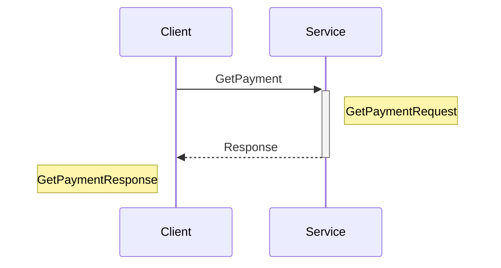

---

### CancelPayment

<a name="cancelpayment"></a>

#### Method Signature

```protobuf
// Unary RPC
rpc CancelPayment(CancelPaymentRequest) returns (CancelPaymentResponse);
```

#### Method Details

| Attribute | Value |
|-----------|-------|
| **Full Name** | `payments.v1.CancelPayment` |
| **Input Type** | [`CancelPaymentRequest`](#cancelpaymentrequest) |
| **Output Type** | [`CancelPaymentResponse`](#cancelpaymentresponse) |
| **Streaming Type** | Unary |

##### Sequence Diagram

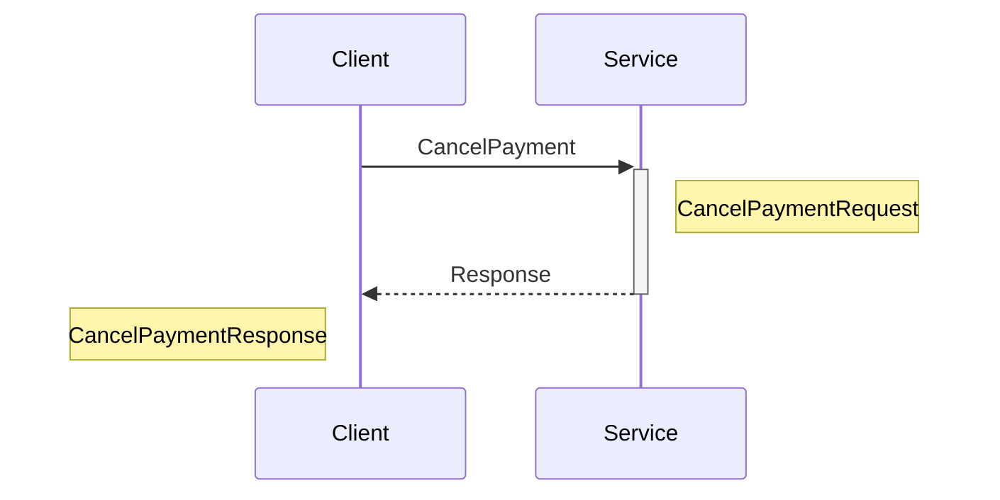

---

### RefundPayment

<a name="refundpayment"></a>

#### Method Signature

```protobuf
// Unary RPC
rpc RefundPayment(RefundPaymentRequest) returns (RefundPaymentResponse);
```

#### Method Details

| Attribute | Value |
|-----------|-------|
| **Full Name** | `payments.v1.RefundPayment` |
| **Input Type** | [`RefundPaymentRequest`](#refundpaymentrequest) |
| **Output Type** | [`RefundPaymentResponse`](#refundpaymentresponse) |
| **Streaming Type** | Unary |

##### Sequence Diagram

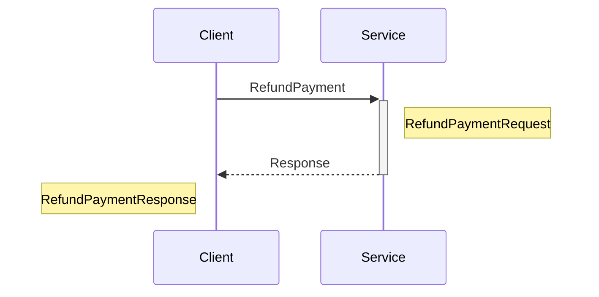

---

### ListPayments

<a name="listpayments"></a>

#### Method Signature

```protobuf
// Unary RPC
rpc ListPayments(ListPaymentsRequest) returns (ListPaymentsResponse);
```

#### Method Details

| Attribute | Value |
|-----------|-------|
| **Full Name** | `payments.v1.ListPayments` |
| **Input Type** | [`ListPaymentsRequest`](#listpaymentsrequest) |
| **Output Type** | [`ListPaymentsResponse`](#listpaymentsresponse) |
| **Streaming Type** | Unary |

##### Sequence Diagram


---

### ProcessBatch

<a name="processbatch"></a>

#### Method Signature

```protobuf
// Server streaming RPC
rpc ProcessBatch(ProcessBatchRequest) returns (stream BatchProcessResult);
```

#### Method Details

| Attribute | Value |
|-----------|-------|
| **Full Name** | `payments.v1.ProcessBatch` |
| **Input Type** | [`ProcessBatchRequest`](#processbatchrequest) |
| **Output Type** | [`BatchProcessResult`](#batchprocessresult) |
| **Streaming Type** | Server Streaming |

##### Sequence Diagram

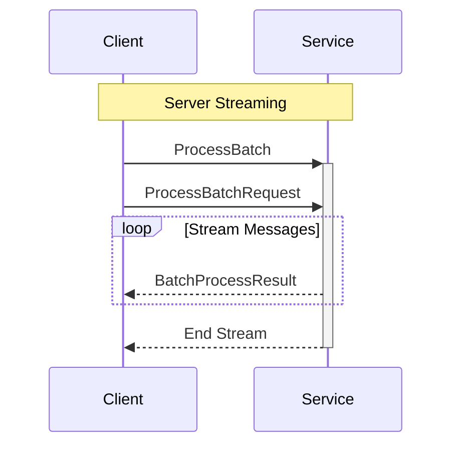

---

### SubscribeToPaymentEvents

<a name="subscribetopaymentevents"></a>

#### Method Signature

```protobuf
// Server streaming RPC
rpc SubscribeToPaymentEvents(SubscribeRequest) returns (stream PaymentEvent);
```

#### Method Details

| Attribute | Value |
|-----------|-------|
| **Full Name** | `payments.v1.SubscribeToPaymentEvents` |
| **Input Type** | [`SubscribeRequest`](#subscriberequest) |
| **Output Type** | [`PaymentEvent`](#paymentevent) |
| **Streaming Type** | Server Streaming |

##### Sequence Diagram

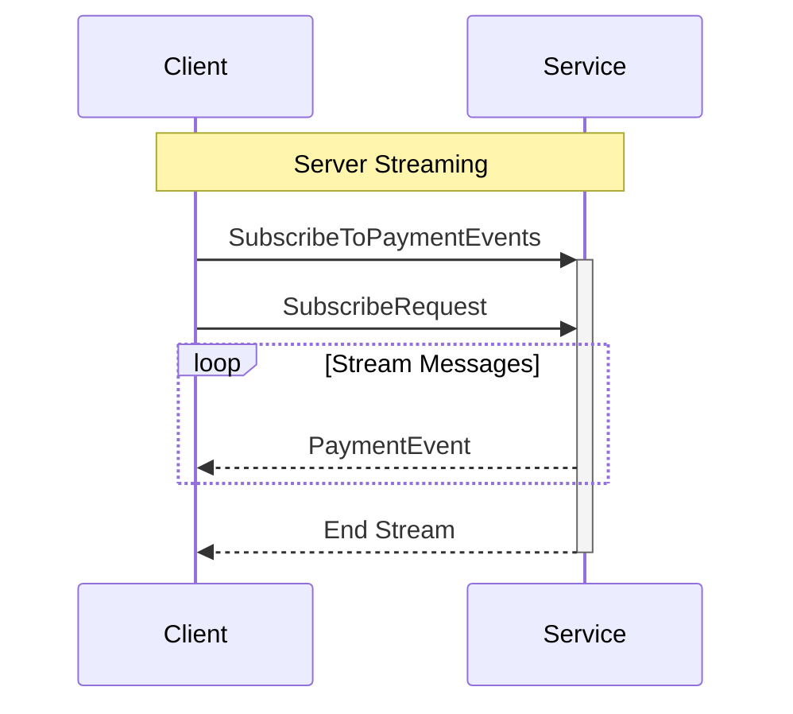

---

## 📦 Messages

<a name="messages"></a>

This service defines **14 message types**:

### ListPaymentsResponse

<a name="listpaymentsresponse"></a>

| Attribute | Value |
|-----------|-------|
| **Full Name** | `payments.v1.ListPaymentsResponse` |
| **Field Count** | 3 |

#### Fields

| # | Name | Type | Label | Description |
|---|------|------|-------|-------------|
| 1 | `payments` | [`Payment`](#payment) | repeated | - |
| 2 | `pagination` | [`PaginationResponse`](#paginationresponse) | optional | - |
| 3 | `summary` | [`PaymentSummary`](#paymentsummary) | optional | - |

#### Proto Definition

```protobuf
message ListPaymentsResponse {
  repeated Payment payments = 1;
  optional PaginationResponse pagination = 2;
  optional PaymentSummary summary = 3;
}
```

##### Message Structure

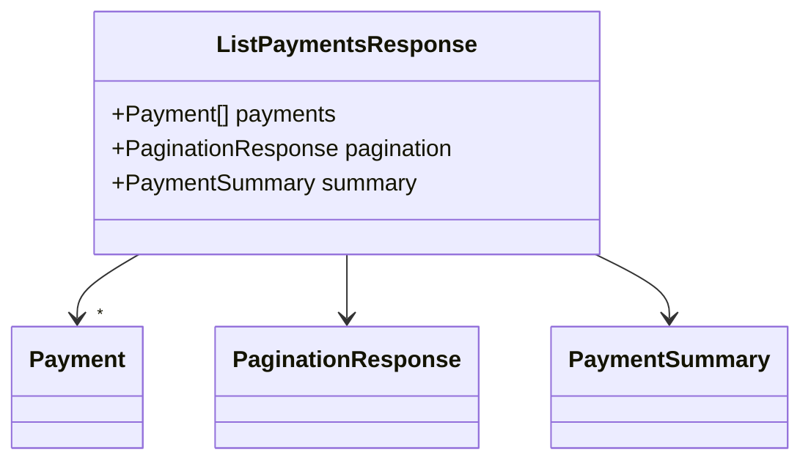

---

### BatchProcessResult

<a name="batchprocessresult"></a>

| Attribute | Value |
|-----------|-------|
| **Full Name** | `payments.v1.BatchProcessResult` |
| **Field Count** | 4 |

#### Fields

| # | Name | Type | Label | Description |
|---|------|------|-------|-------------|
| 1 | `index` | TYPE_INT32 | optional | - |
| 2 | `success` | TYPE_BOOL | optional | - |
| 3 | `payment` | [`Payment`](#payment) | optional | - |
| 4 | `error` | [`Error`](#error) | optional | - |

#### Proto Definition

```protobuf
message BatchProcessResult {
  optional TYPE_INT32 index = 1;
  optional TYPE_BOOL success = 2;
  optional Payment payment = 3;
  optional Error error = 4;
}
```

##### Message Structure

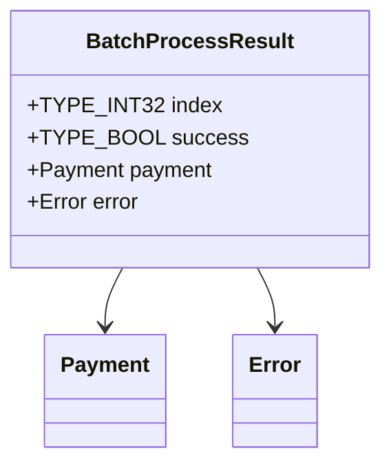

---

### SubscribeRequest

<a name="subscriberequest"></a>

| Attribute | Value |
|-----------|-------|
| **Full Name** | `payments.v1.SubscribeRequest` |
| **Field Count** | 3 |

#### Fields

| # | Name | Type | Label | Description |
|---|------|------|-------|-------------|
| 1 | `payment_ids` | TYPE_STRING | repeated | - |
| 2 | `user_ids` | TYPE_STRING | repeated | - |
| 3 | `event_types` | [`EventType`](#eventtype) | repeated | - |

#### Proto Definition

```protobuf
message SubscribeRequest {
  repeated TYPE_STRING payment_ids = 1;
  repeated TYPE_STRING user_ids = 2;
  repeated EventType event_types = 3;
}
```

##### Message Structure

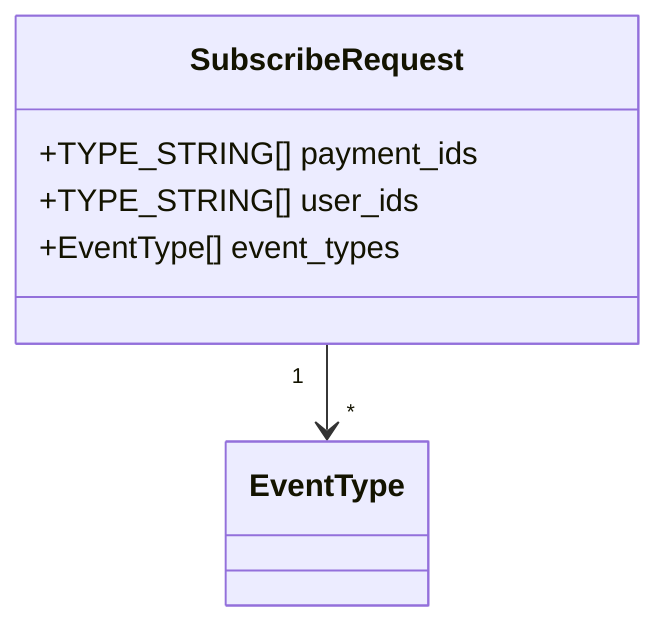

---

### CreatePaymentResponse

<a name="createpaymentresponse"></a>

| Attribute | Value |
|-----------|-------|
| **Full Name** | `payments.v1.CreatePaymentResponse` |
| **Field Count** | 3 |

#### Fields

| # | Name | Type | Label | Description |
|---|------|------|-------|-------------|
| 1 | `payment` | [`Payment`](#payment) | optional | - |
| 2 | `client_secret` | TYPE_STRING | optional | - |
| 3 | `next_action` | [`NextAction`](#nextaction) | optional | - |

#### Proto Definition

```protobuf
message CreatePaymentResponse {
  optional Payment payment = 1;
  optional TYPE_STRING client_secret = 2;
  optional NextAction next_action = 3;
}
```

##### Message Structure

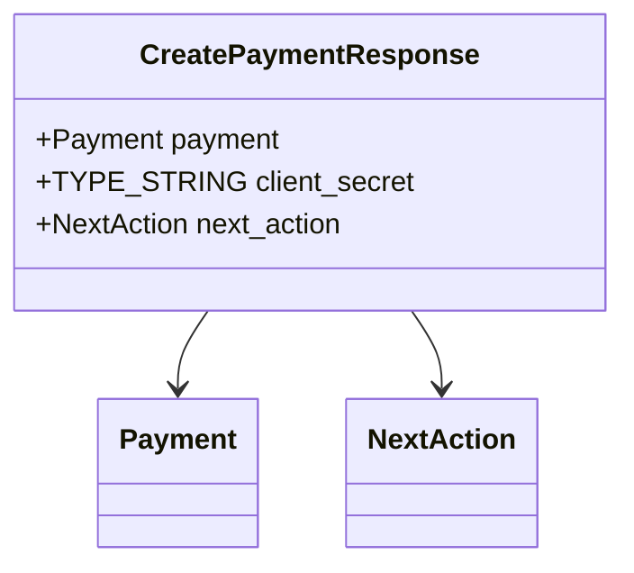

---

### GetPaymentRequest

<a name="getpaymentrequest"></a>

| Attribute | Value |
|-----------|-------|
| **Full Name** | `payments.v1.GetPaymentRequest` |
| **Field Count** | 1 |

#### Fields

| # | Name | Type | Label | Description |
|---|------|------|-------|-------------|
| 1 | `payment_id` | TYPE_STRING | optional | - |

#### Proto Definition

```protobuf
message GetPaymentRequest {
  optional TYPE_STRING payment_id = 1;
}
```

##### Message Structure

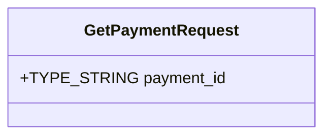

---

### CancelPaymentResponse

<a name="cancelpaymentresponse"></a>

| Attribute | Value |
|-----------|-------|
| **Full Name** | `payments.v1.CancelPaymentResponse` |
| **Field Count** | 1 |

#### Fields

| # | Name | Type | Label | Description |
|---|------|------|-------|-------------|
| 1 | `payment` | [`Payment`](#payment) | optional | - |

#### Proto Definition

```protobuf
message CancelPaymentResponse {
  optional Payment payment = 1;
}
```

##### Message Structure

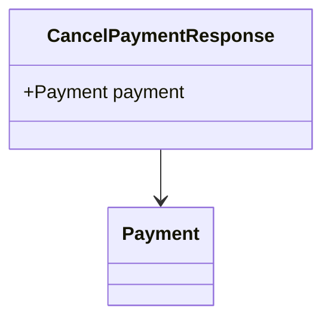

---

### ListPaymentsRequest

<a name="listpaymentsrequest"></a>

| Attribute | Value |
|-----------|-------|
| **Full Name** | `payments.v1.ListPaymentsRequest` |
| **Field Count** | 6 |

#### Fields

| # | Name | Type | Label | Description |
|---|------|------|-------|-------------|
| 1 | `pagination` | [`PaginationRequest`](#paginationrequest) | optional | - |
| 2 | `statuses` | [`PaymentStatus`](#paymentstatus) | repeated | - |
| 3 | `methods` | [`PaymentMethod`](#paymentmethod) | repeated | - |
| 4 | `user_id` | TYPE_STRING | optional | - |
| 5 | `date_range` | [`DateRangeFilter`](#daterangefilter) | optional | - |
| 6 | `amount_range` | [`AmountRangeFilter`](#amountrangefilter) | optional | - |

#### Proto Definition

```protobuf
message ListPaymentsRequest {
  optional PaginationRequest pagination = 1;
  repeated PaymentStatus statuses = 2;
  repeated PaymentMethod methods = 3;
  optional TYPE_STRING user_id = 4;
  optional DateRangeFilter date_range = 5;
  optional AmountRangeFilter amount_range = 6;
}
```

##### Message Structure

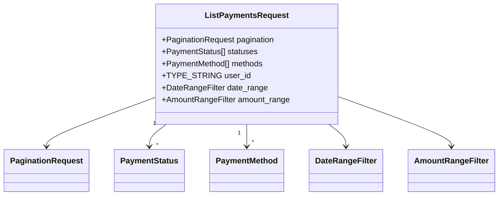

---

### ProcessBatchRequest

<a name="processbatchrequest"></a>

| Attribute | Value |
|-----------|-------|
| **Full Name** | `payments.v1.ProcessBatchRequest` |
| **Field Count** | 3 |

#### Fields

| # | Name | Type | Label | Description |
|---|------|------|-------|-------------|
| 1 | `payments` | [`CreatePaymentRequest`](#createpaymentrequest) | repeated | - |
| 2 | `batch_id` | TYPE_STRING | optional | - |
| 3 | `continue_on_error` | TYPE_BOOL | optional | - |

#### Proto Definition

```protobuf
message ProcessBatchRequest {
  repeated CreatePaymentRequest payments = 1;
  optional TYPE_STRING batch_id = 2;
  optional TYPE_BOOL continue_on_error = 3;
}
```

##### Message Structure

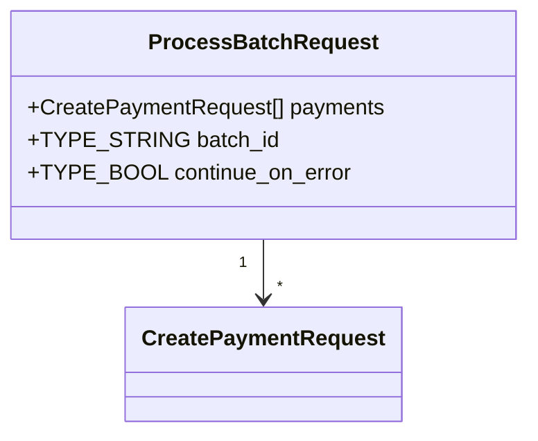

---

### PaymentEvent

<a name="paymentevent"></a>

| Attribute | Value |
|-----------|-------|
| **Full Name** | `payments.v1.PaymentEvent` |
| **Field Count** | 4 |
| **Nested Types** | 1 |

#### Fields

| # | Name | Type | Label | Description |
|---|------|------|-------|-------------|
| 1 | `event_type` | [`EventType`](#eventtype) | optional | - |
| 2 | `payment` | [`Payment`](#payment) | optional | - |
| 3 | `event_time` | [`Timestamp`](#timestamp) | optional | - |
| 4 | `metadata` | [`MetadataEntry`](#metadataentry) | repeated | - |

#### Proto Definition

```protobuf
message PaymentEvent {
  optional EventType event_type = 1;
  optional Payment payment = 2;
  optional Timestamp event_time = 3;
  repeated MetadataEntry metadata = 4;
}
```

##### Message Structure

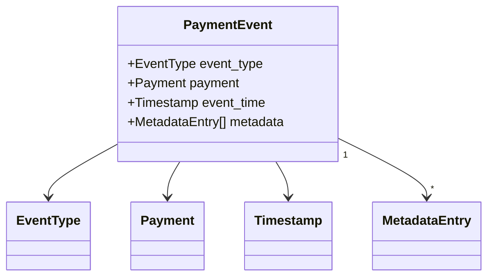

---

### CreatePaymentRequest

<a name="createpaymentrequest"></a>

| Attribute | Value |
|-----------|-------|
| **Full Name** | `payments.v1.CreatePaymentRequest` |
| **Field Count** | 12 |
| **Nested Types** | 1 |

#### Fields

| # | Name | Type | Label | Description |
|---|------|------|-------|-------------|
| 1 | `amount` | [`Money`](#money) | optional | - |
| 2 | `method` | [`PaymentMethod`](#paymentmethod) | optional | - |
| 3 | `payer` | [`PayerInfo`](#payerinfo) | optional | - |
| 4 | `card_source` | [`CardSource`](#cardsource) | oneof `source` | - |
| 5 | `bank_source` | [`BankAccountSource`](#bankaccountsource) | oneof `source` | - |
| 6 | `wallet_source` | [`WalletSource`](#walletsource) | oneof `source` | - |
| 7 | `crypto_source` | [`CryptoSource`](#cryptosource) | oneof `source` | - |
| 8 | `order_id` | TYPE_STRING | optional | - |
| 9 | `description` | TYPE_STRING | optional | - |
| 10 | `auto_capture` | TYPE_BOOL | optional | - |
| 11 | `idempotency_key` | TYPE_STRING | optional | - |
| 12 | `metadata` | [`MetadataEntry`](#metadataentry) | repeated | - |

#### Proto Definition

```protobuf
message CreatePaymentRequest {
  optional Money amount = 1;
  optional PaymentMethod method = 2;
  optional PayerInfo payer = 3;
  optional TYPE_STRING order_id = 8;
  optional TYPE_STRING description = 9;
  optional TYPE_BOOL auto_capture = 10;
  optional TYPE_STRING idempotency_key = 11;
  repeated MetadataEntry metadata = 12;

  oneof source {
    CardSource card_source = 4;
    BankAccountSource bank_source = 5;
    WalletSource wallet_source = 6;
    CryptoSource crypto_source = 7;
  }
}
```

##### Message Structure

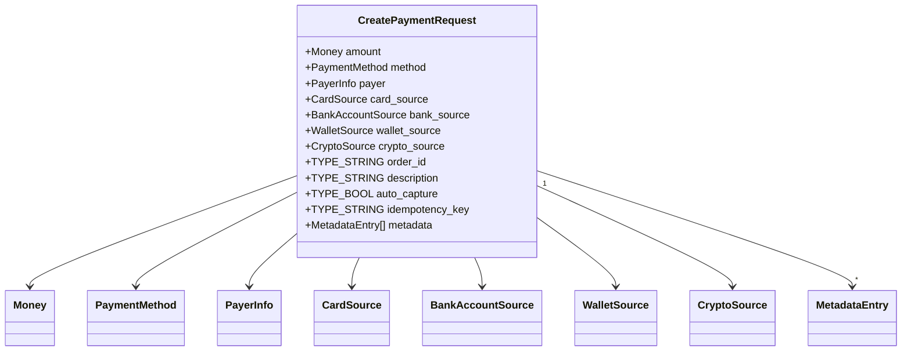

---

### GetPaymentResponse

<a name="getpaymentresponse"></a>

| Attribute | Value |
|-----------|-------|
| **Full Name** | `payments.v1.GetPaymentResponse` |
| **Field Count** | 1 |

#### Fields

| # | Name | Type | Label | Description |
|---|------|------|-------|-------------|
| 1 | `payment` | [`Payment`](#payment) | optional | - |

#### Proto Definition

```protobuf
message GetPaymentResponse {
  optional Payment payment = 1;
}
```

##### Message Structure

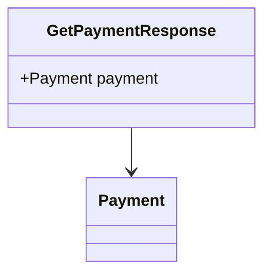

---

### CancelPaymentRequest

<a name="cancelpaymentrequest"></a>

| Attribute | Value |
|-----------|-------|
| **Full Name** | `payments.v1.CancelPaymentRequest` |
| **Field Count** | 2 |

#### Fields

| # | Name | Type | Label | Description |
|---|------|------|-------|-------------|
| 1 | `payment_id` | TYPE_STRING | optional | - |
| 2 | `reason` | TYPE_STRING | optional | - |

#### Proto Definition

```protobuf
message CancelPaymentRequest {
  optional TYPE_STRING payment_id = 1;
  optional TYPE_STRING reason = 2;
}
```

##### Message Structure

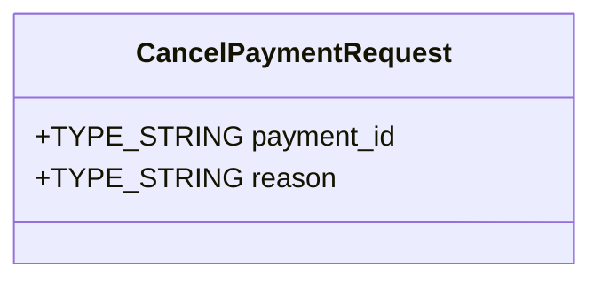

---

### RefundPaymentRequest

<a name="refundpaymentrequest"></a>

| Attribute | Value |
|-----------|-------|
| **Full Name** | `payments.v1.RefundPaymentRequest` |
| **Field Count** | 4 |
| **Nested Types** | 1 |

#### Fields

| # | Name | Type | Label | Description |
|---|------|------|-------|-------------|
| 1 | `payment_id` | TYPE_STRING | optional | - |
| 2 | `amount` | [`Money`](#money) | optional | - |
| 3 | `reason` | TYPE_STRING | optional | - |
| 4 | `metadata` | [`MetadataEntry`](#metadataentry) | repeated | - |

#### Proto Definition

```protobuf
message RefundPaymentRequest {
  optional TYPE_STRING payment_id = 1;
  optional Money amount = 2;
  optional TYPE_STRING reason = 3;
  repeated MetadataEntry metadata = 4;
}
```

##### Message Structure

```mermaid
classDiagram
    class RefundPaymentRequest {
        +TYPE_STRING payment_id
        +Money amount
        +TYPE_STRING reason
        +MetadataEntry[] metadata
    }
    RefundPaymentRequest --> Money
    RefundPaymentRequest "1" --> "*" MetadataEntry
```

---

### RefundPaymentResponse

<a name="refundpaymentresponse"></a>

| Attribute | Value |
|-----------|-------|
| **Full Name** | `payments.v1.RefundPaymentResponse` |
| **Field Count** | 2 |

#### Fields

| # | Name | Type | Label | Description |
|---|------|------|-------|-------------|
| 1 | `payment` | [`Payment`](#payment) | optional | - |
| 2 | `refund` | [`RefundDetails`](#refunddetails) | optional | - |

#### Proto Definition

```protobuf
message RefundPaymentResponse {
  optional Payment payment = 1;
  optional RefundDetails refund = 2;
}
```

##### Message Structure

```mermaid
classDiagram
    class RefundPaymentResponse {
        +Payment payment
        +RefundDetails refund
    }
    RefundPaymentResponse --> Payment
    RefundPaymentResponse --> RefundDetails
```

---

## 🔢 Enumerations

<a name="enumerations"></a>

This service defines **12 enumeration types**:

### CardBrand

<a name="cardbrand"></a>

| Value | Number | Description |
|-------|--------|-------------|
| `CARD_BRAND_UNSPECIFIED` | 0 | - |
| `CARD_BRAND_VISA` | 1 | - |
| `CARD_BRAND_MASTERCARD` | 2 | - |
| `CARD_BRAND_AMEX` | 3 | - |
| `CARD_BRAND_DISCOVER` | 4 | - |
| `CARD_BRAND_JCB` | 5 | - |
| `CARD_BRAND_DINERS` | 6 | - |
| `CARD_BRAND_UNIONPAY` | 7 | - |

#### Proto Definition

```protobuf
enum CardBrand {
  CARD_BRAND_UNSPECIFIED = 0;
  CARD_BRAND_VISA = 1;
  CARD_BRAND_MASTERCARD = 2;
  CARD_BRAND_AMEX = 3;
  CARD_BRAND_DISCOVER = 4;
  CARD_BRAND_JCB = 5;
  CARD_BRAND_DINERS = 6;
  CARD_BRAND_UNIONPAY = 7;
}
```

---

### CryptoType

<a name="cryptotype"></a>

| Value | Number | Description |
|-------|--------|-------------|
| `CRYPTO_TYPE_UNSPECIFIED` | 0 | - |
| `CRYPTO_TYPE_BITCOIN` | 1 | - |
| `CRYPTO_TYPE_ETHEREUM` | 2 | - |
| `CRYPTO_TYPE_LITECOIN` | 3 | - |
| `CRYPTO_TYPE_USDC` | 4 | - |
| `CRYPTO_TYPE_USDT` | 5 | - |

#### Proto Definition

```protobuf
enum CryptoType {
  CRYPTO_TYPE_UNSPECIFIED = 0;
  CRYPTO_TYPE_BITCOIN = 1;
  CRYPTO_TYPE_ETHEREUM = 2;
  CRYPTO_TYPE_LITECOIN = 3;
  CRYPTO_TYPE_USDC = 4;
  CRYPTO_TYPE_USDT = 5;
}
```

---

### SettlementStatus

<a name="settlementstatus"></a>

| Value | Number | Description |
|-------|--------|-------------|
| `SETTLEMENT_STATUS_UNSPECIFIED` | 0 | - |
| `SETTLEMENT_STATUS_PENDING` | 1 | - |
| `SETTLEMENT_STATUS_IN_TRANSIT` | 2 | - |
| `SETTLEMENT_STATUS_SETTLED` | 3 | - |
| `SETTLEMENT_STATUS_FAILED` | 4 | - |

#### Proto Definition

```protobuf
enum SettlementStatus {
  SETTLEMENT_STATUS_UNSPECIFIED = 0;
  SETTLEMENT_STATUS_PENDING = 1;
  SETTLEMENT_STATUS_IN_TRANSIT = 2;
  SETTLEMENT_STATUS_SETTLED = 3;
  SETTLEMENT_STATUS_FAILED = 4;
}
```

---

### ActionType

<a name="actiontype"></a>

| Value | Number | Description |
|-------|--------|-------------|
| `ACTION_TYPE_UNSPECIFIED` | 0 | - |
| `ACTION_TYPE_NONE` | 1 | - |
| `ACTION_TYPE_REDIRECT` | 2 | - |
| `ACTION_TYPE_VERIFY` | 3 | - |
| `ACTION_TYPE_AUTHORIZE` | 4 | - |

#### Proto Definition

```protobuf
enum ActionType {
  ACTION_TYPE_UNSPECIFIED = 0;
  ACTION_TYPE_NONE = 1;
  ACTION_TYPE_REDIRECT = 2;
  ACTION_TYPE_VERIFY = 3;
  ACTION_TYPE_AUTHORIZE = 4;
}
```

---

### PaymentMethod

<a name="paymentmethod"></a>

| Value | Number | Description |
|-------|--------|-------------|
| `PAYMENT_METHOD_UNSPECIFIED` | 0 | - |
| `PAYMENT_METHOD_CREDIT_CARD` | 1 | - |
| `PAYMENT_METHOD_DEBIT_CARD` | 2 | - |
| `PAYMENT_METHOD_BANK_TRANSFER` | 3 | - |
| `PAYMENT_METHOD_PAYPAL` | 4 | - |
| `PAYMENT_METHOD_APPLE_PAY` | 5 | - |
| `PAYMENT_METHOD_GOOGLE_PAY` | 6 | - |
| `PAYMENT_METHOD_CRYPTOCURRENCY` | 7 | - |
| `PAYMENT_METHOD_WIRE_TRANSFER` | 8 | - |

#### Proto Definition

```protobuf
enum PaymentMethod {
  PAYMENT_METHOD_UNSPECIFIED = 0;
  PAYMENT_METHOD_CREDIT_CARD = 1;
  PAYMENT_METHOD_DEBIT_CARD = 2;
  PAYMENT_METHOD_BANK_TRANSFER = 3;
  PAYMENT_METHOD_PAYPAL = 4;
  PAYMENT_METHOD_APPLE_PAY = 5;
  PAYMENT_METHOD_GOOGLE_PAY = 6;
  PAYMENT_METHOD_CRYPTOCURRENCY = 7;
  PAYMENT_METHOD_WIRE_TRANSFER = 8;
}
```

---

### PaymentStatus

<a name="paymentstatus"></a>

| Value | Number | Description |
|-------|--------|-------------|
| `PAYMENT_STATUS_UNSPECIFIED` | 0 | - |
| `PAYMENT_STATUS_PENDING` | 1 | - |
| `PAYMENT_STATUS_PROCESSING` | 2 | - |
| `PAYMENT_STATUS_AUTHORIZED` | 3 | - |
| `PAYMENT_STATUS_CAPTURED` | 4 | - |
| `PAYMENT_STATUS_COMPLETED` | 5 | - |
| `PAYMENT_STATUS_FAILED` | 6 | - |
| `PAYMENT_STATUS_CANCELLED` | 7 | - |
| `PAYMENT_STATUS_REFUNDED` | 8 | - |
| `PAYMENT_STATUS_PARTIALLY_REFUNDED` | 9 | - |
| `PAYMENT_STATUS_DISPUTED` | 10 | - |
| `PAYMENT_STATUS_EXPIRED` | 11 | - |

#### Proto Definition

```protobuf
enum PaymentStatus {
  PAYMENT_STATUS_UNSPECIFIED = 0;
  PAYMENT_STATUS_PENDING = 1;
  PAYMENT_STATUS_PROCESSING = 2;
  PAYMENT_STATUS_AUTHORIZED = 3;
  PAYMENT_STATUS_CAPTURED = 4;
  PAYMENT_STATUS_COMPLETED = 5;
  PAYMENT_STATUS_FAILED = 6;
  PAYMENT_STATUS_CANCELLED = 7;
  PAYMENT_STATUS_REFUNDED = 8;
  PAYMENT_STATUS_PARTIALLY_REFUNDED = 9;
  PAYMENT_STATUS_DISPUTED = 10;
  PAYMENT_STATUS_EXPIRED = 11;
}
```

---

### WalletProvider

<a name="walletprovider"></a>

| Value | Number | Description |
|-------|--------|-------------|
| `WALLET_PROVIDER_UNSPECIFIED` | 0 | - |
| `WALLET_PROVIDER_PAYPAL` | 1 | - |
| `WALLET_PROVIDER_APPLE_PAY` | 2 | - |
| `WALLET_PROVIDER_GOOGLE_PAY` | 3 | - |
| `WALLET_PROVIDER_VENMO` | 4 | - |

#### Proto Definition

```protobuf
enum WalletProvider {
  WALLET_PROVIDER_UNSPECIFIED = 0;
  WALLET_PROVIDER_PAYPAL = 1;
  WALLET_PROVIDER_APPLE_PAY = 2;
  WALLET_PROVIDER_GOOGLE_PAY = 3;
  WALLET_PROVIDER_VENMO = 4;
}
```

---

### RefundStatus

<a name="refundstatus"></a>

| Value | Number | Description |
|-------|--------|-------------|
| `REFUND_STATUS_UNSPECIFIED` | 0 | - |
| `REFUND_STATUS_PENDING` | 1 | - |
| `REFUND_STATUS_PROCESSING` | 2 | - |
| `REFUND_STATUS_COMPLETED` | 3 | - |
| `REFUND_STATUS_FAILED` | 4 | - |
| `REFUND_STATUS_CANCELLED` | 5 | - |

#### Proto Definition

```protobuf
enum RefundStatus {
  REFUND_STATUS_UNSPECIFIED = 0;
  REFUND_STATUS_PENDING = 1;
  REFUND_STATUS_PROCESSING = 2;
  REFUND_STATUS_COMPLETED = 3;
  REFUND_STATUS_FAILED = 4;
  REFUND_STATUS_CANCELLED = 5;
}
```

---

### FraudCheckOutcome

<a name="fraudcheckoutcome"></a>

| Value | Number | Description |
|-------|--------|-------------|
| `FRAUD_CHECK_OUTCOME_UNSPECIFIED` | 0 | - |
| `FRAUD_CHECK_OUTCOME_PASS` | 1 | - |
| `FRAUD_CHECK_OUTCOME_REVIEW` | 2 | - |
| `FRAUD_CHECK_OUTCOME_DECLINE` | 3 | - |

#### Proto Definition

```protobuf
enum FraudCheckOutcome {
  FRAUD_CHECK_OUTCOME_UNSPECIFIED = 0;
  FRAUD_CHECK_OUTCOME_PASS = 1;
  FRAUD_CHECK_OUTCOME_REVIEW = 2;
  FRAUD_CHECK_OUTCOME_DECLINE = 3;
}
```

---

### FeeType

<a name="feetype"></a>

| Value | Number | Description |
|-------|--------|-------------|
| `FEE_TYPE_UNSPECIFIED` | 0 | - |
| `FEE_TYPE_PROCESSING` | 1 | - |
| `FEE_TYPE_TRANSACTION` | 2 | - |
| `FEE_TYPE_CURRENCY_CONVERSION` | 3 | - |
| `FEE_TYPE_CROSS_BORDER` | 4 | - |
| `FEE_TYPE_SERVICE` | 5 | - |

#### Proto Definition

```protobuf
enum FeeType {
  FEE_TYPE_UNSPECIFIED = 0;
  FEE_TYPE_PROCESSING = 1;
  FEE_TYPE_TRANSACTION = 2;
  FEE_TYPE_CURRENCY_CONVERSION = 3;
  FEE_TYPE_CROSS_BORDER = 4;
  FEE_TYPE_SERVICE = 5;
}
```

---

### EventType

<a name="eventtype"></a>

| Value | Number | Description |
|-------|--------|-------------|
| `EVENT_TYPE_UNSPECIFIED` | 0 | - |
| `EVENT_TYPE_PAYMENT_CREATED` | 1 | - |
| `EVENT_TYPE_PAYMENT_UPDATED` | 2 | - |
| `EVENT_TYPE_PAYMENT_COMPLETED` | 3 | - |
| `EVENT_TYPE_PAYMENT_FAILED` | 4 | - |
| `EVENT_TYPE_PAYMENT_REFUNDED` | 5 | - |
| `EVENT_TYPE_PAYMENT_DISPUTED` | 6 | - |

#### Proto Definition

```protobuf
enum EventType {
  EVENT_TYPE_UNSPECIFIED = 0;
  EVENT_TYPE_PAYMENT_CREATED = 1;
  EVENT_TYPE_PAYMENT_UPDATED = 2;
  EVENT_TYPE_PAYMENT_COMPLETED = 3;
  EVENT_TYPE_PAYMENT_FAILED = 4;
  EVENT_TYPE_PAYMENT_REFUNDED = 5;
  EVENT_TYPE_PAYMENT_DISPUTED = 6;
}
```

---

### TransactionType

<a name="transactiontype"></a>

| Value | Number | Description |
|-------|--------|-------------|
| `TRANSACTION_TYPE_UNSPECIFIED` | 0 | - |
| `TRANSACTION_TYPE_PAYMENT` | 1 | - |
| `TRANSACTION_TYPE_REFUND` | 2 | - |
| `TRANSACTION_TYPE_CHARGEBACK` | 3 | - |
| `TRANSACTION_TYPE_PAYOUT` | 4 | - |
| `TRANSACTION_TYPE_ADJUSTMENT` | 5 | - |

#### Proto Definition

```protobuf
enum TransactionType {
  TRANSACTION_TYPE_UNSPECIFIED = 0;
  TRANSACTION_TYPE_PAYMENT = 1;
  TRANSACTION_TYPE_REFUND = 2;
  TRANSACTION_TYPE_CHARGEBACK = 3;
  TRANSACTION_TYPE_PAYOUT = 4;
  TRANSACTION_TYPE_ADJUSTMENT = 5;
}
```

---

## ⚠️ Error Codes

<a name="error-codes"></a>

This service uses standard gRPC status codes:

| gRPC Code | HTTP Status | Description |
|-----------|-------------|-------------|
| `OK` | 200 | Success |
| `CANCELLED` | 499 | Operation cancelled by client |
| `UNKNOWN` | 500 | Unknown error |
| `INVALID_ARGUMENT` | 400 | Client specified an invalid argument |
| `DEADLINE_EXCEEDED` | 504 | Deadline expired before operation could complete |
| `NOT_FOUND` | 404 | Requested entity not found |
| `ALREADY_EXISTS` | 409 | Entity already exists |
| `PERMISSION_DENIED` | 403 | Caller does not have permission |
| `RESOURCE_EXHAUSTED` | 429 | Resource has been exhausted |
| `FAILED_PRECONDITION` | 400 | Operation rejected because system is not in required state |
| `ABORTED` | 409 | Operation aborted, typically due to concurrency issue |
| `OUT_OF_RANGE` | 400 | Operation attempted past valid range |
| `UNIMPLEMENTED` | 501 | Operation not implemented |
| `INTERNAL` | 500 | Internal server error |
| `UNAVAILABLE` | 503 | Service unavailable |
| `DATA_LOSS` | 500 | Unrecoverable data loss or corruption |
| `UNAUTHENTICATED` | 401 | Request does not have valid authentication credentials |

### Error Handling Best Practices

1. **Check status codes**: Always check the gRPC status code before processing responses
2. **Implement retries**: Use exponential backoff for transient errors (`UNAVAILABLE`, `RESOURCE_EXHAUSTED`)
3. **Log errors**: Log error details with correlation IDs for troubleshooting
4. **Handle streaming errors**: Properly handle errors in streaming RPCs
5. **Validate inputs**: Validate inputs client-side to avoid `INVALID_ARGUMENT` errors

---

## 💡 Examples

<a name="examples"></a>

### Go Example

```go
package main

import (
    "context"
    "log"
    "time"

    "google.golang.org/grpc"
    "google.golang.org/grpc/credentials/insecure"

    pb "payments.v1"
)

func main() {
    // Connect to the service
    conn, err := grpc.Dial("localhost:50051",
        grpc.WithTransportCredentials(insecure.NewCredentials()))
    if err != nil {
        log.Fatalf("Failed to connect: %v", err)
    }
    defer conn.Close()

    client := pb.NewPaymentServiceClient(conn)

    // Example RPC call
    ctx, cancel := context.WithTimeout(context.Background(), 5*time.Second)
    defer cancel()

    req := &pb.CreatePaymentRequest{
        // Fill in request fields
    }

    resp, err := client.CreatePayment(ctx, req)
    if err != nil {
        log.Fatalf("RPC failed: %v", err)
    }

    log.Printf("Response: %v", resp)
}
```

### JavaScript (Node.js) Example

```javascript
const grpc = require('@grpc/grpc-js');
const protoLoader = require('@grpc/proto-loader');

// Load proto file
const packageDefinition = protoLoader.loadSync(
    'payments/payments.proto',
    {
        keepCase: true,
        longs: String,
        enums: String,
        defaults: true,
        oneofs: true
    }
);

const proto = grpc.loadPackageDefinition(packageDefinition);

// Create client
const client = new proto.payments.v1.PaymentService(
    'localhost:50051',
    grpc.credentials.createInsecure()
);

// Example RPC call
const request = {
    // Fill in request fields
};

client.CreatePayment(request, (error, response) => {
    if (error) {
        console.error('RPC failed:', error);
        return;
    }
    console.log('Response:', response);
});
```

---

---

<div align="center">

**Generated Documentation**

| Attribute | Value |
|-----------|-------|
| Generated At | 0001-01-01 00:00:00 UTC |
| Generator Version |  |

📚 **Documentation** | 🔧 **ProtoDocs** | ✨ **Auto-Generated**

</div>
