# 📚 UserService API Documentation

| **Attribute** | **Value** |
|---------------|----------|
| **Service Name** | `UserService` |
| **Package** | `users.v1` |
| **Version** |  |
| **Proto File** | `users/users.proto` |
| **Generated** | 0001-01-01T00:00:00Z |

---

## 📑 Table of Contents

- [Overview](#overview)
- [Architecture](#architecture)
- [Methods](#methods)
  - [CreateUser](#createuser)
  - [GetUser](#getuser)
  - [UpdateUser](#updateuser)
  - [DeleteUser](#deleteuser)
  - [ListUsers](#listusers)
  - [SearchUsers](#searchusers)
  - [BatchGetUsers](#batchgetusers)
  - [StreamUserUpdates](#streamuserupdates)
  - [UpdateUserPreferences](#updateuserpreferences)
  - [SyncUserData](#syncuserdata)
- [Messages](#messages)
  - [SearchUsersResponse](#searchusersresponse)
  - [UserSyncRequest](#usersyncrequest)
  - [BatchGetUsersResponse](#batchgetusersresponse)
  - [PreferenceUpdate](#preferenceupdate)
  - [UpdateUserRequest](#updateuserrequest)
  - [UpdateUserResponse](#updateuserresponse)
  - [SearchUsersRequest](#searchusersrequest)
  - [StreamUserUpdatesRequest](#streamuserupdatesrequest)
  - [UserUpdateEvent](#userupdateevent)
  - [UserSyncResponse](#usersyncresponse)
  - [CreateUserRequest](#createuserrequest)
  - [CreateUserResponse](#createuserresponse)
  - [GetUserRequest](#getuserrequest)
  - [DeleteUserRequest](#deleteuserrequest)
  - [ListUsersRequest](#listusersrequest)
  - [ListUsersResponse](#listusersresponse)
  - [BatchGetUsersRequest](#batchgetusersrequest)
  - [UpdateUserPreferencesResponse](#updateuserpreferencesresponse)
  - [GetUserResponse](#getuserresponse)
- [Enumerations](#enumerations)
- [Error Codes](#error-codes)
- [Examples](#examples)

---

## 📖 Overview

<a name="overview"></a>

### Service Statistics

| Metric | Count |
|--------|-------|
| **RPC Methods** | 10 |
| **Message Types** | 19 |
| **Enumerations** | 7 |
| **Streaming RPCs** | 3 |

### Quick Start

This service provides the following capabilities:

- [`CreateUser`](#createuser): 
- [`GetUser`](#getuser): 
- [`UpdateUser`](#updateuser): 
- [`DeleteUser`](#deleteuser): 
- [`ListUsers`](#listusers): 
- ... and 5 more methods

---

## 🏗️ Architecture

<a name="architecture"></a>

```mermaid
graph TB
    classDef serviceClass fill:#e1f5ff,stroke:#01579b,stroke-width:3px
    classDef methodClass fill:#f3e5f5,stroke:#4a148c,stroke-width:2px
    classDef messageClass fill:#e8f5e9,stroke:#1b5e20,stroke-width:2px

    UserService[🔧 UserService]:::serviceClass

    CreateUser[CreateUser]:::methodClass
    UserService --> CreateUser
    CreateUser_in[📥 CreateUserRequest]:::messageClass
    CreateUser_out[📤 CreateUserResponse]:::messageClass
    CreateUser_in -.->|input| CreateUser
    CreateUser -.->|output| CreateUser_out
    GetUser[GetUser]:::methodClass
    UserService --> GetUser
    GetUser_in[📥 GetUserRequest]:::messageClass
    GetUser_out[📤 GetUserResponse]:::messageClass
    GetUser_in -.->|input| GetUser
    GetUser -.->|output| GetUser_out
    UpdateUser[UpdateUser]:::methodClass
    UserService --> UpdateUser
    UpdateUser_in[📥 UpdateUserRequest]:::messageClass
    UpdateUser_out[📤 UpdateUserResponse]:::messageClass
    UpdateUser_in -.->|input| UpdateUser
    UpdateUser -.->|output| UpdateUser_out
    DeleteUser[DeleteUser]:::methodClass
    UserService --> DeleteUser
    DeleteUser_in[📥 DeleteUserRequest]:::messageClass
    DeleteUser_out[📤 Empty]:::messageClass
    DeleteUser_in -.->|input| DeleteUser
    DeleteUser -.->|output| DeleteUser_out
    ListUsers[ListUsers]:::methodClass
    UserService --> ListUsers
    ListUsers_in[📥 ListUsersRequest]:::messageClass
    ListUsers_out[📤 ListUsersResponse]:::messageClass
    ListUsers_in -.->|input| ListUsers
    ListUsers -.->|output| ListUsers_out
    SearchUsers[SearchUsers]:::methodClass
    UserService --> SearchUsers
    SearchUsers_in[📥 SearchUsersRequest]:::messageClass
    SearchUsers_out[📤 SearchUsersResponse]:::messageClass
    SearchUsers_in -.->|input| SearchUsers
    SearchUsers -.->|output| SearchUsers_out
    BatchGetUsers[BatchGetUsers]:::methodClass
    UserService --> BatchGetUsers
    BatchGetUsers_in[📥 BatchGetUsersRequest]:::messageClass
    BatchGetUsers_out[📤 BatchGetUsersResponse]:::messageClass
    BatchGetUsers_in -.->|input| BatchGetUsers
    BatchGetUsers -.->|output| BatchGetUsers_out
    StreamUserUpdates[↓ StreamUserUpdates]:::methodClass
    UserService --> StreamUserUpdates
    StreamUserUpdates_in[📥 StreamUserUpdatesRequest]:::messageClass
    StreamUserUpdates_out[📤 UserUpdateEvent]:::messageClass
    StreamUserUpdates_in -.->|input| StreamUserUpdates
    StreamUserUpdates -.->|output| StreamUserUpdates_out
    UpdateUserPreferences[↑ UpdateUserPreferences]:::methodClass
    UserService --> UpdateUserPreferences
    UpdateUserPreferences_in[📥 PreferenceUpdate]:::messageClass
    UpdateUserPreferences_out[📤 UpdateUserPreferencesResponse]:::messageClass
    UpdateUserPreferences_in -.->|input| UpdateUserPreferences
    UpdateUserPreferences -.->|output| UpdateUserPreferences_out
    SyncUserData[↔️ SyncUserData]:::methodClass
    UserService --> SyncUserData
    SyncUserData_in[📥 UserSyncRequest]:::messageClass
    SyncUserData_out[📤 UserSyncResponse]:::messageClass
    SyncUserData_in -.->|input| SyncUserData
    SyncUserData -.->|output| SyncUserData_out
```

---

## ⚙️ Methods

<a name="methods"></a>

This service defines **10 RPC methods**:

### CreateUser

<a name="createuser"></a>

#### Method Signature

```protobuf
// Unary RPC
rpc CreateUser(CreateUserRequest) returns (CreateUserResponse);
```

#### Method Details

| Attribute | Value |
|-----------|-------|
| **Full Name** | `users.v1.CreateUser` |
| **Input Type** | [`CreateUserRequest`](#createuserrequest) |
| **Output Type** | [`CreateUserResponse`](#createuserresponse) |
| **Streaming Type** | Unary |

##### Sequence Diagram

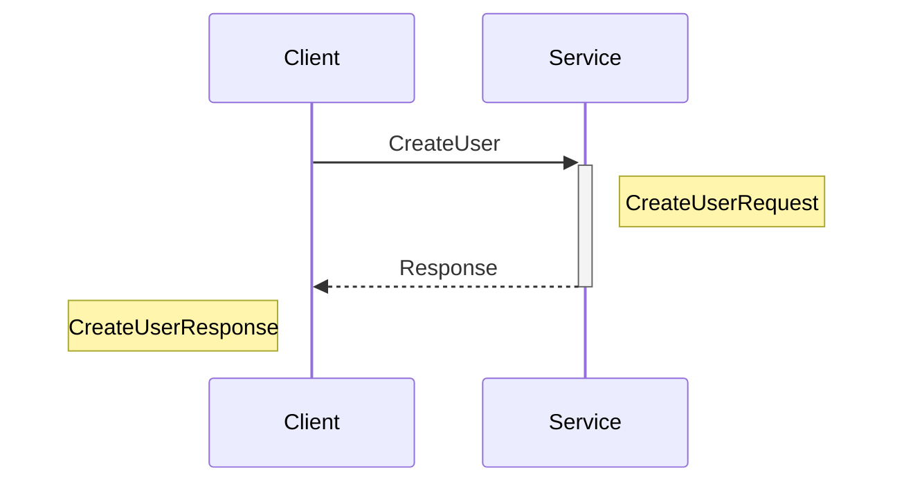

---

### GetUser

<a name="getuser"></a>

#### Method Signature

```protobuf
// Unary RPC
rpc GetUser(GetUserRequest) returns (GetUserResponse);
```

#### Method Details

| Attribute | Value |
|-----------|-------|
| **Full Name** | `users.v1.GetUser` |
| **Input Type** | [`GetUserRequest`](#getuserrequest) |
| **Output Type** | [`GetUserResponse`](#getuserresponse) |
| **Streaming Type** | Unary |

##### Sequence Diagram

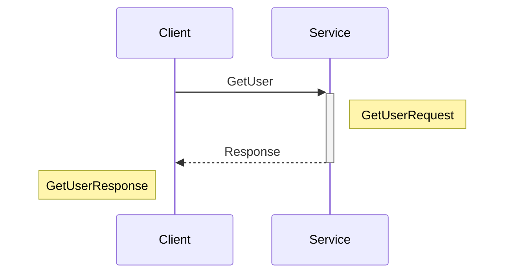

---

### UpdateUser

<a name="updateuser"></a>

#### Method Signature

```protobuf
// Unary RPC
rpc UpdateUser(UpdateUserRequest) returns (UpdateUserResponse);
```

#### Method Details

| Attribute | Value |
|-----------|-------|
| **Full Name** | `users.v1.UpdateUser` |
| **Input Type** | [`UpdateUserRequest`](#updateuserrequest) |
| **Output Type** | [`UpdateUserResponse`](#updateuserresponse) |
| **Streaming Type** | Unary |

##### Sequence Diagram

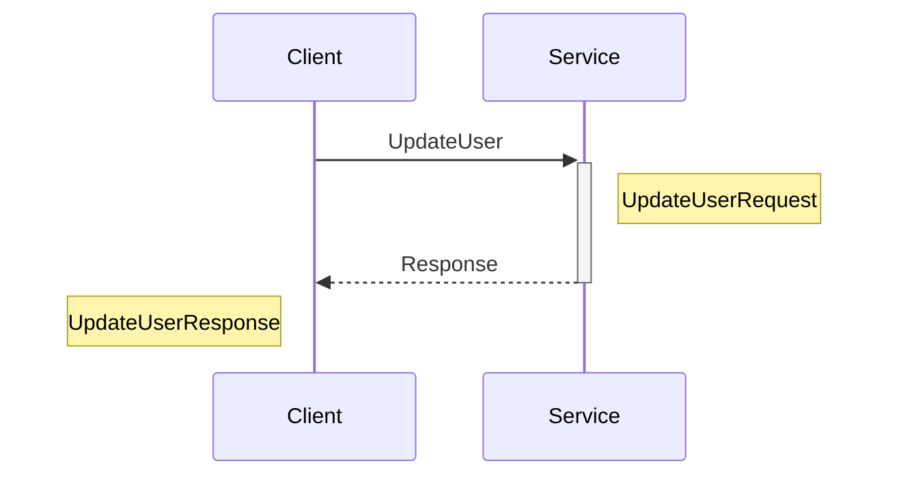

---

### DeleteUser

<a name="deleteuser"></a>

#### Method Signature

```protobuf
// Unary RPC
rpc DeleteUser(DeleteUserRequest) returns (Empty);
```

#### Method Details

| Attribute | Value |
|-----------|-------|
| **Full Name** | `users.v1.DeleteUser` |
| **Input Type** | [`DeleteUserRequest`](#deleteuserrequest) |
| **Output Type** | [`Empty`](#empty) |
| **Streaming Type** | Unary |

##### Sequence Diagram

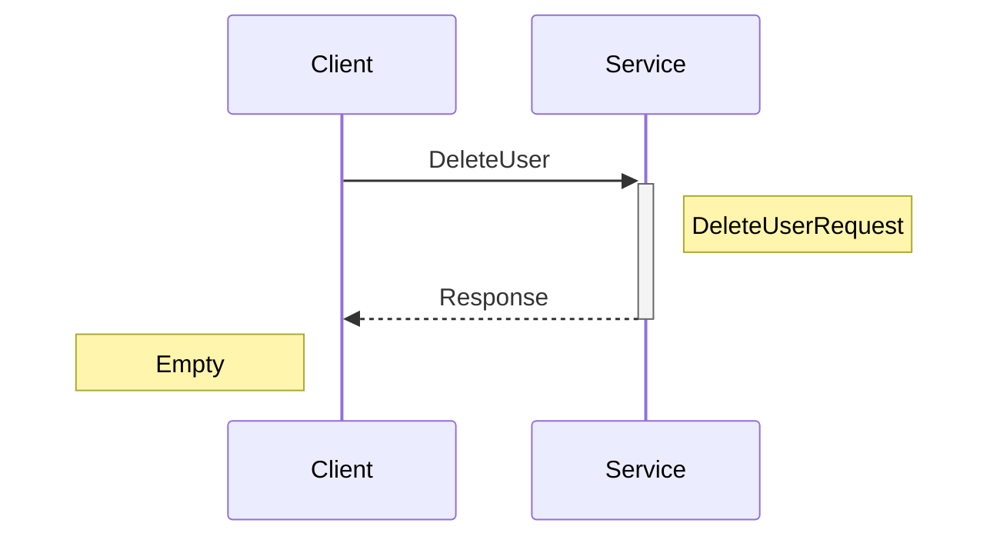

---

### ListUsers

<a name="listusers"></a>

#### Method Signature

```protobuf
// Unary RPC
rpc ListUsers(ListUsersRequest) returns (ListUsersResponse);
```

#### Method Details

| Attribute | Value |
|-----------|-------|
| **Full Name** | `users.v1.ListUsers` |
| **Input Type** | [`ListUsersRequest`](#listusersrequest) |
| **Output Type** | [`ListUsersResponse`](#listusersresponse) |
| **Streaming Type** | Unary |

##### Sequence Diagram


---

### SearchUsers

<a name="searchusers"></a>

#### Method Signature

```protobuf
// Unary RPC
rpc SearchUsers(SearchUsersRequest) returns (SearchUsersResponse);
```

#### Method Details

| Attribute | Value |
|-----------|-------|
| **Full Name** | `users.v1.SearchUsers` |
| **Input Type** | [`SearchUsersRequest`](#searchusersrequest) |
| **Output Type** | [`SearchUsersResponse`](#searchusersresponse) |
| **Streaming Type** | Unary |

##### Sequence Diagram

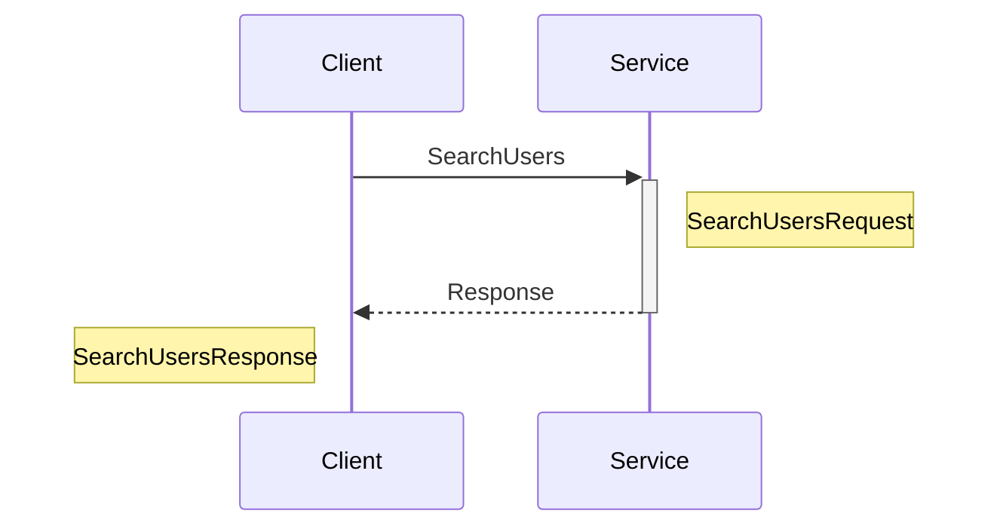

---

### BatchGetUsers

<a name="batchgetusers"></a>

#### Method Signature

```protobuf
// Unary RPC
rpc BatchGetUsers(BatchGetUsersRequest) returns (BatchGetUsersResponse);
```

#### Method Details

| Attribute | Value |
|-----------|-------|
| **Full Name** | `users.v1.BatchGetUsers` |
| **Input Type** | [`BatchGetUsersRequest`](#batchgetusersrequest) |
| **Output Type** | [`BatchGetUsersResponse`](#batchgetusersresponse) |
| **Streaming Type** | Unary |

##### Sequence Diagram

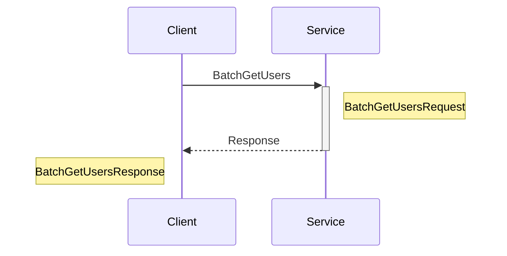

---

### StreamUserUpdates

<a name="streamuserupdates"></a>

#### Method Signature

```protobuf
// Server streaming RPC
rpc StreamUserUpdates(StreamUserUpdatesRequest) returns (stream UserUpdateEvent);
```

#### Method Details

| Attribute | Value |
|-----------|-------|
| **Full Name** | `users.v1.StreamUserUpdates` |
| **Input Type** | [`StreamUserUpdatesRequest`](#streamuserupdatesrequest) |
| **Output Type** | [`UserUpdateEvent`](#userupdateevent) |
| **Streaming Type** | Server Streaming |

##### Sequence Diagram

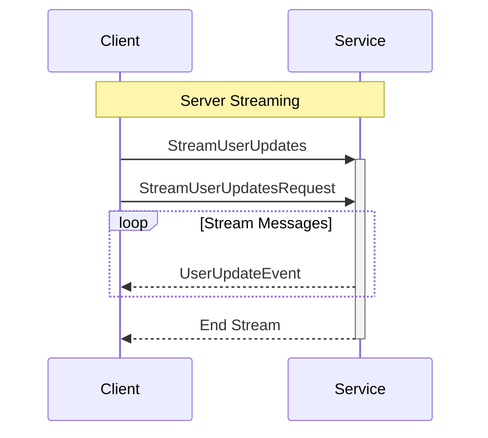

---

### UpdateUserPreferences

<a name="updateuserpreferences"></a>

#### Method Signature

```protobuf
// Client streaming RPC
rpc UpdateUserPreferences(stream PreferenceUpdate) returns (UpdateUserPreferencesResponse);
```

#### Method Details

| Attribute | Value |
|-----------|-------|
| **Full Name** | `users.v1.UpdateUserPreferences` |
| **Input Type** | [`PreferenceUpdate`](#preferenceupdate) |
| **Output Type** | [`UpdateUserPreferencesResponse`](#updateuserpreferencesresponse) |
| **Streaming Type** | Client Streaming |

##### Sequence Diagram

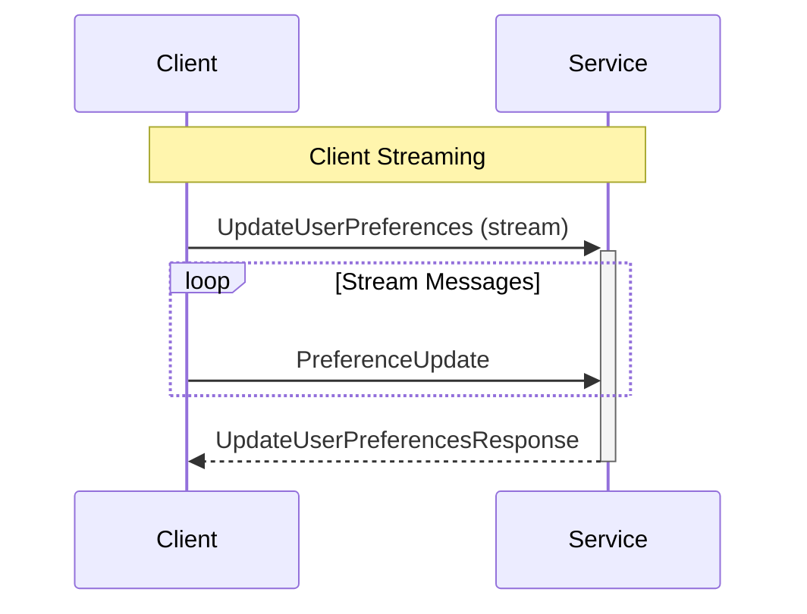

---

### SyncUserData

<a name="syncuserdata"></a>

#### Method Signature

```protobuf
// Bidirectional streaming RPC
rpc SyncUserData(stream UserSyncRequest) returns (stream UserSyncResponse);
```

#### Method Details

| Attribute | Value |
|-----------|-------|
| **Full Name** | `users.v1.SyncUserData` |
| **Input Type** | [`UserSyncRequest`](#usersyncrequest) |
| **Output Type** | [`UserSyncResponse`](#usersyncresponse) |
| **Streaming Type** | Bidirectional Streaming |

##### Sequence Diagram

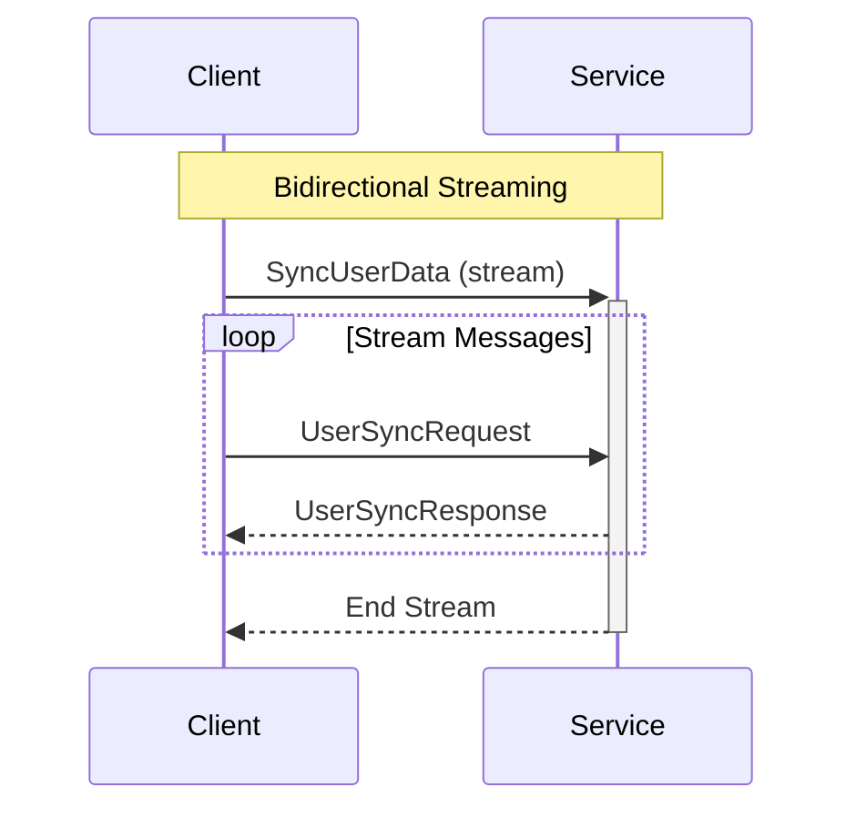

---

## 📦 Messages

<a name="messages"></a>

This service defines **19 message types**:

### SearchUsersResponse

<a name="searchusersresponse"></a>

| Attribute | Value |
|-----------|-------|
| **Full Name** | `users.v1.SearchUsersResponse` |
| **Field Count** | 3 |

#### Fields

| # | Name | Type | Label | Description |
|---|------|------|-------|-------------|
| 1 | `users` | [`User`](#user) | repeated | - |
| 2 | `metadata` | [`SearchMetadata`](#searchmetadata) | optional | - |
| 3 | `pagination` | [`PaginationResponse`](#paginationresponse) | optional | - |

#### Proto Definition

```protobuf
message SearchUsersResponse {
  repeated User users = 1;
  optional SearchMetadata metadata = 2;
  optional PaginationResponse pagination = 3;
}
```

##### Message Structure

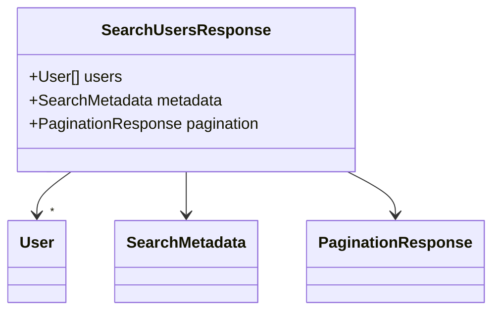

---

### UserSyncRequest

<a name="usersyncrequest"></a>

| Attribute | Value |
|-----------|-------|
| **Full Name** | `users.v1.UserSyncRequest` |
| **Field Count** | 3 |

#### Fields

| # | Name | Type | Label | Description |
|---|------|------|-------|-------------|
| 1 | `initial` | [`InitialSyncRequest`](#initialsyncrequest) | oneof `request` | - |
| 2 | `update` | [`UserDataUpdate`](#userdataupdate) | oneof `request` | - |
| 3 | `ping` | [`Ping`](#ping) | oneof `request` | - |

#### Proto Definition

```protobuf
message UserSyncRequest {

  oneof request {
    InitialSyncRequest initial = 1;
    UserDataUpdate update = 2;
    Ping ping = 3;
  }
}
```

##### Message Structure

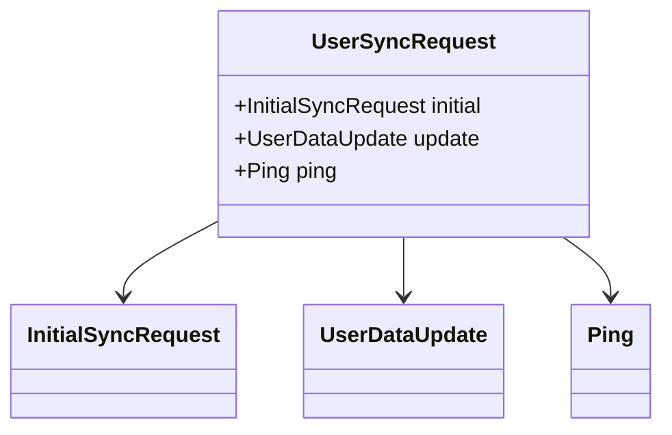

---

### BatchGetUsersResponse

<a name="batchgetusersresponse"></a>

| Attribute | Value |
|-----------|-------|
| **Full Name** | `users.v1.BatchGetUsersResponse` |
| **Field Count** | 2 |
| **Nested Types** | 1 |

#### Fields

| # | Name | Type | Label | Description |
|---|------|------|-------|-------------|
| 1 | `users` | [`UsersEntry`](#usersentry) | repeated | - |
| 2 | `not_found` | TYPE_STRING | repeated | - |

#### Proto Definition

```protobuf
message BatchGetUsersResponse {
  repeated UsersEntry users = 1;
  repeated TYPE_STRING not_found = 2;
}
```

##### Message Structure

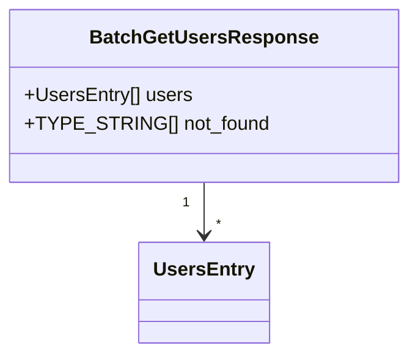

---

### PreferenceUpdate

<a name="preferenceupdate"></a>

| Attribute | Value |
|-----------|-------|
| **Full Name** | `users.v1.PreferenceUpdate` |
| **Field Count** | 3 |

#### Fields

| # | Name | Type | Label | Description |
|---|------|------|-------|-------------|
| 1 | `user_id` | TYPE_STRING | optional | - |
| 2 | `key` | TYPE_STRING | optional | - |
| 3 | `value` | TYPE_STRING | optional | - |

#### Proto Definition

```protobuf
message PreferenceUpdate {
  optional TYPE_STRING user_id = 1;
  optional TYPE_STRING key = 2;
  optional TYPE_STRING value = 3;
}
```

##### Message Structure

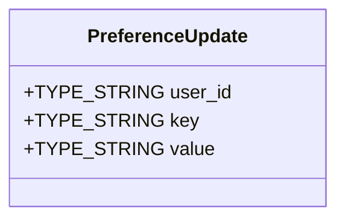

---

### UpdateUserRequest

<a name="updateuserrequest"></a>

| Attribute | Value |
|-----------|-------|
| **Full Name** | `users.v1.UpdateUserRequest` |
| **Field Count** | 3 |

#### Fields

| # | Name | Type | Label | Description |
|---|------|------|-------|-------------|
| 1 | `user_id` | TYPE_STRING | optional | - |
| 2 | `user` | [`User`](#user) | optional | - |
| 3 | `update_mask` | [`FieldMask`](#fieldmask) | optional | - |

#### Proto Definition

```protobuf
message UpdateUserRequest {
  optional TYPE_STRING user_id = 1;
  optional User user = 2;
  optional FieldMask update_mask = 3;
}
```

##### Message Structure

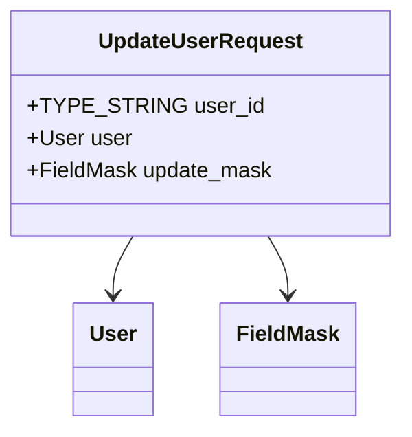

---

### UpdateUserResponse

<a name="updateuserresponse"></a>

| Attribute | Value |
|-----------|-------|
| **Full Name** | `users.v1.UpdateUserResponse` |
| **Field Count** | 1 |

#### Fields

| # | Name | Type | Label | Description |
|---|------|------|-------|-------------|
| 1 | `user` | [`User`](#user) | optional | - |

#### Proto Definition

```protobuf
message UpdateUserResponse {
  optional User user = 1;
}
```

##### Message Structure

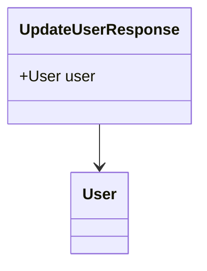

---

### SearchUsersRequest

<a name="searchusersrequest"></a>

| Attribute | Value |
|-----------|-------|
| **Full Name** | `users.v1.SearchUsersRequest` |
| **Field Count** | 3 |

#### Fields

| # | Name | Type | Label | Description |
|---|------|------|-------|-------------|
| 1 | `query` | TYPE_STRING | optional | - |
| 2 | `filters` | [`SearchFilters`](#searchfilters) | optional | - |
| 3 | `pagination` | [`PaginationRequest`](#paginationrequest) | optional | - |

#### Proto Definition

```protobuf
message SearchUsersRequest {
  optional TYPE_STRING query = 1;
  optional SearchFilters filters = 2;
  optional PaginationRequest pagination = 3;
}
```

##### Message Structure

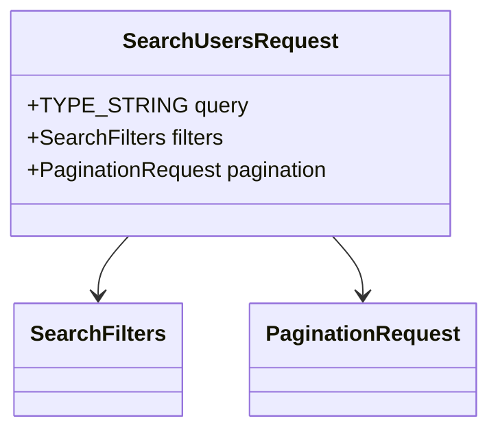

---

### StreamUserUpdatesRequest

<a name="streamuserupdatesrequest"></a>

| Attribute | Value |
|-----------|-------|
| **Full Name** | `users.v1.StreamUserUpdatesRequest` |
| **Field Count** | 2 |

#### Fields

| # | Name | Type | Label | Description |
|---|------|------|-------|-------------|
| 1 | `user_ids` | TYPE_STRING | repeated | - |
| 2 | `event_types` | [`UpdateEventType`](#updateeventtype) | repeated | - |

#### Proto Definition

```protobuf
message StreamUserUpdatesRequest {
  repeated TYPE_STRING user_ids = 1;
  repeated UpdateEventType event_types = 2;
}
```

##### Message Structure

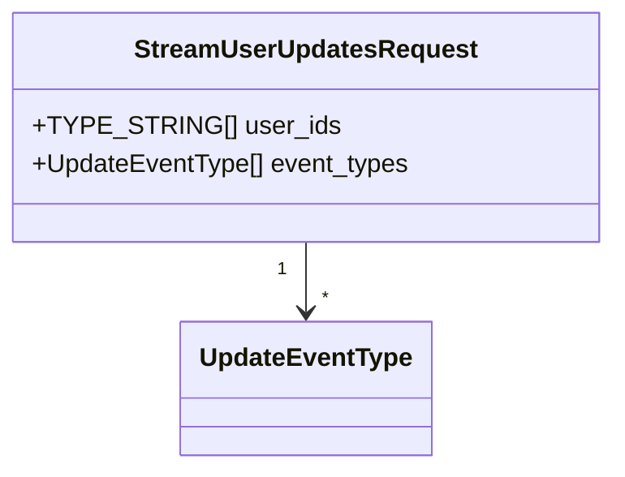

---

### UserUpdateEvent

<a name="userupdateevent"></a>

| Attribute | Value |
|-----------|-------|
| **Full Name** | `users.v1.UserUpdateEvent` |
| **Field Count** | 4 |

#### Fields

| # | Name | Type | Label | Description |
|---|------|------|-------|-------------|
| 1 | `event_type` | [`UpdateEventType`](#updateeventtype) | optional | - |
| 2 | `user` | [`User`](#user) | optional | - |
| 3 | `event_time` | [`Timestamp`](#timestamp) | optional | - |
| 4 | `changed_fields` | TYPE_STRING | repeated | - |

#### Proto Definition

```protobuf
message UserUpdateEvent {
  optional UpdateEventType event_type = 1;
  optional User user = 2;
  optional Timestamp event_time = 3;
  repeated TYPE_STRING changed_fields = 4;
}
```

##### Message Structure

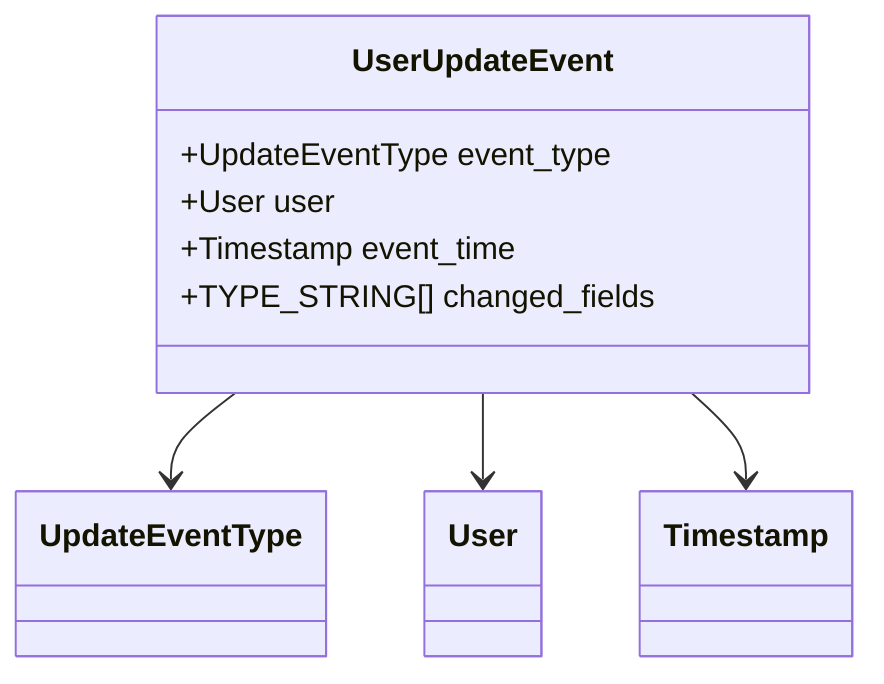

---

### UserSyncResponse

<a name="usersyncresponse"></a>

| Attribute | Value |
|-----------|-------|
| **Full Name** | `users.v1.UserSyncResponse` |
| **Field Count** | 4 |

#### Fields

| # | Name | Type | Label | Description |
|---|------|------|-------|-------------|
| 1 | `ack` | [`SyncAck`](#syncack) | oneof `response` | - |
| 2 | `update` | [`UserDataUpdate`](#userdataupdate) | oneof `response` | - |
| 3 | `pong` | [`Pong`](#pong) | oneof `response` | - |
| 4 | `error` | [`Error`](#error) | oneof `response` | - |

#### Proto Definition

```protobuf
message UserSyncResponse {

  oneof response {
    SyncAck ack = 1;
    UserDataUpdate update = 2;
    Pong pong = 3;
    Error error = 4;
  }
}
```

##### Message Structure

```mermaid
classDiagram
    class UserSyncResponse {
        +SyncAck ack
        +UserDataUpdate update
        +Pong pong
        +Error error
    }
    UserSyncResponse --> SyncAck
    UserSyncResponse --> UserDataUpdate
    UserSyncResponse --> Pong
    UserSyncResponse --> Error
```

---

### CreateUserRequest

<a name="createuserrequest"></a>

| Attribute | Value |
|-----------|-------|
| **Full Name** | `users.v1.CreateUserRequest` |
| **Field Count** | 7 |

#### Fields

| # | Name | Type | Label | Description |
|---|------|------|-------|-------------|
| 1 | `email` | TYPE_STRING | optional | - |
| 2 | `username` | TYPE_STRING | optional | - |
| 3 | `full_name` | TYPE_STRING | optional | - |
| 4 | `password` | TYPE_STRING | optional | - |
| 5 | `profile` | [`UserProfile`](#userprofile) | optional | - |
| 6 | `preferences` | [`UserPreferences`](#userpreferences) | optional | - |
| 7 | `invite_code` | TYPE_STRING | optional | - |

#### Proto Definition

```protobuf
message CreateUserRequest {
  optional TYPE_STRING email = 1;
  optional TYPE_STRING username = 2;
  optional TYPE_STRING full_name = 3;
  optional TYPE_STRING password = 4;
  optional UserProfile profile = 5;
  optional UserPreferences preferences = 6;
  optional TYPE_STRING invite_code = 7;
}
```

##### Message Structure

```mermaid
classDiagram
    class CreateUserRequest {
        +TYPE_STRING email
        +TYPE_STRING username
        +TYPE_STRING full_name
        +TYPE_STRING password
        +UserProfile profile
        +UserPreferences preferences
        +TYPE_STRING invite_code
    }
    CreateUserRequest --> UserProfile
    CreateUserRequest --> UserPreferences
```

---

### CreateUserResponse

<a name="createuserresponse"></a>

| Attribute | Value |
|-----------|-------|
| **Full Name** | `users.v1.CreateUserResponse` |
| **Field Count** | 2 |

#### Fields

| # | Name | Type | Label | Description |
|---|------|------|-------|-------------|
| 1 | `user` | [`User`](#user) | optional | - |
| 2 | `verification_token` | TYPE_STRING | optional | - |

#### Proto Definition

```protobuf
message CreateUserResponse {
  optional User user = 1;
  optional TYPE_STRING verification_token = 2;
}
```

##### Message Structure

```mermaid
classDiagram
    class CreateUserResponse {
        +User user
        +TYPE_STRING verification_token
    }
    CreateUserResponse --> User
```

---

### GetUserRequest

<a name="getuserrequest"></a>

| Attribute | Value |
|-----------|-------|
| **Full Name** | `users.v1.GetUserRequest` |
| **Field Count** | 1 |

#### Fields

| # | Name | Type | Label | Description |
|---|------|------|-------|-------------|
| 1 | `user_id` | TYPE_STRING | optional | - |

#### Proto Definition

```protobuf
message GetUserRequest {
  optional TYPE_STRING user_id = 1;
}
```

##### Message Structure

```mermaid
classDiagram
    class GetUserRequest {
        +TYPE_STRING user_id
    }
```

---

### DeleteUserRequest

<a name="deleteuserrequest"></a>

| Attribute | Value |
|-----------|-------|
| **Full Name** | `users.v1.DeleteUserRequest` |
| **Field Count** | 3 |

#### Fields

| # | Name | Type | Label | Description |
|---|------|------|-------|-------------|
| 1 | `user_id` | TYPE_STRING | optional | - |
| 2 | `hard_delete` | TYPE_BOOL | optional | - |
| 3 | `reason` | TYPE_STRING | optional | - |

#### Proto Definition

```protobuf
message DeleteUserRequest {
  optional TYPE_STRING user_id = 1;
  optional TYPE_BOOL hard_delete = 2;
  optional TYPE_STRING reason = 3;
}
```

##### Message Structure

```mermaid
classDiagram
    class DeleteUserRequest {
        +TYPE_STRING user_id
        +TYPE_BOOL hard_delete
        +TYPE_STRING reason
    }
```

---

### ListUsersRequest

<a name="listusersrequest"></a>

| Attribute | Value |
|-----------|-------|
| **Full Name** | `users.v1.ListUsersRequest` |
| **Field Count** | 5 |

#### Fields

| # | Name | Type | Label | Description |
|---|------|------|-------|-------------|
| 1 | `pagination` | [`PaginationRequest`](#paginationrequest) | optional | - |
| 2 | `role` | [`UserRole`](#userrole) | optional | - |
| 3 | `status` | [`UserStatus`](#userstatus) | optional | - |
| 4 | `sort_by` | TYPE_STRING | optional | - |
| 5 | `sort_order` | TYPE_STRING | optional | - |

#### Proto Definition

```protobuf
message ListUsersRequest {
  optional PaginationRequest pagination = 1;
  optional UserRole role = 2;
  optional UserStatus status = 3;
  optional TYPE_STRING sort_by = 4;
  optional TYPE_STRING sort_order = 5;
}
```

##### Message Structure

```mermaid
classDiagram
    class ListUsersRequest {
        +PaginationRequest pagination
        +UserRole role
        +UserStatus status
        +TYPE_STRING sort_by
        +TYPE_STRING sort_order
    }
    ListUsersRequest --> PaginationRequest
    ListUsersRequest --> UserRole
    ListUsersRequest --> UserStatus
```

---

### ListUsersResponse

<a name="listusersresponse"></a>

| Attribute | Value |
|-----------|-------|
| **Full Name** | `users.v1.ListUsersResponse` |
| **Field Count** | 2 |

#### Fields

| # | Name | Type | Label | Description |
|---|------|------|-------|-------------|
| 1 | `users` | [`User`](#user) | repeated | - |
| 2 | `pagination` | [`PaginationResponse`](#paginationresponse) | optional | - |

#### Proto Definition

```protobuf
message ListUsersResponse {
  repeated User users = 1;
  optional PaginationResponse pagination = 2;
}
```

##### Message Structure

```mermaid
classDiagram
    class ListUsersResponse {
        +User[] users
        +PaginationResponse pagination
    }
    ListUsersResponse "1" --> "*" User
    ListUsersResponse --> PaginationResponse
```

---

### BatchGetUsersRequest

<a name="batchgetusersrequest"></a>

| Attribute | Value |
|-----------|-------|
| **Full Name** | `users.v1.BatchGetUsersRequest` |
| **Field Count** | 1 |

#### Fields

| # | Name | Type | Label | Description |
|---|------|------|-------|-------------|
| 1 | `user_ids` | TYPE_STRING | repeated | - |

#### Proto Definition

```protobuf
message BatchGetUsersRequest {
  repeated TYPE_STRING user_ids = 1;
}
```

##### Message Structure

```mermaid
classDiagram
    class BatchGetUsersRequest {
        +TYPE_STRING[] user_ids
    }
```

---

### UpdateUserPreferencesResponse

<a name="updateuserpreferencesresponse"></a>

| Attribute | Value |
|-----------|-------|
| **Full Name** | `users.v1.UpdateUserPreferencesResponse` |
| **Field Count** | 2 |

#### Fields

| # | Name | Type | Label | Description |
|---|------|------|-------|-------------|
| 1 | `updated_count` | TYPE_INT32 | optional | - |
| 2 | `user` | [`User`](#user) | optional | - |

#### Proto Definition

```protobuf
message UpdateUserPreferencesResponse {
  optional TYPE_INT32 updated_count = 1;
  optional User user = 2;
}
```

##### Message Structure

```mermaid
classDiagram
    class UpdateUserPreferencesResponse {
        +TYPE_INT32 updated_count
        +User user
    }
    UpdateUserPreferencesResponse --> User
```

---

### GetUserResponse

<a name="getuserresponse"></a>

| Attribute | Value |
|-----------|-------|
| **Full Name** | `users.v1.GetUserResponse` |
| **Field Count** | 1 |

#### Fields

| # | Name | Type | Label | Description |
|---|------|------|-------|-------------|
| 1 | `user` | [`User`](#user) | optional | - |

#### Proto Definition

```protobuf
message GetUserResponse {
  optional User user = 1;
}
```

##### Message Structure

```mermaid
classDiagram
    class GetUserResponse {
        +User user
    }
    GetUserResponse --> User
```

---

## 🔢 Enumerations

<a name="enumerations"></a>

This service defines **7 enumeration types**:

### UserRole

<a name="userrole"></a>

| Value | Number | Description |
|-------|--------|-------------|
| `USER_ROLE_UNSPECIFIED` | 0 | - |
| `USER_ROLE_GUEST` | 1 | - |
| `USER_ROLE_USER` | 2 | - |
| `USER_ROLE_MODERATOR` | 3 | - |
| `USER_ROLE_ADMIN` | 4 | - |
| `USER_ROLE_SUPER_ADMIN` | 5 | - |

#### Proto Definition

```protobuf
enum UserRole {
  USER_ROLE_UNSPECIFIED = 0;
  USER_ROLE_GUEST = 1;
  USER_ROLE_USER = 2;
  USER_ROLE_MODERATOR = 3;
  USER_ROLE_ADMIN = 4;
  USER_ROLE_SUPER_ADMIN = 5;
}
```

---

### UserStatus

<a name="userstatus"></a>

| Value | Number | Description |
|-------|--------|-------------|
| `USER_STATUS_UNSPECIFIED` | 0 | - |
| `USER_STATUS_PENDING_VERIFICATION` | 1 | - |
| `USER_STATUS_ACTIVE` | 2 | - |
| `USER_STATUS_SUSPENDED` | 3 | - |
| `USER_STATUS_BANNED` | 4 | - |
| `USER_STATUS_DELETED` | 5 | - |

#### Proto Definition

```protobuf
enum UserStatus {
  USER_STATUS_UNSPECIFIED = 0;
  USER_STATUS_PENDING_VERIFICATION = 1;
  USER_STATUS_ACTIVE = 2;
  USER_STATUS_SUSPENDED = 3;
  USER_STATUS_BANNED = 4;
  USER_STATUS_DELETED = 5;
}
```

---

### Gender

<a name="gender"></a>

| Value | Number | Description |
|-------|--------|-------------|
| `GENDER_UNSPECIFIED` | 0 | - |
| `GENDER_MALE` | 1 | - |
| `GENDER_FEMALE` | 2 | - |
| `GENDER_NON_BINARY` | 3 | - |
| `GENDER_PREFER_NOT_TO_SAY` | 4 | - |

#### Proto Definition

```protobuf
enum Gender {
  GENDER_UNSPECIFIED = 0;
  GENDER_MALE = 1;
  GENDER_FEMALE = 2;
  GENDER_NON_BINARY = 3;
  GENDER_PREFER_NOT_TO_SAY = 4;
}
```

---

### Theme

<a name="theme"></a>

| Value | Number | Description |
|-------|--------|-------------|
| `THEME_UNSPECIFIED` | 0 | - |
| `THEME_LIGHT` | 1 | - |
| `THEME_DARK` | 2 | - |
| `THEME_AUTO` | 3 | - |

#### Proto Definition

```protobuf
enum Theme {
  THEME_UNSPECIFIED = 0;
  THEME_LIGHT = 1;
  THEME_DARK = 2;
  THEME_AUTO = 3;
}
```

---

### NotificationType

<a name="notificationtype"></a>

| Value | Number | Description |
|-------|--------|-------------|
| `NOTIFICATION_TYPE_UNSPECIFIED` | 0 | - |
| `NOTIFICATION_TYPE_ACCOUNT` | 1 | - |
| `NOTIFICATION_TYPE_SECURITY` | 2 | - |
| `NOTIFICATION_TYPE_MARKETING` | 3 | - |
| `NOTIFICATION_TYPE_SOCIAL` | 4 | - |
| `NOTIFICATION_TYPE_TRANSACTION` | 5 | - |

#### Proto Definition

```protobuf
enum NotificationType {
  NOTIFICATION_TYPE_UNSPECIFIED = 0;
  NOTIFICATION_TYPE_ACCOUNT = 1;
  NOTIFICATION_TYPE_SECURITY = 2;
  NOTIFICATION_TYPE_MARKETING = 3;
  NOTIFICATION_TYPE_SOCIAL = 4;
  NOTIFICATION_TYPE_TRANSACTION = 5;
}
```

---

### Visibility

<a name="visibility"></a>

| Value | Number | Description |
|-------|--------|-------------|
| `VISIBILITY_UNSPECIFIED` | 0 | - |
| `VISIBILITY_PUBLIC` | 1 | - |
| `VISIBILITY_FRIENDS` | 2 | - |
| `VISIBILITY_PRIVATE` | 3 | - |

#### Proto Definition

```protobuf
enum Visibility {
  VISIBILITY_UNSPECIFIED = 0;
  VISIBILITY_PUBLIC = 1;
  VISIBILITY_FRIENDS = 2;
  VISIBILITY_PRIVATE = 3;
}
```

---

### UpdateEventType

<a name="updateeventtype"></a>

| Value | Number | Description |
|-------|--------|-------------|
| `UPDATE_EVENT_TYPE_UNSPECIFIED` | 0 | - |
| `UPDATE_EVENT_TYPE_CREATED` | 1 | - |
| `UPDATE_EVENT_TYPE_UPDATED` | 2 | - |
| `UPDATE_EVENT_TYPE_DELETED` | 3 | - |
| `UPDATE_EVENT_TYPE_STATUS_CHANGED` | 4 | - |

#### Proto Definition

```protobuf
enum UpdateEventType {
  UPDATE_EVENT_TYPE_UNSPECIFIED = 0;
  UPDATE_EVENT_TYPE_CREATED = 1;
  UPDATE_EVENT_TYPE_UPDATED = 2;
  UPDATE_EVENT_TYPE_DELETED = 3;
  UPDATE_EVENT_TYPE_STATUS_CHANGED = 4;
}
```

---

## ⚠️ Error Codes

<a name="error-codes"></a>

This service uses standard gRPC status codes:

| gRPC Code | HTTP Status | Description |
|-----------|-------------|-------------|
| `OK` | 200 | Success |
| `CANCELLED` | 499 | Operation cancelled by client |
| `UNKNOWN` | 500 | Unknown error |
| `INVALID_ARGUMENT` | 400 | Client specified an invalid argument |
| `DEADLINE_EXCEEDED` | 504 | Deadline expired before operation could complete |
| `NOT_FOUND` | 404 | Requested entity not found |
| `ALREADY_EXISTS` | 409 | Entity already exists |
| `PERMISSION_DENIED` | 403 | Caller does not have permission |
| `RESOURCE_EXHAUSTED` | 429 | Resource has been exhausted |
| `FAILED_PRECONDITION` | 400 | Operation rejected because system is not in required state |
| `ABORTED` | 409 | Operation aborted, typically due to concurrency issue |
| `OUT_OF_RANGE` | 400 | Operation attempted past valid range |
| `UNIMPLEMENTED` | 501 | Operation not implemented |
| `INTERNAL` | 500 | Internal server error |
| `UNAVAILABLE` | 503 | Service unavailable |
| `DATA_LOSS` | 500 | Unrecoverable data loss or corruption |
| `UNAUTHENTICATED` | 401 | Request does not have valid authentication credentials |

### Error Handling Best Practices

1. **Check status codes**: Always check the gRPC status code before processing responses
2. **Implement retries**: Use exponential backoff for transient errors (`UNAVAILABLE`, `RESOURCE_EXHAUSTED`)
3. **Log errors**: Log error details with correlation IDs for troubleshooting
4. **Handle streaming errors**: Properly handle errors in streaming RPCs
5. **Validate inputs**: Validate inputs client-side to avoid `INVALID_ARGUMENT` errors

---

## 💡 Examples

<a name="examples"></a>

### Go Example

```go
package main

import (
    "context"
    "log"
    "time"

    "google.golang.org/grpc"
    "google.golang.org/grpc/credentials/insecure"

    pb "users.v1"
)

func main() {
    // Connect to the service
    conn, err := grpc.Dial("localhost:50051",
        grpc.WithTransportCredentials(insecure.NewCredentials()))
    if err != nil {
        log.Fatalf("Failed to connect: %v", err)
    }
    defer conn.Close()

    client := pb.NewUserServiceClient(conn)

    // Example RPC call
    ctx, cancel := context.WithTimeout(context.Background(), 5*time.Second)
    defer cancel()

    req := &pb.CreateUserRequest{
        // Fill in request fields
    }

    resp, err := client.CreateUser(ctx, req)
    if err != nil {
        log.Fatalf("RPC failed: %v", err)
    }

    log.Printf("Response: %v", resp)
}
```

### JavaScript (Node.js) Example

```javascript
const grpc = require('@grpc/grpc-js');
const protoLoader = require('@grpc/proto-loader');

// Load proto file
const packageDefinition = protoLoader.loadSync(
    'users/users.proto',
    {
        keepCase: true,
        longs: String,
        enums: String,
        defaults: true,
        oneofs: true
    }
);

const proto = grpc.loadPackageDefinition(packageDefinition);

// Create client
const client = new proto.users.v1.UserService(
    'localhost:50051',
    grpc.credentials.createInsecure()
);

// Example RPC call
const request = {
    // Fill in request fields
};

client.CreateUser(request, (error, response) => {
    if (error) {
        console.error('RPC failed:', error);
        return;
    }
    console.log('Response:', response);
});
```

---

---

<div align="center">

**Generated Documentation**

| Attribute | Value |
|-----------|-------|
| Generated At | 0001-01-01 00:00:00 UTC |
| Generator Version |  |

📚 **Documentation** | 🔧 **ProtoDocs** | ✨ **Auto-Generated**

</div>
