# 📚 UserService API Documentation

| **Attribute** | **Value** |
|---------------|----------|
| **Service Name** | `UserService` |
| **Package** | `users.v1` |
| **Version** |  |
| **Proto File** | `users/users.proto` |
| **Generated** | 0001-01-01T00:00:00Z |

UserService manages user accounts and profiles

---

## 📑 Table of Contents

- [Overview](#overview)
- [Architecture](#architecture)
- [Methods](#methods)
  - [CreateUser](#createuser)
  - [GetUser](#getuser)
  - [UpdateUser](#updateuser)
  - [DeleteUser](#deleteuser)
  - [ListUsers](#listusers)
  - [SearchUsers](#searchusers)
  - [BatchGetUsers](#batchgetusers)
  - [StreamUserUpdates](#streamuserupdates)
  - [UpdateUserPreferences](#updateuserpreferences)
  - [SyncUserData](#syncuserdata)
- [Messages](#messages)
  - [UpdateUserPreferencesResponse](#updateuserpreferencesresponse)
  - [UserPreferences](#userpreferences)
  - [InitialSyncRequest](#initialsyncrequest)
  - [UserDataUpdate](#userdataupdate)
  - [Ping](#ping)
  - [ListUsersResponse](#listusersresponse)
  - [SearchUsersResponse](#searchusersresponse)
  - [UserUpdateEvent](#userupdateevent)
  - [PrivacySettings](#privacysettings)
  - [SecuritySettings](#securitysettings)
  - [DateRange](#daterange)
  - [CreateUserRequest](#createuserrequest)
  - [StreamUserUpdatesRequest](#streamuserupdatesrequest)
  - [TrustedDevice](#trusteddevice)
  - [DeleteUserRequest](#deleteuserrequest)
  - [UserSyncRequest](#usersyncrequest)
  - [User](#user)
  - [SearchMetadata](#searchmetadata)
  - [Pong](#pong)
  - [NotificationPreferences](#notificationpreferences)
  - [GetUserResponse](#getuserresponse)
  - [UpdateUserResponse](#updateuserresponse)
  - [BatchGetUsersResponse](#batchgetusersresponse)
  - [UserProfile](#userprofile)
  - [UpdateUserRequest](#updateuserrequest)
  - [SearchUsersRequest](#searchusersrequest)
  - [BatchGetUsersRequest](#batchgetusersrequest)
  - [UserSyncResponse](#usersyncresponse)
  - [LoginAttempts](#loginattempts)
  - [SearchFilters](#searchfilters)
  - [SyncAck](#syncack)
  - [QuietHours](#quiethours)
  - [GetUserRequest](#getuserrequest)
  - [CreateUserResponse](#createuserresponse)
  - [ListUsersRequest](#listusersrequest)
  - [PreferenceUpdate](#preferenceupdate)
- [Enumerations](#enumerations)
- [Error Codes](#error-codes)
- [Examples](#examples)

---

## 📖 Overview

<a name="overview"></a>

### Service Statistics

| Metric | Count |
|--------|-------|
| **RPC Methods** | 10 |
| **Message Types** | 36 |
| **Enumerations** | 7 |
| **Streaming RPCs** | 3 |

### Quick Start

This service provides the following capabilities:

- [`CreateUser`](#createuser): CreateUser creates a new user account
- [`GetUser`](#getuser): GetUser retrieves a user by ID
- [`UpdateUser`](#updateuser): UpdateUser updates an existing user
- [`DeleteUser`](#deleteuser): DeleteUser soft-deletes a user
- [`ListUsers`](#listusers): ListUsers lists users with pagination
- ... and 5 more methods

---

## 🏗️ Architecture

<a name="architecture"></a>

```mermaid
graph TB
    classDef serviceClass fill:#e1f5ff,stroke:#01579b,stroke-width:3px
    classDef methodClass fill:#f3e5f5,stroke:#4a148c,stroke-width:2px
    classDef messageClass fill:#e8f5e9,stroke:#1b5e20,stroke-width:2px

    UserService[🔧 UserService]:::serviceClass

    CreateUser[CreateUser]:::methodClass
    UserService --> CreateUser
    CreateUser_in[📥 CreateUserRequest]:::messageClass
    CreateUser_out[📤 CreateUserResponse]:::messageClass
    CreateUser_in -.->|input| CreateUser
    CreateUser -.->|output| CreateUser_out
    GetUser[GetUser]:::methodClass
    UserService --> GetUser
    GetUser_in[📥 GetUserRequest]:::messageClass
    GetUser_out[📤 GetUserResponse]:::messageClass
    GetUser_in -.->|input| GetUser
    GetUser -.->|output| GetUser_out
    UpdateUser[UpdateUser]:::methodClass
    UserService --> UpdateUser
    UpdateUser_in[📥 UpdateUserRequest]:::messageClass
    UpdateUser_out[📤 UpdateUserResponse]:::messageClass
    UpdateUser_in -.->|input| UpdateUser
    UpdateUser -.->|output| UpdateUser_out
    DeleteUser[DeleteUser]:::methodClass
    UserService --> DeleteUser
    DeleteUser_in[📥 DeleteUserRequest]:::messageClass
    DeleteUser_out[📤 Empty]:::messageClass
    DeleteUser_in -.->|input| DeleteUser
    DeleteUser -.->|output| DeleteUser_out
    ListUsers[ListUsers]:::methodClass
    UserService --> ListUsers
    ListUsers_in[📥 ListUsersRequest]:::messageClass
    ListUsers_out[📤 ListUsersResponse]:::messageClass
    ListUsers_in -.->|input| ListUsers
    ListUsers -.->|output| ListUsers_out
    SearchUsers[SearchUsers]:::methodClass
    UserService --> SearchUsers
    SearchUsers_in[📥 SearchUsersRequest]:::messageClass
    SearchUsers_out[📤 SearchUsersResponse]:::messageClass
    SearchUsers_in -.->|input| SearchUsers
    SearchUsers -.->|output| SearchUsers_out
    BatchGetUsers[BatchGetUsers]:::methodClass
    UserService --> BatchGetUsers
    BatchGetUsers_in[📥 BatchGetUsersRequest]:::messageClass
    BatchGetUsers_out[📤 BatchGetUsersResponse]:::messageClass
    BatchGetUsers_in -.->|input| BatchGetUsers
    BatchGetUsers -.->|output| BatchGetUsers_out
    StreamUserUpdates[↓ StreamUserUpdates]:::methodClass
    UserService --> StreamUserUpdates
    StreamUserUpdates_in[📥 StreamUserUpdatesRequest]:::messageClass
    StreamUserUpdates_out[📤 UserUpdateEvent]:::messageClass
    StreamUserUpdates_in -.->|input| StreamUserUpdates
    StreamUserUpdates -.->|output| StreamUserUpdates_out
    UpdateUserPreferences[↑ UpdateUserPreferences]:::methodClass
    UserService --> UpdateUserPreferences
    UpdateUserPreferences_in[📥 PreferenceUpdate]:::messageClass
    UpdateUserPreferences_out[📤 UpdateUserPreferencesResponse]:::messageClass
    UpdateUserPreferences_in -.->|input| UpdateUserPreferences
    UpdateUserPreferences -.->|output| UpdateUserPreferences_out
    SyncUserData[↔️ SyncUserData]:::methodClass
    UserService --> SyncUserData
    SyncUserData_in[📥 UserSyncRequest]:::messageClass
    SyncUserData_out[📤 UserSyncResponse]:::messageClass
    SyncUserData_in -.->|input| SyncUserData
    SyncUserData -.->|output| SyncUserData_out
```

---

## ⚙️ Methods

<a name="methods"></a>

This service defines **10 RPC methods**:

### CreateUser

<a name="createuser"></a>

CreateUser creates a new user account

#### Method Signature

```protobuf
// Unary RPC
rpc CreateUser(CreateUserRequest) returns (CreateUserResponse);
```

#### Method Details

| Attribute | Value |
|-----------|-------|
| **Full Name** | `users.v1.CreateUser` |
| **Input Type** | [`CreateUserRequest`](#createuserrequest) |
| **Output Type** | [`CreateUserResponse`](#createuserresponse) |
| **Streaming Type** | Unary |

##### Sequence Diagram

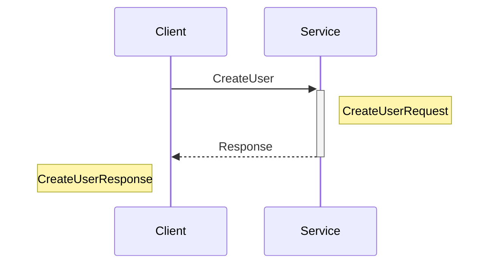

---

### GetUser

<a name="getuser"></a>

GetUser retrieves a user by ID

#### Method Signature

```protobuf
// Unary RPC
rpc GetUser(GetUserRequest) returns (GetUserResponse);
```

#### Method Details

| Attribute | Value |
|-----------|-------|
| **Full Name** | `users.v1.GetUser` |
| **Input Type** | [`GetUserRequest`](#getuserrequest) |
| **Output Type** | [`GetUserResponse`](#getuserresponse) |
| **Streaming Type** | Unary |

##### Sequence Diagram

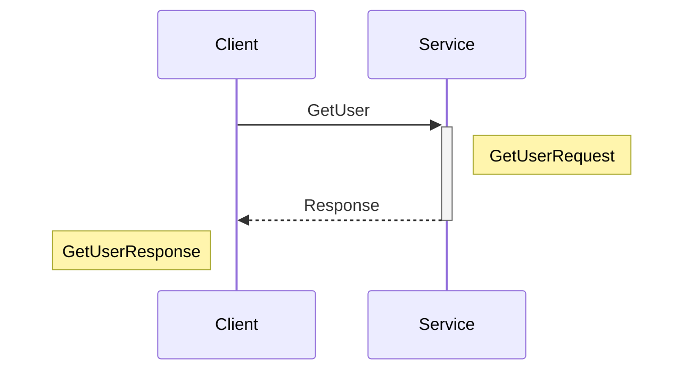

---

### UpdateUser

<a name="updateuser"></a>

UpdateUser updates an existing user

#### Method Signature

```protobuf
// Unary RPC
rpc UpdateUser(UpdateUserRequest) returns (UpdateUserResponse);
```

#### Method Details

| Attribute | Value |
|-----------|-------|
| **Full Name** | `users.v1.UpdateUser` |
| **Input Type** | [`UpdateUserRequest`](#updateuserrequest) |
| **Output Type** | [`UpdateUserResponse`](#updateuserresponse) |
| **Streaming Type** | Unary |

##### Sequence Diagram

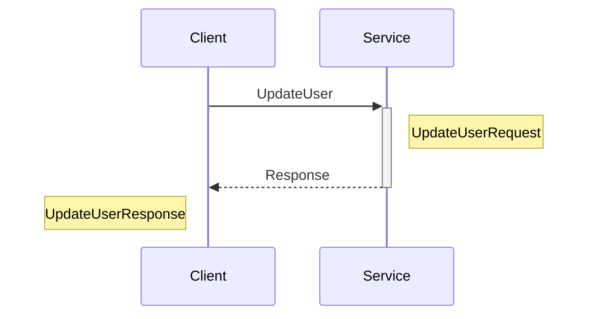

---

### DeleteUser

<a name="deleteuser"></a>

DeleteUser soft-deletes a user

#### Method Signature

```protobuf
// Unary RPC
rpc DeleteUser(DeleteUserRequest) returns (Empty);
```

#### Method Details

| Attribute | Value |
|-----------|-------|
| **Full Name** | `users.v1.DeleteUser` |
| **Input Type** | [`DeleteUserRequest`](#deleteuserrequest) |
| **Output Type** | [`Empty`](#empty) |
| **Streaming Type** | Unary |

##### Sequence Diagram

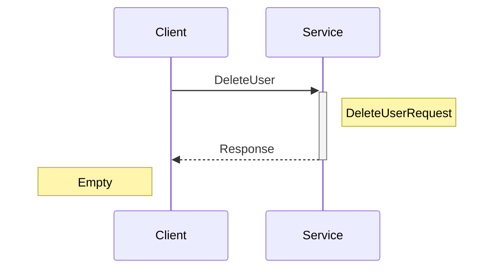

---

### ListUsers

<a name="listusers"></a>

ListUsers lists users with pagination

#### Method Signature

```protobuf
// Unary RPC
rpc ListUsers(ListUsersRequest) returns (ListUsersResponse);
```

#### Method Details

| Attribute | Value |
|-----------|-------|
| **Full Name** | `users.v1.ListUsers` |
| **Input Type** | [`ListUsersRequest`](#listusersrequest) |
| **Output Type** | [`ListUsersResponse`](#listusersresponse) |
| **Streaming Type** | Unary |

##### Sequence Diagram


---

### SearchUsers

<a name="searchusers"></a>

SearchUsers searches users by criteria

#### Method Signature

```protobuf
// Unary RPC
rpc SearchUsers(SearchUsersRequest) returns (SearchUsersResponse);
```

#### Method Details

| Attribute | Value |
|-----------|-------|
| **Full Name** | `users.v1.SearchUsers` |
| **Input Type** | [`SearchUsersRequest`](#searchusersrequest) |
| **Output Type** | [`SearchUsersResponse`](#searchusersresponse) |
| **Streaming Type** | Unary |

##### Sequence Diagram

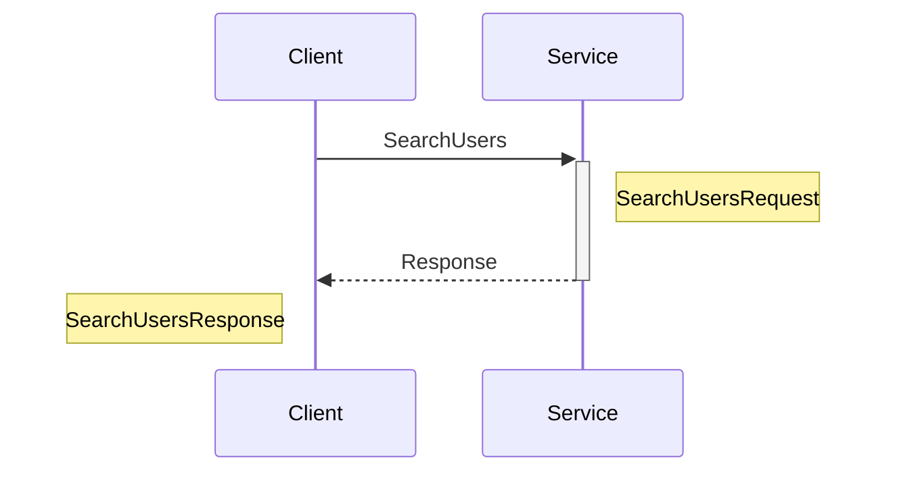

---

### BatchGetUsers

<a name="batchgetusers"></a>

BatchGetUsers retrieves multiple users

#### Method Signature

```protobuf
// Unary RPC
rpc BatchGetUsers(BatchGetUsersRequest) returns (BatchGetUsersResponse);
```

#### Method Details

| Attribute | Value |
|-----------|-------|
| **Full Name** | `users.v1.BatchGetUsers` |
| **Input Type** | [`BatchGetUsersRequest`](#batchgetusersrequest) |
| **Output Type** | [`BatchGetUsersResponse`](#batchgetusersresponse) |
| **Streaming Type** | Unary |

##### Sequence Diagram

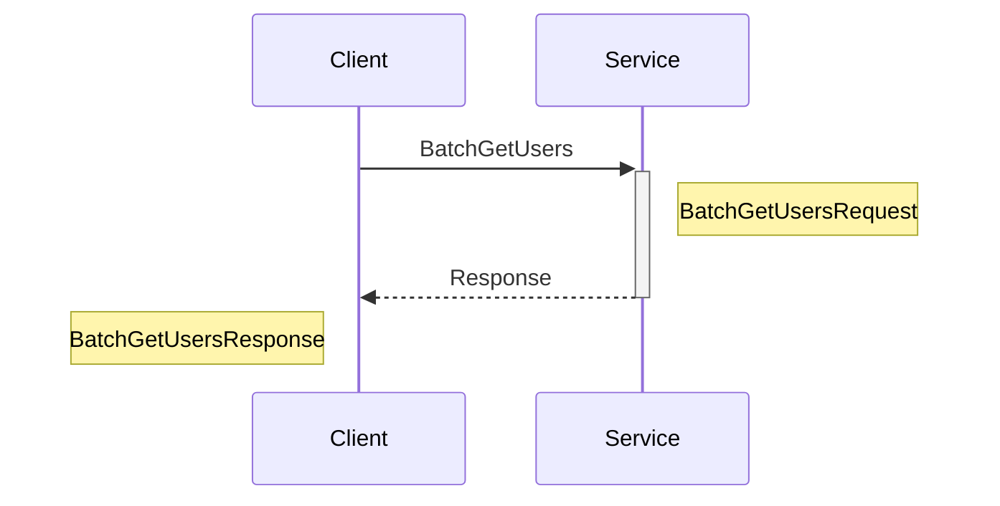

---

### StreamUserUpdates

<a name="streamuserupdates"></a>

StreamUserUpdates streams real-time user updates (server streaming)

#### Method Signature

```protobuf
// Server streaming RPC
rpc StreamUserUpdates(StreamUserUpdatesRequest) returns (stream UserUpdateEvent);
```

#### Method Details

| Attribute | Value |
|-----------|-------|
| **Full Name** | `users.v1.StreamUserUpdates` |
| **Input Type** | [`StreamUserUpdatesRequest`](#streamuserupdatesrequest) |
| **Output Type** | [`UserUpdateEvent`](#userupdateevent) |
| **Streaming Type** | Server Streaming |

##### Sequence Diagram

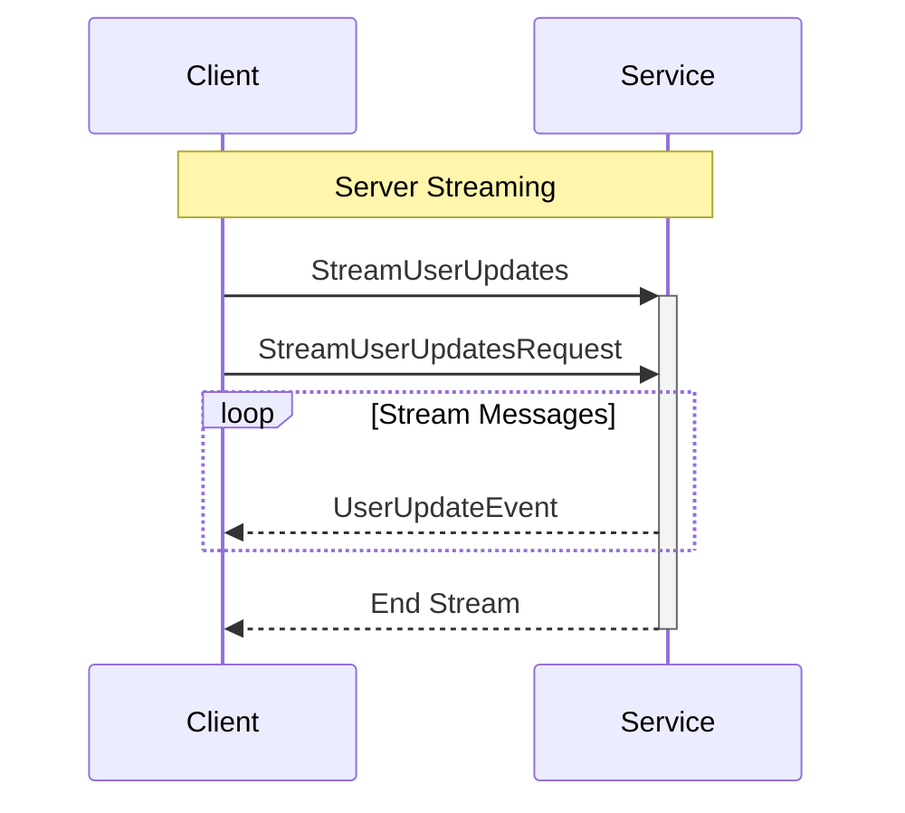

---

### UpdateUserPreferences

<a name="updateuserpreferences"></a>

UpdateUserPreferences updates user preferences (client streaming)

#### Method Signature

```protobuf
// Client streaming RPC
rpc UpdateUserPreferences(stream PreferenceUpdate) returns (UpdateUserPreferencesResponse);
```

#### Method Details

| Attribute | Value |
|-----------|-------|
| **Full Name** | `users.v1.UpdateUserPreferences` |
| **Input Type** | [`PreferenceUpdate`](#preferenceupdate) |
| **Output Type** | [`UpdateUserPreferencesResponse`](#updateuserpreferencesresponse) |
| **Streaming Type** | Client Streaming |

##### Sequence Diagram

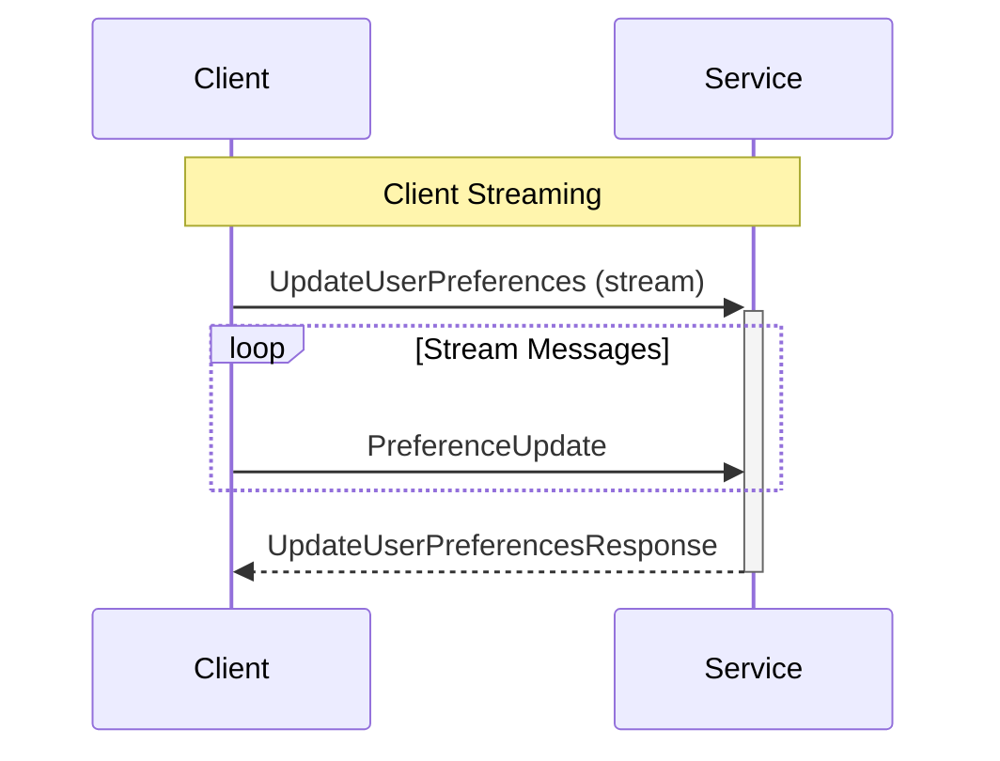

---

### SyncUserData

<a name="syncuserdata"></a>

SyncUserData bidirectional streaming for real-time sync

#### Method Signature

```protobuf
// Bidirectional streaming RPC
rpc SyncUserData(stream UserSyncRequest) returns (stream UserSyncResponse);
```

#### Method Details

| Attribute | Value |
|-----------|-------|
| **Full Name** | `users.v1.SyncUserData` |
| **Input Type** | [`UserSyncRequest`](#usersyncrequest) |
| **Output Type** | [`UserSyncResponse`](#usersyncresponse) |
| **Streaming Type** | Bidirectional Streaming |

##### Sequence Diagram

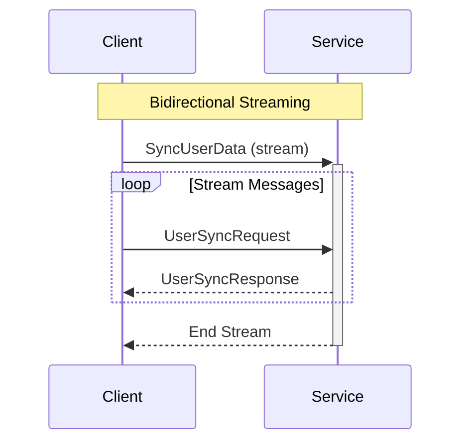

---

## 📦 Messages

<a name="messages"></a>

This service defines **36 message types**:

### UpdateUserPreferencesResponse

<a name="updateuserpreferencesresponse"></a>

UpdateUserPreferencesResponse confirms preference updates

| Attribute | Value |
|-----------|-------|
| **Full Name** | `users.v1.UpdateUserPreferencesResponse` |
| **Field Count** | 2 |

#### Fields

| # | Name | Type | Label | Description |
|---|------|------|-------|-------------|
| 1 | `updated_count` | int32 | optional | Number of preferences updated |
| 2 | `user` | [`User`](#user) | optional | Updated user |

#### Proto Definition

```protobuf
message UpdateUserPreferencesResponse {
  // Number of preferences updated
  optional int32 updated_count = 1;
  // Updated user
  optional User user = 2;
}
```

##### Message Structure

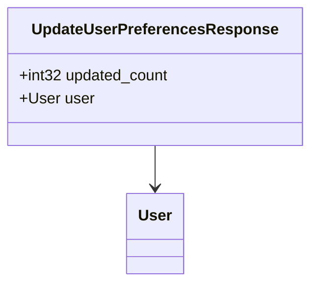

---

### UserPreferences

<a name="userpreferences"></a>

UserPreferences contains user preferences

| Attribute | Value |
|-----------|-------|
| **Full Name** | `users.v1.UserPreferences` |
| **Field Count** | 6 |
| **Nested Types** | 1 |

#### Fields

| # | Name | Type | Label | Description |
|---|------|------|-------|-------------|
| 1 | `language` | string | optional | Language preference (ISO 639-1) |
| 2 | `timezone` | string | optional | Timezone (IANA timezone) |
| 3 | `theme` | [`Theme`](#theme) | optional | Theme preference |
| 4 | `notifications` | [`NotificationPreferences`](#notificationpreferences) | optional | Notification preferences |
| 5 | `privacy` | [`PrivacySettings`](#privacysettings) | optional | Privacy settings |
| 6 | `display` | map<string, string> |  | Display preferences |

#### Proto Definition

```protobuf
message UserPreferences {
  // Language preference (ISO 639-1)
  optional string language = 1;
  // Timezone (IANA timezone)
  optional string timezone = 2;
  // Theme preference
  optional Theme theme = 3;
  // Notification preferences
  optional NotificationPreferences notifications = 4;
  // Privacy settings
  optional PrivacySettings privacy = 5;
  // Display preferences
   map<string, string> display = 6;
}
```

##### Message Structure

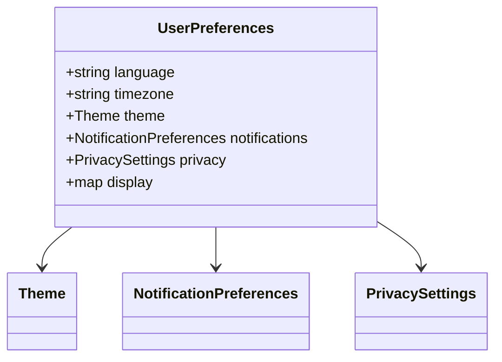

---

### InitialSyncRequest

<a name="initialsyncrequest"></a>

InitialSyncRequest initiates sync

| Attribute | Value |
|-----------|-------|
| **Full Name** | `users.v1.InitialSyncRequest` |
| **Field Count** | 2 |

#### Fields

| # | Name | Type | Label | Description |
|---|------|------|-------|-------------|
| 1 | `user_id` | string | optional | User ID |
| 2 | `last_sync_at` | [`Timestamp`](#timestamp) | optional | Last sync timestamp |

#### Proto Definition

```protobuf
message InitialSyncRequest {
  // User ID
  optional string user_id = 1;
  // Last sync timestamp
  optional Timestamp last_sync_at = 2;
}
```

##### Message Structure

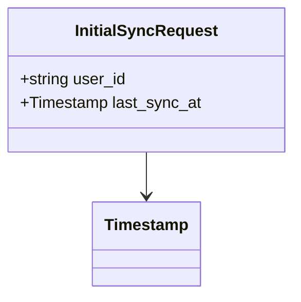

---

### UserDataUpdate

<a name="userdataupdate"></a>

UserDataUpdate represents data changes

| Attribute | Value |
|-----------|-------|
| **Full Name** | `users.v1.UserDataUpdate` |
| **Field Count** | 2 |
| **Nested Types** | 1 |

#### Fields

| # | Name | Type | Label | Description |
|---|------|------|-------|-------------|
| 1 | `fields` | map<string, string> |  | Updated fields |
| 2 | `updated_at` | [`Timestamp`](#timestamp) | optional | Update timestamp |

#### Proto Definition

```protobuf
message UserDataUpdate {
  // Updated fields
   map<string, string> fields = 1;
  // Update timestamp
  optional Timestamp updated_at = 2;
}
```

##### Message Structure

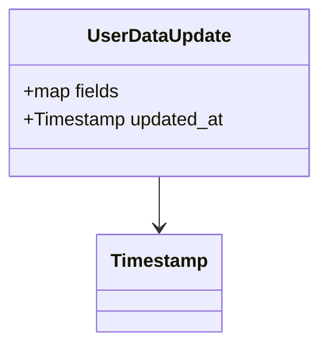

---

### Ping

<a name="ping"></a>

Ping for keep-alive

| Attribute | Value |
|-----------|-------|
| **Full Name** | `users.v1.Ping` |
| **Field Count** | 1 |

#### Fields

| # | Name | Type | Label | Description |
|---|------|------|-------|-------------|
| 1 | `timestamp` | [`Timestamp`](#timestamp) | optional | Timestamp |

#### Proto Definition

```protobuf
message Ping {
  // Timestamp
  optional Timestamp timestamp = 1;
}
```

##### Message Structure

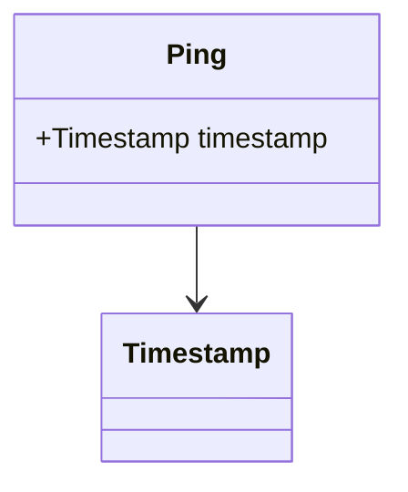

---

### ListUsersResponse

<a name="listusersresponse"></a>

ListUsersResponse returns list of users

| Attribute | Value |
|-----------|-------|
| **Full Name** | `users.v1.ListUsersResponse` |
| **Field Count** | 2 |

#### Fields

| # | Name | Type | Label | Description |
|---|------|------|-------|-------------|
| 1 | `users` | [`User`](#user) | repeated | Users list |
| 2 | `pagination` | [`PaginationResponse`](#paginationresponse) | optional | Pagination metadata |

#### Proto Definition

```protobuf
message ListUsersResponse {
  // Users list
  repeated User users = 1;
  // Pagination metadata
  optional PaginationResponse pagination = 2;
}
```

##### Message Structure

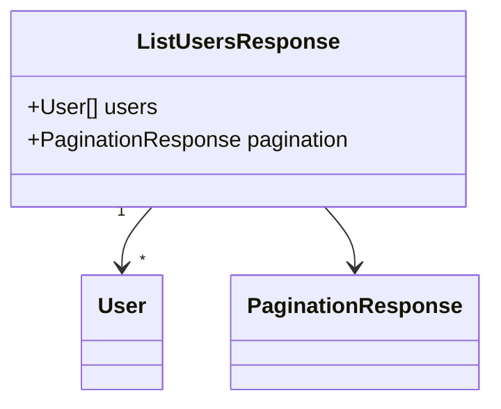

---

### SearchUsersResponse

<a name="searchusersresponse"></a>

SearchUsersResponse returns search results

| Attribute | Value |
|-----------|-------|
| **Full Name** | `users.v1.SearchUsersResponse` |
| **Field Count** | 3 |

#### Fields

| # | Name | Type | Label | Description |
|---|------|------|-------|-------------|
| 1 | `users` | [`User`](#user) | repeated | Matched users |
| 2 | `metadata` | [`SearchMetadata`](#searchmetadata) | optional | Search metadata |
| 3 | `pagination` | [`PaginationResponse`](#paginationresponse) | optional | Pagination |

#### Proto Definition

```protobuf
message SearchUsersResponse {
  // Matched users
  repeated User users = 1;
  // Search metadata
  optional SearchMetadata metadata = 2;
  // Pagination
  optional PaginationResponse pagination = 3;
}
```

##### Message Structure

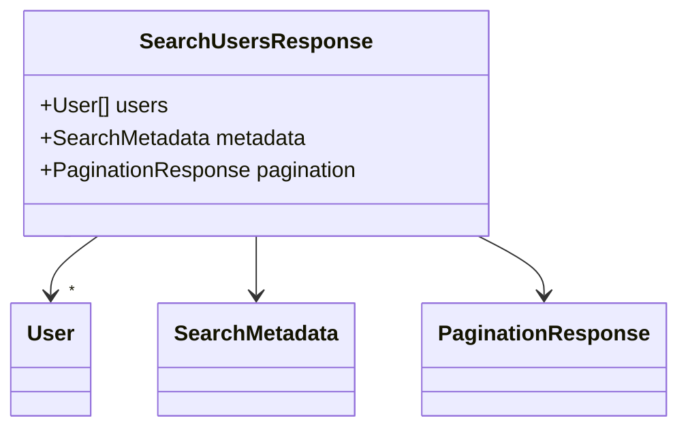

---

### UserUpdateEvent

<a name="userupdateevent"></a>

UserUpdateEvent represents a user update event

| Attribute | Value |
|-----------|-------|
| **Full Name** | `users.v1.UserUpdateEvent` |
| **Field Count** | 4 |

#### Fields

| # | Name | Type | Label | Description |
|---|------|------|-------|-------------|
| 1 | `event_type` | [`UpdateEventType`](#updateeventtype) | optional | Event type |
| 2 | `user` | [`User`](#user) | optional | User that was updated |
| 3 | `event_time` | [`Timestamp`](#timestamp) | optional | Timestamp of event |
| 4 | `changed_fields` | string | repeated | Changed fields |

#### Proto Definition

```protobuf
message UserUpdateEvent {
  // Event type
  optional UpdateEventType event_type = 1;
  // User that was updated
  optional User user = 2;
  // Timestamp of event
  optional Timestamp event_time = 3;
  // Changed fields
  repeated string changed_fields = 4;
}
```

##### Message Structure

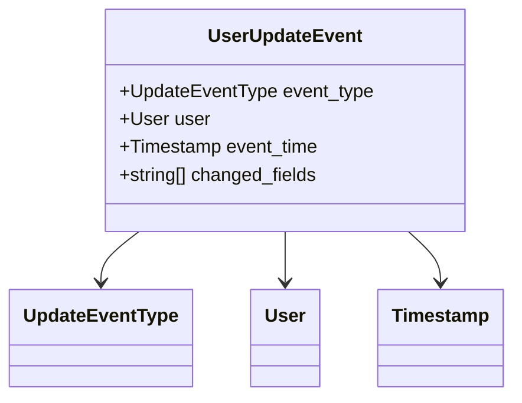

---

### PrivacySettings

<a name="privacysettings"></a>

PrivacySettings contains privacy preferences

| Attribute | Value |
|-----------|-------|
| **Full Name** | `users.v1.PrivacySettings` |
| **Field Count** | 5 |

#### Fields

| # | Name | Type | Label | Description |
|---|------|------|-------|-------------|
| 1 | `profile_visibility` | [`Visibility`](#visibility) | optional | Profile visibility |
| 2 | `show_email` | bool | optional | Show email to others |
| 3 | `show_phone` | bool | optional | Show phone to others |
| 4 | `searchable` | bool | optional | Allow search engines to index |
| 5 | `data_sharing_consent` | bool | optional | Data sharing consent |

#### Proto Definition

```protobuf
message PrivacySettings {
  // Profile visibility
  optional Visibility profile_visibility = 1;
  // Show email to others
  optional bool show_email = 2;
  // Show phone to others
  optional bool show_phone = 3;
  // Allow search engines to index
  optional bool searchable = 4;
  // Data sharing consent
  optional bool data_sharing_consent = 5;
}
```

##### Message Structure

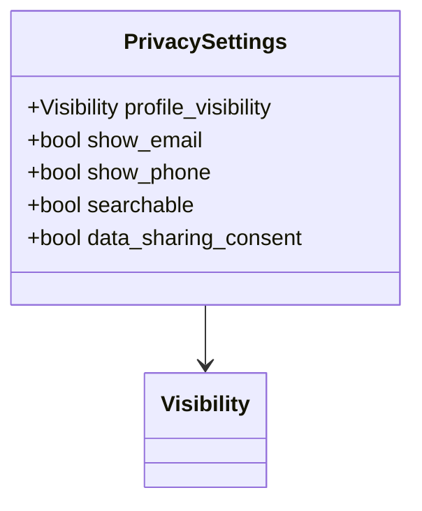

---

### SecuritySettings

<a name="securitysettings"></a>

SecuritySettings contains security configuration

| Attribute | Value |
|-----------|-------|
| **Full Name** | `users.v1.SecuritySettings` |
| **Field Count** | 4 |

#### Fields

| # | Name | Type | Label | Description |
|---|------|------|-------|-------------|
| 1 | `password_changed_at` | [`Timestamp`](#timestamp) | optional | Password last changed |
| 2 | `active_sessions` | int32 | optional | Active sessions count |
| 3 | `trusted_devices` | [`TrustedDevice`](#trusteddevice) | repeated | Trusted devices |
| 4 | `login_attempts` | [`LoginAttempts`](#loginattempts) | optional | Login attempt tracking |

#### Proto Definition

```protobuf
message SecuritySettings {
  // Password last changed
  optional Timestamp password_changed_at = 1;
  // Active sessions count
  optional int32 active_sessions = 2;
  // Trusted devices
  repeated TrustedDevice trusted_devices = 3;
  // Login attempt tracking
  optional LoginAttempts login_attempts = 4;
}
```

##### Message Structure

```mermaid
classDiagram
    class SecuritySettings {
        +Timestamp password_changed_at
        +int32 active_sessions
        +TrustedDevice[] trusted_devices
        +LoginAttempts login_attempts
    }
    SecuritySettings --> Timestamp
    SecuritySettings "1" --> "*" TrustedDevice
    SecuritySettings --> LoginAttempts
```

---

### DateRange

<a name="daterange"></a>

DateRange represents a date range

| Attribute | Value |
|-----------|-------|
| **Full Name** | `users.v1.DateRange` |
| **Field Count** | 2 |

#### Fields

| # | Name | Type | Label | Description |
|---|------|------|-------|-------------|
| 1 | `start` | [`Timestamp`](#timestamp) | optional | Start date |
| 2 | `end` | [`Timestamp`](#timestamp) | optional | End date |

#### Proto Definition

```protobuf
message DateRange {
  // Start date
  optional Timestamp start = 1;
  // End date
  optional Timestamp end = 2;
}
```

##### Message Structure

```mermaid
classDiagram
    class DateRange {
        +Timestamp start
        +Timestamp end
    }
    DateRange --> Timestamp
    DateRange --> Timestamp
```

---

### CreateUserRequest

<a name="createuserrequest"></a>

CreateUserRequest creates a new user

| Attribute | Value |
|-----------|-------|
| **Full Name** | `users.v1.CreateUserRequest` |
| **Field Count** | 7 |

#### Fields

| # | Name | Type | Label | Description |
|---|------|------|-------|-------------|
| 1 | `email` | string | optional | Email address |
| 2 | `username` | string | optional | Username |
| 3 | `full_name` | string | optional | Full name |
| 4 | `password` | string | optional | Password (will be hashed) |
| 5 | `profile` | [`UserProfile`](#userprofile) | optional | Initial profile data |
| 6 | `preferences` | [`UserPreferences`](#userpreferences) | optional | Initial preferences |
| 7 | `invite_code` | string | optional | Invite code (optional) |

#### Proto Definition

```protobuf
message CreateUserRequest {
  // Email address
  optional string email = 1;
  // Username
  optional string username = 2;
  // Full name
  optional string full_name = 3;
  // Password (will be hashed)
  optional string password = 4;
  // Initial profile data
  optional UserProfile profile = 5;
  // Initial preferences
  optional UserPreferences preferences = 6;
  // Invite code (optional)
  optional string invite_code = 7;
}
```

##### Message Structure

```mermaid
classDiagram
    class CreateUserRequest {
        +string email
        +string username
        +string full_name
        +string password
        +UserProfile profile
        +UserPreferences preferences
        +string invite_code
    }
    CreateUserRequest --> UserProfile
    CreateUserRequest --> UserPreferences
```

---

### StreamUserUpdatesRequest

<a name="streamuserupdatesrequest"></a>

StreamUserUpdatesRequest initiates user update stream

| Attribute | Value |
|-----------|-------|
| **Full Name** | `users.v1.StreamUserUpdatesRequest` |
| **Field Count** | 2 |

#### Fields

| # | Name | Type | Label | Description |
|---|------|------|-------|-------------|
| 1 | `user_ids` | string | repeated | User IDs to watch |
| 2 | `event_types` | [`UpdateEventType`](#updateeventtype) | repeated | Event types to receive |

#### Proto Definition

```protobuf
message StreamUserUpdatesRequest {
  // User IDs to watch
  repeated string user_ids = 1;
  // Event types to receive
  repeated UpdateEventType event_types = 2;
}
```

##### Message Structure

```mermaid
classDiagram
    class StreamUserUpdatesRequest {
        +string[] user_ids
        +UpdateEventType[] event_types
    }
    StreamUserUpdatesRequest "1" --> "*" UpdateEventType
```

---

### TrustedDevice

<a name="trusteddevice"></a>

TrustedDevice represents a trusted device

| Attribute | Value |
|-----------|-------|
| **Full Name** | `users.v1.TrustedDevice` |
| **Field Count** | 4 |

#### Fields

| # | Name | Type | Label | Description |
|---|------|------|-------|-------------|
| 1 | `device_id` | string | optional | Device ID |
| 2 | `device_name` | string | optional | Device name |
| 3 | `last_used_at` | [`Timestamp`](#timestamp) | optional | Last used timestamp |
| 4 | `fingerprint` | string | optional | Device fingerprint |

#### Proto Definition

```protobuf
message TrustedDevice {
  // Device ID
  optional string device_id = 1;
  // Device name
  optional string device_name = 2;
  // Last used timestamp
  optional Timestamp last_used_at = 3;
  // Device fingerprint
  optional string fingerprint = 4;
}
```

##### Message Structure

```mermaid
classDiagram
    class TrustedDevice {
        +string device_id
        +string device_name
        +Timestamp last_used_at
        +string fingerprint
    }
    TrustedDevice --> Timestamp
```

---

### DeleteUserRequest

<a name="deleteuserrequest"></a>

DeleteUserRequest deletes a user

| Attribute | Value |
|-----------|-------|
| **Full Name** | `users.v1.DeleteUserRequest` |
| **Field Count** | 3 |

#### Fields

| # | Name | Type | Label | Description |
|---|------|------|-------|-------------|
| 1 | `user_id` | string | optional | User ID |
| 2 | `hard_delete` | bool | optional | Hard delete (permanent) |
| 3 | `reason` | string | optional | Deletion reason |

#### Proto Definition

```protobuf
message DeleteUserRequest {
  // User ID
  optional string user_id = 1;
  // Hard delete (permanent)
  optional bool hard_delete = 2;
  // Deletion reason
  optional string reason = 3;
}
```

##### Message Structure

```mermaid
classDiagram
    class DeleteUserRequest {
        +string user_id
        +bool hard_delete
        +string reason
    }
```

---

### UserSyncRequest

<a name="usersyncrequest"></a>

UserSyncRequest for bidirectional streaming

| Attribute | Value |
|-----------|-------|
| **Full Name** | `users.v1.UserSyncRequest` |
| **Field Count** | 3 |

#### Fields

| # | Name | Type | Label | Description |
|---|------|------|-------|-------------|
| 1 | `initial` | [`InitialSyncRequest`](#initialsyncrequest) | oneof `request` | Initial sync request |
| 2 | `update` | [`UserDataUpdate`](#userdataupdate) | oneof `request` | Data update |
| 3 | `ping` | [`Ping`](#ping) | oneof `request` | Keep-alive ping |

#### Proto Definition

```protobuf
message UserSyncRequest {

  oneof request {
    // Initial sync request
    InitialSyncRequest initial = 1;
    // Data update
    UserDataUpdate update = 2;
    // Keep-alive ping
    Ping ping = 3;
  }
}
```

##### Message Structure

```mermaid
classDiagram
    class UserSyncRequest {
        +InitialSyncRequest initial
        +UserDataUpdate update
        +Ping ping
    }
    UserSyncRequest --> InitialSyncRequest
    UserSyncRequest --> UserDataUpdate
    UserSyncRequest --> Ping
```

---

### User

<a name="user"></a>

User represents a user account

| Attribute | Value |
|-----------|-------|
| **Full Name** | `users.v1.User` |
| **Field Count** | 13 |

#### Fields

| # | Name | Type | Label | Description |
|---|------|------|-------|-------------|
| 1 | `metadata` | [`Metadata`](#metadata) | optional | User metadata |
| 2 | `email` | string | optional | Email address (unique) |
| 3 | `username` | string | optional | Username (unique) |
| 4 | `full_name` | string | optional | User's full name |
| 5 | `profile` | [`UserProfile`](#userprofile) | optional | Profile information |
| 6 | `role` | [`UserRole`](#userrole) | optional | User role |
| 7 | `status` | [`UserStatus`](#userstatus) | optional | Account status |
| 8 | `email_verified` | bool | optional | Email verification status |
| 9 | `phone_verified` | bool | optional | Phone verification status |
| 10 | `two_factor_enabled` | bool | optional | Two-factor authentication enabled |
| 11 | `last_login_at` | [`Timestamp`](#timestamp) | optional | Last login timestamp |
| 12 | `preferences` | [`UserPreferences`](#userpreferences) | optional | User preferences |
| 13 | `security` | [`SecuritySettings`](#securitysettings) | optional | Security settings |

#### Proto Definition

```protobuf
message User {
  // User metadata
  optional Metadata metadata = 1;
  // Email address (unique)
  optional string email = 2;
  // Username (unique)
  optional string username = 3;
  // User's full name
  optional string full_name = 4;
  // Profile information
  optional UserProfile profile = 5;
  // User role
  optional UserRole role = 6;
  // Account status
  optional UserStatus status = 7;
  // Email verification status
  optional bool email_verified = 8;
  // Phone verification status
  optional bool phone_verified = 9;
  // Two-factor authentication enabled
  optional bool two_factor_enabled = 10;
  // Last login timestamp
  optional Timestamp last_login_at = 11;
  // User preferences
  optional UserPreferences preferences = 12;
  // Security settings
  optional SecuritySettings security = 13;
}
```

##### Message Structure

```mermaid
classDiagram
    class User {
        +Metadata metadata
        +string email
        +string username
        +string full_name
        +UserProfile profile
        +UserRole role
        +UserStatus status
        +bool email_verified
        +bool phone_verified
        +bool two_factor_enabled
        +Timestamp last_login_at
        +UserPreferences preferences
        +SecuritySettings security
    }
    User --> Metadata
    User --> UserProfile
    User --> UserRole
    User --> UserStatus
    User --> Timestamp
    User --> UserPreferences
    User --> SecuritySettings
```

---

### SearchMetadata

<a name="searchmetadata"></a>

SearchMetadata contains search result metadata

| Attribute | Value |
|-----------|-------|
| **Full Name** | `users.v1.SearchMetadata` |
| **Field Count** | 3 |

#### Fields

| # | Name | Type | Label | Description |
|---|------|------|-------|-------------|
| 1 | `total_matches` | int64 | optional | Total matches |
| 2 | `execution_time_ms` | int64 | optional | Search execution time (ms) |
| 3 | `applied_filters` | [`SearchFilters`](#searchfilters) | optional | Applied filters |

#### Proto Definition

```protobuf
message SearchMetadata {
  // Total matches
  optional int64 total_matches = 1;
  // Search execution time (ms)
  optional int64 execution_time_ms = 2;
  // Applied filters
  optional SearchFilters applied_filters = 3;
}
```

##### Message Structure

```mermaid
classDiagram
    class SearchMetadata {
        +int64 total_matches
        +int64 execution_time_ms
        +SearchFilters applied_filters
    }
    SearchMetadata --> SearchFilters
```

---

### Pong

<a name="pong"></a>

Pong response to ping

| Attribute | Value |
|-----------|-------|
| **Full Name** | `users.v1.Pong` |
| **Field Count** | 1 |

#### Fields

| # | Name | Type | Label | Description |
|---|------|------|-------|-------------|
| 1 | `timestamp` | [`Timestamp`](#timestamp) | optional | Timestamp |

#### Proto Definition

```protobuf
message Pong {
  // Timestamp
  optional Timestamp timestamp = 1;
}
```

##### Message Structure

```mermaid
classDiagram
    class Pong {
        +Timestamp timestamp
    }
    Pong --> Timestamp
```

---

### NotificationPreferences

<a name="notificationpreferences"></a>

NotificationPreferences contains notification settings

| Attribute | Value |
|-----------|-------|
| **Full Name** | `users.v1.NotificationPreferences` |
| **Field Count** | 5 |

#### Fields

| # | Name | Type | Label | Description |
|---|------|------|-------|-------------|
| 1 | `email_enabled` | bool | optional | Email notifications enabled |
| 2 | `push_enabled` | bool | optional | Push notifications enabled |
| 3 | `sms_enabled` | bool | optional | SMS notifications enabled |
| 4 | `enabled_types` | [`NotificationType`](#notificationtype) | repeated | Notification types to receive |
| 5 | `quiet_hours` | [`QuietHours`](#quiethours) | optional | Quiet hours |

#### Proto Definition

```protobuf
message NotificationPreferences {
  // Email notifications enabled
  optional bool email_enabled = 1;
  // Push notifications enabled
  optional bool push_enabled = 2;
  // SMS notifications enabled
  optional bool sms_enabled = 3;
  // Notification types to receive
  repeated NotificationType enabled_types = 4;
  // Quiet hours
  optional QuietHours quiet_hours = 5;
}
```

##### Message Structure

```mermaid
classDiagram
    class NotificationPreferences {
        +bool email_enabled
        +bool push_enabled
        +bool sms_enabled
        +NotificationType[] enabled_types
        +QuietHours quiet_hours
    }
    NotificationPreferences "1" --> "*" NotificationType
    NotificationPreferences --> QuietHours
```

---

### GetUserResponse

<a name="getuserresponse"></a>

GetUserResponse returns the requested user

| Attribute | Value |
|-----------|-------|
| **Full Name** | `users.v1.GetUserResponse` |
| **Field Count** | 1 |

#### Fields

| # | Name | Type | Label | Description |
|---|------|------|-------|-------------|
| 1 | `user` | [`User`](#user) | optional | User data |

#### Proto Definition

```protobuf
message GetUserResponse {
  // User data
  optional User user = 1;
}
```

##### Message Structure

```mermaid
classDiagram
    class GetUserResponse {
        +User user
    }
    GetUserResponse --> User
```

---

### UpdateUserResponse

<a name="updateuserresponse"></a>

UpdateUserResponse returns the updated user

| Attribute | Value |
|-----------|-------|
| **Full Name** | `users.v1.UpdateUserResponse` |
| **Field Count** | 1 |

#### Fields

| # | Name | Type | Label | Description |
|---|------|------|-------|-------------|
| 1 | `user` | [`User`](#user) | optional | Updated user |

#### Proto Definition

```protobuf
message UpdateUserResponse {
  // Updated user
  optional User user = 1;
}
```

##### Message Structure

```mermaid
classDiagram
    class UpdateUserResponse {
        +User user
    }
    UpdateUserResponse --> User
```

---

### BatchGetUsersResponse

<a name="batchgetusersresponse"></a>

BatchGetUsersResponse returns multiple users

| Attribute | Value |
|-----------|-------|
| **Full Name** | `users.v1.BatchGetUsersResponse` |
| **Field Count** | 2 |
| **Nested Types** | 1 |

#### Fields

| # | Name | Type | Label | Description |
|---|------|------|-------|-------------|
| 1 | `users` | map<string, User> |  | Users map (ID -> User) |
| 2 | `not_found` | string | repeated | IDs not found |

#### Proto Definition

```protobuf
message BatchGetUsersResponse {
  // Users map (ID -> User)
   map<string, User> users = 1;
  // IDs not found
  repeated string not_found = 2;
}
```

##### Message Structure

```mermaid
classDiagram
    class BatchGetUsersResponse {
        +map<string, User> users
        +string[] not_found
    }
```

---

### UserProfile

<a name="userprofile"></a>

UserProfile contains user profile information

| Attribute | Value |
|-----------|-------|
| **Full Name** | `users.v1.UserProfile` |
| **Field Count** | 10 |
| **Nested Types** | 2 |

#### Fields

| # | Name | Type | Label | Description |
|---|------|------|-------|-------------|
| 1 | `avatar_url` | string | optional | Avatar URL |
| 2 | `cover_photo_url` | string | optional | Cover photo URL |
| 3 | `bio` | string | optional | Bio or description |
| 4 | `phone` | string | optional | Phone number |
| 5 | `birth_date` | [`Timestamp`](#timestamp) | optional | Birth date |
| 6 | `gender` | [`Gender`](#gender) | optional | Gender |
| 7 | `address` | [`Address`](#address) | optional | Primary address |
| 8 | `additional_addresses` | [`Address`](#address) | repeated | Additional addresses |
| 9 | `social_links` | map<string, string> |  | Social media links |
| 10 | `custom_fields` | map<string, string> |  | Custom profile fields |

#### Proto Definition

```protobuf
message UserProfile {
  // Avatar URL
  optional string avatar_url = 1;
  // Cover photo URL
  optional string cover_photo_url = 2;
  // Bio or description
  optional string bio = 3;
  // Phone number
  optional string phone = 4;
  // Birth date
  optional Timestamp birth_date = 5;
  // Gender
  optional Gender gender = 6;
  // Primary address
  optional Address address = 7;
  // Additional addresses
  repeated Address additional_addresses = 8;
  // Social media links
   map<string, string> social_links = 9;
  // Custom profile fields
   map<string, string> custom_fields = 10;
}
```

##### Message Structure

```mermaid
classDiagram
    class UserProfile {
        +string avatar_url
        +string cover_photo_url
        +string bio
        +string phone
        +Timestamp birth_date
        +Gender gender
        +Address address
        +Address[] additional_addresses
        +map<string, string> social_links
        +map<string, string> custom_fields
    }
    UserProfile --> Timestamp
    UserProfile --> Gender
    UserProfile --> Address
    UserProfile "1" --> "*" Address
```

---

### UpdateUserRequest

<a name="updateuserrequest"></a>

UpdateUserRequest updates a user

| Attribute | Value |
|-----------|-------|
| **Full Name** | `users.v1.UpdateUserRequest` |
| **Field Count** | 3 |

#### Fields

| # | Name | Type | Label | Description |
|---|------|------|-------|-------------|
| 1 | `user_id` | string | optional | User ID |
| 2 | `user` | [`User`](#user) | optional | Updated user data |
| 3 | `update_mask` | [`FieldMask`](#fieldmask) | optional | Field mask for partial updates |

#### Proto Definition

```protobuf
message UpdateUserRequest {
  // User ID
  optional string user_id = 1;
  // Updated user data
  optional User user = 2;
  // Field mask for partial updates
  optional FieldMask update_mask = 3;
}
```

##### Message Structure

```mermaid
classDiagram
    class UpdateUserRequest {
        +string user_id
        +User user
        +FieldMask update_mask
    }
    UpdateUserRequest --> User
    UpdateUserRequest --> FieldMask
```

---

### SearchUsersRequest

<a name="searchusersrequest"></a>

SearchUsersRequest searches users

| Attribute | Value |
|-----------|-------|
| **Full Name** | `users.v1.SearchUsersRequest` |
| **Field Count** | 3 |

#### Fields

| # | Name | Type | Label | Description |
|---|------|------|-------|-------------|
| 1 | `query` | string | optional | Search query |
| 2 | `filters` | [`SearchFilters`](#searchfilters) | optional | Search filters |
| 3 | `pagination` | [`PaginationRequest`](#paginationrequest) | optional | Pagination |

#### Proto Definition

```protobuf
message SearchUsersRequest {
  // Search query
  optional string query = 1;
  // Search filters
  optional SearchFilters filters = 2;
  // Pagination
  optional PaginationRequest pagination = 3;
}
```

##### Message Structure

```mermaid
classDiagram
    class SearchUsersRequest {
        +string query
        +SearchFilters filters
        +PaginationRequest pagination
    }
    SearchUsersRequest --> SearchFilters
    SearchUsersRequest --> PaginationRequest
```

---

### BatchGetUsersRequest

<a name="batchgetusersrequest"></a>

BatchGetUsersRequest retrieves multiple users

| Attribute | Value |
|-----------|-------|
| **Full Name** | `users.v1.BatchGetUsersRequest` |
| **Field Count** | 1 |

#### Fields

| # | Name | Type | Label | Description |
|---|------|------|-------|-------------|
| 1 | `user_ids` | string | repeated | User IDs to retrieve |

#### Proto Definition

```protobuf
message BatchGetUsersRequest {
  // User IDs to retrieve
  repeated string user_ids = 1;
}
```

##### Message Structure

```mermaid
classDiagram
    class BatchGetUsersRequest {
        +string[] user_ids
    }
```

---

### UserSyncResponse

<a name="usersyncresponse"></a>

UserSyncResponse for bidirectional streaming

| Attribute | Value |
|-----------|-------|
| **Full Name** | `users.v1.UserSyncResponse` |
| **Field Count** | 4 |

#### Fields

| # | Name | Type | Label | Description |
|---|------|------|-------|-------------|
| 1 | `ack` | [`SyncAck`](#syncack) | oneof `response` | Sync acknowledgment |
| 2 | `update` | [`UserDataUpdate`](#userdataupdate) | oneof `response` | Server-side update |
| 3 | `pong` | [`Pong`](#pong) | oneof `response` | Pong response |
| 4 | `error` | [`Error`](#error) | oneof `response` | Error |

#### Proto Definition

```protobuf
message UserSyncResponse {

  oneof response {
    // Sync acknowledgment
    SyncAck ack = 1;
    // Server-side update
    UserDataUpdate update = 2;
    // Pong response
    Pong pong = 3;
    // Error
    Error error = 4;
  }
}
```

##### Message Structure

```mermaid
classDiagram
    class UserSyncResponse {
        +SyncAck ack
        +UserDataUpdate update
        +Pong pong
        +Error error
    }
    UserSyncResponse --> SyncAck
    UserSyncResponse --> UserDataUpdate
    UserSyncResponse --> Pong
    UserSyncResponse --> Error
```

---

### LoginAttempts

<a name="loginattempts"></a>

LoginAttempts tracks login attempts

| Attribute | Value |
|-----------|-------|
| **Full Name** | `users.v1.LoginAttempts` |
| **Field Count** | 3 |

#### Fields

| # | Name | Type | Label | Description |
|---|------|------|-------|-------------|
| 1 | `failed_count` | int32 | optional | Failed attempts count |
| 2 | `last_failed_at` | [`Timestamp`](#timestamp) | optional | Last failed attempt |
| 3 | `locked_until` | [`Timestamp`](#timestamp) | optional | Account locked until |

#### Proto Definition

```protobuf
message LoginAttempts {
  // Failed attempts count
  optional int32 failed_count = 1;
  // Last failed attempt
  optional Timestamp last_failed_at = 2;
  // Account locked until
  optional Timestamp locked_until = 3;
}
```

##### Message Structure

```mermaid
classDiagram
    class LoginAttempts {
        +int32 failed_count
        +Timestamp last_failed_at
        +Timestamp locked_until
    }
    LoginAttempts --> Timestamp
    LoginAttempts --> Timestamp
```

---

### SearchFilters

<a name="searchfilters"></a>

SearchFilters defines search criteria

| Attribute | Value |
|-----------|-------|
| **Full Name** | `users.v1.SearchFilters` |
| **Field Count** | 4 |
| **Nested Types** | 1 |

#### Fields

| # | Name | Type | Label | Description |
|---|------|------|-------|-------------|
| 1 | `roles` | [`UserRole`](#userrole) | repeated | Role filter |
| 2 | `statuses` | [`UserStatus`](#userstatus) | repeated | Status filter |
| 3 | `created_at` | [`DateRange`](#daterange) | optional | Date range |
| 4 | `tags` | map<string, string> |  | Tag filters |

#### Proto Definition

```protobuf
message SearchFilters {
  // Role filter
  repeated UserRole roles = 1;
  // Status filter
  repeated UserStatus statuses = 2;
  // Date range
  optional DateRange created_at = 3;
  // Tag filters
   map<string, string> tags = 4;
}
```

##### Message Structure

```mermaid
classDiagram
    class SearchFilters {
        +UserRole[] roles
        +UserStatus[] statuses
        +DateRange created_at
        +map<string, string> tags
    }
    SearchFilters "1" --> "*" UserRole
    SearchFilters "1" --> "*" UserStatus
    SearchFilters --> DateRange
```

---

### SyncAck

<a name="syncack"></a>

SyncAck acknowledges sync

| Attribute | Value |
|-----------|-------|
| **Full Name** | `users.v1.SyncAck` |
| **Field Count** | 2 |

#### Fields

| # | Name | Type | Label | Description |
|---|------|------|-------|-------------|
| 1 | `success` | bool | optional | Synced successfully |
| 2 | `synced_at` | [`Timestamp`](#timestamp) | optional | Sync timestamp |

#### Proto Definition

```protobuf
message SyncAck {
  // Synced successfully
  optional bool success = 1;
  // Sync timestamp
  optional Timestamp synced_at = 2;
}
```

##### Message Structure

```mermaid
classDiagram
    class SyncAck {
        +bool success
        +Timestamp synced_at
    }
    SyncAck --> Timestamp
```

---

### QuietHours

<a name="quiethours"></a>

QuietHours defines when notifications are muted

| Attribute | Value |
|-----------|-------|
| **Full Name** | `users.v1.QuietHours` |
| **Field Count** | 4 |

#### Fields

| # | Name | Type | Label | Description |
|---|------|------|-------|-------------|
| 1 | `enabled` | bool | optional | Enabled |
| 2 | `start_time` | string | optional | Start time (HH:MM format) |
| 3 | `end_time` | string | optional | End time (HH:MM format) |
| 4 | `days` | int32 | repeated | Days of week (0=Sunday, 6=Saturday) |

#### Proto Definition

```protobuf
message QuietHours {
  // Enabled
  optional bool enabled = 1;
  // Start time (HH:MM format)
  optional string start_time = 2;
  // End time (HH:MM format)
  optional string end_time = 3;
  // Days of week (0=Sunday, 6=Saturday)
  repeated int32 days = 4;
}
```

##### Message Structure

```mermaid
classDiagram
    class QuietHours {
        +bool enabled
        +string start_time
        +string end_time
        +int32[] days
    }
```

---

### GetUserRequest

<a name="getuserrequest"></a>

GetUserRequest retrieves a user

| Attribute | Value |
|-----------|-------|
| **Full Name** | `users.v1.GetUserRequest` |
| **Field Count** | 1 |

#### Fields

| # | Name | Type | Label | Description |
|---|------|------|-------|-------------|
| 1 | `user_id` | string | optional | User ID |

#### Proto Definition

```protobuf
message GetUserRequest {
  // User ID
  optional string user_id = 1;
}
```

##### Message Structure

```mermaid
classDiagram
    class GetUserRequest {
        +string user_id
    }
```

---

### CreateUserResponse

<a name="createuserresponse"></a>

CreateUserResponse returns the created user

| Attribute | Value |
|-----------|-------|
| **Full Name** | `users.v1.CreateUserResponse` |
| **Field Count** | 2 |

#### Fields

| # | Name | Type | Label | Description |
|---|------|------|-------|-------------|
| 1 | `user` | [`User`](#user) | optional | Created user |
| 2 | `verification_token` | string | optional | Verification token |

#### Proto Definition

```protobuf
message CreateUserResponse {
  // Created user
  optional User user = 1;
  // Verification token
  optional string verification_token = 2;
}
```

##### Message Structure

```mermaid
classDiagram
    class CreateUserResponse {
        +User user
        +string verification_token
    }
    CreateUserResponse --> User
```

---

### ListUsersRequest

<a name="listusersrequest"></a>

ListUsersRequest lists users

| Attribute | Value |
|-----------|-------|
| **Full Name** | `users.v1.ListUsersRequest` |
| **Field Count** | 5 |

#### Fields

| # | Name | Type | Label | Description |
|---|------|------|-------|-------------|
| 1 | `pagination` | [`PaginationRequest`](#paginationrequest) | optional | Pagination |
| 2 | `role` | [`UserRole`](#userrole) | optional | Filter by role |
| 3 | `status` | [`UserStatus`](#userstatus) | optional | Filter by status |
| 4 | `sort_by` | string | optional | Sort field |
| 5 | `sort_order` | string | optional | Sort order (asc/desc) |

#### Proto Definition

```protobuf
message ListUsersRequest {
  // Pagination
  optional PaginationRequest pagination = 1;
  // Filter by role
  optional UserRole role = 2;
  // Filter by status
  optional UserStatus status = 3;
  // Sort field
  optional string sort_by = 4;
  // Sort order (asc/desc)
  optional string sort_order = 5;
}
```

##### Message Structure

```mermaid
classDiagram
    class ListUsersRequest {
        +PaginationRequest pagination
        +UserRole role
        +UserStatus status
        +string sort_by
        +string sort_order
    }
    ListUsersRequest --> PaginationRequest
    ListUsersRequest --> UserRole
    ListUsersRequest --> UserStatus
```

---

### PreferenceUpdate

<a name="preferenceupdate"></a>

PreferenceUpdate for client streaming

| Attribute | Value |
|-----------|-------|
| **Full Name** | `users.v1.PreferenceUpdate` |
| **Field Count** | 3 |

#### Fields

| # | Name | Type | Label | Description |
|---|------|------|-------|-------------|
| 1 | `user_id` | string | optional | User ID |
| 2 | `key` | string | optional | Preference key |
| 3 | `value` | string | optional | Preference value |

#### Proto Definition

```protobuf
message PreferenceUpdate {
  // User ID
  optional string user_id = 1;
  // Preference key
  optional string key = 2;
  // Preference value
  optional string value = 3;
}
```

##### Message Structure

```mermaid
classDiagram
    class PreferenceUpdate {
        +string user_id
        +string key
        +string value
    }
```

---

## 🔢 Enumerations

<a name="enumerations"></a>

This service defines **7 enumeration types**:

### Gender

<a name="gender"></a>

Gender represents user gender

| Value | Number | Description |
|-------|--------|-------------|
| `GENDER_UNSPECIFIED` | 0 | - |
| `GENDER_MALE` | 1 | - |
| `GENDER_FEMALE` | 2 | - |
| `GENDER_NON_BINARY` | 3 | - |
| `GENDER_PREFER_NOT_TO_SAY` | 4 | - |

#### Proto Definition

```protobuf
enum Gender {
  GENDER_UNSPECIFIED = 0;
  GENDER_MALE = 1;
  GENDER_FEMALE = 2;
  GENDER_NON_BINARY = 3;
  GENDER_PREFER_NOT_TO_SAY = 4;
}
```

---

### Theme

<a name="theme"></a>

Theme represents UI theme preference

| Value | Number | Description |
|-------|--------|-------------|
| `THEME_UNSPECIFIED` | 0 | - |
| `THEME_LIGHT` | 1 | - |
| `THEME_DARK` | 2 | - |
| `THEME_AUTO` | 3 | - |

#### Proto Definition

```protobuf
enum Theme {
  THEME_UNSPECIFIED = 0;
  THEME_LIGHT = 1;
  THEME_DARK = 2;
  THEME_AUTO = 3;
}
```

---

### NotificationType

<a name="notificationtype"></a>

NotificationType represents types of notifications

| Value | Number | Description |
|-------|--------|-------------|
| `NOTIFICATION_TYPE_UNSPECIFIED` | 0 | - |
| `NOTIFICATION_TYPE_ACCOUNT` | 1 | - |
| `NOTIFICATION_TYPE_SECURITY` | 2 | - |
| `NOTIFICATION_TYPE_MARKETING` | 3 | - |
| `NOTIFICATION_TYPE_SOCIAL` | 4 | - |
| `NOTIFICATION_TYPE_TRANSACTION` | 5 | - |

#### Proto Definition

```protobuf
enum NotificationType {
  NOTIFICATION_TYPE_UNSPECIFIED = 0;
  NOTIFICATION_TYPE_ACCOUNT = 1;
  NOTIFICATION_TYPE_SECURITY = 2;
  NOTIFICATION_TYPE_MARKETING = 3;
  NOTIFICATION_TYPE_SOCIAL = 4;
  NOTIFICATION_TYPE_TRANSACTION = 5;
}
```

---

### Visibility

<a name="visibility"></a>

Visibility represents visibility levels

| Value | Number | Description |
|-------|--------|-------------|
| `VISIBILITY_UNSPECIFIED` | 0 | - |
| `VISIBILITY_PUBLIC` | 1 | - |
| `VISIBILITY_FRIENDS` | 2 | - |
| `VISIBILITY_PRIVATE` | 3 | - |

#### Proto Definition

```protobuf
enum Visibility {
  VISIBILITY_UNSPECIFIED = 0;
  VISIBILITY_PUBLIC = 1;
  VISIBILITY_FRIENDS = 2;
  VISIBILITY_PRIVATE = 3;
}
```

---

### UpdateEventType

<a name="updateeventtype"></a>

UpdateEventType represents types of update events

| Value | Number | Description |
|-------|--------|-------------|
| `UPDATE_EVENT_TYPE_UNSPECIFIED` | 0 | - |
| `UPDATE_EVENT_TYPE_CREATED` | 1 | - |
| `UPDATE_EVENT_TYPE_UPDATED` | 2 | - |
| `UPDATE_EVENT_TYPE_DELETED` | 3 | - |
| `UPDATE_EVENT_TYPE_STATUS_CHANGED` | 4 | - |

#### Proto Definition

```protobuf
enum UpdateEventType {
  UPDATE_EVENT_TYPE_UNSPECIFIED = 0;
  UPDATE_EVENT_TYPE_CREATED = 1;
  UPDATE_EVENT_TYPE_UPDATED = 2;
  UPDATE_EVENT_TYPE_DELETED = 3;
  UPDATE_EVENT_TYPE_STATUS_CHANGED = 4;
}
```

---

### UserRole

<a name="userrole"></a>

UserRole represents user roles in the system

| Value | Number | Description |
|-------|--------|-------------|
| `USER_ROLE_UNSPECIFIED` | 0 | - |
| `USER_ROLE_GUEST` | 1 | - |
| `USER_ROLE_USER` | 2 | - |
| `USER_ROLE_MODERATOR` | 3 | - |
| `USER_ROLE_ADMIN` | 4 | - |
| `USER_ROLE_SUPER_ADMIN` | 5 | - |

#### Proto Definition

```protobuf
enum UserRole {
  USER_ROLE_UNSPECIFIED = 0;
  USER_ROLE_GUEST = 1;
  USER_ROLE_USER = 2;
  USER_ROLE_MODERATOR = 3;
  USER_ROLE_ADMIN = 4;
  USER_ROLE_SUPER_ADMIN = 5;
}
```

---

### UserStatus

<a name="userstatus"></a>

UserStatus represents user account status

| Value | Number | Description |
|-------|--------|-------------|
| `USER_STATUS_UNSPECIFIED` | 0 | - |
| `USER_STATUS_PENDING_VERIFICATION` | 1 | - |
| `USER_STATUS_ACTIVE` | 2 | - |
| `USER_STATUS_SUSPENDED` | 3 | - |
| `USER_STATUS_BANNED` | 4 | - |
| `USER_STATUS_DELETED` | 5 | - |

#### Proto Definition

```protobuf
enum UserStatus {
  USER_STATUS_UNSPECIFIED = 0;
  USER_STATUS_PENDING_VERIFICATION = 1;
  USER_STATUS_ACTIVE = 2;
  USER_STATUS_SUSPENDED = 3;
  USER_STATUS_BANNED = 4;
  USER_STATUS_DELETED = 5;
}
```

---

## ⚠️ Error Codes

<a name="error-codes"></a>

This service uses standard gRPC status codes:

| gRPC Code | HTTP Status | Description |
|-----------|-------------|-------------|
| `OK` | 200 | Success |
| `CANCELLED` | 499 | Operation cancelled by client |
| `UNKNOWN` | 500 | Unknown error |
| `INVALID_ARGUMENT` | 400 | Client specified an invalid argument |
| `DEADLINE_EXCEEDED` | 504 | Deadline expired before operation could complete |
| `NOT_FOUND` | 404 | Requested entity not found |
| `ALREADY_EXISTS` | 409 | Entity already exists |
| `PERMISSION_DENIED` | 403 | Caller does not have permission |
| `RESOURCE_EXHAUSTED` | 429 | Resource has been exhausted |
| `FAILED_PRECONDITION` | 400 | Operation rejected because system is not in required state |
| `ABORTED` | 409 | Operation aborted, typically due to concurrency issue |
| `OUT_OF_RANGE` | 400 | Operation attempted past valid range |
| `UNIMPLEMENTED` | 501 | Operation not implemented |
| `INTERNAL` | 500 | Internal server error |
| `UNAVAILABLE` | 503 | Service unavailable |
| `DATA_LOSS` | 500 | Unrecoverable data loss or corruption |
| `UNAUTHENTICATED` | 401 | Request does not have valid authentication credentials |

### Error Handling Best Practices

1. **Check status codes**: Always check the gRPC status code before processing responses
2. **Implement retries**: Use exponential backoff for transient errors (`UNAVAILABLE`, `RESOURCE_EXHAUSTED`)
3. **Log errors**: Log error details with correlation IDs for troubleshooting
4. **Handle streaming errors**: Properly handle errors in streaming RPCs
5. **Validate inputs**: Validate inputs client-side to avoid `INVALID_ARGUMENT` errors

---

## 💡 Examples

<a name="examples"></a>

### Go Example

```go
package main

import (
    "context"
    "log"
    "time"

    "google.golang.org/grpc"
    "google.golang.org/grpc/credentials/insecure"

    pb "users.v1"
)

func main() {
    // Connect to the service
    conn, err := grpc.Dial("localhost:50051",
        grpc.WithTransportCredentials(insecure.NewCredentials()))
    if err != nil {
        log.Fatalf("Failed to connect: %v", err)
    }
    defer conn.Close()

    client := pb.NewUserServiceClient(conn)

    // Example RPC call
    ctx, cancel := context.WithTimeout(context.Background(), 5*time.Second)
    defer cancel()

    req := &pb.CreateUserRequest{
        // Fill in request fields
    }

    resp, err := client.CreateUser(ctx, req)
    if err != nil {
        log.Fatalf("RPC failed: %v", err)
    }

    log.Printf("Response: %v", resp)
}
```

### JavaScript (Node.js) Example

```javascript
const grpc = require('@grpc/grpc-js');
const protoLoader = require('@grpc/proto-loader');

// Load proto file
const packageDefinition = protoLoader.loadSync(
    'users/users.proto',
    {
        keepCase: true,
        longs: String,
        enums: String,
        defaults: true,
        oneofs: true
    }
);

const proto = grpc.loadPackageDefinition(packageDefinition);

// Create client
const client = new proto.users.v1.UserService(
    'localhost:50051',
    grpc.credentials.createInsecure()
);

// Example RPC call
const request = {
    // Fill in request fields
};

client.CreateUser(request, (error, response) => {
    if (error) {
        console.error('RPC failed:', error);
        return;
    }
    console.log('Response:', response);
});
```

---

---

<div align="center">

**Generated Documentation**

| Attribute | Value |
|-----------|-------|
| Generated At | 0001-01-01 00:00:00 UTC |
| Generator Version |  |

📚 **Documentation** | 🔧 **ProtoDocs** | ✨ **Auto-Generated**

</div>
