# ProtoDocs Diagram Generation System

Comprehensive diagram generation for gRPC services supporting GraphML export and 10+ Mermaid diagram types.

## Features

### GraphML Export

Generate standards-compliant GraphML XML files for use with graph visualization tools:

- **yEd** - Interactive graph editing and layout
- **Gephi** - Network analysis and visualization
- **Cytoscape** - Biological network analysis (adapted for service graphs)
- **Neo4j** - Graph database import
- **NetworkX** - Python graph analysis

**Generated Elements:**
- Service nodes with package and description
- Method nodes with streaming type (unary, client_stream, server_stream, bidirectional)
- Message nodes with field information
- Relationships: contains, input, output, references

### Enhanced Mermaid Diagrams

10 comprehensive diagram types for complete service visualization:

#### 1. Enhanced Architecture Diagram
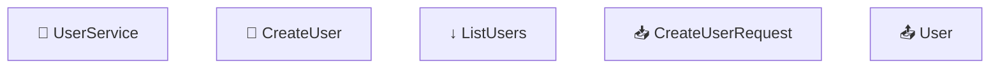

**Features:**
- Color-coded nodes by type (service, unary, streaming, message)
- Streaming type indicators (🔵 unary, ↑ client stream, ↓ server stream, ↔️ bidirectional)
- Input/output message connections
- Custom styling with configurable theme

#### 2. Comprehensive Sequence Diagram
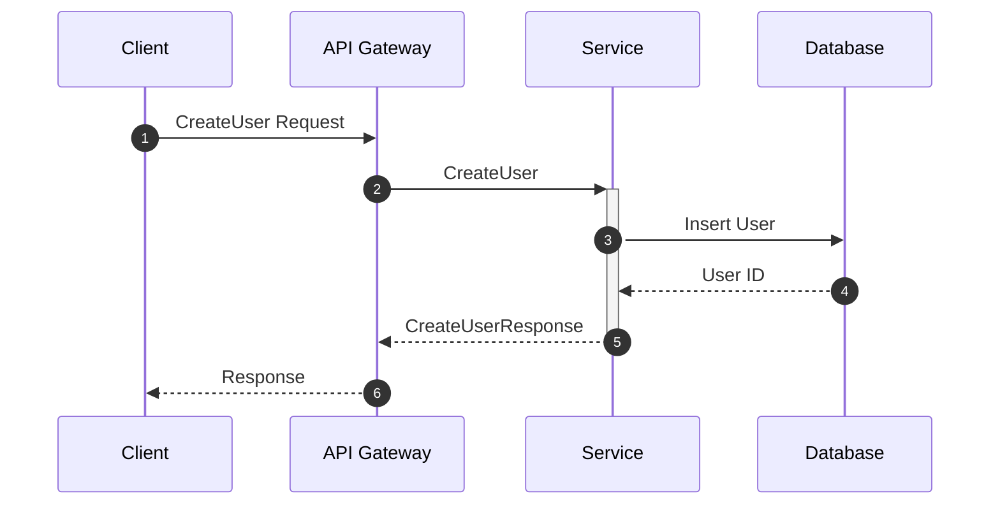

**Features:**
- Auto-numbered steps
- Multi-participant flows
- All streaming patterns (unary, client stream, server stream, bidirectional)
- Database interaction modeling
- Loop visualizations for streams

#### 3. Enhanced Class Diagram
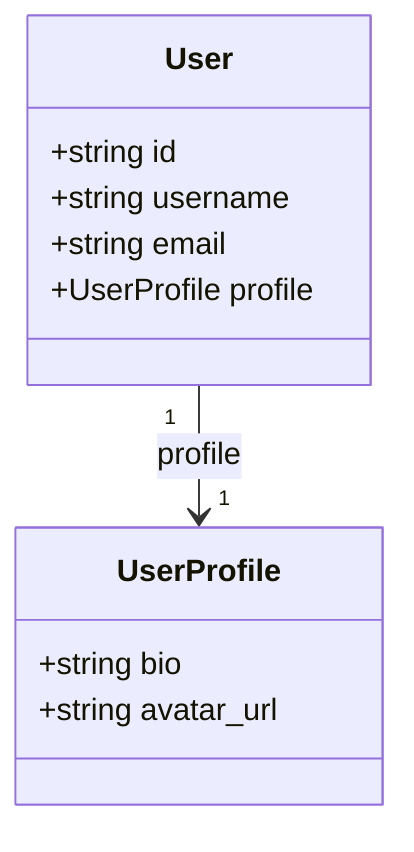

**Features:**
- UML class representation
- Field types and labels
- Relationship cardinality
- Support for repeated fields (arrays)

#### 4. Entity-Relationship Diagram (ERD)
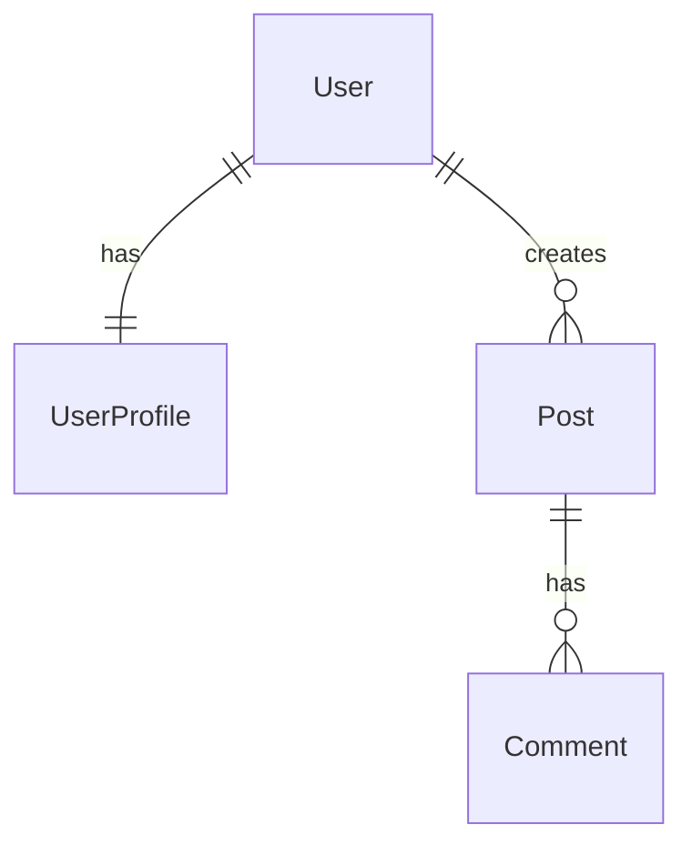

**Features:**
- Database-style ER modeling
- Cardinality notation
- Field type documentation

#### 5. State Machine Diagram
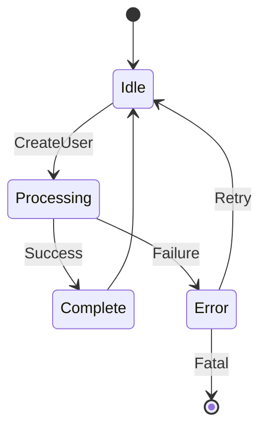

**Features:**
- Service lifecycle states
- Method-triggered transitions
- Error handling paths
- Retry and recovery flows

#### 6. Method Execution Flowchart
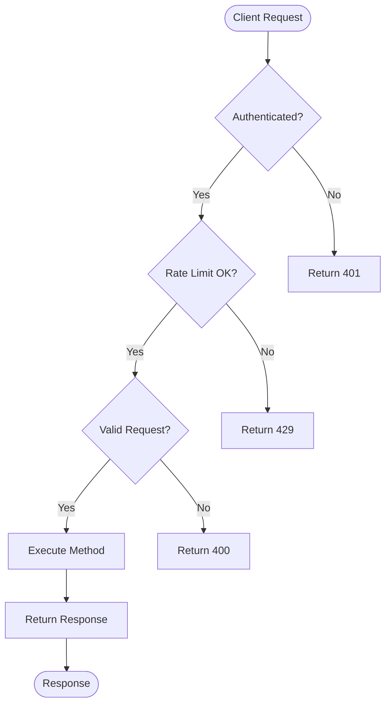

**Features:**
- Complete request processing flow
- Authentication checks
- Rate limiting logic
- Request validation
- Per-method execution paths
- Error handling for each stage

#### 7. Service Mindmap
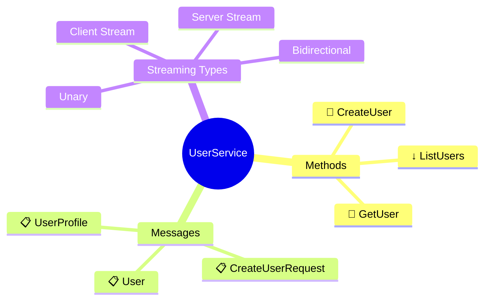

**Features:**
- Hierarchical service overview
- Quick visual reference
- Grouped by category

#### 8. C4 Context Diagram
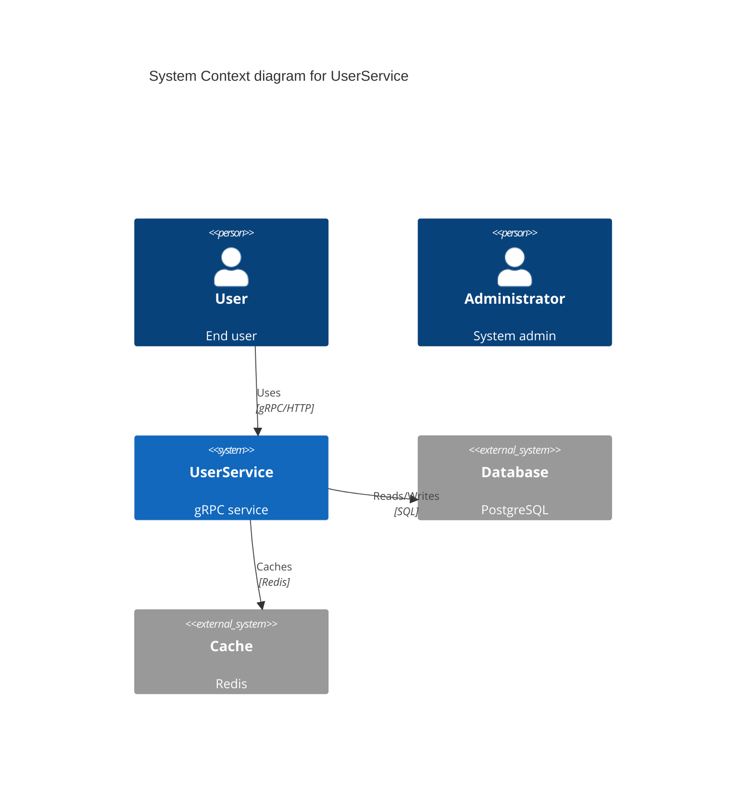

**Features:**
- System context visualization
- External actors
- System boundaries
- External dependencies
- Protocol annotations

#### 9. C4 Container Diagram
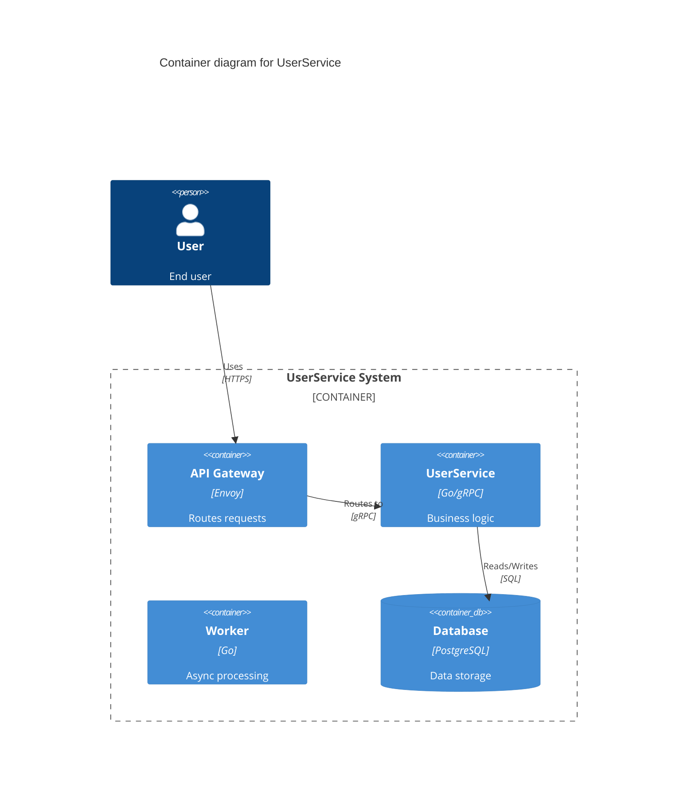

**Features:**
- Container-level architecture
- Internal containers
- Technology stack annotations
- Inter-container relationships

#### 10. Data Flow Diagram
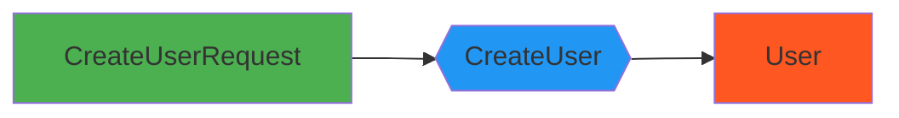

**Features:**
- Input/process/output visualization
- Color-coded node types
- Data transformation flow

## Usage

### GraphML Generation

```go
package main

import (
    "github.com/kyivinua/docgen-tool/tools/protodocs/diagrams"
)

func main() {
    // Create service data
    service := &diagrams.DocService{
        Name:        "UserService",
        FullName:    "users.v1.UserService",
        Description: "User management service",
        Methods: []diagrams.DocMethod{
            {
                Name:       "CreateUser",
                InputType:  "users.v1.CreateUserRequest",
                OutputType: "users.v1.User",
            },
        },
    }

    messages := []diagrams.DocMessage{
        {
            Name:     "User",
            FullName: "users.v1.User",
            Fields: []diagrams.DocField{
                {Name: "id", Type: "string"},
                {Name: "username", Type: "string"},
            },
        },
    }

    // Generate GraphML
    generator := diagrams.NewServiceGraphMLGenerator()
    graphml, err := generator.GenerateServiceGraphML(service, messages)
    if err != nil {
        panic(err)
    }

    // Convert to XML
    xml, err := graphml.ToXML()
    if err != nil {
        panic(err)
    }

    // Save to file
    os.WriteFile("service.graphml", []byte(xml), 0644)
}
```

### Enhanced Mermaid Generation

```go
package main

import (
    "github.com/kyivinua/docgen-tool/tools/protodocs/diagrams"
)

func main() {
    // Create configuration
    config := diagrams.DefaultDiagramConfig()
    config.Theme = "forest"

    // Create generator
    generator := diagrams.NewEnhancedMermaidGenerator(config)

    // Generate all diagram types
    allDiagrams := generator.GenerateCompleteDiagramSet(service, messages, enums)

    // Access specific diagrams
    architecture := allDiagrams["architecture"]
    sequence := allDiagrams["sequence"]
    classDiagram := allDiagrams["class"]
    // ... etc

    // Or generate individual diagrams
    archDiagram := generator.GenerateEnhancedArchitectureDiagram(service, messages)
    seqDiagram := generator.GenerateComprehensiveSequenceDiagram(service)
    stateDiagram := generator.GenerateStateMachineDiagram(service)
    flowchart := generator.GenerateMethodFlowchart(service)
    mindmap := generator.GenerateServiceMindmap(service, messages)
    c4Context := generator.GenerateC4ContextDiagram(service)
    c4Container := generator.GenerateC4ContainerDiagram(service)
    dataFlow := generator.GenerateDataFlowDiagram(service, messages)
}
```

## Configuration

### Diagram Config

```go
type DiagramConfig struct {
    Theme  string  // "default", "forest", "dark", "neutral"
    // ... other config options
}

// Use default configuration
config := diagrams.DefaultDiagramConfig()

// Or customize
config := &diagrams.DiagramConfig{
    Theme: "dark",
}
```

## Output Formats

### GraphML XML

```xml
<?xml version="1.0" encoding="UTF-8"?>
<graphml xmlns="http://graphml.graphdrawing.org/xmlns">
  <graph id="UserService" edgedefault="directed">
    <node id="service_1">
      <data key="d0">UserService</data>
      <data key="d1">service</data>
    </node>
    <node id="method_1">
      <data key="d0">CreateUser</data>
      <data key="d1">method</data>
      <data key="d4">unary</data>
    </node>
    <edge source="service_1" target="method_1">
      <data key="d6">contains</data>
    </edge>
  </graph>
</graphml>
```

### Mermaid Markdown

Diagrams can be embedded directly in Markdown:

````markdown
# UserService Architecture

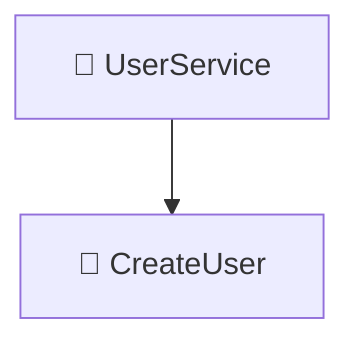
````

## Integration with Documentation

The diagram generators integrate seamlessly with the ProtoDocs documentation pipeline:

1. **Parse proto files** → Extract service, method, message information
2. **Generate diagrams** → Create GraphML and Mermaid diagrams
3. **Embed in docs** → Include diagrams in generated markdown documentation
4. **Export GraphML** → Save for use in visualization tools

## Visualization Tools

### Recommended Tools for GraphML

1. **yEd** ([https://www.yworks.com/products/yed](https://www.yworks.com/products/yed))
   - Free desktop application
   - Automatic layout algorithms
   - Export to PNG, SVG, PDF

2. **Gephi** ([https://gephi.org/](https://gephi.org/))
   - Network analysis
   - Statistical metrics
   - Community detection

3. **Cytoscape** ([https://cytoscape.org/](https://cytoscape.org/))
   - Biological network visualization
   - Plugin ecosystem
   - Advanced styling

### Mermaid Rendering

Mermaid diagrams render in:
- GitHub Markdown
- GitLab Markdown
- Mermaid Live Editor ([https://mermaid.live](https://mermaid.live))
- VS Code with Mermaid extension
- Markdown preview tools

## Examples

See `enhanced_test.go` for complete working examples of:
- GraphML generation
- All 10 Mermaid diagram types
- Complete diagram set generation
- Output validation

## Testing

Run tests:

```bash
go test ./tools/protodocs/diagrams/...
```

Test coverage:
- ✓ GraphML XML generation and validation
- ✓ Enhanced architecture diagrams
- ✓ Comprehensive sequence diagrams
- ✓ Enhanced class diagrams
- ✓ Entity-relationship diagrams
- ✓ State machine diagrams
- ✓ Method execution flowcharts
- ✓ Service mindmaps
- ✓ C4 context diagrams
- ✓ C4 container diagrams
- ✓ Data flow diagrams
- ✓ Complete diagram set generation

## Architecture

```
diagrams/
├── graphml.go            # GraphML XML export
├── enhanced_mermaid.go   # Comprehensive Mermaid generators
├── enhanced_test.go      # Test suite
├── types.go             # Shared data types
└── README.md            # This file
```

## Contributing

When adding new diagram types:

1. Add generator method to `EnhancedMermaidGenerator`
2. Add test case in `enhanced_test.go`
3. Update `GenerateCompleteDiagramSet` to include new type
4. Document in this README
5. Add examples

## License

Part of the ProtoDocs documentation generation system.
