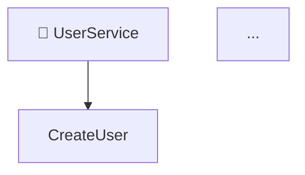
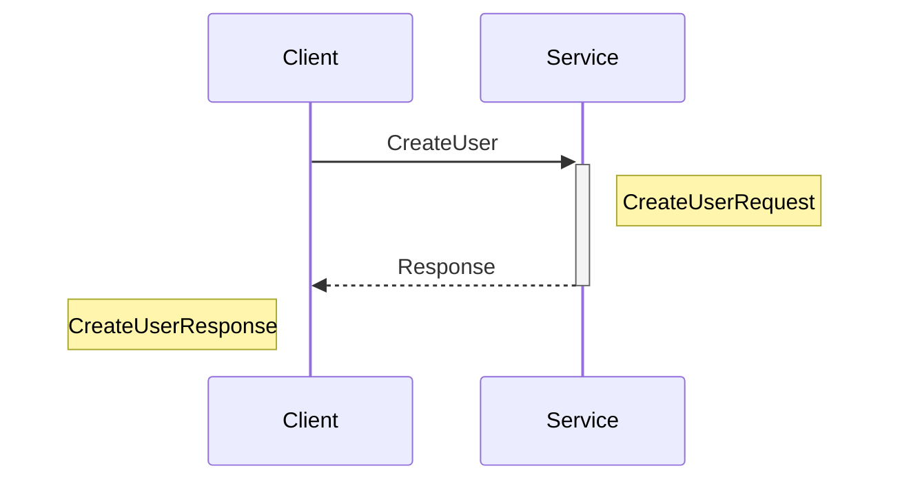

# ProtoDocs - Consolidated Documentation Generator

Comprehensive, single-file documentation generator for Protocol Buffer services with integrated Mermaid diagrams, TOC, cross-references, and structured sections.

## Features

### 📚 Documentation Structure
- **Table of Contents** - Auto-generated with configurable depth
- **Anchors & Cross-References** - Links between messages, methods, and types
- **Structured Sections** - Overview, Architecture, Methods, Messages, Enums, Examples, Error Codes
- **Metadata Tables** - Service info, method details, field specifications

### 📊 Integrated Diagrams
- **Service Architecture** - Flowchart showing service, methods, and message flow
- **Sequence Diagrams** - Per-method call flows (unary, streaming types)
- **Message Structure** - Class diagrams showing message composition
- **Data Flow** - Complete data flow through the system

### 🎨 Diagram Features
- **Mermaid.js** integration
- **Streaming indicators** - Visual differentiation (↑ client, ↓ server, ↔️ bidirectional)
- **Themed diagrams** - Support for default, forest, dark, neutral themes
- **Smart positioning** - Inline, section-based, or appendix diagrams

### 📝 Content Sections

1. **Header & Metadata**
   - Service name, package, version
   - Proto file reference
   - Generation timestamp

2. **Table of Contents**
   - Hierarchical navigation
   - Depth-configurable
   - Auto-linked sections

3. **Overview**
   - Service statistics (method count, message count, streaming RPCs)
   - Quick start guide
   - Capability summary

4. **Architecture**
   - Service architecture diagram
   - Component relationships
   - Message flow visualization

5. **Methods**
   - Method signature (protobuf syntax)
   - Streaming type indicators
   - Input/Output types with cross-references
   - HTTP/REST bindings (if available)
   - Sequence diagrams per method
   - Usage examples (Go, Python, JavaScript)

6. **Messages**
   - Field tables (number, name, type, label, description)
   - Oneof group visualization
   - Proto definition code blocks
   - Message structure class diagrams
   - Cross-references to related types

7. **Enumerations**
   - Enum value tables
   - Proto definitions
   - Usage descriptions

8. **Error Codes**
   - gRPC status codes
   - HTTP equivalents
   - Error handling best practices

9. **Examples**
   - Multi-language client examples
   - Go, Python, JavaScript/Node.js
   - Ready-to-use code snippets

10. **Footer**
    - Generation metadata
    - Version information
    - Auto-generated disclaimer

## Configuration

### ConsolidatedConfig Options

```go
type ConsolidatedConfig struct {
    // Documentation structure
    IncludeTOC            bool   // Include table of contents
    TOCDepth              int    // TOC depth (1-5)
    IncludeDiagrams       bool   // Include Mermaid diagrams
    DiagramPosition       string // "inline", "section", "appendix"
    IncludeCrossReferences bool   // Link messages/types
    IncludeAnchors        bool   // Add HTML anchors

    // Diagram types
    IncludeArchitecture   bool   // Service architecture
    IncludeSequence       bool   // Method sequences
    IncludeMessageGraph   bool   // Message structure
    IncludeDataFlow       bool   // Data flow diagrams

    // Content sections
    IncludeOverview       bool   // Overview section
    IncludeAuthentication bool   // Auth section
    IncludeExamples       bool   // Code examples
    IncludeErrorCodes     bool   // Error codes
    IncludeChangelog      bool   // Changelog section

    // Formatting
    UseEmojis             bool   // Use emoji icons
    CodeHighlighting      string // "protobuf", "json", "yaml"
    DiagramTheme          string // "default", "forest", "dark", "neutral"
}
```

### Default Configuration

```go
config := docgen.DefaultConsolidatedConfig()
// All features enabled by default
```

## Usage

### Basic Usage

```go
package main

import (
    "fmt"
    "os"

    "github.com/kyivinua/docgen-tool/tools/protodocs/docgen"
)

func main() {
    // Parse proto files
    parser := docgen.NewProtoParser(
        []string{"proto/users/users.proto"},
        []string{"proto", "proto/common"},
    )

    docs, err := parser.Parse()
    if err != nil {
        panic(err)
    }

    // Generate consolidated documentation
    config := docgen.DefaultConsolidatedConfig()
    generator := docgen.NewConsolidatedDocGenerator(config)

    for _, doc := range docs {
        markdown := generator.GenerateConsolidatedDoc(doc)

        // Write to file
        filename := fmt.Sprintf("docs/%s.md", doc.Service.Name)
        os.WriteFile(filename, []byte(markdown), 0644)
    }
}
```

### Custom Configuration

```go
config := docgen.ConsolidatedConfig{
    IncludeTOC:            true,
    TOCDepth:              3,
    IncludeDiagrams:       true,
    DiagramPosition:       "section",  // Diagrams in sections
    IncludeCrossReferences: true,
    IncludeAnchors:        true,

    // Select specific diagram types
    IncludeArchitecture:   true,
    IncludeSequence:       true,
    IncludeMessageGraph:   false,  // Skip message graphs
    IncludeDataFlow:       true,

    // Content sections
    IncludeOverview:       true,
    IncludeExamples:       true,
    IncludeErrorCodes:     true,

    // Styling
    UseEmojis:             false,  // Professional mode
    CodeHighlighting:      "protobuf",
    DiagramTheme:          "forest",  // Forest theme
}

generator := docgen.NewConsolidatedDocGenerator(config)
```

## Example Output Structure

```markdown
# 📚 UserService API Documentation

| **Attribute** | **Value** |
|---------------|----------|
| **Service Name** | `UserService` |
| **Package** | `users.v1` |
| **Version** | 1.0 |
| **Proto File** | `proto/users/users.proto` |

---

## 📑 Table of Contents

- [Overview](#overview)
- [Architecture](#architecture)
- [Methods](#methods)
  - [CreateUser](#createuser)
  - [GetUser](#getuser)
  - [UpdateUser](#updateuser)
  ...
- [Messages](#messages)
  - [User](#user)
  - [CreateUserRequest](#createuserrequest)
  ...
- [Enumerations](#enumerations)
- [Error Codes](#error-codes)
- [Examples](#examples)

---

## 📖 Overview

### Service Statistics

| Metric | Count |
|--------|-------|
| **RPC Methods** | 10 |
| **Message Types** | 25 |
| **Enumerations** | 5 |
| **Streaming RPCs** | 3 |

---

## 🏗️ Architecture



---

## ⚙️ Methods

### CreateUser

<a name="createuser"></a>

Creates a new user account

#### Method Signature

```protobuf
// Unary RPC
rpc CreateUser(CreateUserRequest) returns (CreateUserResponse);
```

#### Method Details

| Attribute | Value |
|-----------|-------|
| **Full Name** | `users.v1.UserService.CreateUser` |
| **Input Type** | [`CreateUserRequest`](#createuserrequest) |
| **Output Type** | [`CreateUserResponse`](#createuserresponse) |
| **Streaming Type** | Unary |

##### Sequence Diagram



---

## 📦 Messages

### User

<a name="user"></a>

Represents a user account

#### Fields

| # | Name | Type | Label | Description |
|---|------|------|-------|-------------|
| 1 | `id` | `string` | optional | User ID |
| 2 | `email` | `string` | optional | Email address |
| 3 | `username` | `string` | optional | Username |
...

#### Proto Definition

```protobuf
message User {
  // User ID
  string id = 1;

  // Email address
  string email = 2;
  ...
}
```

---

## 💡 Examples

### Go Example
...

### Python Example
...

---
```

## Integration with ProtoDocs Pipeline

The consolidated documentation generator integrates seamlessly with the existing ProtoDocs pipeline:

1. **Proto Parsing** - Uses `protoc` to generate FileDescriptorSet
2. **Documentation Extraction** - Parses descriptors into structured data
3. **Diagram Generation** - Creates Mermaid diagrams for all components
4. **Document Synthesis** - Combines all elements into single-file docs
5. **Output Generation** - Writes markdown files with proper formatting

## Benefits

### For Developers
- **Single Source of Truth** - One comprehensive file per service
- **Easy Navigation** - TOC and cross-references for quick lookup
- **Visual Understanding** - Diagrams show architecture at a glance
- **Ready Examples** - Copy-paste code snippets
- **Self-Contained** - All information in one place

### For Technical Writers
- **Consistent Structure** - Same format across all services
- **Auto-Generated** - No manual documentation needed
- **Always Up-to-Date** - Regenerate from proto files
- **Professional Output** - Clean, formatted markdown

### For Teams
- **Better Onboarding** - New developers understand APIs quickly
- **Reduced Questions** - Comprehensive docs answer most questions
- **API Discovery** - Easy to explore available services
- **Version Control** - Docs live with code in git

## Comparison with Old System

| Feature | Old System | Consolidated System |
|---------|-----------|---------------------|
| Files per service | 20+ files | 1 file |
| Diagrams | Separate files | Integrated inline |
| TOC | Manual | Auto-generated |
| Cross-references | None | Full support |
| Streaming indicators | Generic text | Visual (↑↓↔️) |
| Examples | Missing | 3 languages |
| Message structure | Tables only | Tables + diagrams |
| Proto definitions | Not shown | Syntax-highlighted |
| Error codes | Missing | Complete guide |

## Next Steps

1. Test with test-monorepo services
2. Generate documentation for all services
3. Compare output quality with old system
4. Commit improvements to repository

## Known Limitations

1. **Proto Comments** - Requires proper source code info from protoc
2. **HTTP Annotations** - Needs google.api.http extension parsing
3. **Custom Options** - Proto options not fully extracted
4. **Nested Types** - Complex nesting may need manual adjustment

## Future Enhancements

1. **Interactive Diagrams** - SVG export for interactivity
2. **API Playground** - Embedded gRPC testing
3. **Versioning** - Multiple version comparison
4. **Search Integration** - Full-text search across docs
5. **PDF Export** - Professional PDF generation
